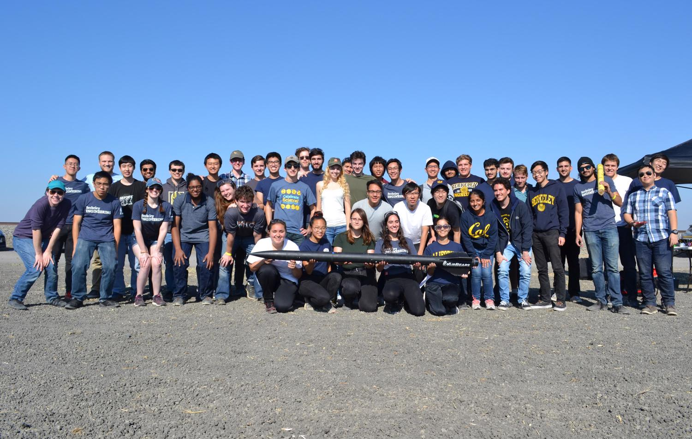

# Space Technologies and Rocketry

## [Members: Want to edit the GitBook? Follow this _**link**_!](https://app.gitbook.com/@rocketry/spaces)

Still don't have edit access or can't access the STAR Internal space? Check out this [**tutorial**](how-to-use-gitbook.md).

## Welcome!

This is a space for the general public, prospective members, and current members to access all sorts of documentation compiled by our team.&#x20;

If you're interested in joining, we recommend starting with the FAQ and the Membership section, then moving on to the Intro Projects:


[join.md](join.md)



[frequently-asked-questions.md](frequently-asked-questions.md)



[member-info](member-info/)



[intro-projects](intro-projects/)


For current members and the general public, here are the major sections of our documentation. Tutorials are for the most part widely applicable to the sort of work we do, but many do pertain specifically to software or processes for STAR members:


[tutorials](tutorials/)



[reference](reference/)



[history-of-the-team](history-of-the-team/)


Team-specific testing information and test forms can be found in the Testing section:


[testing](testing/)


To contribute to our documentation, see the below page:


[how-to-use-gitbook.md](how-to-use-gitbook.md)


Documentation on specific current or past projects can be found at the STAR Internal space, which is restricted to members:


The /internal/ space, separate from this one (/public/)


