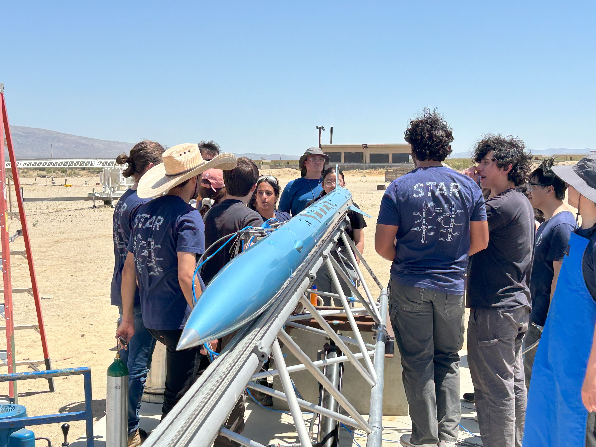
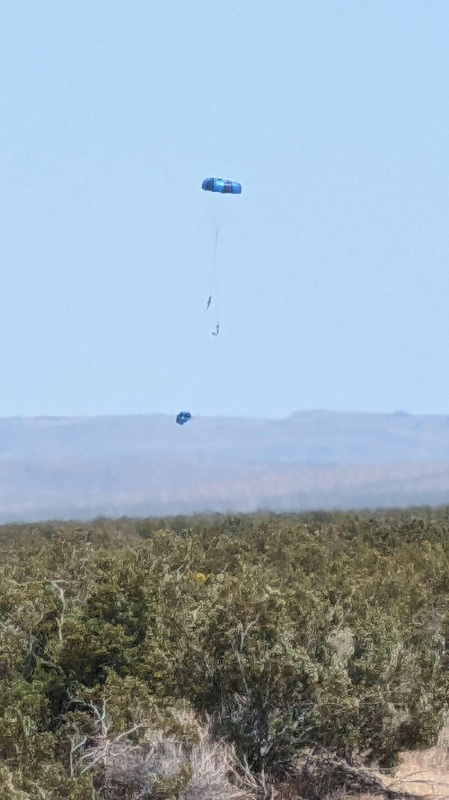

# ALULA: First Leap

<figure><figcaption>
ALULA Static Fire 03/10/2024
</figcaption></figure>

 

<figure><figcaption>
ALULA Pre-Launch
</figcaption></figure>

<figure><figcaption>
Pre-Launch Jitters
</figcaption></figure>



<figure><figcaption>
Vehicle Touchdown
</figcaption></figure>

 

<figure><figcaption>
Recovered Vehicle
</figcaption></figure>


