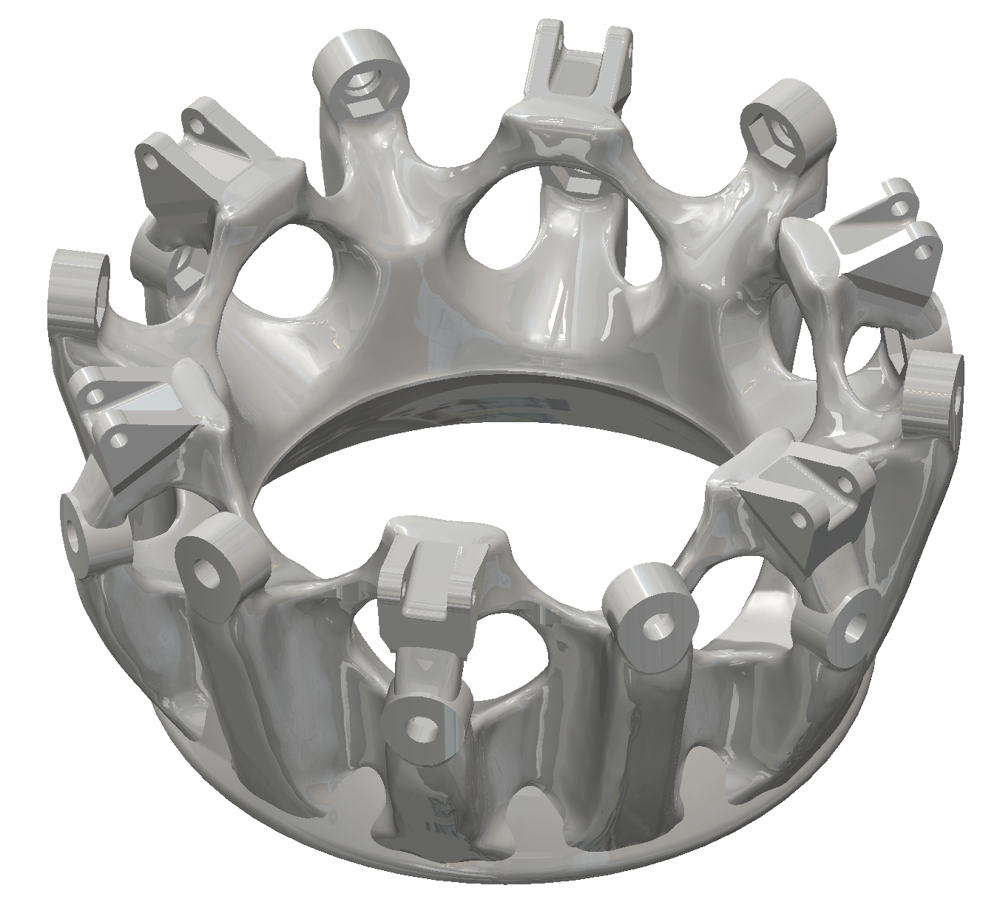
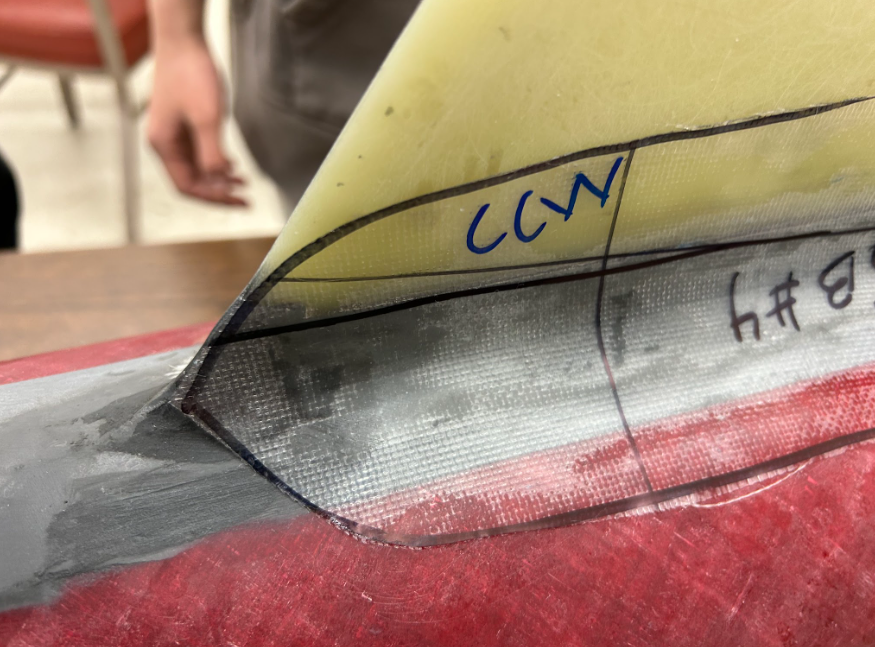

# Airframe

<figure><figcaption>
<strong>Complete ALULA CAD</strong>
</figcaption></figure>

#### Design & Manufacturing

<figure><figcaption>
Custom Airframe Composites
</figcaption></figure>

 

<figure><figcaption>
Design Example: Tank Mount
</figcaption></figure>

 

<figure><figcaption>
Fin Layup Process
</figcaption></figure>

### Aero-Structures Analysis

<figure><figcaption></figcaption></figure>
