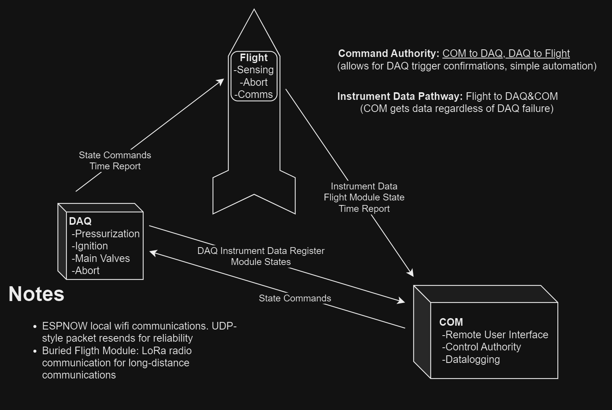
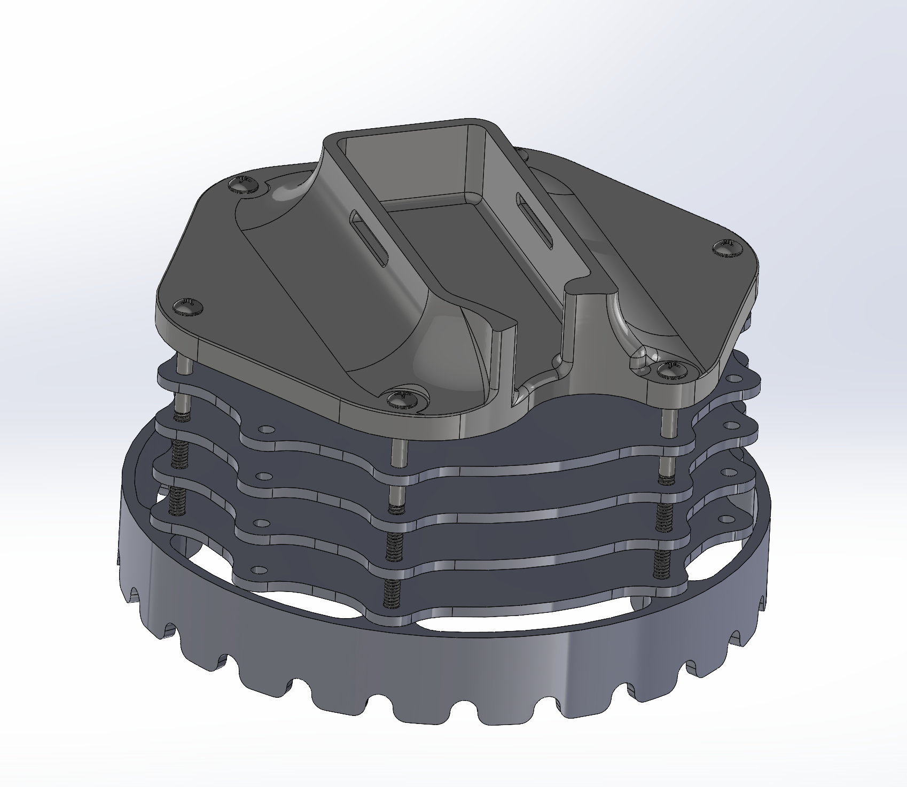
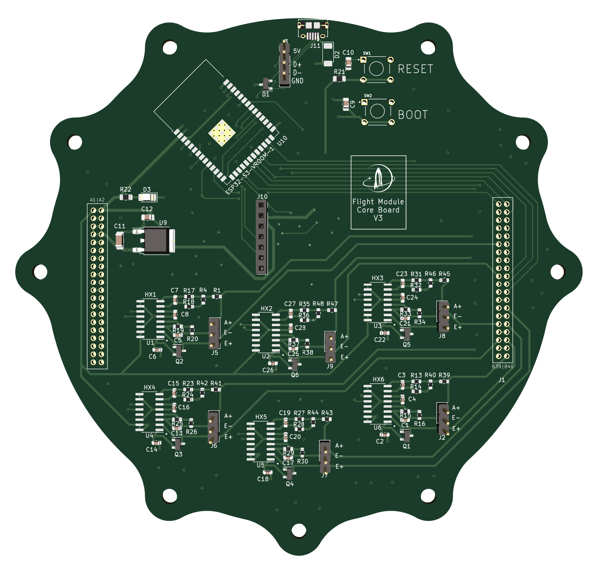

# Avionics

### Instrumentation Requirements:

| Name                | Purpose          | Base Quantity | 
Total 

(w/ Redundancy)
 |
| ------------------- | ---------------- | ------------- | ----------------------------------- |
| Pressure Transducer | Pressure data    | 5             | 6                                   |
| Thermocouple        | Temperature data | 2             | 4                                   |
| Power Switches      | Actuate valves   | 4             | 8 (2x red.)                         |
| ESP32               | Microcontroller  | 1             | 1                                   |
| SD Card             | Data storage     | 1             | 1                                   |

\

### Command/Communications Structure

<figure><figcaption>
ALULA Command Structure
</figcaption></figure>

### Control State Structure

<figure><figcaption>
ALULA Control State Diagram
</figcaption></figure>

### Flight Avionics: Stackable Sub-Module Array

<figure><figcaption>
Flight Module Assembly
</figcaption></figure>

 

<figure><figcaption>
Core Board PCB Design
</figcaption></figure>

