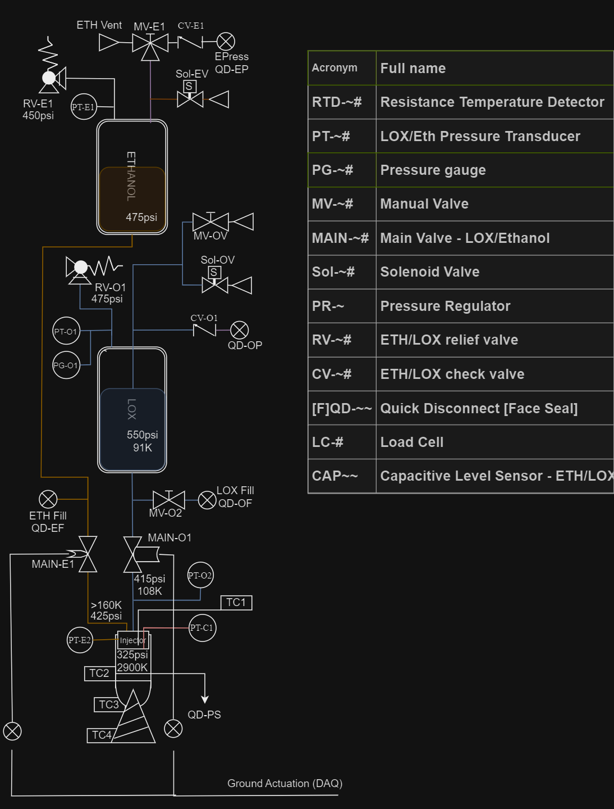
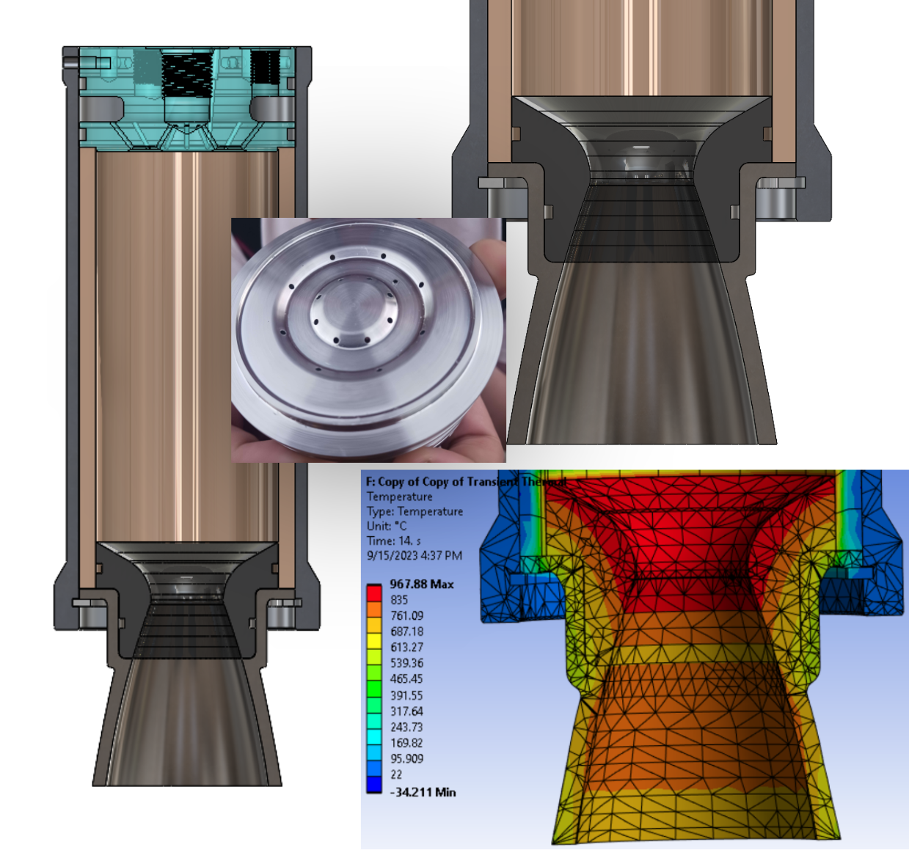

# Propulsion

## Development Steps:

1. High-Level Rocket Structure: Thrust Range, Vehicle Mass (+-50%)
2. Conservative(High-Thrust) Thruster / Feed System Design + Review
3. Fluid System Assembly, Testing, Calibration. Instrumentation and Control Development. Flight Structure Design Integration
4. Static Fire Testing. Mass Optimization, Simulation Refinement.
5. Flight Vehicle Integration

## System Modules

#### Fluid System (Engine "Feed System")

<figure><figcaption>
Fluid System Piping and Instrumentation Diagram (P&#x26;ID)
</figcaption></figure>

#### Thruster + Injector

Priorities: Stable, Conservative Perfomance and Efficient Manufacturing/Assembly

* Injector: Unlike-Doublet Impinging, LOX-centered
* Chamber: Ablative + Fuel Jetted Wall-Film. 6061 Aluminum Jacket.
* Nozzle: Graphite Throat, 316L Stainless Steel Expansion

<figure><figcaption></figcaption></figure>
