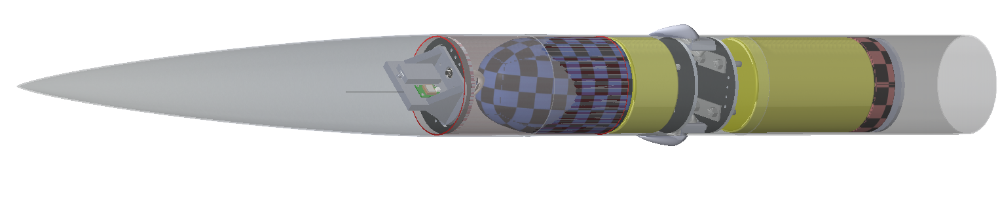
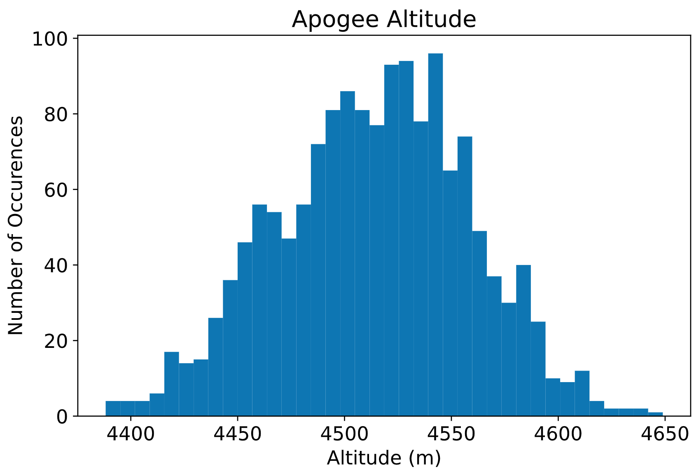
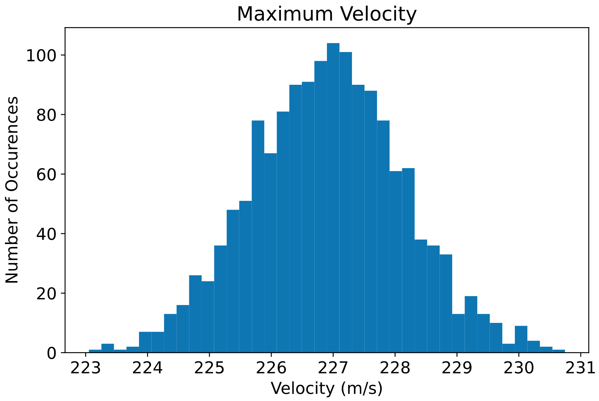
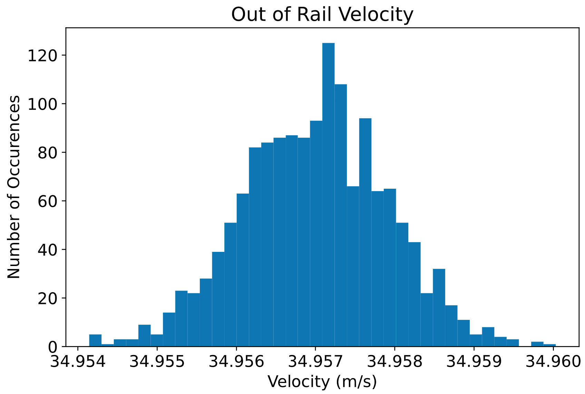

# Recovery

<figure><figcaption>
<strong>Recovery System CAD</strong>
</figcaption></figure>

### Specifications

* Dual side dual deployment
* Redundant Altimeters, ejection charges
* Dual-Camera Onboard Monitoring
* GPS real-time telemetry

#### Requirements

* Drogue Deployment velocity < 50 ft/s
* Main chute deployment velocity < 100 ft/s
* Landing velocity: below 25 ft/s
* Downwind Drift < 1 km

### Demonstration Launch 11/2023

### MCMC Dispersion Analysis&#x20;

<figure><figcaption></figcaption></figure>

 

<figure><figcaption></figcaption></figure>

 

<figure><figcaption></figcaption></figure>

