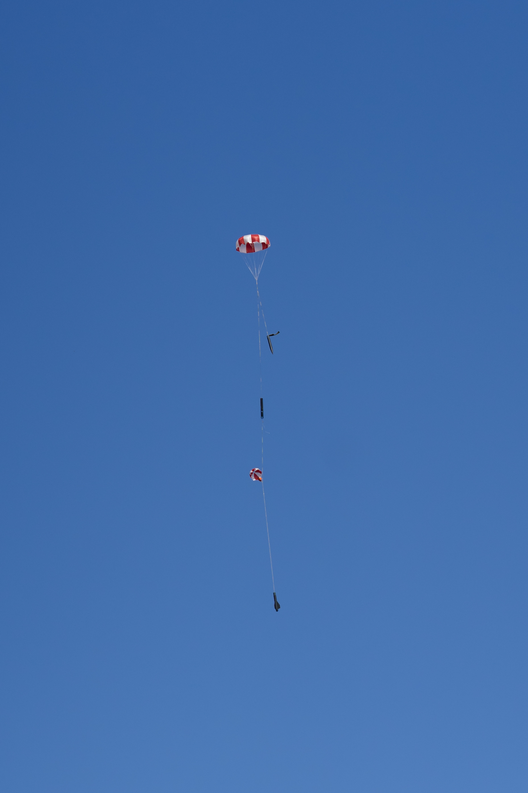

# 2019-11-16 AirBears First Flight

The first flight of AirBears constituted the largest launch we have had to date in terms of attendance, with a total of 47 members. It was also our first fully nominal launch in over a year \(Sub-Arktos was successfully flown and recovered earlier in the year, but with off-nominal parachute deployment\).

### Morning Logistics

Launch logistics were well-organized with the a spreadsheet with assigned drivers and seats. Moving forward however, we should have contingencies in place for when drivers do not show up/wake up on time for launches. We left around 5:20 a.m. from Etcheverry Hall \(nominal time to meet was set at 4:40 a.m.\); in the future, we should pack the day before and leave from the Hearst Memorial Mining Circle to minimize disruption to residents.

We arrived at TCC around 9 a.m. and were able to get fully set up by 10 a.m. It is recommended that at least one car arrive before 9 a.m., as attendance at the flyers meeting is required, and setup help is much appreciated.

### Ground Test

Recovery ground test originally used wire crimps but because the crimps were finicky and hard to get on, they were abandoned later. Ground test consisted of the use of two one-gram black powder charges. The drogue chute deployed very well, however, the main chute tube had separation of only a few inches so we sized up to two-gram black powder charges for both sides and performed a second ground test. This one went well, only testing the main parachute side with complete separation. 

Ground test 2 video: [https://drive.google.com/file/d/1EIZnwMlhGFCPrsdd58aA63Z8x0X2OzbJ/view](https://drive.google.com/file/d/1EIZnwMlhGFCPrsdd58aA63Z8x0X2OzbJ/view)

It must be noted that the scale we brought to use was not working well and failed to measure therefore black powder charges were measured based on volume of vial and estimated density \(found online\) and not actual weight. We will add a hundredth-gram precision or better scale to our checklists.

### Payload and Avionics

The payloads flown were an SRAD electronic sensing package named IRIS \(Iris Records Information via Sensors\) and Muons, a cosmic ray detector. In addition to the Payload subteam's payloads, the Avionics subteam flew the avionics sled previously flown on Sub-Arktos on 2019-04-20. 

While the avionics sled integrated smoothly, the payload stack was difficult to integrate, despite having done so successfully at integration a week earlier. As a result, the IRIS payload was subject to an unexpected loss of power during assembly. While the power was reconnected, the payload was never re-initialized, a manual step required to begin recording. As a result, IRIS did not record data for this flight. We are exploring software changes and hardware changes to make this impossible, as well as updating procedures.

### Final Assembly and Arming

Once the payload, avionics, and sims altimeters were all mounted into the payload section, the many sections of the rocket were screwed together with pan head sheet metal screws and shear pins at separable interfaces. Everything closed properly but the main parachute was a bit tight. 

Pictures were taken both before going out to the launchpad and on the launchpad. Once the pictures were taken, all non-essential personnel were asked to leave the launchpad and the rocket was loaded onto the launch rail. Note we did not bring Teflon lubricant to the pad as checklists instructed; it was judged this was an acceptable departure from procedure. It was exceedingly difficult to insert the retaining pin to hold the launch rail in place; recommend bringing a hammer.

With the rocket in place, the igniter was inserted according to procedure and successfully checked for continuity. Recovery altimeters were nominal and the Simulations subteam altimeter was instructed to start recording via Bluetooth.

### Flight and Recovery

AirBears flew nominally, going up to 4509 ft apogee. This was incredibly close to the projected apogee of 4500 ft. The two recovery altimeters recorded 4508 and 4509 ft respectively. Drogue deployed at apogee and the main parachute deployed at 800 ft. There was very little wind thus the parachute drifted very close to the original launch location around 100 meters away. All black powder was fully burned off.

\[payload and avionics\]

Slight burns were noticed on all of the parachutes likely because of poor parachute bag sizing and the black powder charges ended up being quite large.

