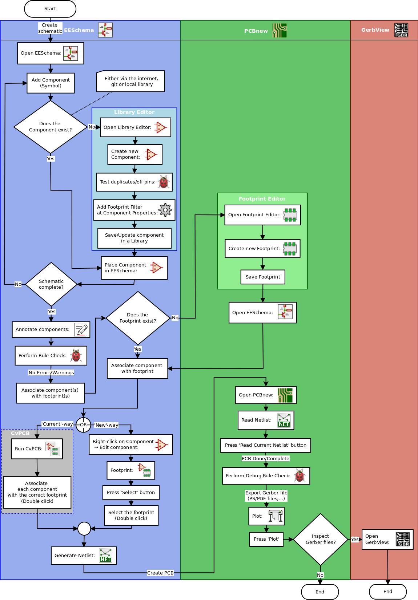
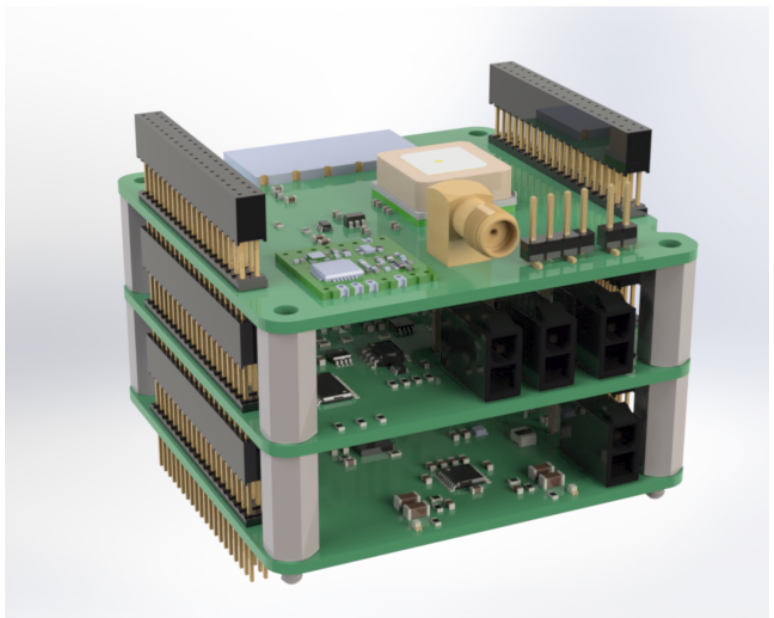
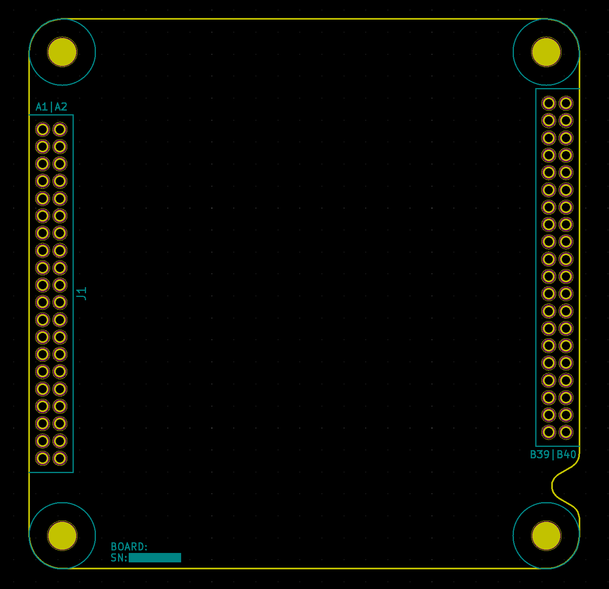
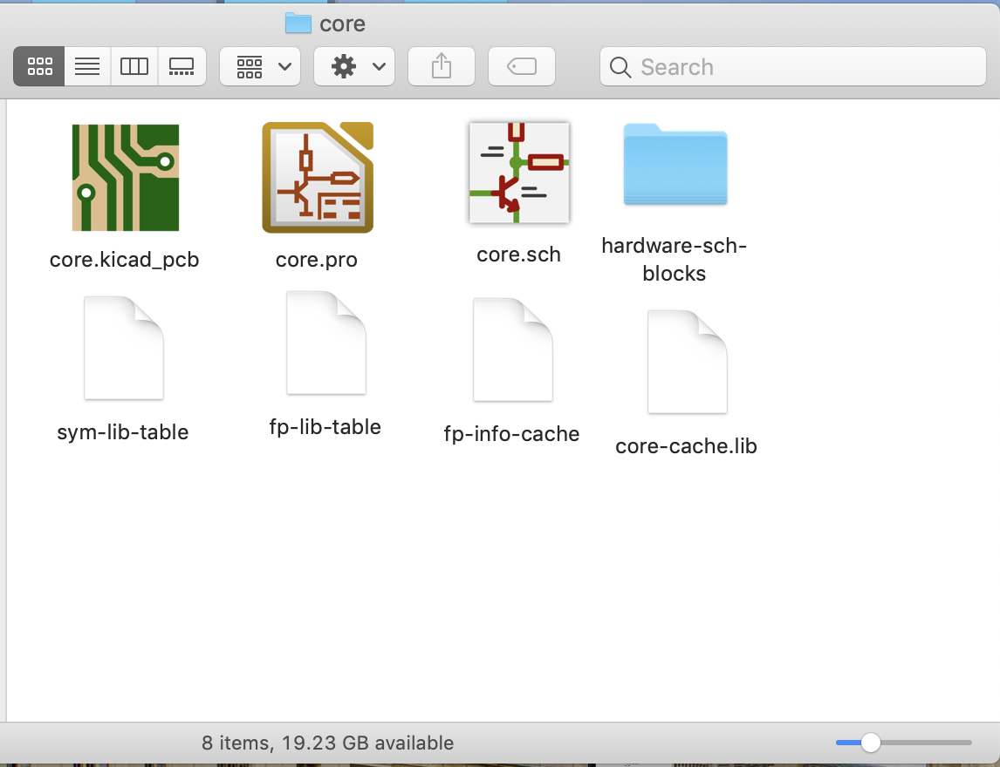
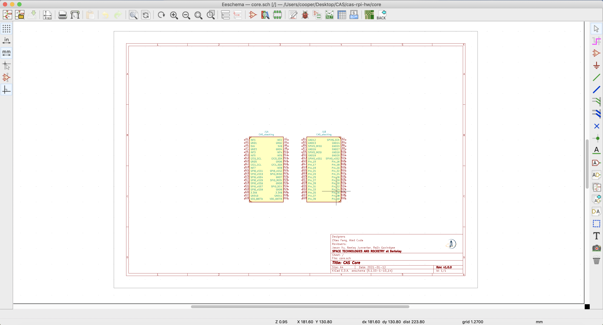
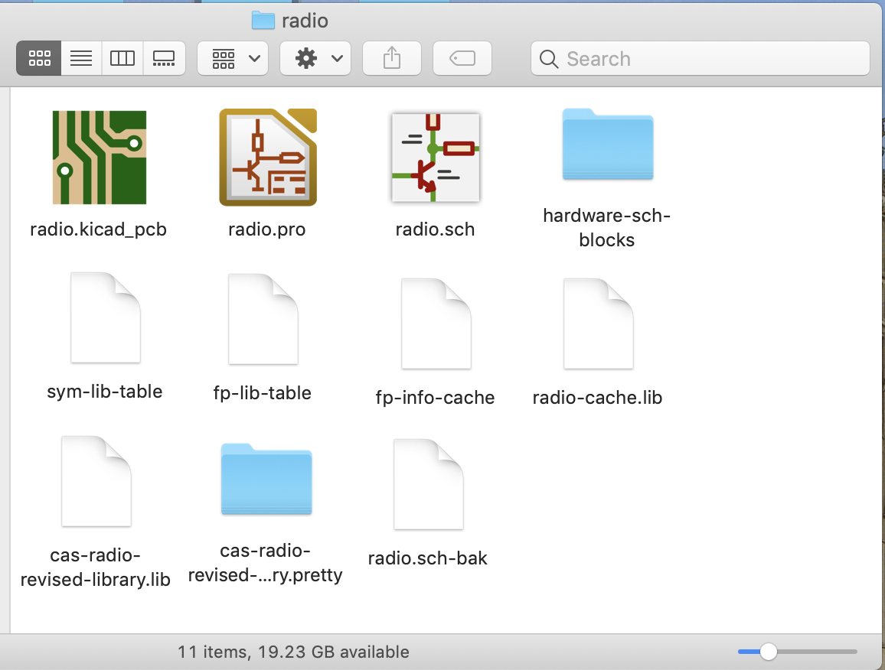
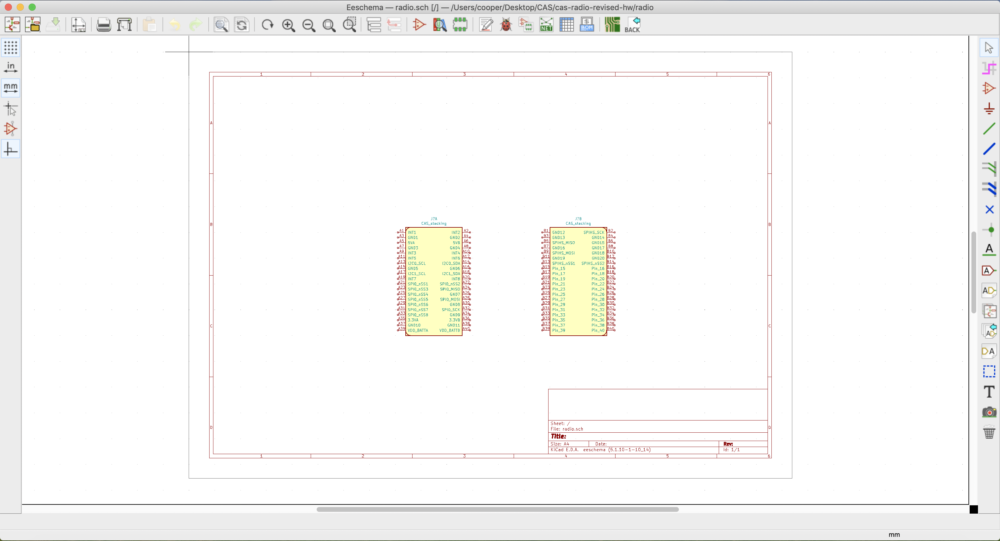
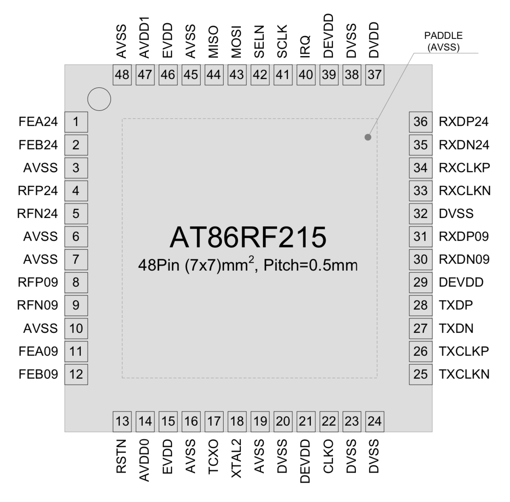

# Avionics \(new intro project Fall 2021\)

"One bad year of competition is really annoying, but one bad year of education leads to three bad years of competition."  
--Sam

## Welcome to avionics!

If you're reading this, you're probably a new member who's looking to get involved with our avionics projects at STAR. This document--our new intro project--will teach you everything you need to know to be a filly contributing member on the team, even if you have no experience. For your own reference, here's a concise list of all the different websites and resources that you'll be interacting with as an avionics member:

* Our gitbooks page, which you're reading right now! In addition to the intro project, there are also helful tutorials written by previous avionics members linked here: [https://app.gitbook.com/@rocketry/s/public/~/drafts/-MjLyQKJMVHvQ78dHKoB/tutorials/avionics](https://app.gitbook.com/@rocketry/s/public/~/drafts/-MjLyQKJMVHvQ78dHKoB/tutorials/avionics). Try to read through them since they might help a lot with doing your intro project.
* The STAR google drive, linked here: [https://drive.google.com/drive/folders/0B1\_9aZj6iTHlanFqejNER29MdGs?usp=sharing](https://drive.google.com/drive/folders/0B1_9aZj6iTHlanFqejNER29MdGs?usp=sharing)
* Quire, which is a sort of mega to-do list so we can keep track of what to do when. It's similar to trello, if you've ever used it.
* The STAR calendar: [https://calendar.google.com/calendar/b/1?cid=dGJzbDNzZ290MXUyYW5wMm90M3NhNzAxOTBAZ3JvdXAuY2FsZW5kYXIuZ29vZ2xlLmNvbQ](https://calendar.google.com/calendar/b/1?cid=dGJzbDNzZ290MXUyYW5wMm90M3NhNzAxOTBAZ3JvdXAuY2FsZW5kYXIuZ29vZ2xlLmNvbQ)
* Our github, which is where avionics projects live \(including your intro projects\): [https://github.com/calstar](https://github.com/calstar)
* Cadlab, which is sort of like a mirror for github. It lets you look at the schematics for our projects without needing to download them and open kicad. Link: [https://cadlab.io/star](https://cadlab.io/star)
* And, of course, the club discord!

## Overview

This intro project serves as an introduction to the Kicad software suite, which is used by the avionics team to design circuit boards for STAR projects. The projects is split up into two paths--one path is for students who are more interested in schematic design, and the other path is for students more interested in PCB layout. Schematic design and PCB layout are both fundamental parts of using Kicad. The primary goal of both intro projects is for students to learn how board design is done on the avionics subteam, and gain experience on a project that is very similar to "real" avionics projects.

The schematic-focused path of the intro project is called "cas-rpi-hw" and it consists of adding two new parts \(a raspberry pi compute module, and an FPGA\) to our current CAS-Core board. The layout-focused path of the intro project is called "cas-radio-revised-hw" and it consists of adding one new part \(a dual radio transmitter-reciever\) to our current CAS-Radio board. Both CAS-Core and CAS-Radio will be explained in more detail later on. 

Here are the links to the github repositories where our intro projects live. These repositories contain the starter files for the project, and they tell you the specifications that you'll be trying to fulfill.  
[https://github.com/calstar/cas-rpi-hw](https://github.com/calstar/cas-rpi-hw)  
[https://github.com/calstar/cas-radio-revised-hw](https://github.com/calstar/cas-radio-revised-hw)

## What is Kicad?

The circuit design process in Kicad follows a relatively predictable structure, which is separated into two main phases: schematic design, and PCB layout. Schematic design involves deciding which components and pins are connected to which, and PCB layout involves actually drawing the physical wires that will connect the components together. Each component on a circuit board has one symbol \(a diagram showing which pins it has, and what their names are\) and one footprint \(a diagram showing the exact size and shape of its pins\). Symbols are used in the schematic design stage, and footprints are used in the PCB layout stage. 

Kicad has tools that you can use to create your own symbols and footprints for any circuit element, but we will not be using those tools in the intro project \(all symbols and footprints are pre-made for you\). Even outside the intro project, these tools are not always necessary because Kicad has thousands of well-known circuit elements pre-loaded with symbols and footprints. Even if it is not included in Kicad, there are also symbols and footprints publicly available on the web for many different circuit elements \(for example, at [snapeda.com](https://www.snapeda.com)\). You will probably only need to use the footprint/symbol editor if you need to add a very rare or obscure component to your circuit.

Another core feature of Kicad is Libraries, which are used to store symbols and footprints. Every symbol or footprint must be in a library. You can create your own libraries to store symbols and footprints in, and these libraries can either be global or project-specific. Creating project-specific libraries is generally simpler and easier to manage.  
Annoyingly, the symbol libraries and footprint libraries are stored in two different ways. Symbol libraries are stored in a .lib file, but footprint libraries are stored in a .pretty folder. The .pretty folder contains multiple .kicad\_mod files, and these files are the individual footprints.

A typical Kicad project proceeds as follows:  
1: Decide on the main components you are planning to use on your circuit board.  
2: Create schematic symbols for these components, unless they already exist in Kicad.  
3: Create footprints for these components, unless they already exist in Kicad.  
4: Create connections between pins in the schematic design stage  
5: Associate symbols with footprints \(tell Kicad which symbol corresponds to which footprint\)  
6: Draw the physical traces between footprints in the PCB layout stage  
7: Generate gerber files  
  
Here is a convenient cheatsheet that explains this process in full:

You can get started with Kicad by downloading and installing it here: [https://www.kicad.org/download/](https://www.kicad.org/download/)

If you have no prior experience with Kicad, then I _highly_ recommend watching this tutorial video series by Digikey. It is useful both as a first look to get familiar with Kicad, and as a refresher to brush up on the details. Following along with their practice project is completely optional--the tutorial is still very helpful even when just passively watching.

Basics: [https://www.youtube.com/watch?v=vaCVh2SAZY4](https://www.youtube.com/watch?v=vaCVh2SAZY4)  
Schematic symbol editor: [https://www.youtube.com/watch?v=c2niS9ZRBHo](https://www.youtube.com/watch?v=c2niS9ZRBHo)  
Schematic design: [https://www.youtube.com/watch?v=4Gtd7xY6zS4](https://www.youtube.com/watch?v=4Gtd7xY6zS4)  
Footprint editor: [https://www.youtube.com/watch?v=ZHH4G\_EWhm0](https://www.youtube.com/watch?v=ZHH4G_EWhm0)  
Associate footprints with symbols: [https://www.youtube.com/watch?v=Ghv0bGiZFL8](https://www.youtube.com/watch?v=Ghv0bGiZFL8)  
PCB Layout 1: [https://www.youtube.com/watch?v=Ghv0bGiZFL8](https://www.youtube.com/watch?v=Ghv0bGiZFL8)  
PCB Layout 2: [https://www.youtube.com/watch?v=jaQPr7PgImk](https://www.youtube.com/watch?v=jaQPr7PgImk)  
Generate gerber files: [https://www.youtube.com/watch?v=ENmDnoKs2hM](https://www.youtube.com/watch?v=ENmDnoKs2hM)  
Generate BOM & Order parts \(optional\): [https://www.youtube.com/watch?v=I7GUiGoD1w8&t=642s](https://www.youtube.com/watch?v=I7GUiGoD1w8&t=642s)  
Solder components to board \(optional\): [https://www.youtube.com/watch?v=Zkn\_Au5aeLA](https://www.youtube.com/watch?v=Zkn_Au5aeLA)

## CAS

CAS stands for Common Avionics Stack and it is one of our most recent avionics projects. The fundamental idea behind CAS is that the entire system is organized into modular boards, each of which are about 3 inches by 3 inches in area. Each board has one general purpose, and the boards are all connected together in a 'stack.' The boards can exchange data because each board has an identical 80-pin header. 

The CAS board that already exist are: Core \(main function: performing computations and gathering data\), Pyro \(main function: igniting fuses\), Radio \(main function: sending and recieving radio\). The CAS boards that are currently in development are your two intro peoject boards, as well as the CAS-Prop board \(main function: interfacing with the propulsion system\). The files for the boards can be found on cadlab \([https://cadlab.io/star](https://cadlab.io/star)\) and github \([https://github.com/calstar](https://github.com/calstar)\).

The Cas-Stacking component \(located in hardware-sch-blocks here: [https://cadlab.io/project/22829/master/circuit/Q0FTX2J1cy9DQVNfYnVzLnNjaA%3D%3D](https://cadlab.io/project/22829/master/circuit/Q0FTX2J1cy9DQVNfYnVzLnNjaA%3D%3D)\) is the most important part of CAS because it is used to connect all the CAS modules together. Each CAS module contains one copy of the CAS-Stacking board. Each pin X on one CAS-Stacking board is shorted to its corresponding pin X on every other copy of the CAS-Stacking board. One Cas-Stacking board has 80 pins in total: 40 on the left \(A1-A40\) and 40 on the right \(B1-B40\). Pins B15-B40 are currently unused.

The following is a description of the pins used by Cas-Stacking. Except for the power and miscellaneous pins, most of the pins should be used to interface with the board's microcontroller.

* Power
  * +3.3V
  * +5V
  * +BATTERY
  * GND
* I2C \#1
  * SCL
  * SDA
* I2C \#2
  * SCL
  * SDA
* SPI High-Speed
  * SCK
  * MISO
  * MOSI
  * SS1, SS2
* SPI Low-Speed
  * SCK
  * MISO
  * MOSI
  * SS1, SS2, SS3, SS4, SS5, SS6, SS7, SS8
* Miscellaneous \(can be connected to anything\)
  * INT1, INT2, INT3, INT4, INT5, INT6, INT7, INT8

Included below is the schematic footprint for a Cas-Stacking board. The pins A1-A40 are on the left, and the pins B1-B40 are on the right. The 4 circles on the corners are larger protrusions that are used to stabilize the board and keep it from falling out.

One thing to note about CAS is that, unlike most circuit boards, CAS boards have 4 layers instead of 2. This is not a significant change to the design process, but it is something to keep in mind. The plan for the 4 layers is to designate the outer two as front copper pour and back copper pour, while making the middle two boards a ground plane and a power plane. A 'plane' is basically a copper pour that fills the entire layer.

## Using git

Git and github are a system to manage and keep track of files in large programming projects. Each individual project is stored in a 'repository.' STAR maintains a github account here with several repositories: [https://github.com/calstar](https://github.com/calstar).

If you have never used git before, or you need a refresher, here are a few guides you can follow:  
[https://inst.eecs.berkeley.edu/~cs61b/fa21/docs/using-git.html](https://inst.eecs.berkeley.edu/~cs61b/fa21/docs/using-git.html)  
[https://product.hubspot.com/blog/git-and-github-tutorial-for-beginners](https://product.hubspot.com/blog/git-and-github-tutorial-for-beginners)  
[https://rogerdudler.github.io/git-guide/](https://rogerdudler.github.io/git-guide/)  
[https://guides.github.com/introduction/git-handbook/](https://guides.github.com/introduction/git-handbook/)  
  
In general, your workflow using git will look something like this:  
1: Do some work inside your project directory.  
2: Enter the command **git add** \* to add your files to the staging area.  
3: Enter the command **git commit -m "your message here"** to create a commit for your files.  
4: Enter the command **git push** to push your files to the remote repository.  
  
The first time you use git, though, you will have to initialize your repository and also specify what remote repository you want to be connected to. Here are the main steps to doing this:  
1: Create a directory that you want your project to be in.  
2: Enter the command **git init**.  
3: Enter the command **git pull &lt;remote repository url here&gt;**.  
4: The files from the remote repository should now be in your project directory. From there, you can follow the workflow mentioned above.   
  
One of the most useful commands is **git status**, which can help you out if you are confused or stuck. It will tell you what is the status of your local repository and what has been changed, staged, deleted, etc.

## Managing submodules

#### NOTE: This section isn't needed for completing your intro project, but it could be a good reference for the future when you want to make your own kicad projects. 

Kicad has a large number of preloaded libraries \(for symbols & footprints\), but it is also possible to import your own libraries. There are a lot of these libraries publicly available on github. In fact, even the kicad default libraries are available on github \([https://github.com/KiCad/kicad-symbols](https://github.com/KiCad/kicad-symbols), [https://github.com/KiCad/kicad-footprints](https://github.com/KiCad/kicad-footprints)\). At avionics, we have created our own library to hold some of our symbols and footprints. This library is located at the the 'hardware-sch-blocks' repository on our github \([https://github.com/calstar/hardware-sch-blocks](https://github.com/calstar/hardware-sch-blocks)\) and cadlab \([https://cadlab.io/project/22829/master/files](https://cadlab.io/project/22829/master/files)\). 

When we create new avionics projects, we will want to include hardware-sch-blocks as a kicad submodule. Here are the steps for creating a new project and importing our hardware-sch-blocks submodule into the symbol editor:  
1: Open kicad and create an empty project. In your terminal, navigate inside the project directory.  
2: Type the command **git init** to start a git repository.  
3: Type the command **git submodule add https://github.com/calstar/hardware-sch-blocks**  
4: Open the schematic editor in your kicad project, and click 'manage symbol libraries.'  
5: Go to the 'project-specific libraries' tab and add a new library.  
6: Set the library's nickname to 'star-common-lib' and set the library path to ${KIPRJMOD}/hardware-sch-blocks/star-common-lib.lib  
7: Click 'ok' and save the project.  
8: If you click on 'place symbol' and scroll down in the dialog box, you should see a section labeled 'star-common-lib'  
  
The steps for importing our submodule into the footprint editor are similar, though it assumes you have already followed the above steps for importing our submodule into the symbol editor.  
1: Open the layout editor in your kicad project, and click 'manage footprint libraries.'  
2: Go to the 'project-specific libraries' tab and add a new library.  
3: Set the library's nickname to 'star-common-lib' and set the library path to ${KIPRJMOD}/hardware-sch-blocks/star-common-lib.lib  
4: Click 'ok' and save the project.  
  
Here is another useful reference for learning about kicad submodules: [https://www.youtube.com/watch?v=oXzJFrLo77Y](https://www.youtube.com/watch?v=oXzJFrLo77Y)

## Intro Project A: CAS-RPI-HW

#### Step 0: Getting started

* First, create a new directory to hold this kicad project. On the command line, **cd** into this directory.
* Enter the command **git init** to create a git repository in this directory.
* Enter the command **git pull https://github.com/calstar/cas-rpi-hw** to download the starter files for the project. Your project will be located inside the **core** directory. If you look inside it, this is what you should find:

--**core.pro**: Click on this to open the kicad main window.  
--**core.sch**: Click on this to open the schematic editor.  
--**core.kicad\_pcb**: Click on this op open the PCB layout editor.  
--**hardware-sch-blocks**: This contains the symbol and footprint libraries for star-common-lib. The schematic library is located at star-common-lib.lib, and the footprint library is located at star-common-lib.pretty.

* To get started with the project, open the schematic file **core.sch** which will pull up the kicad schematic editor. The project should be blank except for two symbols for the Cas-Stacking board, which is inherited from the star-common-lib library. \(It's true that Cas-Stacking is just one part and not two, but sometimes we will split very large kicad components into multiple symbols so they are more convenient to work with in the schematic editor.\)
* Here is what you should see at the beginning.

Before proceeding to the next steps, look at the readme on the intro project github page: [https://github.com/calstar/cas-rpi-hw](https://github.com/calstar/cas-rpi-hw). This tells you what the main projects specs are, and has some advice to help you plan the circuit schematic. You will probably want to refer to this readme frequently.

#### Step 1: Create Schematic

* Create a subcircuit to contain the Raspberry Pi Compute Module 
* **\[FILL IN HERE\]**
* The next thing to add is the ice40 fpga. Luckily, kicad already has this component in its default libraries. If you click the 'place symbol' tool and then search for 'ice40', you should see symbols pop up that you can use for the ice40 fpga. Click on the one \(or ones\) you want, then click 'ok' and you should be able to place them on the schematic.
* Afer that, try adding the BMP388. This should be very similar to adding rhe fpga, except you will find it under the 'star-common-lib' section. Place it down in the same way you placed down the fpga.
* Add more components according to the spec on the github readme, such as the accelerometer and rpi cam connectors. Use the resources linked in the readme to figure out how everything should be wired together. You will probably want to review: the datasheets for all relevant components, the downloadable rpi schematics from the CM4IO-KICAD folder, the previous cas-core board schematics on cadlab, and the list of pins for the cas-stacking connector. This step will probably take the longest as you read through all the resources and figure out where everything should go.
* Kicad has the following useful hotkeys. Use E to edit a components properties, R to rotate a component, M to move a component, and W to start drawing a wire \(use esc to cancel a wire drawing\).

#### Step 2: Associate Components With Footprints

* When you are satisfied with the state of the schematic, you can associate the components with footprints before proceeding to the layout stage.
* Select the 'annotate schematic symbols' tool and click 'annotate' to give a number to every symbol on the board.
* Open the CVPCB tool from the toolbar.
* Search for each board component and associate it with a footprint.
* Generate the netlist.
* Open PCBNew and read in the net-list.

#### Step 3: Layout PCB

* You'll see each footprint generate on top of each other in one big clump. Move them out of the way so they aren't all on top of each other. Make sure that all the footprints can fit inside the boundaries of the cas-stacking board. 
* All the components have little white 'air wires' showing what needs to be connected where. Your next step is to move the components around \(with the M hotkey\) and rotate them \(with the R hotkey\) so that most of the air wires aren't crossing over each other. You probably will still have some air wires crossing over, but try to move the footprints out of the way so you can minimize it as much as possible.
* You can calculate proper trace width using an online trace width calculator, and set the trace widths in KiCad \(go to the track width tab on the toolbar, click on ‘edit pre-defined sizes’ in the dropdown menu, and input the new sizes\). You will have to set both trace width and drill size. Remember that power traces generally need bigger trace sizes than other types of traces.
* Route the traces according to the connections provided by the air wires, until all of the air wires are gone. You will probably need to use vias to go through the board in order to fit all the traces in.
* When routing power traces, try not to make them go through any vias \(though its not an absolute necessity\). The power traces should have "priority" over other types of traces.
* If you're confused about something, you refer to the old cas-core and cas-radio projects that already exist to see what the settings were like \(trace width, drill size, board layer settings, etc\). Just clone the repository into a new directory and open the project in kicad, then you can navigate around the project and see what a finished kicad project is supposed to look like.
* Try using Kicad's 3d viewer to see what your board is going to look like once it's been fabricated. You can do this at any stage in the layout process!
* When you're done drawing traces, create a ground pour on the second layer \(creating a ground plane\), and then create a +5v pour on the third layer \(creating a power plane\).
* Generate gerber files once the layout is finished. Generating gerbers is always the last step in a Kicad project.

## Intro Project B:CAS-Radio-Revised-HW

#### Step 0: Getting started

* First, create a new directory to hold this kicad project. On the command line, **cd** into this directory.
* Enter the command **git init** to create a git repository in this directory.
* Enter the command **git pull https://github.com/calstar/cas-radio-revised-hw** to download the starter files for the project. Your project will be located inside the **radio** directory. If you look inside it, this is what you should find:

--**radio.pro**: Click on this to open the kicad main window.  
--**radio.sch**: Click on this to open the schematic editor.  
--**radio.kicad\_pcb**: Click on this op open the PCB layout editor.  
--**hardware-sch-blocks**: This contains the symbol and footprint libraries for star-common-lib. The schematic library is located at star-common-lib.lib, and the footprint library is located at star-common-lib.pretty.  
--**cas-radio-revised-library.lib**: a simple schematic library that only contains one component, the AT86RF215 radio transciever which you need for your project.  
--**cas-radio-revised-library.pretty**: a simple footprint library that also contains only one component, the AT86RF215 transciever.

* To get started with the project, open the schematic file **radio.sch** which will pull up the kicad schematic editor. The project should be blank except for two symbols for the Cas-Stacking board, which is inherited from the star-common-lib library. \(It's true that Cas-Stacking is just one part and not two, but sometimes we will split very large kicad components into multiple symbols so they are more convenient to work with in the schematic editor.\)
* Here is what you should see at the beginning.

Before proceeding to the next steps, look at the readme on the intro project github page: [https://github.com/calstar/cas-radio-revised-hw](https://github.com/calstar/cas-radio-revised-hw). This tells you what the main projects specs are, and has some advice to help you plan the circuit schematic. You will probably want to refer to this readme frequently.

#### Step 1: Create Schematic

* The AT86RF215 transciever is probably the most important part of this project, since it's the component that actually does the radio communication. It is an IC radio module with two separate radios included \(a 0.9 GHz one, and a 2.4 GHz one\). The two radios are independent of each other. They also have both transmission \(data in\) and recieving \(data out\) capabilities. The AT86RF215 has 48 pins on it, with the following functions. It's not necessary to understand what these pins are used for, but it's provided to help make the wiring diagram easier to comprehend. 

* 0.9 GHz Radio
  * RFP09: Differential RF Input \(positive\)
  * RFN09: Differential RF Input \(negative\)
  * FEA09: Digital Output A
  * FEB09: Digital Output B
  * RXDP09: I/Q Interface Output \(positive\)
  * RXDN09: I/Q Interface Ouput \(negative\)
* 2.4 GHz Radio
  * RFP24: Differential RF Input \(positive\)
  * RFN24: Differential RF Input \(negative\)
  * FEA24: Digital Output A
  * FEB24: Digital Output B
  * RXDP24: I/Q Interface Output \(positive\)
  * RXDN24: I/Q Interface Ouput \(negative\)
* Power
  * DVDD: Internally Regulated Digital Supply Voltage
  * AVDD0: Internally Regulated Analog Supply Voltage 0
  * AVDD1: Internally Regulated Analog Supply Voltage 1
  * EVDD: External Analog Supply Voltage
  * DEVDD: External Digital Supply Voltage
  * AVSS: Analog Ground
  * DVSS: Digital Ground
* Communication
  * MISO: SPI MOSI Connection
  * MOSI: SPI MISO Connection
  * SCLK: SPI SCLK Connection
  * SELN: SPI SELN Connection
  * RXCLKP: RX I/Q Interface Clock Output \(positive\)
  * RXCLKN: RX I/Q Interface Clock Output \(negative\)
  * TXCLKP: TX I/Q Interface Clock Input \(positive\)
  * TXCLKN: TX I/Q Interface Clock Input \(negative\)
  * TXDP: TX I/Q Interface Data Input \(positive\)
  * TXDN: TX I/Q Interface Data Input \(negative\)
* Miscellaneous
  * IRQ: Interrupt Signal
  * RSTN: Reset Pin \(active low\)
  * TXCO: Crystal Oscillator Input
  * XTAL2: Crystal Oscillator Output
  * CLKO: Clock Output 
* The radio transciever's schematic symbol is included in the cas-radio-revised-hw library. So that means we're able to use it as a component in Kicad. Click on the 'place symbol' tool at the right, and scroll down to the cas-radio-revised-hw section. Then click on the AT86RF215 part, and select ok. Now you can place it down in the schematic.
* Refer to the resources included in the github readme to figure out how the AT86RF215 should be wired up. You will probably want to review: the AT86RF215 datasheet, the cariboulite schematic, the previous cas-core and cas-radio board schematics on cadlab, and the list of pins for the cas-stacking connector. This step will probably take the longest as you read through all the resources and figure out where everything should go.
* Kicad has the following useful hotkeys. Use E to edit a components properties, R to rotate a component, M to move a component, and W to start drawing a wire \(use esc to cancel a wire drawing\).

#### Step 2: Associate Components With Footprints

* When you are satisfied with the state of the schematic, you can associate the components with footprints before proceeding to the layout stage.
* Select the 'annotate schematic symbols' tool and click 'annotate' to give a number to every symbol on the board.
* Open the CVPCB tool from the toolbar.
* Search for each board component and associate it with a footprint.
* Generate the netlist.
* Open PCBNew and read in the net-list.

#### Step 3: Layout PCB

* You'll see each footprint generate on top of each other in one big clump. Move them out of the way so they aren't all on top of each other. Make sure that all the footprints can fit inside the boundaries of the cas-stacking board. 
* All the components have little white 'air wires' showing what needs to be connected where. Your next step is to move the components around \(with the M hotkey\) and rotate them \(with the R hotkey\) so that most of the air wires aren't crossing over each other. You probably will still have some air wires crossing over, but try to move the footprints out of the way so you can minimize it as much as possible.
* You can calculate proper trace width using an online trace width calculator, and set the trace widths in KiCad \(go to the track width tab on the toolbar, click on ‘edit pre-defined sizes’ in the dropdown menu, and input the new sizes\). You will have to set both trace width and drill size. Remember that power traces generally need bigger trace sizes than other types of traces.
* Route the traces according to the connections provided by the air wires, until all of the air wires are gone. You will probably need to use vias to go through the board in order to fit all the traces in.
* When routing power traces, try not to make them go through any vias \(though its not an absolute necessity\). The power traces should have "priority" over other types of traces.
* If you're confused about something, you refer to the old cas-core and cas-radio projects that already exist to see what the settings were like \(trace width, drill size, board layer settings, etc\). Just clone the repository into a new directory and open the project in kicad, then you can navigate around the project and see what a finished kicad project is supposed to look like.
* Try using Kicad's 3d viewer to see what your board is going to look like once it's been fabricated. You can do this at any stage in the layout process!
* When you're done drawing traces, create a ground pour on the second layer \(creating a ground plane\), and then create a +5v pour on the third layer \(creating a power plane\).
* Generate gerber files once the layout is finished. Generating gerbers is always the last step in a Kicad project.

