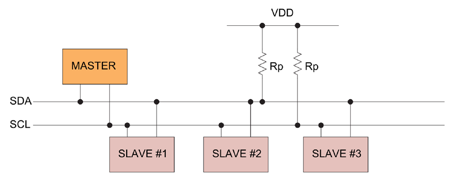
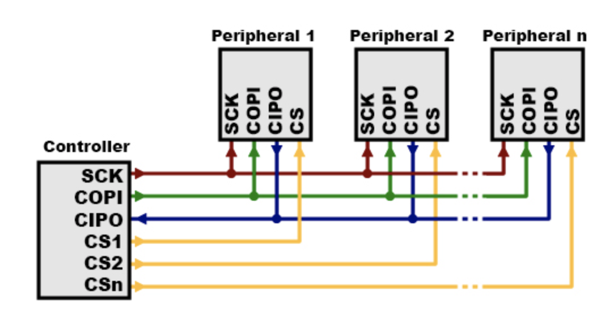
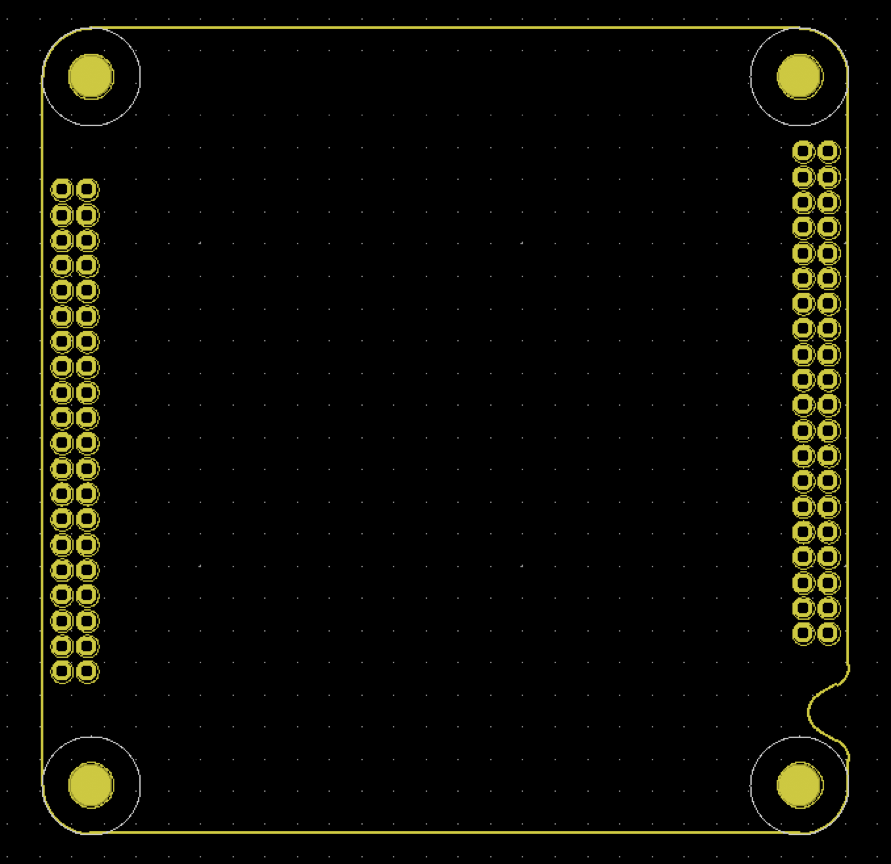
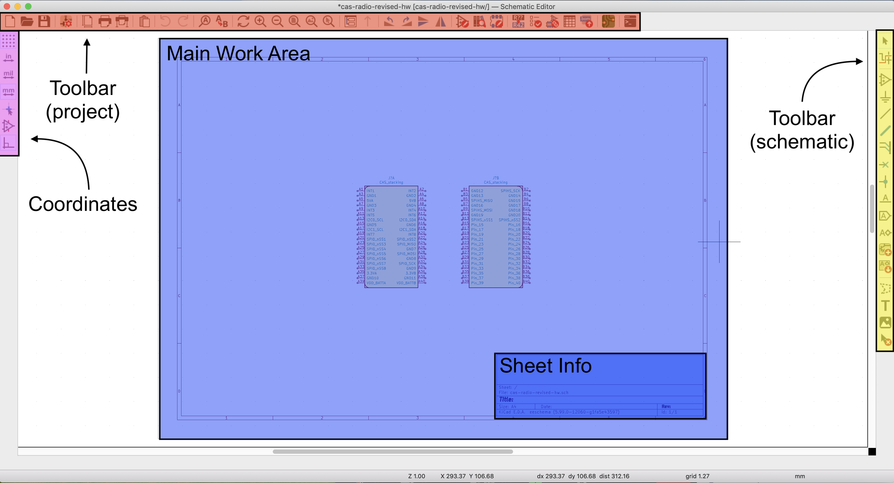

# Avionics \(new intro project Fall 2021\)

"One bad year of competition is really annoying. One bad year of education leads to three bad years of competition."  
--Sam

## Overview

This intro project serves as an introduction to the Kicad software suite, which is used by the avionics team to design circuit boards for STAR projects. The projects is split up into two paths--one path is for students who are more interested in schematic design, and the other path is for students more interested in PCB layout. Schematic design and PCB layout are both fundamental parts of using Kicad. The primary goal of both intro projects is for students to learn how board design is done on the avionics subteam, and gain experience on a project that is very similar to "real" avionics projects.

The schematic-focused path of the intro project is called "cas-rpi-hw" and it consists of adding two new parts \(a raspberry pi compute module, and an FPGA\) to our current CAS-Core board. The layout-focused path of the intro project is called "cas-radio-revised-hw" and it consists of adding one new part \(a dual radio transmitter-reciever\) to our current CAS-Radio board. Both CAS-Core and CAS-Radio will be explained in more detail later on.

## What is Kicad?

The circuit design process in Kicad follows a relatively predictable structure, which is separated into two main phases: schematic design, and PCB layout. Schematic design involves deciding which components and pins are connected to which, and PCB layout involves actually drawing the physical wires that will connect the components together. Each component on a circuit board has one symbol \(a diagram showing which pins it has, and what their names are\) and one footprint \(a diagram showing the exact size and shape of its pins\). Symbols are used in the schematic design stage, and footprints are used in the PCB layout stage. 

Kicad has tools that you can use to create your own symbols and footprints for any circuit element, but we will not be using those tools in the intro project \(all symbols and footprints are pre-made for you\). Even outside the intro project, these tools are not always necessary because Kicad has thousands of well-known circuit elements pre-loaded with symbols and footprints. Even if it is not included in Kicad, there are also symbols and footprints publicly available on the web for many different circuit elements \(for example, at [snapeda.com](https://www.snapeda.com)\)

Another core feature of Kicad is Libraries, which are used to store symbols and footprints. Every symbol or footprint must be in a library. You can create your own libraries to store symbols and footprints in, and these libraries can either be global or project-specific. Creating project-specific libraries is generally simpler and easier to manage.

A typical Kicad project proceeds as follows:  
1: Decide on the main components you are planning to use on your circuit board.  
2: Create schematic symbols for these components, unless they already exist in Kicad.  
3: Create footprints for these components, unless they already exist in Kicad.  
4: Create connections between pins in the schematic design stage  
5: Associate symbols with footprints \(tell Kicad which symbol corresponds to which footprint\)  
6: Draw the physical traces between footprints in the PCB layout stage  
7: Generate gerber files \(gerber files are the end stage of PCB design\)  
  
Here is a convenient cheatsheet that explains this process in full:

You can get started with Kicad by downloading and installing it here: [https://www.kicad.org/download/](https://www.kicad.org/download/). If you just want to get started with kicad as soon as possible, you can follow the instructions on the site as nomal. However, if you are doing the cas-rpi-hw intro project, then you can jump to those instructions because it will tell you how do download the nightly development build that you need for it \(otherwise you would need to redownload kicad all over again\).

If you have no prior experience with Kicad, then I _highly_ recommend watching this tutorial video series by Digikey. It is useful both as a first look to get familiar with Kicad, and as a refresher to brush up on the details. Following along with their practice project is completely optional--the tutorial is still very helpful even when just passively watching.

Basics: [https://www.youtube.com/watch?v=vaCVh2SAZY4](https://www.youtube.com/watch?v=vaCVh2SAZY4)  
Schematic symbol editor: [https://www.youtube.com/watch?v=c2niS9ZRBHo](https://www.youtube.com/watch?v=c2niS9ZRBHo)  
Schematic design: [https://www.youtube.com/watch?v=4Gtd7xY6zS4](https://www.youtube.com/watch?v=4Gtd7xY6zS4)  
Footprint editor: [https://www.youtube.com/watch?v=ZHH4G\_EWhm0](https://www.youtube.com/watch?v=ZHH4G_EWhm0)  
Associate footprints with symbols: [https://www.youtube.com/watch?v=Ghv0bGiZFL8](https://www.youtube.com/watch?v=Ghv0bGiZFL8)  
PCB Layout 1: [https://www.youtube.com/watch?v=Ghv0bGiZFL8](https://www.youtube.com/watch?v=Ghv0bGiZFL8)  
PCB Layout 2: [https://www.youtube.com/watch?v=jaQPr7PgImk](https://www.youtube.com/watch?v=jaQPr7PgImk)  
Generate gerber files: [https://www.youtube.com/watch?v=ENmDnoKs2hM](https://www.youtube.com/watch?v=ENmDnoKs2hM)  
Generate BOM & Order parts \(optional\): [https://www.youtube.com/watch?v=I7GUiGoD1w8&t=642s](https://www.youtube.com/watch?v=I7GUiGoD1w8&t=642s)  
Solder components to board \(optional\): [https://www.youtube.com/watch?v=Zkn\_Au5aeLA](https://www.youtube.com/watch?v=Zkn_Au5aeLA)

## CAS

CAS stands for Common Avionics Stack and it is one of our most recent avionics projects. The fundamental idea behind CAS is that the entire system is organized into modular boards, each of which are about 3 inches by 3 inches in area. Each board has one general purpose, and the boards are all connected together in a 'stack.' The boards can exchange data because each board has an identical 80-pin header. The pins of one board contact the pins of every other board--so, for example, once the stack is arranged, pin X of one board is connected to pin X of every other board. but pin X of one board isn't necessarily connected to pin Y of the same board.

The CAS board that already exist are: Core \(main function: performing computations\), Pyro \(main function: igniting fuses\), Radio \(main function: sending and recieving radio\), and Prop \(main function: regulating the rocket's propulsion system\). The files for the boards can be found on cadlab \([https://cadlab.io/star](https://cadlab.io/star)\) and github \([https://github.com/calstar](https://github.com/calstar)\).

Most of the boards on CAS are 4-layer, but in this intro project we will only cover 2 layer boards. 2 layer and 4 layer boards have many similarities, but the main difference about 4 layer boards is that the middle two layers are generally designated as power and ground planes, respectively, while the topmost and bottomost layers serve the same function they would on a 2-layer board.

## Using git

Git and github are a system to manage and keep track of files in large programming projects. Each individual project is stored in a 'repository.' STAR maintains a github account here with several repositories: [https://github.com/calstar](https://github.com/calstar).

If you have never used git before, or you need a refresher, here are a few guides you can follow:  
[https://inst.eecs.berkeley.edu/~cs61b/fa21/docs/using-git.html](https://inst.eecs.berkeley.edu/~cs61b/fa21/docs/using-git.html)  
[https://product.hubspot.com/blog/git-and-github-tutorial-for-beginners](https://product.hubspot.com/blog/git-and-github-tutorial-for-beginners)  
[https://rogerdudler.github.io/git-guide/](https://rogerdudler.github.io/git-guide/)  
[https://guides.github.com/introduction/git-handbook/](https://guides.github.com/introduction/git-handbook/)  
  
In general, your workflow using git will look something like this:  
1: Do some work inside your project directory.  
2: Enter the command **git add** \* to add your files to the staging area.  
3: Enter the command **git commit -m "your message here"** to create a commit for your files.  
4: Enter the command **git push** to push your files to the remote repository.  
  
The first time you use git, though, you will have to initialize your repository and also specify what remote repository you want to be connected to. Here are the main steps to doing this:  
1: Create a directory that you want your project to be in.  
2: Enter the command **git init**.  
3: Enter the command **git pull &lt;remote repository url here&gt;**.  
4: The files from the remote repository should now be in your project directory. From there, you can follow the workflow mentioned above.   
  
One of the most useful commands is **git status**, which can help you out if you are confused or stuck. It will tell you what is the status of your local repository and what has been changed, staged, deleted, etc.

## Digital Communication Protocols

One aspect of electronics that's very important if you want to actually build anything, but is often overlooked by beginners: digital communication protocols. Simply put, these allow electronic components to transfer data between each other. There are three important ones you need to be aware of: UART, I2C, and SPI.

In UART, each device that communicates has a TX \(transmit\) and an RX \(recieve\) port. The TX of one device must be connected to the RX of the other device, and vice versa. So, let's imagine that Device A and Device B want to communicate over UART. Then, there are four relevant pins:   
--Device A RX  
--Device A TX  
--Device B RX  
--Device B TX  
Device A TX and Device B RX are connected together. On this wire, data flows from device A to device B. Device B TX and Device B RX are connected together. On this wire, data flows from device B to device A.   
One important feature of UART is that there is no clock signal involved--the 'A' in UART stands for Asynchronous. Because of this, the two devices must agree on a 'baud rate' \(bits per second\) saying how fast they want to send and recieve data. The most common baud rates are 9600 and 115200.

In I2C, each device that communicates has an SDA \(data\) and SCL \(clock\) port. The clock wire is simply a clock, and the data wire can send and recieve in both directions. I2C communication usually involves one 'master' device \(usually a microcontroller\) and multiple peripheral devices. Since there are only two wires involved, the SCL of one device is connected to the SCL of every device, and the SDA of one device is connected to the SDA of every device. This means that the devices must coordinate to ensure that only one data stream is sent in one direction at a time, and the peripheral devices only participate when it is their turn.  
To accomodate this, the master device starts a communication session. It sends out a short data stream specifying whether it wants to read or write, and another short data stream specifying which peripheral device it wants to talk to. Then, the master device will communicate with that one peripheral device it selected, while the other peripheral devices will remain idle \(they can 'hear' the conversation, but they aren't 'listening.'\)

In SPI, similar to I2C, there is one master device and multiple peripheral devices. Each device that communicates has SCK \(clock\), MISO \(write to master\), MOSI \(read from master\), and CS \(select device\) ports. The functions of SCK, MISO, and MOSI are relatively self-explanatory, but SS is special. Each peripheral device has only one CS port, but the master has one CS port for every peripheral device there is. So, the master device has a CS port connected to each device's CS port. If a CS port for a peripheral is pulled low, that means that master wants to communicate with that device, and so they will exchange data through the MISO and MOSI ports. Data is transferred from or to only one peripheral device at a time. Overall, SPI is pretty similar to I2C, but the main difference is that deciding which device to talk to is done with setting the CS wires instead of sending an address bit out on the data wire. \(And

## Managing submodules

Kicad has a large number of preloaded libraries \(for symbols & footprints\), but it is also possible to import your own libraries. There are a lot of these libraries publicly available on github. In fact, even the kicad default libraries are available on github \([https://github.com/KiCad/kicad-symbols](https://github.com/KiCad/kicad-symbols), [https://github.com/KiCad/kicad-footprints](https://github.com/KiCad/kicad-footprints)\). At avionics, we have created our own library to hold some of our symbols and footprints. This library is located at the the 'hardware-sch-blocks' repository on our github \([https://github.com/calstar/hardware-sch-blocks](https://github.com/calstar/hardware-sch-blocks)\) and cadlab \([https://cadlab.io/project/22829/master/files](https://cadlab.io/project/22829/master/files)\). 

When we create new avionics projects, we will want to include hardware-sch-blocks as a kicad submodule. Here are the steps for creating a new project and importing our hardware-sch-blocks submodule into the symbol editor:  
1: Open kicad and create an empty project. In your terminal, navigate inside the project directory.  
2: Type the command **git init** to start a git repository.  
3: Type the command **git submodule add https://github.com/calstar/hardware-sch-blocks**.  
4: Open the schematic editor in your kicad project, and click 'manage symbol libraries.'  
5: Go to the 'project-specific libraries' tab and add a new library.  
6: Set the library's nickname to 'star-common-lib' and set the library path to ${KIPRJMOD}/hardware-sch-blocks/star-common-lib.lib  
7: Click 'ok' and save the project.  
8: If you click on 'place symbol' and scroll down in the dialog box, you should see a section labeled 'star-common-lib'  
  
The steps for importing our submodule into the footprint editor are similar, though it assumes you have already followed the above steps for importing our submodule into the symbol editor.  
1: Open the layout editor in your kicad project, and click 'manage footprint libraries.'  
2: Go to the 'project-specific libraries' tab and add a new library.  
3: Set the library's nickname to 'star-common-lib' and set the library path to ${KIPRJMOD}/hardware-sch-blocks/star-common-lib.lib  
4: Click 'ok' and save the project.  
  
Here is another useful reference for learning about kicad submodules: [https://www.youtube.com/watch?v=oXzJFrLo77Y](https://www.youtube.com/watch?v=oXzJFrLo77Y)

## Cas-Stacking 80-pin connector

The Cas-Stacking board \(located in hardware-sch-blocks here: [https://cadlab.io/project/22829/master/circuit/Q0FTX2J1cy9DQVNfYnVzLnNjaA%3D%3D](https://cadlab.io/project/22829/master/circuit/Q0FTX2J1cy9DQVNfYnVzLnNjaA%3D%3D)\) is used to connect the CAS modules together. Each CAS module contains one copy of the CAS-Stacking board. Each pin X on one CAS-Stacking board is shorted to its corresponding pin X on every other copy of the CAS-Stacking board. One Cas-Stacking board has 80 pins in total: 40 on the left \(A1-A40\) and 40 on the right \(B1-B40\). Pins B15-B40 are currently unused.

The following is a description of the pins used by Cas-Stacking. Except for the power and miscellaneous pins, most of the pins should be used to interface with the board's microcontroller.

* Power
  * +3.3V
  * +5V
  * +BATTERY
  * GND
* I2C \#1
  * SCL
  * SDA
* I2C \#2
  * SCL
  * SDA
* SPI High-Speed
  * SCK
  * MISO
  * MOSI
  * SS1, SS2
* SPI Low-Speed
  * SCK
  * MISO
  * MOSI
  * SS1, SS2, SS3, SS4, SS5, SS6, SS7, SS8
* Miscellaneous \(can be connected to anything\)
  * INT1, INT2, INT3, INT4, INT5, INT6, INT7, INT8

Included below is the schematic footprint for a Cas-Stacking board. The pins A1-A40 are on the left, and the pins B1-B40 are on the right. The 4 circles on the corners are larger protrusions that are used to stabilize the board and keep it from falling out.

## Intro Project A: cas-rpi-hw

#### Step 0: Getting started

* First, create a new directory to hold this kicad project. On the command line, **cd** into this directory.
* Enter the command **git init** to create a git repository in this directory.
* Enter the command **git pull https://github.com/calstar/cas-radio-revised-hw** to download the starter files for the project. The project starts out with some mostly-empty project files \(cas-rpi-hw.pro, cas-rpi-hw.sch, and cas-rpi-hw.kicad\_pcb\) as well as the required star-common-lib library.
* Before doing anything else, we need to download the latest build for kicad because it is the only build that can handle the rapsberry pi kicad files. To do so, head over to [https://www.kicad.org/download/](https://www.kicad.org/download/), select your operating system, and scroll down to click on the link with the nightly development builds. Download the one with the most recent release date, and install it.
* Then, go to [https://www.raspberrypi.org/products/compute-module-4-io-board/](https://www.raspberrypi.org/products/compute-module-4-io-board/) and scroll down to the link for "Raspberry Pi Compute Module 4 IO Board Kicad Files." Click on the link to download the folder.

#### Step 1: Add Raspberry Pi Compute Module To Schematic

* Create a subcircuit to contain the Raspberry Pi Compute Module \(the intro project on gitbooks will describe what the correct subcircuit should look like\)
* Add the Raspberry Pi Compute Module’s symbol to the schematic
* Add any required minor components to the schematic near the compute module, such as resistors and capacitors \(the intro project on Gitbooks will list what is needed\)
* Connect the pins on the Rapberry Pi Compute Module to all other relevant components on the board \(the intro project on Gitbooks will list which pins should be connected to which\).

#### Step 2: Add ICE40 FPGA To Schematic

* Create a subcircuit to contain the ICE40 FPGA \(the intro project on gitbooks will describe what the correct subcircuit should look like\)
* Add the ICE40 FPGA’s symbol to the schematic
* Add any required minor components to the schematic near the FPGA, such as resistors and capacitors \(the intro project on Gitbooks will list what is needed\)
* Connect the pins on the ICE40 FPGA to all other relevant components on the board \(the intro project on Gitbooks will list which pins should be connected to which\).

#### Step 3: Associate Components With Footprints

* Perform electrical rules check using debugger tab to ensure there are no errors
* Open the CVPCB tool from the toolbar
* Search for each board component and associate it with a footprint
* Generate the netlist
* Open PCBNew and read in net-list

#### Step 4: Layout PCB

* Organize footprints into clean positions on top of the CAS-Stacking board
* Calculate proper trace width using an online trace width calculator, and set the trace widths in KiCad \(go to the track width tab on the toolbar, click on ‘edit pre-defined sizes’ in the dropdown menu, and input the new sizes\)
* Draw traces on the front copper layer connecting all of the ‘air wires’, using vias to draw traces on the back copper layer if necessary
* Create a ground pour with the copper fill tool
* Generate gerber files once the layout is finished

## Intro Project B: cas-radio-revised-hw

#### Step 0: Getting started

* First, create a new directory to hold this kicad project. On the command line, **cd** into this directory.
* Enter the command **git init** to create a git repository in this directory.
* Enter the command **git pull https://github.com/calstar/cas-radio-revised-hw** to download the starter files for the project. The project starts out with some mostly-empty project files \(cas-radio-revised-hw.pro, cas-radio-revised-hw.sch, and cas-radio-revised-hw.kicad\_pcb\) as well as two required libraries \(hardware-sch-blocks/star-common-lib, and cas-radio-revised-library.lib\). 
* To get started, open the schematic file cas-radio-revised-hw.sch which will pull up the kicad schematic editor. The project should be blank except for two symbols for the Cas-Stacking board, which is inherited from the star-common-lib library. \(It's true that Cas-Stacking is just one part and not two, but sometimes we will split very large kicad components into multiple symbols so they are more convenient to work with in the schematic editor.\)
* Here is what you should see at the beginning. \(If you are using the stable release of kicad \(under 6.0\) then it should look slightly different, but these differences are mainly cosmetic. If you want to use this exact same version of kicad, follow the instructions in the cas-rpi-hw intro project for downloading the nightly build of kicad.\)

* That's a lot to take in. So, here's a breakdown of what each part on the screen does:

* Main Work Area
  * This is where all your components and wiring is goin to be. It's the area on the screen that's bounded by the red box. You can actually go outside the red box if you want, the only reason the red box is there is for asthetic purposes.
* Sheet Info
  * This doesn't have any bearing on your actual circuit design, it's just an area where you can jot down things like the project name, version number, designer, etc.
* Coordinates
  * This is used to set your measurement scales and grid size, as well as change the units used for measurement.
* Toolbar \(project\)
  * This is the toolbar at the top of the screen. It's used to do things like save your work, start and finish projects, zoom in and zoom out, and run the electrical rules check. It's mainly for tasks that involve the project files.
* Toolbar \(schematic\)
  * This is the toolbar at the right of the screen. It's used to do things like draw wires, add components, add text, and add power / ground flags. It's mainly for tasks that involve the circuit schematic itself. \(This toolbar is the one you'll probably spend the most time using.\)

* From this point forward, the rest of the intro project will be shuttling you towards these goals. Keep them in mind so things don't start to feel confusing or aimless.
  * Add the AT86RF215 radio transciever to the schematic
  * Add the power and ground sources to the schematic
  * Connect up the Cas-Stacking and AT86RF215 according to the intstructions in their datasheets
  * Associate the schematic symbols with their footprints and generate the netlist
  * Complete the PCB layout in the PCB editor

#### Step 1: Add Radio Transceiver To Schematic

* Add the Radio Transceiver’s symbol to the schematic
* Add any required minor components to the schematic near the transceiver, such as resistors and capacitors \(the intro project on Gitbooks will list what is needed\)
* Connect the pins on the Radio Transceiver to all other relevant components on the board \(the intro project on Gitbooks will list which pins should be connected to which\).

Datasheet for the AT86RF215: https://ww1.microchip.com/downloads/en/DeviceDoc/Atmel-42415-WIRELESS-AT86RF215\_Datasheet.pdf

The AT86RF215 transciever is probably the most important part of this project, since it's the component that actually does the radio communication. It is an IC radio module with two separate radios included \(a 0.9 GHz one, and a 2.4 GHz one\). The two radios are independent of each other. They also have both transmission \(data in\) and recieving \(data out\) capabilities. The AT86RF215 has 48 pins on it, with the following functions. It's not necessary to understand what these pins are used for, but it's provided to help make the wiring diagram easier to comprehend. 

* 0.9 GHz Radio
  * RFP09: Differential RF Input \(positive\)
  * RFN09: Differential RF Input \(negative\)
  * FEA09: Digital Output A
  * FEB09: Digital Output B
  * RXDP09: I/Q Interface Output \(positive\)
  * RXDN09: I/Q Interface Ouput \(negative\)
* 2.4 GHz Radio
  * RFP24: Differential RF Input \(positive\)
  * RFN24: Differential RF Input \(negative\)
  * FEA24: Digital Output A
  * FEB24: Digital Output B
  * RXDP24: I/Q Interface Output \(positive\)
  * RXDN24: I/Q Interface Ouput \(negative\)
* Power
  * DVDD: Internally Regulated Digital Supply Voltage
  * AVDD0: Internally Regulated Analog Supply Voltage 0
  * AVDD1: Internally Regulated Analog Supply Voltage 1
  * EVDD: External Analog Supply Voltage
  * DEVDD: External Digital Supply Voltage
  * AVSS: Analog Ground
  * DVSS: Digital Ground
* Communication
  * MISO: SPI MOSI Connection
  * MOSI: SPI MISO Connection
  * SCLK: SPI SCLK Connection
  * SELN: SPI SELN Connection
  * RXCLKP: RX I/Q Interface Clock Output \(positive\)
  * RXCLKN: RX I/Q Interface Clock Output \(negative\)
  * TXCLKP: TX I/Q Interface Clock Input \(positive\)
  * TXCLKN: TX I/Q Interface Clock Input \(negative\)
  * TXDP: TX I/Q Interface Data Input \(positive\)
  * TXDN: TX I/Q Interface Data Input \(negative\)
* Miscellaneous
  * IRQ: Interrupt Signal
  * RSTN: Reset Pin \(active low\)
  * TXCO: Crystal Oscillator Input
  * XTAL2: Crystal Oscillator Output
  * CLKO: Clock Output

#### Step 2: Associate Components With Footprints

* Perform electrical rules check using debugger tab to ensure there are no errors
* Open the CVPCB tool from the toolbar
* Search for each board component and associate it with a footprint
* Generate the netlist
* Open PCBNew and read in net-list

#### Step 3: Layout PCB

* Organize footprints into clean positions on top of the CAS-Stacking board
* Calculate proper trace width using an online trace width calculator, and set the trace widths in KiCad \(go to the track width tab on the toolbar, click on ‘edit pre-defined sizes’ in the dropdown menu, and input the new sizes\)
* Draw traces on the front copper layer connecting all of the ‘air wires’, using vias to draw traces on the back copper layer if necessary
* Create a ground pour with the copper fill tool
* Generate gerber files once the layout is finished

