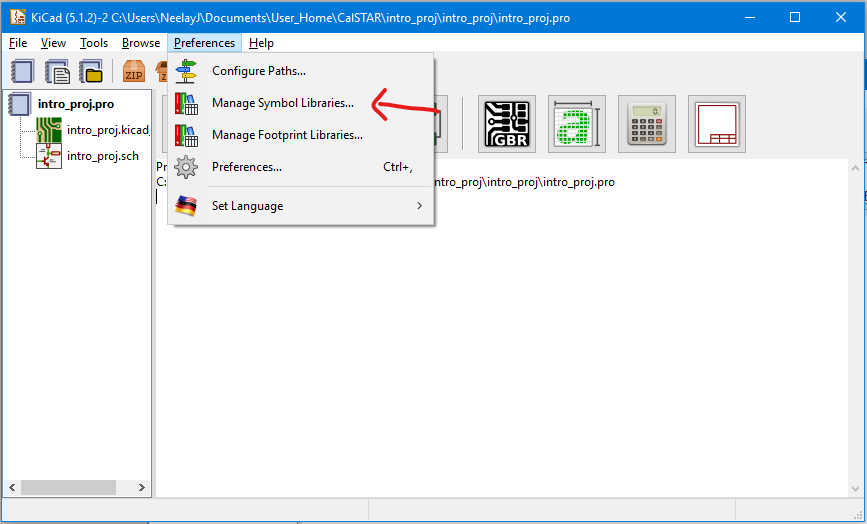

# Avionics

In this intro project, you will work through a cut-down version of the process we use in Avionics to go from start to finish for a project. Through this project you will learn how to use our tools and get a feel for what we do in Avionics.

If you have any questions about the intro project, are stuck, need help understanding a part of it, or want to know more, ask in the Avionics channel in Discord, or ping Neelay \(neelay.junnarkar\#4617\) directly!

## Description

The project you will be working on is a system to detect apogee \(peak of arc of rocket\) and deploy parachutes.

The project will have two major phases, below. A guideline time to complete each part is in parentheses.

* Hardware
  * Schematic: complete a schematic for a microcontroller and an altimeter \(3 days\)
  * Layout: layout part of the completed schematic \(6 days\)
* Firmware
  * Altimeter Interface: Interface with an altimeter using I2C \(4 days\)
  * Flight Computer Logic: using altimeter data, detect apogee and deploy parachutes \(4 days\)

## Phase 0: Hardware



### Schematic

In this part, you will learn to read datasheets for components and apply the reference schematic designs in the datasheet to complete a schematic in KiCad with a microcontroller, power module, and altimeter. This schematic may not have all the functionality required in a practically useful board, but is intended as a demonstration. 

Part of this will be guided, showing basic KiCad usage, but other parts of the schematic will be left to you. Remember to refer to the KiCad tutorial page in Avionics Tutorials for more complete references for how to use KiCad.

First, download the zip file above. It will contain two folders: `intro_proj` and `lib`. The `intro_proj` folder contains a KiCad project which you will complete. In this section you will complete the schematic. The `lib` folder contains schematic symbols and component footprints you will need.

I highly recommend looking at some of the following schematics to get a feel for how they generally should look. However, don't feel the need to make yours this polished \(in particular comments and bounding boxes\).

* [CalSTAR Groundstation](https://cadlab.io/project/2325/master/circuit/Z3JvdW5kLXN0YXRpb24vZ3JvdW5kLXN0YXRpb24uc2No)
* [CalSTAR Blackbox](https://cadlab.io/project/2320/master/circuit/YmxhY2tib3gtbmcvYmxhY2tib3gtbmcuc2No)

#### Setting up libraries

In `intro_proj`, open up `intro_proj.pro`, the KiCad project. We will now make sure that the calstar schematic symbol library in `lib` is included.

Hit `Preferences > Manage Symbol Libraries` as below.

Once the `Symbol Libraries` window opens, go to the `Project Libraries` tab and hit the `Add existing library to table` button in the bottom left row above `Path Subsitutions`.

Now navigate to `lib/` and select `calstar.lib`.  The window should end up looking like this:

Hit `Ok` and now go back to the KiCad project window. 

#### Editing the schematic

From the KiCad project window, hit the `Schematic Layout Editor` button.

This will open up the schematic editor which will have 4 items on it: a Conn\_01x02\_Male 2 pin connector for power input, an LM3940 \(voltage regulator to convert input 5V to 3.3V for the microcontroller and altimeter\), a BMP388 \(the altimeter\), and a box with many pins on it referencing a file `../lib/STM32F401RET6.sch`. If you double-click on this, it will open up that file showing the microcontroller schematic symbol along with many capacitors and resistors, and a 5 pin connector. This is a hierarchical schematic sheet, which we use to abstract away commonly used configurations of components. You can read more about them [here](http://docs.kicad-pcb.org/5.1.2/en/eeschema/eeschema.html#hierarchical-schematics).


An easy way to get to the datasheets of components is to double-click on a schematic symbol. This will open `Symbol Properties`, which has a `Datasheet` field which contains a link to a datasheet. When creating a new symbol for the calstar symbols library, make sure to do this!


The first step in completing this schematic is to connect the power input. Hit `a` and then search `+5V`. Hit `Ok` and then place the symbol by `Pin 1` of the 2 pin connector. Now hit `a` again and place the component `GND` by `Pin 2` of the connector. These symbols represent global +5V and ground which you can connect to anywhere else in the schematic by using the same symbols again. You should end up with something like below. Note that you can select a component by either clicking on it or hovering over it and hitting `g`. Then you can move it by hitting `m` or rotating it by hitting `r`.  


See a full list of hotkeys under `Help > List Hotkeys`


Now you will place wires to connect the power and ground to the connector. Hit `w` and then connect the circle at the end of `Pin 1` on the connector to the circle on the `+5V` symbol. Note that when in wire mode, the cursor will turn into a sort of pencil. Connect `Pin 2` to the `GND` symbol. You should end up with the following:

KiCad has error checking features which, if run currently, would warn that neither 5V nor GND are driven. This is because KiCad can't know an external source would be hooked up to the connector. To fix this you will put in power flags to indicate +5V and GND are powered. Hit `a` again and search for `PWR_FLAG`. Put 2 of these into the schematic. Now we want to connect one to `+5V` and the other to `GND`. To get more symbols for these, you can either go through the process of adding them using the libraries, or you can hover over the existing components, hit `c` for copy, and then place the copied symbols by the power flags. Hook up the power flags to the `+5V` and `GND` symbols as shown below. Note that rotation don't matter and are mostly style, although it is convention to try and make ground face down and power face up.  Altogether you should now have the following!

#### Voltage Regulator

You will now complete the rest of the power module of this schematic: the voltage regulator. The voltage regulator converts the input voltage, in this case 5V, to the voltage required by other components in the schematic, in this case 3.3V. We will often be converting to 3.3V for most of our components in calstar. The input voltage depends on the project. Some, such as ground station which is powered off USB, use 5V, but often we will have batteries at around 15V.

The voltage regulator in particular in this schematic is the [Texas Instruments LM3940](http://www.ti.com/lit/ds/symlink/lm3940.pdf). Open up the datasheet for the component and read the first page. This will give a good overview of the component. Ask in \#avionics in discord if you have any questions! 

At the bottom of the first page you will see a figure of a simplified schematic. This is a configuration TI recommends for this voltage regulator. Note that there are two capacitors, one from Vin \(+5V\) to ground, and one from Vout \(+3.3V\) to ground.

First, hook up `+5V` to `VI` \(input voltage\) of the regulator by copying over a `+5V` symbol and then using `w` to wire it. Now copy over `GND` to the `GND` pin of the regulator by doing the same. Now, for `VO` \(output voltage\), hit `a` and search up `+3.3V`. Hook this up to `VO`. This symbol will act as a hookup for all `+3.3V` points in the schematic. At this point you should have the following:

 

Now you will add the capacitors: hit `a` and then search for `C`. Select the unpolarized capacitor symbol and place 2 of them in the configuration depicted in the datasheet. Hook them up as depicted. Now to set the values of the capacitors, hover over them and hit `e`. This will bring up the `Symbol Properties` window. Go to the `Value` field, and replace "C" with the respective value in the datasheet \(such as "33uF"\). You will end up with the following:

While I have not done so in the above picture, you can also select the text and hit `m` to move it around if it overlaps anything. We will resolve the question mark in the component name later. 

#### Altimeter and microcontroller

Now you will complete altimeter \(BMP388\) and microcontroller \(STM32F401RET6\) portion of the schematic. This portion will be more hands-off, for you to use what you learned in the previous sections.


Ask in discord if you need help, or ping Neelay directly!


The first point to note is that the microcontroller hierarchical sheet already completes much of the microcontroller portion for you, all according to the STM32F401RET6 \(the microcontroller part label\) datasheet. Therefore, for power, all you have to do is hookup `+3.3V` to the `3V3` pin, and ground to its ground pin. 

For this project, you will be using the Inter-Integrated Circuit \(I2C\) protocol to communicate between the microcontroller and the altimeter. I2C uses two wires, a data line \(SDA\), and a clock line which defines the rate of communication on the data line \(SCL\).

At this point, open up the altimeter datasheet and read the first few pages to get a sense for its features and what it does. You will note it is actually a barometric pressure sensor, but there is a relation between pressure and altitude we can use \(given pressure at sea-level\) to determine altitude.

Now, search the datasheet to find a reference schematic for how the BMP388 should be hooked up with resistors \('R'\) and capacitors \('C'\) for I2C operation. Place components to hook it up as specified, with `I2C Address Pin Select` connected to ground. This pin determines one of the bits of the I2C address the microcontroller will use to address the altimeter. Note that we will be using both `VDD` and `VDDIO` as `+3.3V`. At this point, connections to `CSB`, `INT` \(for interrupt\), `SCL`, and `SDA` will be unfinished. These pins will all be connected to the microcontroller, with `CSB` by recommendation of the datasheet.

Now you must determine which pins of the microcontroller to connect these to \(none of the pins on the microcontroller hierarchical block are named `SDA` or `SCL`!\). For `SCL` and `SDA` it must be particular pins meant for I2C on the microcontroller. You can find these by looking in the microcontroller datasheet. For `CSB` and `INT`, it does not matter as long as they are general purpose input-output pins \(there are some more details for `INT` but it does not mater for the microcontroller we are using\). However, for consistency, connect `CSB` to `PB9` and `INT` to `PB8`. Note that you can use global labels to clean up the schematic and prevent wires from going all over the place. Connect a wire to a named global label \(e.g. "SDA"\) and then use another global label elsewhere. Example below

####  Annotating schematic symbols and electrical rule check

Now that the schematic is 'complete', it is time to get rid of those question marks. To do this, hit the `Annotate schematic symbols` button in the top toolbar. When its window pops up, hit `Annotate` and then `Close`. Now all the question marks will be replaced with numbers. These are called reference designators, so components can be easily identified. An example, `R6`, for example, means "Resistor 6". 

Now hit the button next to `Annotate schematic symbols`, `Perform electrical rules check`. This will verify the schematic follows certain rules. Hit `run`. Many issues will likely show up. Most of them will be "Pin not connected" issues. However there likely is also a "Conflict problem between pins" as below.

This is because the pin on the altimeter is not set as a power input pin, but is connected to power. To fix this, hit `a` and then search `Net`. Select and place `Net-Tie_2` as below. Annotate schematic symbols again and then run electrical rules check. This should get rid of that warning. 

Now many of the pin unconnected warnings will be coming from unconnected pins of the microcontroller. It is good practice to mark which pins will not be used in the schematic. This will also get rid of the warning. To mark no connection, select the blue x on the right toolbar, and then click each little square at the end of unused pins on the microcontroller hierarchical block. The result should be as below.

This should remove all warnings except for one last one related to `VCAP1` in the microcontroller sheet. We will ignore this one.

#### Assigning footprints to schematic symbols

The last step in the schematic editor is to assign a footprint, the physical layout of solder pads, to each schematic symbol. Hit the `Assign PCB footprints to schematic symbols` button in the top toolbar.

This will open a window like below, but your middle column will not be as filled out yet.

The left column are footprint libraries, which contain available footprints you can choose from. The middle column contains symbols in your schematic. The right column shows filtered footprints, so footprints in the selected library that follow your particular `Footprint Filters` in the top of the window.

You will have to assign the footprints as in the picture above. As our standard, we use 0603 imperial SMD resitors and capacitors. Imperial 0603 refers to the footprint being for components measuring 0.06 in × 0.03 in. SMD refers to surface-mount. In the picture below, the 3 black components soldered to board with numbers on them are surface-mount resistors. The 2 orange-brownish components on the left are surface-mount capacitors.

When you have found and assigned all the footprints, hit `Ok`.

Resources

* Altimeter \([Bosch BMP388](https://www.bosch-sensortec.com/bst/products/all_products/bmp388)\) datasheet: [https://ae-bst.resource.bosch.com/media/\_tech/media/datasheets/BST-BMP388-DS001.pdf](https://ae-bst.resource.bosch.com/media/_tech/media/datasheets/BST-BMP388-DS001.pdf)
* LDO \([Texas Instruments LM3940](http://www.ti.com/product/LM3940)\) datasheet: [http://www.ti.com/lit/ds/symlink/lm3940.pdf](http://www.ti.com/lit/ds/symlink/lm3940.pdf)
* Microcontroller \(STM32401RET6\):
  * Datasheet: [https://www.st.com/en/microcontrollers-microprocessors/stm32f401re.html](https://www.st.com/en/microcontrollers-microprocessors/stm32f401re.html)
  * Users Guide: [https://www.st.com/content/ccc/resource/technical/document/reference\_manual/5d/b1/ef/b2/a1/66/40/80/DM00096844.pdf/files/DM00096844.pdf/jcr:content/translations/en.DM00096844.pdf](https://www.st.com/content/ccc/resource/technical/document/reference_manual/5d/b1/ef/b2/a1/66/40/80/DM00096844.pdf/files/DM00096844.pdf/jcr:content/translations/en.DM00096844.pdf)
* KiCad schematic guide: [http://docs.kicad-pcb.org/5.1.2/en/getting\_started\_in\_kicad/getting\_started\_in\_kicad.html](http://docs.kicad-pcb.org/5.1.2/en/getting_started_in_kicad/getting_started_in_kicad.html)
* [https://app.gitbook.com/@calstar/s/docs/tutorials/avionics/board-design](https://app.gitbook.com/@calstar/s/docs/tutorials/avionics/board-design)

### Layout

In this part, you will learn to read datasheets for the reference layout designs, and then complete a two-layer board layout of the schematic from the previous step in KiCad.

Again, I highly recommend looking at the below layouts as a guide:

* [CalSTAR Groundstation](https://cadlab.io/project/2325/master/circuit/Z3JvdW5kLXN0YXRpb24vZ3JvdW5kLXN0YXRpb24ua2ljYWRfcGNi)
* [CalSTAR Blackbox](https://cadlab.io/project/2320/master/circuit/YmxhY2tib3gtbmcvYmxhY2tib3gtbmcua2ljYWRfcGNi)

#### Setting up libraries

Just as we set up KiCad to include a calstar schematic symbol library, we will now set up kicad to include a calstar component footprint library. This includes a custom footprint for the BMP388 pressure sensor since its exact package did not have an existing footprint in KiCad's own libraries.

As in the previous setting up libraries step, open up the KiCad project \(`.pro`\) file, and select `Manage Footprint Libraries...`.

Navigate to the `Project Specific Libraries` tab and then hit `Add existing library to table`. 

Navigate to `lib` and select the `calstar.pretty` folder. Hit `Ok` and you should end up with the following.

#### Setting up the PCB

First, fill the PCB with the components from the schematic by, after the schematic is annotated and ERC'd \(electrical rule check\), running `Tools > Update PCB from Schematic...`. 

Then hit `Update PCB`.

Then hit `Close` and you should see a clump of components in the layout window. Move these to the center of the sheet. You should end up with something like below:

At this point, to understand what is going on in the above picture, read the following section in our Board Design Reference tutorial: [https://calstar.gitbook.io/docs/tutorials/avionics/board-design\#making-a-layout](https://calstar.gitbook.io/docs/tutorials/avionics/board-design#making-a-layout).

Before continuing to actually drawing traces and placing components, you must setup the board and rule checker. Here, you set options such as the number of copper layers in the board, the board thickness, minimum trace thickness, trace clearances, via sizes, etc. These will affect how you can place components and route traces in the board. Many of these values depend on our fabrication house capabilities \([https://bayareacircuits.com/capabilities/](https://bayareacircuits.com/capabilities/), we stick to standard\), while others such as board thickness are derived from considerations of our radio.

Hit the `Board setup` button to input these values. 


The unit `mil` is one thousandth of an inch!


| Measurement | Value |
| :--- | :--- |
| Copper layers | 2 |
| PCB thickness | 31 mils |
| Track width | 6 mils |
| Minimum track width | 6 mils |

Set `Copper layers` in the `Layers` tab on the sidebar. Before setting `track width`, click on `Design Rules` and set `Minimum track width` to 6 mils.The rest are set in `Design Rules > Net Classes`. For many projects you will not set just one Net Class. A net class allows you to create configurations of track width, clearances, etc. Often you will have a power net class, which generally will require wider traces because of higher current, and then a net class for the rest of your signals. For reference, is a tool to calculate track widths: [https://www.eeweb.com/tools/external-pcb-trace-width](https://www.eeweb.com/tools/external-pcb-trace-width).  

Now, the goal is to place components and route traces so that all 'nets' are connected. One important consideration is that we place 'copper pours' as 'ground planes' on both the top and bottom layer. Essentially anywhere that isn't occupied by a component or trace will be ground. This, in addition to many other effects, makes routing easier since ground can always be connected to the other side of the board using a 'via', or a connection between layers.

First select the `Edge.Cuts` layer where you will draw the boundaries of the board.

Now select `Add graphic lines` from the right toolbar and draw a roughly 1.5 inch by 1.5 inch square around the components. This will be more space than needed for this board, but you can later adjust the edges to different aspect ratios if you wish. Hold `Ctrl` to make the lines go straight, and look in the bottom left to see length of segment.

You should end up with something like the following.

Now to create the ground plane. Go back to the `F.Cu` layer, or 'front copper'. Now select `Add filled zones`.

Create the ground plane by tracing the edge of the board. You can zoom in to make sure you are selecting the right points. When you begin drawing and the `Copper Zone Properties` window pops up, set `Net` to `GND`, `Default pad connection` to `Thermal relief` and `Outline slope` to `H,V and 45 deg only` and click `Ok`.

Now continue tracing around the board. You will end up with below. You may notice some ratlines have disapeared, becase those grounds have been connected by the ground pour.

Now go to `B.Cu` \(Back Copper\) and do the same to end up with below, but make sure `Layer` is set to `B.Cu` in `Copper Zone Properties`.

It can get annoying with the pour always showing, so know that these three buttons on the left toolbar can change the viewing options of pours. Also, hit `B` to update copper pours when you move around components.


Remember to think about solderability! How close are you placing components to another? Would you be able to get tweezers and a soldering iron in there? Consider the height of components too.


Now for the fun part, to move all the components and route traces between them. Many of the controls are the same as in schematic editor, such as `m` for move and `r` for rotate. To route a trace, press `x` or hit the button below. 

To place vias, to bring traces to the back of the board and route them there if necessary, or connect the front ground plane to the back ground plane, hit the following button that is right below `Route trace`.

Not everything is free-form though. A major guideline is to put the capacitors that go between `VDD` and `VSS` on components right next to the `VDD/VSS` pairs, as in the example below.

In the right part of the above image you may note I routed `VDD` under the microcontroller! That's perfectly valid, and feel free to route signals under other components, but try to keep the ground plane as intact as possible.

The last step is to perform design rules check just as in schematic. Hit the following button to open up the menu to do so.

Hit `Run DRC` and fix any errors that occur. When both `Problems / Markers` and `Unconnected Items` show 0 errors, you're done with layout! Feel free to ask in \#avionics for help.

Additionally you can run `View > 3D Viewer`. This will generate a 3d model of the board with components and traces, ground pours, drill holes, and all rendered. This is fun to look at as you progress with your layout but also useful for getting a sense of component spacing for soldering, an easy visual check for errors, and good for integration with CAD models.

You may notice that some components, `U1` in particular, do not have a model. This is because that component has a custom footprint and symbol, but we did not place a model. 

Resources

* [https://app.gitbook.com/@calstar/s/docs/tutorials/avionics/board-design](https://app.gitbook.com/@calstar/s/docs/tutorials/avionics/board-design)
* Same datasheets as above
* KiCad layout guide
* [https://www.eeweb.com/tools/external-pcb-trace-width](https://www.eeweb.com/tools/external-pcb-trace-width)


Doing layout takes trial and error! Don't be afraid to play with many different configurations and orientations of components.


## Phase 1: Firmware

### Flight Computer Logic

Now, with the hardware complete, you will implement the main logic of the board: to use altitude data to detect apogee, and then use GPIO \(General Purpose Input/Output\) pins to ignite blackpowder and deploy parachutes. You will be testing your code in our Software-in-the-Loop \(SIL\) simulator. Take note that there is noise in altimeter data!


With going directly to writing firmware for main logic, this intro project is skipping a crucial step: writing firmware for interfacing with sensors. Much of this has to do with learning protocols such as Inter-integrated circuit \(I2C\), Universal Asynchronous Receiver/Transmitter \(UART\), and Serial Peripheral Interface \(SPI\) protocols. Links have been provided in the 'Further Reading' section.


#### Setup

The first step is to setup [SIL ](https://github.com/calstar/SIL)for the intro project. SIL is a software simulation tool that allows us to run our firmware intended for hardware, without the hardware. This allows us to test and debug our code, make faster iterations, and test changes to code even when we are not in the lab.

Download the files below. These are configuration files for SIL. The rocket configuration file defines parameters of the rocket such as weight, drag, parachutes, and then microcontrollers and pin connections for our avionics. The simulation config file defines environment parameters such as ground height and simulation parameters such as how to record data and what tests to run. These config files have been pre-made for the intro project, but you may have to define your own for future projects.





Now, clone the SIL repository from:



You will want to place the rocket config file in `config/rockets` and the simulation config file in `config/simulations`. 

Now, create a `main.cpp` file in a directory of your choosing \(perhaps an intro project folder outside of SIL\). Now, look at the SIL Readme: [https://github.com/calstar/SIL/blob/master/README.md](https://github.com/calstar/SIL/blob/master/README.md) to understand the format of a file that SIL will accept. It is similar to an Arduino file layout. 

Follow the README to learn how to run SIL as well. Note that you will want to pass in your own code to make, and the intro project simulation file to build. Once you understand how to run SIL, begin writing your program following the below guidance.

#### Altitude

In the sample firmware folder of SIL, you will see an example on how to read altitude data. That file shows how to use the MPL3115A2 altimeter, a sensor we have used previously. For this intro project you will use the BMP388 pressure sensor. Look for how to use the BMP388 in `SIL/src/includes`. It parallels the use of the MPL. However, the BMP does not convert pressure to altitude, so you will have to do that on your own.

#### GPIO

The interface to deploy parachutes for our firmware is through general purpose input/output \(GPIO\) pins. Essentially, create a `DigitalOut` for each output GPIO you want and set the variable to `0` when it should output `LOW` and set to `1` when it should output `HIGH`.

#### Logic

Your code should deploy the drogue parachute at \(or soon after\) apogee, and deploy the main parachute at 600ft above the ground.

#### Specification List

Below is a quick reference of the above, plus pin definitions and other usefull stuff.

* Use BMP388 sensor; code in `SIL/src/includes`. Convert pressure in Pascals to ft.
* Use `DigitalOut` for output pins.
* The drogue chute is on pin `10`.
* The main chute is on pin `11`.
* The serial pins are `DEBUG_TX` and `DEBUG_RX`.

Resources

* [SIL](https://github.com/calstar/SIL)
* [Pressure Altitude](https://www.weather.gov/media/epz/wxcalc/pressureAltitude.pdf)

