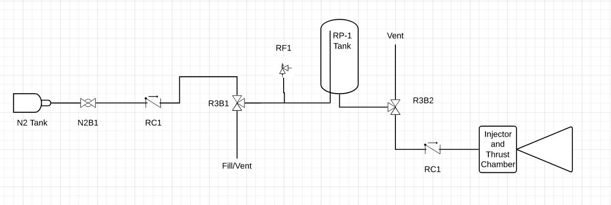

# Propulsion Fall 2019

## Introduction

The purpose of this project is to ensure that new and returning members research various parts of a rocket propulsion system from both theoretical and practical engineering points of view.

The project consists of two parts: an in-person component and a project component.

### Returning Members

If you are a returning member for the 2019-2020 academic year, you are not required to complete the project component, but you _are_ required to satisfy the in-person requirement by participating in any of the offered workshops. Leading or helping plan a workshop will be considered as participation.

If you are interested in contributing to a workshop \(highly encouraged\), please contact Michael via Discord.

### Contact

If you have any questions about any part of the question at any time \(even if it's 4AM on a weekend\), do not hesitate to reach out to the propulsion lead \(Michael\) or the propulsion deputy \(Trevor\). Discord is preferred, but if you are having difficulty getting started with Discord, Email is fine.

* Michael's Discord: mvronsky \(accessible through CalSTAR discord\)
* Trevor's Discord: zat15  \(accessible through CalSTAR discord\)
* Discord: in the \#propulsion channel
* Michael's Email: michaelvronsky@obvious.edu
* Trevor's Email: tzinky@obvious.edu
* Office Hours:

  * Michael's OH: Tuesdays 14:10-15:30 in Kresge Engineering Library

    \(exact location may vary, will be announced on Discord\)

  * Trevor's OH: Wednesdays 16:30-18:00 in Kresge Engineering Library

    \(exact location may vary, will be announced on Discord\)


This project is intended to challenge you a little bit! You are not expected to know everything you need for this project going in, and it will almost certainly be necessary for you to ask questions and interact with the team lead and propulsion members. This is by design, and is intended to get you familiar with our workflow and asking for help when needed. If you feel intimidated by the intro project, please please please reach out to others! Everybody wants you to succeed!


## 

## 1. In-Person Component

To satisfy the in-person component, you must attend **one** of the following events:

* Safety Workshop \(First one on Friday, Sept. 20 at 19:00\)
* Michael or Trevor's Office Hours, to review safety \(See above for OH\)

In addition to attending a safety session, you are required to attend **one** of the following events. If you have time to attend more than one, you are encouraged to do so.

* A trip to the Richmond Field Station \(RFS\) \(See \#propulsion for updates\)
  * This is more time consuming, but highly recommended, as it is where we do most of our work
* Injectors and cooling workshop \(Thursday Sept. 26, 7PM-8PM\)
* Mechanical design workshop \(Time TBD\)
* CAD workshop \(Sunday Sept. 22 9AM-11AM\)
* Solid propellant workshop \(Thursday Sept. 26 6PM-7PM\)
* Pipes and Fittings workshop \(Wednesday Oct. 2nd, 8PM-9PM\)

Lastly, once you believe you have finished your intro project, you should schedule a time with Michael during office hours to go over your submission. If you are super busy and can't find a time, then talk to me and we can sort something out.

## 2. Project Component

You may choose any of the three project components to complete. All are intended to be of about the same difficulty, and should give you insight about the various engineering tasks that we undertake.

### 2.1 Fluids

This task involves assorted tasks related to fluids design in propulsion systems. 

#### 2.1.1 - Injectors

Injectors serve to mix and atomize the propellants flowing into the thrust chamber. Injectors also help regulate the flow of propellants and ensure efficient combustion.

* Describe 4 types of injectors, and explain their pros and cons
* Design an injection system for the given engine.
  * Your design should consist of the following:
    * The selected injector type, and a justification for its selection
      * Factors to consider here are manufacturability/machinability and efficiency of mixing, among others
    * If there are multiple injection elements, describe their layout on the injection plate
    * The orifice area for each injection element. This can be calculated using an equation found in chapter 8 of Sutton \(9th ed.\)
  * The engine parameters are:
    * 1000psi chamber pressure
    * Mass flow rates are 0.17 kg/s for LOX, 0.08 kg/s for RP-1
    * 250 psi pressure drop across the injector
    * Injection plate diameter is 2”

#### 2.1.2 - Feed System Analysis

The following Piping and Instrumentation Diagram \(P&ID\) is for a simplified gas-fed system. For each component labelled, describe its function, and what would happen if that component were not included in the system. Note that this is not the entire feed system, just one side of it. There are 2 fluids in the system, N2 and RP-1.


To get an idea of what some components are used for, consider walking through a cycle of filling the tank from the Fill/Vent, then feeding through either the injector or the vent in R3B2


In the diagram, all ball valves are "L-port".

The following page will be very useful in interpreting this diagram:



#### 2.1.3 - Flow coefficient

The flow coefficient of a component, often denoted Cv, is a very useful measure of its behaviour in the feed system.

Describe what the flow coefficient is, and explain why it is important to look at the flow coefficient of components when selecting them.

Then, showing your work, derive the pressure drop across this swagelok check valve \([https://www.swagelok.com/en/catalog/Product/Detail?part=SS-4C-1/3](https://www.swagelok.com/en/catalog/Product/Detail?part=SS-4C-1/3)\) when carrying RP-1 at a _mass_ flow rate of 0.08 kg/s. Discuss your answer, particularly whether this pressure drop is significant in the context of the feed system \(which operates at 1250-1800 psi\).

**Deliverables**

* Your injector design and area calculations
* Your interpretation of the P&ID diagram
* Your solution to the question in part 2.1.3


All deliverables should be compiled into a powerpoint/google slides presentation


### 2.2 Thrust Chamber Design

A thrust chamber is to be designed for a 1000lbf engine using Kerosene and Liquid Oxygen.

* Design constraints:
  * O/F ratio = 2.5
  * The feed system can supply up to 1200psi feed pressure, and an injection pressure drop of 250psi will be used.
    * Based on these parameters, decide on a reasonable chamber pressure.
  * The thrust chamber must fit in a 7.5” diameter airframe.
  * Ambient pressure will be 1atm

**Deliverables:**

* Chamber geometry: Using the Rocket Propulsion Analysis \(RPA\) software, determine the thrust chamber size and shape.
* Tank analysis: A total impulse of 30,000 N\*s is desired. Using the mass flow rates derived in RPA, determine the mass of each propellant required, as well as the associated volume.
* Material analysis: Pick three materials that are commonly used as thrust chamber materials and describe the pros and cons of each material in this application
  * A good analysis should include comparisons between quantitative material properties such as yield strength, thermal conductivity, and thermal expansion as well as qualitative material properties such as brittleness, machinability, cost, and corrosion resistance
  * If a metal is one of the materials chosen, it must be a specific grade i.e. 1018 steel vs just steel, or 316 stainless steel vs just stainless steel


All deliverables should be compiled into a powerpoint/google slides presentation


### 2.3 Test Stand Mechanical Design/CAD

Just like any other subteam, our work requires the design and construction of many mechanical systems, often for a very specialized task. In the past, these have included structures to house the propulsion system in the rocket or on the test stands, testing jigs for various components, mounting brackets, and more.

In this task, you will design a test stand for testing small solid motors. Test stands are used to fire the motor while it is static on the ground. Test stands help verify motor design and test key features of any propulsion systems. Common features of test stands include thrust measuring devices, safety features, and, obviously, motor systems. In this project, you will design a small test stand intended to test fire solid model rocket motors up to a “G” class. Your design of this should ideally maximize safety and measurement accuracy, while minimizing costs and complexity.


This is an intentionally open-ended mechanical design task. The purpose is to exercise your ability to think about problems and create mechanical solutions. If you don’t know where to start, try searching online for rocket motor test stands to get some inspiration.


**Design Constraints**

* Must be able to safely test fire up to a “G” class solid motor
* Must be able to handle various motor diameters up to 29mm
* Must be able to measure the thrust produced by the motor

**Deliverables:**

* A completed Solidworks assembly file of your test stand
* A bill of materials including all part names, order links \(www.mcmaster.com is a great website for ordering pretty much any part you can think of, plus they have CAD’s on the website which is pretty great\), and prices. A template is provided here.
* A justification of your design. Factor of Safety calculations, while optional, would be nice. This can be just a quick paragraph or two explaining your thinking, possibly improvements, possible failure modes, etc.


**SolidWorks is only compatible with Windows!** If you use MacOS or Linux you have three options: 

1. Use the on-campus CAD lab in Etcheverry 1XXX which has SolidWorks pre-installed.
2. Install Windows and then install SolidWorks.
3. **Only if the above is not feasible,** you may use a compatible CAD program of your choice \(Fusion 360 is recommended as it has a lot of resources online\).



All deliverables should be placed in the GrabCAD "Fall 2019 Intro Projects" project, in a folder with your name:

i.e. Fall 2019 Intro Projects&gt;First Last


## Resources





