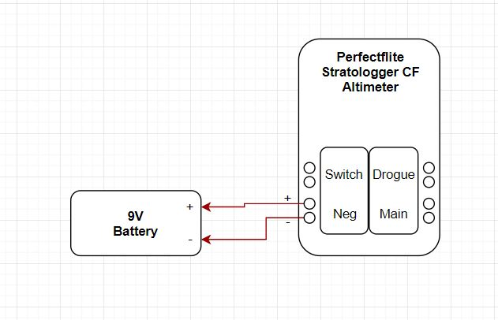

# Recovery 2018

## **Introduction**

Welcome to the Recovery team's intro/returning project page! Glad you're here.

The recovery team is tasked with safely landing the launch vehicle. This responsibility entails understanding the constraints provided by others/the specifications of the launch vehicle itself and producing creative and efficient solutions. Tasks include but are not limited to: parachute size/material/geometry selection, parachute deployment altitude selection, ejection/separation mechanisms, and a general understanding of mechanics, electronics, simulations, physics, and more.

For any questions/help, feel free to reach out to the recovery team lead, Allen, and deputy, Evan at office hours or online through Discord/email. Office Hour times/locations for both are listed below. OH are highly encouraged if you need help!

* Allen Ruan | Recovery Team Lead
  * OH: Thurs 3-5PM, Kresge Engineering Library or Etcheverry CAD Lab(check discord for exact location)
  * Email: [allenruan@berkeley.edu](mailto:allenruan@berkeley.edu)
* Evan Borzilleri | Recovery Team Deputy
  * OH: Monday 10AM-12PM, Kresge Engineering Library (check discord for exact location)
  * Email: [evanjborzilleri@berkeley.edu](mailto:evanjborzilleri@berkeley.edu)


**\[Workshop]** = indicates that a workshop will be provided for the fundamentals of this task. Workshops are mandatory, and will make accomplishing the tasks much more simple. Workshop times are listed below:

* **\[OpenRocket]** | \[When] \[Where]
* **\[PDM]** | \[When] \[Where]
* **\[Recovery]** | Thursday 6-7PM (09/13) in Etcheverry 3rd Floor (check discord for room #)
* **\[Solidworks]** | Saturday 2-4PM (09/15) CAD Lab (Etcheverry 1171)


## **New Member Project **_**(8 hrs)**_

The new member project for the recovery subteam is intended to:

1. Introduce a **strong technical foundation** for the critical components of the recovery subsystem to new members
2. Learn to work with constraints, similar to **industry**
3. Encourage **collaboration/asking for help** to accomplish these tasks

The deliverables of the project should be presented at the recovery subteam meeting **(Sept. 27th)** in the form of a .ppt slide deck containing snapshots of the various projects. Remember! This project is meant to be challenging, but attainable, especially if you ask for help. So please ask questions, come to workshops, and come to office hours!\
****

### **Task 1 | Knot Tying **_**(0.5 hrs)**_

Workshops | **\[Recovery]**

Objective | Become familiar with and learn to tie all the knots necessary for parachute deployment systems (All knots will be demoed in the workshop). The following knots must be perfected:

* Eight knot
* Square knot
* Bowline knot
* Alpine Butterfly knot
* Double hitch

Deliverable | The student must demonstrate tying all the knots above to either Evan or Allen

### **Task 2 | Recovery Sequence **_**(0.5 hrs)**_

Workshops | **\[Recovery]**

Objective | Create a flowchart detailing the sequence of recovery events starting from when the launch vehicle is at apogee to when it is fully recovered. Images/Drawings are encouraged.


**Hint:** There's at least around 4 events starting from apogee and ending with landing. The more detailed the events are described, the better.


Deliverable | Flowchart (can use draw.io or any other diagram sites)

### **Task 3 | Parachute Selection **_**(3 hrs)**_

Workshops | **\[Recovery] \[OpenRocket]**

Objective | Select the best combination of parachutes that satisfies the constraints below:

Constraints:

* Drogue is deployed at apogee (maximum altitude)
* Main is deployed at 600ft above ground level (AGL)
* Drogue Cd (Coefficient of Drag): 1.5
* Main Cd: 2.2
* Each component must not land with greater than 75 ftlb-f
* Drift radius must be less than 2500ft in 20mph wind

| **Parachute Options**                | Drogue Deployment Velocity (ft/s) | Drogue Terminal Velocity (ft/s) | Main Deployment Velocity (ft/s) | Main Terminal Velocity (ft/s) | KE of Upper Section before Landing (ft-lbf) | KE of Avionics Bay before Landing (ft-lbf) | KE of Lower Section before Landing (ft-lbf) | Drift in 20mph wind (ft) |
| ------------------------------------ | --------------------------------- | ------------------------------- | ------------------------------- | ----------------------------- | ------------------------------------------- | ------------------------------------------ | ------------------------------------------- | ------------------------ |
| _Option 1:_ Main - 72", Drogue - 12" |                                   |                                 |                                 |                               |                                             |                                            |                                             |                          |
| _Option 2:_ Main - 72", Drogue - 24" |                                   |                                 |                                 |                               |                                             |                                            |                                             |                          |
| _Option 3:_ Main - 60", Drogue - 24" |                                   |                                 |                                 |                               |                                             |                                            |                                             |                          |


**Hint:** First calculate the **masses** of the upper, lower, and avionics bay sections using the given OpenRocket File for Arktos. In this case, the upper section is referring to all components above the avionics bay while lower section refers to all components below the avionics bay.



OpenRocket File for Arktos


Deliverable | Modified table with filled out fields in .ppt and correct option with explanation of why this is the best option out of the three. .ppt must show work/calculations. Cheating is not tolerated.


**BONUS:** Play around with OpenRocket and select your own combination of sizes that would be even better than the best option listed above.


****

### **Task 4 | Bulkhead Design **_**(4 hrs)**_

Workshops | **\[PDM] \[Recovery] \[Solidworks]**

Objective | Create a CAD assembly of a rocket bulkhead using Solidworks. Once complete, check-in to CalSTAR’s Solidworks Workgroup PDM. The CAD Assembly shall consist of the following parts/components:

* Outer Bulkhead
* Inner Bulkhead
* U-Bolt
  * 1/4" Bolt
  * 1/4" Flat Washers (x4)
  * 1/4" - 20 Nuts (x4)

Drawings of the necessary parts are provided below:


Assembled Bulkhead



Bulkhead #1 Drawing



Bulkhead #2 Drawing


For bonus points:

* Include material properties for each component
* Etch text on both sides of the combined bulkhead

Deliverable | Snapshots of the full assembly (two different views), and screenshot of assembly uploaded to the PDM

****

### **Task 5 | Creative Section **_**(X hrs)**_

Workshops | **\[Recovery] \[Solidworks]**&#x20;

Objective | CAD and mockup a functional electronics sled for the avionics bay. The sled must meet the following requirements:

* Designed in 3D modeling software (preferably Solidworks)
* Must be able to mount Stratologger CF altimeters and 9V Duracell batteries
* Fit within a 4in diameter tube


**NOTE:** This is meant to be an open-ended project; there is no "correct" way to complete it. We just want to see what new and innovative designs you can come up with. Manufacturing methods are also open-ended  (some suggestions might include 3D printing, lasercutting, etc.).


Deliverable | Manufactured sled and its assembly file uploaded to the PDM. Add photos to the .ppt and describe the design

****

## **Returning Member Project **_**(10.5 hrs)**_

Similar to the new member project, the returning member project is intended on refreshing everyone’s mind on performing the pertinent tasks for the recovery team, in addition to educating members on a deeper level focused on manufacturing and big-picture understanding. It is **due on 09/20.**\
****

### **Task 0 | Intro Project  **_**(7.5 hrs)**_

Workshops | **\[OpenRocket] \[PDM] \[Recovery] \[Solidworks]**

Objective | Complete tasks 1, 3, and 4 the intro project

Deliverable | Document all work on a .ppt as outlined above

### **Task 6 | Wiring Diagram **_**(1 hr)**_

Workshops | **\[Recovery]**

Objective | Create a wiring diagram of all the electronics/wiring included in the avionics system for a dual deployment recovery system using a flowchart software (eg. draw.io). Include + and -. This might require looking into an altimeter datasheet (look up perfectflite stratologger CF). Components that shall be included:

* 1 Altimeter
* 1 9V Battery
* 1 External Switch
* 1 Main Charge
* 1 Drogue Charge

Below is a snapshot of a diagram with the altimeter and batter to get you started.

Deliverable | Snapshot of wiring diagram in .ppt

****

### **Task 7 | Launch Day Checklist Quiz  **_**(0.5 hrs)**_

Workshops | None

Objective | Complete the following quiz about the sequence of events that we, as a recovery team, complete during a launch day. Unlimited attempts, but must get a perfect score.

Link: [https://goo.gl/forms/MhCX3EOcK8SDAHts1](https://goo.gl/forms/MhCX3EOcK8SDAHts1)

Deliverable | Screenshot of perfect score\
****

### **Task 8 | Technical Writing** _(1.5 hr)_

Workshops | None

Objective | Given the importance of technical reports/documentation in what we do, write a paragraph detailing the specs and function of the bulkhead you have just created. Include an image of the CAD and the actual manufactured bulkhead. Include a reference for the figure and a caption. Format is up to you, but please check for typos and grammatical errors. If you have any questions, there exists a lot of good documentation on LaTeX online, and/or come to OH.

Deliverable | .pdf of the LaTeX document\
