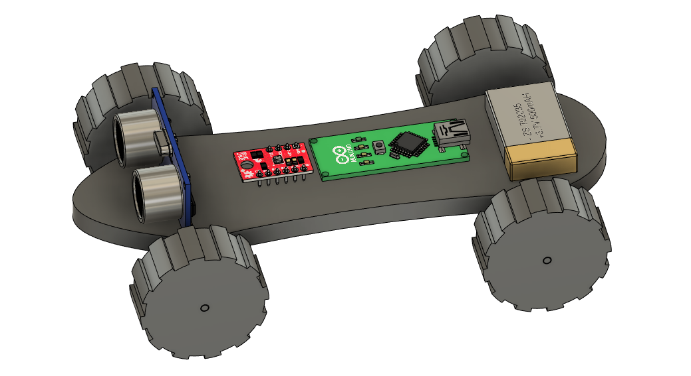
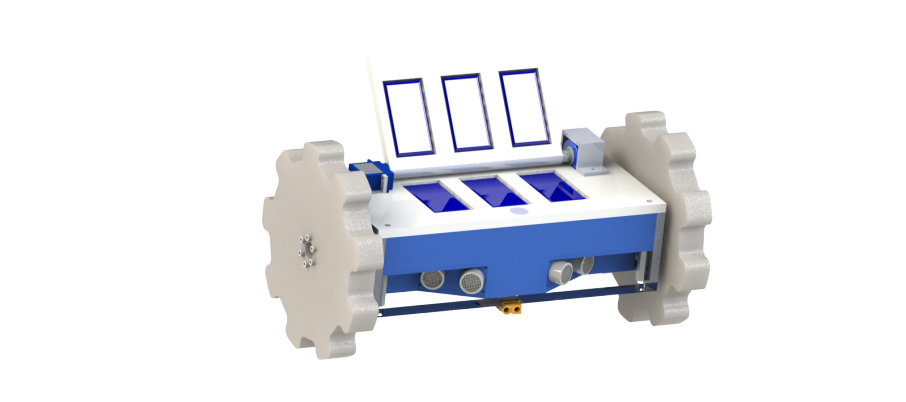

# Payload

<figure><figcaption>
Example rover assembly
</figcaption></figure>

## Introduction

The intro project is designed with three main parts:

1. A **general rocketry take-home quiz**, taken **alone** (due roughly _1 week_ after assigned)
2. A **rover design project**, done with **mentor guidance** (due roughly _3 weeks_ after assigned)

The intro project may seem daunting, but don’t worry!

In addition to the existing resources on GitBook, all the returning payload members will available to help.

We will assign a specific returning member as your mentor, but please reach out to any returning member for any questions. Also, feel free to DM Payload Lead Caytyn Abono on Discord (**caytyn#0890**).

We will also hold a series of intro project workshops throughout the next weeks, giving an opportunity for hands-on help. Details will be announced here and on the #payload channel.

Above all, we hope that the intro project will be a fun and rewarding experience.

Checkpoints Schedule:

* By week of 2022-09-24 - Quiz Complete
* By week of 2022-10-15 - Design Project Complete

### Part 1: General STAR & Rocketry Quiz Questions

1. What are the specialties of STAR?
2. What are the names of STAR's rockets?
   1. What are their diameters?
   2. What are they made out of?
3. What is the maximum side length payload cube that could theoretically fit in a 20cm diameter rocket?
4. A G-class motor is roughly how many times more powerful than a D-class motor?
5. With roughly what speed will a 10kg rocket hit the ground if in free fall from 1280m? (You may use g=10 m/s/s)
   1. Is this a realistic speed to assume? Why or why not?
6. Give two pros and two cons of a dual-deployment (two parachute) recovery system.
   1. How do altimeters measure altitude?
7. Is it possible to directly measure the velocity of a rocket during flight? Why or why not?
   1. Describe two ways you might calculate the velocity of a rocket with the following sensors: GPS tracker, altimeter, accelerometer, gyroscope.
   2. What are the potential advantages and drawbacks of each method given?
8. Explain what each number means in the following UTS designation: #6-32x1
   1. What is the smallest screw gauge in the UTS system?
   2. What are the standard and fine TPI of a #4 screw?
9. Explain what each number means in the following Metric screw designation: M6-1.0x20
   1. How is the designation of threading different in the UTS system than the Metric system? **Subtle but important.**
   2. Why is the Metric system superior to the US Customary system?

### Quiz Submission

Please fill out your quiz on the Google Form here: [https://docs.google.com/forms/d/e/1FAIpQLSfBBbWGSsRz67oonUvC7-hr3IUu-v4TSqGfmcmzg7yq0dAcPA/viewform?usp=sf\_link](https://docs.google.com/forms/d/e/1FAIpQLSfBBbWGSsRz67oonUvC7-hr3IUu-v4TSqGfmcmzg7yq0dAcPA/viewform?usp=sf\_link)

### Part 2: Design

#### Design Objective Outline

Our goal is to build a mini robotic rover that fits inside a 6” inner diameter payload tube. Another team has already done the task of picking out the electronics, sensors, and wheels. Your task is to design and prototype the rover’s chassis—a structure to mount all of the sensors, battery and wheels. After that, you will build your design, but without the electronics.

#### Requirements

> Engineering is defined by requirements!
>
>
>
> Tolerances are important, make sure to add AT LEAST a 1mm tolerance when designing to account for manufacturing differences.&#x20;
>
>
>
> Listed below are all the parts you will need to integrate into your design. For the tires and axles, you will have a choice of which style tire and which length of axles (and choice of colors as well). When we have our first intro project work session, you will be able to pick your LEGO parts and design from there!

_**Components to Integrate**_

* 1x [Arduino Nano ](https://store-usa.arduino.cc/products/arduino-nano/?selectedStore=us)
* 1x [motor driver board](https://www.pololu.com/product/2130) (optional)&#x20;
* 1x [distance sensor ](https://www.pololu.com/product/2474)
* 1x 3.7v Lipo Battery&#x20;
* 4x LEGO Rims (56145)&#x20;
* 2x LEGO Axles (3708 or 3737 or 13927)&#x20;
* 4x LEGO Tires (15413 or 61481 or 55978)

Note on the axles:&#x20;

One of the axle types (13927) is too long for the payload space requirement. You will have to cut these (both in CAD and in real life) to make them fit. We will teach you how to do this!

_**Detailed Design Requirements:**_

1. All components must fit within the space of a cylinder, 6" in inner diameter and 8" in length.
2. All components must be mounted by non-permanent means. For example, you may not glue the Arduino to the frame. One method could be to use zip ties/Velcro; if you choose this option, be sure to include slots/holes for the ties/velcro. For parts with mounting holes, screws and nuts are preferred.
3. The distance sensor must be mounted to the front of the rover, facing forward.
4. The wheels may be arranged in any reasonable format (keep in mind you will be manufacturing and building the rover, so the axles need to be able to spin freely, and since the chassis’ are being 3D printed you will need to account for any shrinkage; we will talk about this more in the 3D printing workshop).
5. You do not have to worry about wiring the electronics or mounting the rover to the tube, but you should make sure the wires can be routed to each electrical component For example, if designing covers to fasten the electronics to the chassis, make sure to put a hole for a wire to fit through (number inches).

Your rover may be as elaborate or simple as you'd like, but it should adhere to the above requirements, and should be able to be manufactured given the resources and parts that Jacobs and STAR are providing.

### Designing in SolidWorks


**Checkpoint: Week of \[TBD] | Workshop 1: \[TBD] see #announcements on Discord for more information**

**(Dates subject to modification according to scheduling)**


We will use CAD (computer aided design) software in order to model our 3D frame. STAR has standardized using [SolidWorks ](https://github.com/calstar/star-gitbook/tree/5d8cf7302474743570b93a399b946d08b76f99ff/intro-projects/www.solidworks.com)as our preferred CAD software. If you have used CAD software other than SolidWorks, such as Fusion 360, Inventor, or Creo, then SolidWorks should not be too difficult to pick up.

If you have never used CAD software before, don’t worry! We will hold a CAD workshop during GM (date TBD)**.** If you are not able to attend, there are also great online resources:




There will also be example PDFs for each section located at the end of each stage. Use them if you are really stuck!


### Step 1: Installing SolidWorks

The first challenge of this stage is installing SolidWorks. The GitBook has a very helpful “SolidWorks Installation” page to help you with this.


[solidworks.md](../tutorials/software/solidworks.md)



**SolidWorks is only compatible with Windows!** If you use MacOS or Linux you have three options:

1. Use the on-campus CAD lab in Etcheverry 1XXX or Jacobs 10 both of which have SolidWorks pre-installed.
2. Install Windows and then install SolidWorks.
3. **Only if the above is not feasible,** you may use a compatible CAD program of your choice (Fusion 360 is recommended as it has many online resources).


### Step 2: Working with the given hardware

Assume another team has already picked out the wheels and electronics necessary for a rover. As a design engineer, your task is to cohesively incorporate all the given components into a (hopefully) functioning rover. A good place to start is by looking at the physical dimensions of each component.&#x20;

Attached are 2D dimensioned engineering drawings of some of the electronics.


Component Dimensions


Below is a pdf with the dimensions for the LEGO wheels and axles (which depend on which tires you chose), along with some examples for how to design your rover to accomodate them.


Dimensions of LEGO Parts + Tips for Axle Mounting Design


3D models of major components are provided below for the SolidWorks assembly of your rovers.




You do not have to 3D model the payload section.


### Step 3: Working with the tube

The most challenging (and annoying) constraint placed on many payload projects is the size of the payload tube (the part of the rocket that the payload is stored in). Learning to work with the size limits of a cylinder is essential.

In this project, your tube space is limited to 6" in. inner diameter and **8**" in length, a common size for a medium-scale rocket (and the size our glider, DAVE, will have to fit into!). It is often convenient to work with space envelopes limited by a rectangle, so the foremost important fact to understand is that **a 6" diameter circle will not fit a 6x6" square.** Your usable space is limited to what you can fit (or [inscribe](http://www.moomoomath.com/inscribed-polygon.html)) within a circle.

### Step 4: Start designing!

That's all the essentials to get you started on your design. Remember, you can come up with anything as long as it meets the detailed design requirements. The rest of this sub-section lists a few tips.


Any non-permanent mounting method is acceptable. If a part comes with screw holes, you are encouraged to design for screw fasteners. However, zip ties and Velcro are also acceptable (and are the only possible options for parts without mounting holes).



To design screw holes that fit, visit the [Tolerancing GitBook page](../tutorials/manufacturing/tolerancing.md)!



Your mentor (and other Payload members) are here to help, and if you're ever stuck or confused, please ask!


### Step 6: Manufacturing!

Now you start actually building your rover!&#x20;

The chassis can be 3D printed through Jacobs (if you don’t have a Makerpass, you can still print it and STAR will reimburse you). Click [here](https://jacobsinstitute.berkeley.edu/jacobs-self-service-printing/) for Jacobs self-service printing. We will also have a workshop during a GM on everything you’ll need to know about 3D printing.&#x20;

The electronics will not be part of your final rover, so all you will need to do is cut your axles (if necessary) and integrate the wheels and axles with your chassis. On the last day of intro projects, we will provide you with the rest of your parts and you’ll be ready to build!

## Project Submission

Please upload your SolidWorks/other CAD files here: [https://forms.gle/fBveaPspNEGfzsas9](https://forms.gle/fBveaPspNEGfzsas9)
