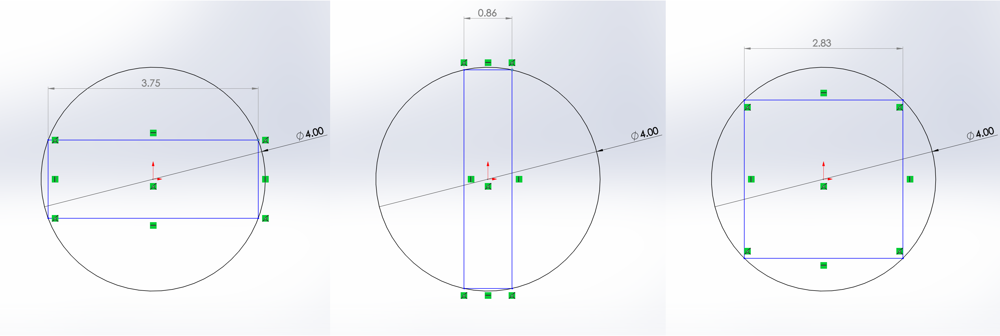

# Payload

## Introduction

The intro project is designed with two main parts:

1. A general rocketry take-home quiz, taken alone \(due roughly 1 week after assigned\)
2. A design project, also done alone \(due roughly 3 weeks after assigned\)

The intro project may seem daunting, but don’t worry! In addition to the existing resources on GitBook, all the returning payload members will available to help. To encourage intra-team communication, new members are encouraged to ask for help from a designated returning member, as part of our mentorship program. Furthermore, do not hesitate to ask questions on the \#payload Discord channel or PM Jared Farley or other payload members.

We will also hold a series of intro project workshops throughout the next weeks, giving an opportunity for hands-on help. Details will be announced here and on the \#payload channel.

Above all, we hope that the intro project will be a fun and rewarding experience.

Checkpoints Schedule:

* By week of 2020-09-21 - Quiz Complete
* By week of 2020-10-05 - Design Project Complete

### Part 1: General STAR & Rocketry Quiz Questions

1. What are the subteams of STAR?
2. What are the names of STAR's rockets?
   1. What are their diameters?
   2. What are they made out of?
3. What is the maximum side length payload cube that could theoretically fit in a 20cm diameter rocket?
4. A G-class motor is roughly how many times more powerful than a D-class motor?
5. With roughly what speed will a 10kg rocket hit the ground if in free fall from 1280m? \(You may use g=10 m/s/s\)
   1. Is this a realistic speed to assume? Why or why not?
6. Give two pros and two cons of a dual-deployment \(two parachute\) recovery system.
   1. How do altimeters measure altitude?
7. Is it possible to directly measure the velocity of a rocket during flight? Why or why not?
   1. Describe two ways you might calculate the velocity of a rocket with the following sensors: GPS tracker, altimeter, accelerometer, gyroscope.
   2. What are the potential advantages and drawbacks of each method given?
8. Explain what each number means in the following UTS designation: \#6-32x1
   1. What is the smallest screw gauge in the UTS system?
   2. What are the standard and fine TPI of a \#4 screw?
9. Explain what each number means in the following Metric screw designation: M6-1.0x20
   1. How is the designation of threading different in the UTS system than the Metric system? **Subtle but important.**
   2. Why is the Metric system superior to the US Customary system?

### Quiz Submission

Please upload your quiz as a PDF here:



### Part 2: Design

#### Design Objective Outline

Our goal is to build a mini robotic rover that fits inside a 4” diameter payload tube. Another team has already done the task of picking out the electronics, sensors, motors, and wheels. Your task is to design and prototype the rover’s chassis– a structure to mount all of sensors, motors, wheels, and the [microcontroller](https://electronics.howstuffworks.com/microcontroller1.htm).

#### Requirements

> Engineering is defined by requirements!

_**Components to Integrate**_

* 1x [Arduino Nano](https://store.arduino.cc/usa/arduino-nano)
* 2x [40mm wheels](https://www.pololu.com/product/1452/specs)
* 1x [ball caster wheel](https://www.pololu.com/product/952/resources)
* 2x [motors](https://www.pololu.com/product/2367/resources)
* 1x [motor driver board](https://www.pololu.com/product/2130) \(optional\)
* 1x [distance sensor](https://www.pololu.com/product/2474)

_**Detailed Design Requirements:**_

1. All components must fit within the space of a cylinder, 4" in diameter and 8" in length.
2. All components must be mounted by non-permanent means. For example, you may not glue the Arduino to the frame. One method could be to use zip ties/Velcro; if you choose this option, be sure to include slots/holes for the ties/velcro. For parts with mounting holes, screws and nuts are preferred.
3. The distance sensor must be mounted to the front of the rover, facing forward.
4. The wheels may be arranged in any _reasonable_ format. \(Tricycle-like approach recommended\).
5. You do not have to worry about wiring the electronics or mounting the rover to the tube.

Your frame may be as elaborate or simple as you'd like, but it should adhere to the above requirements.

### Designing in Solidworks


**Checkpoint: Week of \[TBD\] \| Workshop 1: \[TBD\] see \#announcements on Discord for more information**

**\(Dates subject to modification according to scheduling\)**


We will use CAD \(computer aided design\) software in order to model our 3D frame. STAR has standardized in using [SolidWorks ](www.solidworks.com)as our preferred CAD software. If you have used CAD software other than SolidWorks, such as Fusion 360, Inventor, or Creo, then SolidWorks should not be too difficult to pick up. 

If you have never used CAD software before, don’t worry! We will hold an intro project training class during Workshop 1, most likely on the week of 9/21**.** If you are not able to attend, there are also great online resources:




There will also be example PDFs for each section located at the end of each stage. Use them if you are really stuck!


### Step 1: Installing SolidWorks

The first challenge of this stage is installing SolidWorks. The GitBook has a very helpful “SolidWorks Installation” page to help you with this.




**SolidWorks is only compatible with Windows!** If you use MacOS or Linux you have three options: 

1. Use the on-campus CAD lab in Etcheverry 1XXX or Jacobs 10 both of which have SolidWorks pre-installed.
2. Install Windows and then install SolidWorks.
3. **Only if the above is not feasible,** you may use a compatible CAD program of your choice \(Fusion 360 is recommended as it has many online resources\).


### Step 2: Working with given hardware

Assume another team has already picked out the motors and electronics necessary for a rover. As a design engineer, your task is to cohesively incorporate all the given components into a \(hopefully\) functioning rover.

A good place to start is by looking at the physical dimensions of each component. Attached are 2D dimensioned engineering drawings of all the parts.




You do not have to 3D model the provided components. However, 3D models of major components are provided below should you want to make a SolidWorks assembly in the end \(NOT REQUIRED\).




### Step 3: Working with the tube

The most challenging \(and annoying\) constraint placed on many payload projects is the size of the payload tube \(the part of the rocket that the payload is stored in\). Learning to work with the size limits of a cylinder is essential. 

In this project, your tube space is limited to 4" in diameter and 8" in length, a common size for a medium-scale rocket. It is often convenient to work with space envelopes limited by a rectangle, so the foremost important fact to understand is that **a 4" diameter circle will not fit a 4x4" square.** Your usable space is limited to what you can fit \(or [inscribe](http://www.moomoomath.com/inscribed-polygon.html)\) within a circle.

Keep this in mind when designing your chassis!

### Step 4: Start designing!

That's all the essentials to get you started on your design. Remember, you can come up with anything as long as it meets the detailed design requirements. The rest of this sub-section lists a few tips.


Any non-permanent mounting method is acceptable. If a part comes with screw holes, you are encouraged to design for screw fasteners. However, zip ties and Velcro are also acceptable \(and are the only possible options for parts without mounting holes\). 



To design screw holes that fit, visit the [Tolerancing GitBook page](../tutorials/manufacturing/tolerancing.md)! 



If you are really stuck, or just want to see an example of a simple chassis design process step-by-step, there is a detailed PDF in the additional design resources section.


### Step 5: Additional resources

A detailed step-by-step design guide will be released later in the semester \(Although I heavily encourage you to try it out yourself first & ask any Payload member for help before consulting the guide\).

## Project Submission

Please upload your SolidWorks/other CAD files here:



