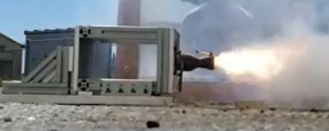

# Propulsion

## Introduction

The purpose of this project is to ensure that new and returning members research various parts of a rocket propulsion system from both theoretical and practical engineering points of view. The document containing the entire timeline can be found [here](https://docs.google.com/document/d/1Uy2l3JOKqw\_BGmBq33F0STwY3ups7bEq2XvbOAA-AiI/edit).&#x20;

Your project should be completed with your intro project group.

### Returning Members

Returning members have no special requirements for Fall 2022.

### Contact

If you have any questions about any part of the question at any time, do not hesitate to reach out to the propulsion lead (Liam) or the propulsion deputy (Rachel). Discord is preferred, but if you are having difficulty getting started with Discord, email is fine.

* Liam
  * Discord: Liam M.#4183
  * email: liam.mchugh@berkeley.edu
* Rachel
  * Discord: rachel w.#5286
  * email: reweber@berkeley.edu
* For access to the STAR general discord, please message us!&#x20;
  * If you have access, find us in the #propulsion #ellie #LE2 tags!&#x20;


This project is intended to challenge you a little bit! You are not expected to know everything you need for this project going in, and it will almost certainly be necessary for you to ask questions and interact with the team lead, propulsion members, and of course your mentor. This is by design, and is intended to get you familiar with our workflow and asking for help when needed. If you feel intimidated by the intro project, please please please reach out to others! Everybody wants you to succeed!


## Week 1: Introduction to Propulsion

Our first meeting with be at the STAR general meeting on Tursday, where we will give new memebrs a run down of what you can expect with prop as well as a runthorugh of our current projects! Recruits are also invited to our propulsion meetings on Monday night.&#x20;

If you are not able to make it in person, please feel free to reach out to us so we can answer any question you may have, as well as set you up with an educational group mentor!&#x20;

The way the propulsion intro project will be broken down is listed below:&#x20;

1. Week 1 (current week): will help new recruits become familiar with propulsion as a team. You will also be assigned a project mentor and be divided into teams&#x20;
2. Week 2: will be where we introduce Solid Rockets, Liquid Rockets, and Feed Systems. You will:
   1. Be assigned to a group and a mentor
   2. Start readings for week 2&#x20;
   3. Work with your group to complete the slides for week 2
3. Week 3: will be focusing on Injectors and Thrust Chambers. You will:
   1. Present slides for week 2 to mentor&#x20;
   2. Start readings for week 3&#x20;
   3. Work with your group to complete the slides for week 3
4. Week 4 and 5: will be where you will get to work under a member of the prop team and be introduced to propulsion specialties of your choosing.&#x20;

\
You can view our week 1 slides [here](https://docs.google.com/presentation/d/1ELVzyB-4RBtOOTk8soJIerAGa7zAK6LjjPjcKwEF6Lg/edit#slide=id.g147dd557f88\_0\_5). This week will focus on establishing a point of contact between you and your group, as well as establishing a meeting time. You are welcome to get started on the readings for week 2 and 3.&#x20;

Please fill out our form [here](https://forms.gle/agxxTCMhbVcqkshz5) so we can get your paired up with a mentor!&#x20;

## Week 2: Solid Rockets, Liquid Rockets, and Feed Systems&#x20;

Now that you have met the team and been assigned a mentor, it's time to get learning! You will be expected to go through the assigned material in your own time throughout the course of this week. If you have any questions, please feel free to attend office hours with your mentor, or to reach out on discord.&#x20;

You will also be expected to fill out slides with your group, which will be shared to you by your mentor. Each of you will be assigned slides to fill, where you will answer questions related to this week's readings. Don’t worry about correctness - your mentor will go over the correct answers with you at your scheduled meetings.

There will also be an in person workshop on the LE2 feed system! We encourage you to attend, but if that is not possible, it will be recorded.&#x20;

* Readings:
  * Solid Rocket
    * [Video of NASA’s solid rocket booster](https://www.youtube.com/watch?v=7ChDT4kj3oE)
    * [How Rocket Engines Work](https://science.howstuffworks.com/rocket.htm#pt3)
      * Read Solid-fuel Rockets: Fuel Mixture&#x20;
      * Read Solid-fuel Rockets: Channel Configuration
    * [Rocket and Space Technology: Solid Propellants](http://www.braeunig.us/space/propel.htm#solid)
      * Read Solid Propellants
    * [Fundamentals of Rocket Propulsion](https://ftp.idu.ac.id/wp-content/uploads/ebook/tdg/DESIGN%20SISTEM%20DAYA%20GERAK/Fundamentals%20of%20Rocket%20Propulsion.pdf)
      * Read pg 9, section 1.5.1.1
      * Pay special attention to the fig 1.5a. What are the six parts of a solid rocket listed? Excluding “payload,” can you say what each part does?
    * BONUS: [Solid Rocket Grain Design](https://www.youtube.com/watch?v=xDl\_LO6nOnI\&t=58s)
  * Liquid Rocket
    * [Video: Liquid Propellant Rocket Engine](https://www.youtube.com/watch?v=9Y3fG-YrIII)
    * [Rocket & Space Technology - Solid Propellants](http://www.braeunig.us/space/propel.htm#liquid)
      * Read Liquid Propellants
    * [How Rocket Engines Work](https://science.howstuffworks.com/rocket.htm#pt5)
      * Read Liquid-Propellant Rocket
    * [Fundamentals of Rocket Propulsion](https://ftp.idu.ac.id/wp-content/uploads/ebook/tdg/DESIGN%20SISTEM%20DAYA%20GERAK/Fundamentals%20of%20Rocket%20Propulsion.pdf)
      * Read pg 12, section 1.5.1.2
    * [Rocket Propulsion Elements](https://ftp.idu.ac.id/wp-content/uploads/ebook/tdg/DESIGN%20SISTEM%20DAYA%20GERAK/Rocket%20Propulsion%20Elements.pdf)
      * Section 1.2 on page 4
  * Feed Systems
    * [Video: Propellant Feed Systems](https://www.youtube.com/watch?v=tOrELhwdMAg)
    * [Fundamentals of Rocket Propulsion](https://ftp.idu.ac.id/wp-content/uploads/ebook/tdg/DESIGN%20SISTEM%20DAYA%20GERAK/Fundamentals%20of%20Rocket%20Propulsion.pdf)
      * Read pg 357, 10.8.1 Liquid-Propellant Feed System&#x20;
      * Reach pg 360, 10.8.1.1 Gas Pressure Feed System
    * [How Does a Pressure Regulator Work](https://www.fluidcontrols.co.uk/how-pressure-regulators-work/)
    * [Rocket Propulsion Elements](https://ftp.idu.ac.id/wp-content/uploads/ebook/tdg/DESIGN%20SISTEM%20DAYA%20GERAK/Rocket%20Propulsion%20Elements.pdf)
      * Read section 6.3-6.4 (up to table 6-5) on page 203
    * BONUS: [Liquid Propellant Feed Systems](https://aerospacenotes.com/liquid-propellant-feed-systems/)

## Week 3: Valves, Injectors, and Thrust Chambers

This week you will be expected to have completed the slides from week 2. You will also be assigned new slides for this week, due next week. Since the sources are so short, the slides for this week are mostly filled out, with the hope that completing them should take each person about an hour.&#x20;

\
There will also be an in person workshop on RPA! We encourage you to attend, but if that is not possible, it will be recorded.

* Injectors
  * [Bi-Liquid Injectors](https://youtu.be/pE0q4vrhkMU)
  * [Rocket Propulsion Elements](https://ftp.idu.ac.id/wp-content/uploads/ebook/tdg/DESIGN%20SISTEM%20DAYA%20GERAK/Rocket%20Propulsion%20Elements.pdf)
    * Read section 8.1 on page 276, up to injector flow characteristics&#x20;
  * [Pintle Injectors](http://pintleinjector.blogspot.com/2016/12/pintle-injector.html)
  * [Impinging Injectors Video](https://www.youtube.com/watch?v=watzSDCZeXM)
* Valves
  * [design fundamentals](https://youtu.be/W1QYuh9BXao)
* Thrust Chambers
  * [Cooling in Liquid Rockets](https://aeronotes.weebly.com/cooling-in-liquid-rocket.html)
  * [Rocket Propulsion Elements](https://ftp.idu.ac.id/wp-content/uploads/ebook/tdg/DESIGN%20SISTEM%20DAYA%20GERAK/Rocket%20Propulsion%20Elements.pdf)
    * Read intro to chapter 8 on page 271&#x20;
    * Read section 8.2 on page 285 up to “Film Cooling” on page 2
  * [STAR Gitbook RPA instructions](https://rocketry.gitbook.io/docs/tutorials/propulsion/rocket-propulsion-analysis-tutorial)
    * We will also have a workshop on this&#x20;
* Bonus Material:
  * [Propulsion Systems Lectures](https://ocw.mit.edu/courses/16-50-introduction-to-propulsion-systems-spring-2012/pages/lecture-notes/)
  * Famous/Exciting Rocket Stuff!!
    * [RIP Robert Goddard](https://www.nasa.gov/missions/research/f\_goddard.html)
    * [RD-180: Absolute Legend](https://www.technologyreview.com/2019/06/26/134490/spacex-blue-origin-russian-rd180-rocket-engine-design/)
    * [Copenhagen Suborbitals Project](https://youtu.be/IkRE2ogHrdc)
  * [Workshop Recordings](https://drive.google.com/drive/u/0/folders/1kCIn9Z-NuIFim6WLNRcDuI9-HEB9zsh7), [Feed System Presentations](https://drive.google.com/drive/u/0/folders/1kCIn9Z-NuIFim6WLNRcDuI9-HEB9zsh7)
  * [STAR Gitbook Resources](https://rocketry.gitbook.io/public/tutorials/propulsion)

## Week 4-5: Technical Project Starts&#x20;

You finished your readings!! Now, you will be assigned a technical mentor. This is different from your previous one because your project mentor will be the person who is in charge of a technical project on our LE2 rocket! Depending on what you would like to learn, you can choose who to work with.&#x20;

Weekly office hours and meetings will be provided by your new mentor!. Also, never be afraid to reach out for help - ask anyone you feel comfortable with. It is better to ask for clarification on something that might seem obvious than to spend hours confused.&#x20;

In the end, we require a short slide deck of what you have learned from your research.&#x20;

We will also be hosting several workshops! To complete your intro project, please attend at least one specialty workshop.&#x20;

**Technical Project Options / Further Research Launching Points:**&#x20;

(referenced are specific technical mentors that will provide direct assistance)

We will cover each project idea in detial after the third week of introductory material.

* Flight Vehicle Igniter - Aarchan, Liam
  * Goal: Ignite a liquid rocket with a reliable system. Understand startup transience in liquid propulsion systems.
  * Research / Resources:&#x20;
    * [https://www.liquisearch.com/liquid-propellant\_rocket/ignition](https://www.liquisearch.com/liquid-propellant\_rocket/ignition)
    * [How the F1 Engine Starts](https://youtu.be/2cldgl9IIyY)
* Rocket Engine Cooling - Jeremy, Liam
  * Goal: Test ablative cooling methods on ELLIE system. Develop an understanding of cooling analysis and design.&#x20;
  * Research / Resources:
    * [Combustion Chamber Resources](https://drive.google.com/drive/folders/1kkrnJm72aCkNJDlvlvJBez-JXPKkwrA2?usp=sharing)&#x20;
* Propellant Storage; Design and Testing - Aarchan, Tyler
  * Goal: Design a lightweight propellant tank using rocket airframe
  * Complications: Structure, Chemical Reactivity, Sealing, Wire Routing
  * Research/Resources:
    * [ Airframe Tank Design Considerations](https://www.halfcatrocketry.com/pv-design)
    * Create Airframe-Integrated Tank
    * Plan Pressure, Cycle, and Temperature Test
* Valve Design and Testing: - Justin, Pranit
  * Goal: Design a simple propellant valve
  * Complications: Control Speed/Accuracy, Fluid Type, Actuation Method
  * Research Links
    * Pyro Valves: Main Actuators for LE2!
    * Flow-Control Valves: Precisely Control Flow Rates/Pressure Drops with physical actuation
    * [Needle Valve](https://youtu.be/CzBB1CEAAS4)
    * [Bang-Bang Valve](https://youtu.be/eX7fBt0pJwk)
    * Servo-Actuated [Ball Valves](https://theengineeringmindset.com/the-basics-of-ball-valves-explained/): ELLIE Main Valves!
    * [https://en.wikipedia.org/wiki/Pyrotechnic\_valves](https://en.wikipedia.org/wiki/Pyrotechnic\_valves)&#x20;
    * [Solenoid Valves](https://youtu.be/-MLGr1\_Fw0c): Propulsion Ground System Equipment: Pressurization and Pneumatic Actuation
    * [Pneumatic Actuator](https://youtu.be/hmz1h5fk2bI): Pressure-operated actuation, most commonly linear piston.
* Remote Pressurization Line Disconnect System- Scout, Rachel
  * Goal: Remotely yank pressurization lines off rocket before launch. Develop understanding of avionics and control logic.
  * Resources:
    * [Quick Disconnect Coupling Mechanism](https://youtu.be/-DRf\_8OWHjM)&#x20;
    * [Solenoid Valves](https://youtu.be/-MLGr1\_Fw0c): Propulsion Ground System Equipment: Pressurization and Pneumatic Actuation
    * [Pneumatic Actuator](https://youtu.be/hmz1h5fk2bI): Pressure-operated actuation, most commonly linear piston.
* Propulsion System Modeling- Liam, Dylan
  * Goal: Model a simplified rocket in Simulink. Optimize a thrust curve for exactly 10,000 ft apogee target. Develop understanding of modeling and control
  * Resources:
    * [Simulink Modeling - Feed Systems](https://drive.google.com/file/d/13sZ0Y6N4bCdf\_QgLgTDrhz9q7u7sj6Qm/view?usp=sharing)
    * [Intro to Optimization](https://docs.google.com/presentation/d/1WN75i01ckPoMVYoqD23YH-e8cbf3BI9Y8Y-eZ1Xmk2k/edit?usp=sharing)

