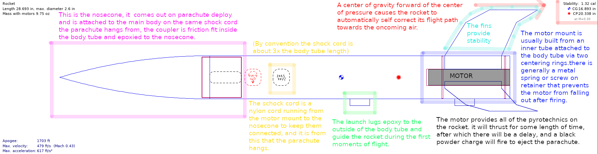

# Simulations

## **Introduction**

The purpose of this intro project is to familiarize members with basic principals of aerodynamics, data analysis, and amateur rocket construction.

The Project will consist of two parts. The first is the optimization of an airframe built in OpenRocket, and the second is focused around analysis of flight data from the most recent 4/20/19 SubArktos flight.

It is impossible to stress enough that this is not a trivial project, it is strongly recommend that you ask for help whenever you run into any problems from either Aled Cuda or Rebecca Bennett, or simply in the \#simulations channel, it is more than likely that we made mistakes writing this. I have no doubt that you will be able to complete the project

## **Task 1: Rocketry and Open Rocket fundamentals**

For this part of the project we will be using OpenRocket to test out our designs.

Linked here is the open rocket design file [star-bad-rocket.ork](https://drive.google.com/file/d/1gqBJer0bRjJgeQ_T2a0bXtkvjIhNywai/view?usp=sharing) \(download the whole thing, not the contained rocket.ork \[ork files are secretly zips of ork files that are secretly xml files\]\), your goal is to optimize this for your choice of either altitude or velocity using the given motor \(the F32-5, with 32N of average thrust and a 5 second charge delay is a midpower motor\). In order to complete this part of the project your design must reach either 2250 ft of altitude, or 750 ft/s. Any parts you use in your design must either be available from [https://www.apogeerockets.com/](https://www.apogeerockets.com/), [https://www.madcowrocketry.com/](https://www.madcowrocketry.com/), or laser cuttable from plywood in the Jacobs Maker Space \(this is what I would recommend for your fins to give you a little bit of freedom\). If you would like to do something more fancy contact Aled Cuda on discord to get approval before using it. Additionally your rocket must carry a 0.37 oz 1.9x0.7" cylinder, aka a Jolly Logic Altimeter 3. Finally the stability of the vehicle must be between 1.2 cal and 1.8 cal \(you should aim for about 1.4\).

Your submission should take the form of your optimized open rocket file which you should DM to Aled Cuda on Discord with the filename YOURNAME-rocket.ork.

Once all intro projects have been completed we will build the original rocket and a rocket based on the best ideas from all intro projects and drag race them at the next STAR launch.





## **Task 2: Basic data analysis**

Given the flight data located [here](https://docs.google.com/spreadsheets/d/16dwX5WDEOZP_vEfSIgagrvYs0uZEfav1a7I369uwBCU/edit?usp=sharing) \(this should be your main source of data\) and [here](https://drive.google.com/drive/folders/1TLGjI3f3F8k1CgMLw04M0OItpMtd5XO3?usp=sharing) \(the .pf2s are secretly csvs, just rename them\]\). All pieces of data here are from the same flight, you only need one source to complete the project \(I would recommend the one in the first link\). You should derive the following things, along with a short description of the method used in derivation:

* Maximum velocity obtained during flight \(ft/s\)
* Parachute decent rate \(ft/s\)
* Parachute deployment time \(time from liftoff\) \(s\)
* Total flight time \(s\)
* Total motor burn time \(s\)

And for extra brownie points:

* Maximum acceleration reached during liftoff \(this ones more difficult than it may seem\) \(ft/s/s\)

Present your findings in a DM to the lead \(Aled Cuda\)

