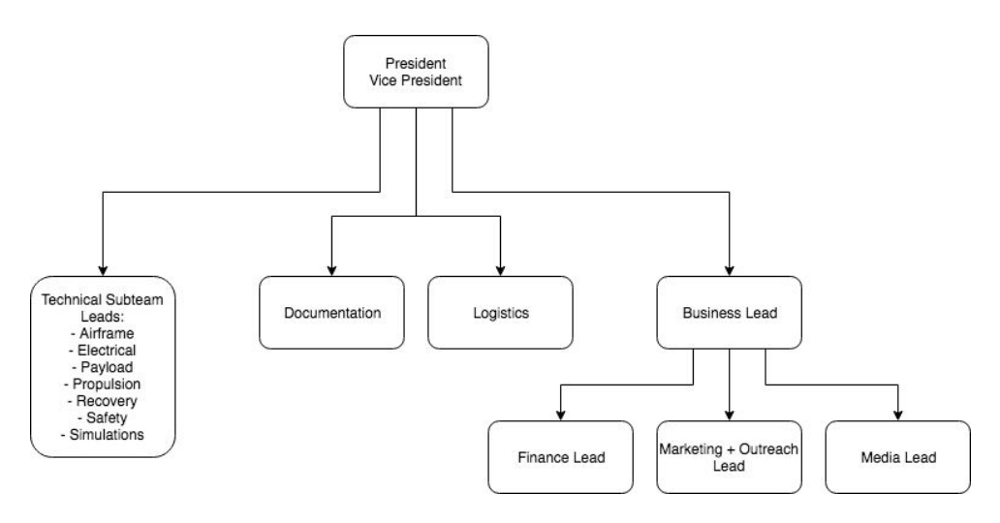

# Elections

## Elections

While not a requirement, active members are invited to participate in subteam and general elections.

Rules are detailed in our constitution, which can be found at the link below--choose the most recent version. **The constitution is the only authoritative source for rules concerning elections**. That being said, election information will be generally outlined below for your convenience.



We are proud to say that all of our official technical and administrative leadership is elected!

Elections are usually run by the President and Vice President, although there is no constitutional requirement as to the body that must hold the elections or the manner in which they are to be carried out.

Generally \(although again not codified\), we strive to have elections follow these principles:

* **Free and Fair:** only eligible members vote, and follow one-person-one-vote. All eligible votes are counted, and a reasonable effort is made to make sure any eligible member can vote if they desire. No eligible member is prevented from running for a position.
* **Confidential:** use some form of secret / Australian ballot; you have a right to vote without others knowing your choice.
* **Transparent:** the results and process should remain accountable and subject to re-count.

## Rules

### Term Length

From the constitution,

> Elections will occur towards the end of the spring semester but prior to the last day of the semester. The Executive Board will serve a year-long term starting after the final competition event, even if that competition event is held in summer.

This allows for relatively constant leadership for each project, or each school year in the event that a project lasts for multiple years.

### Club-wide Elections

This includes positions like the President, Vice President, Documentation Lead, Logistics Lead, and Business Lead. From the constitution,

> Club-wide positions will be elected through a simple majority vote of all active members. If a simple majority has not voted for a single candidate, the two candidates who have received the most votes will enter a runoff election with simple majority vote. A person is allowed to vote if they have been an active member on the team for at least a semester prior to the election.

Active membership is defined in the constitution explicitly, but you can generally take it to mean fulfillment of the [Membership Requirements](membership-requirements.md). These elections usually happen during GM near the end of the year.

### Subteam Elections

Subteam elections are a little more complicated, taking place in two phases: nomination and confirmation.

#### Nomination

First, subteams nominate a candidate using a form of ranked-choice voting called Single Transferable Vote \(STV\):

* The voters rank candidates in their order of preference on their ballots, including a “no confidence” vote indicating that they do not wish to transfer their vote to any subsequent candidates on the list
* In each round of voting, the candidates with the fewest votes are eliminated. Each voter who voted for those candidates transfers their vote to the next candidate on their preference list, leading to the next round of voting with these new tallies
* At the end of this process, the candidate with a majority of available votes wins the nomination.

If you aren't interested in the math behind it, it suffices to say that voters rank their preferences and a winner is chosen that will satisfy people. \(If you are interested in the math, check out [this](https://en.wikipedia.org/wiki/Arrow%27s_impossibility_theorem)!\)

Nomination votes usually take place during the normal subteam meeting time.

#### Confirmation:

> This Candidate Subteam Lead will then be confirmed through a simple majority vote of all active members. If a Candidate is rejected, the runner-up of the subteam election will be nominated as the new Candidate.

Usually, Subteam Leads confirmation votes for all subteams occur in a single GM during which the voting for club-wide positions also takes place.

