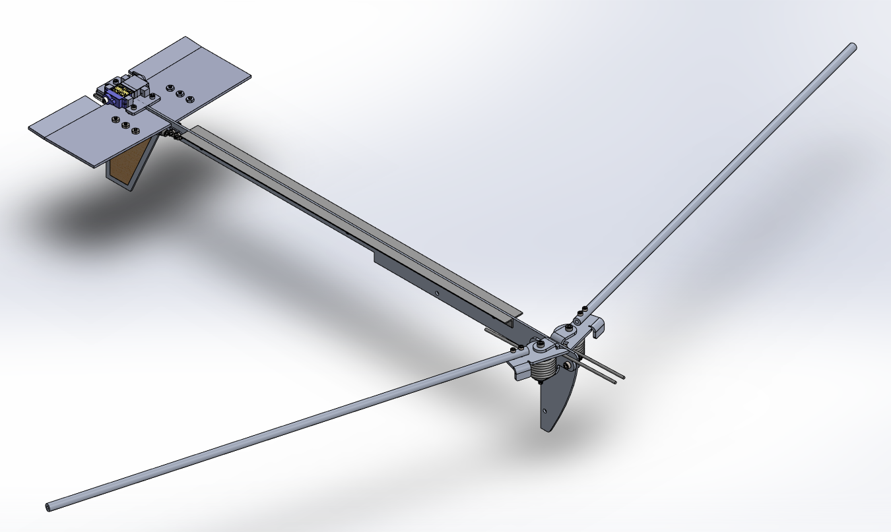

# Payload

<figure><figcaption>
A past iteration of DAVE (2022)
</figcaption></figure>

## Introduction

The intro project is designed with three main parts:

1. A series of **workshops** given at the beginning of the year to teach **basic rocketry and payload knowledge** as well as necessary skills (given the first few weeks of the school year)
2. A **general rocketry/payload take-home quiz**, taken **alone** (due roughly _2 weeks_ after assigned)
3. A **glider design project**, done with **mentor guidance** (due roughly _3 weeks_ after assigned)

The intro project may seem daunting, but don’t worry!

In addition to the existing resources on GitBook, all the returning payload members will be available to help.

We will assign a specific returning member as your mentor, but please reach out to any returning member for any questions. Also, feel free to DM Payload Lead, Tristan Steen, on Discord (**chaddusmaximus**).

We will also hold a series of intro project work sessions throughout the next weeks, giving an opportunity for hands-on help. Details will be announced on the #payload channel.

Above all, we hope that the intro project will be a fun, educational and rewarding experience.

Checkpoints Schedule:

* By 2023-9-21 - Quiz Complete
* By 2023-10-5 - Design Project Complete

### Part 1: General STAR & Rocketry Quiz Questions

1. Name all of the Specialty Subteams on STAR.
2. List all of STAR's previous rockets.
   1. What are their diameters?
   2. What Material(s) are they made out of?
3. What is the maximum length of a payload cube that could theoretically fit in a 20cm diameter rocket?
4. A G-class motor is roughly how many times more powerful than a D-class motor?
5. With roughly what speed will a 10kg rocket hit the ground if in free fall from 1280m? (You may use g=10 m/s/s)
   1. Is this a realistic speed to assume? Why or why not?
6. Give two pros and two cons of a dual-deployment (two parachute) recovery system.
7. How do altimeters measure altitude?
8. Is it possible to directly measure the velocity of a rocket during flight? Why or why not?
   1. Describe two ways you might calculate the velocity of a rocket with the following sensors: GPS tracker, altimeter, accelerometer, gyroscope. What are the potential advantages and drawbacks of each method given?
9. Explain what each number means in the following UTS designation: #6-32x1
10. Explain what each number means in the following Metric screw designation: M6-1.0x20

### Quiz Submission

Please fill out your quiz on the Google Form here: \[INSERT LINK WHEN FINISHED]

### Part 2: Design

#### Design Objective Outline

Our goal is to build a mini glider that fits inside a 4” inner diameter, 12" long payload tube. Your task is to design and prototype a glider that can be ejected from the rocket for an unpowered flight to deliver a payload to the ground. Your glider does not have to fold like DAVE, but design the dimensions of your wing spars and stabilizers to fit in the payload tube as if it did. You will be responsible for designing your glider’s fuselage, wings, wing spars, and stabilizers. After that, you will build your design.

#### Requirements

> Engineering is defined by requirements!
>
>
>
> Tolerances are important, so consult the [Tolerancing Page](../../tutorials/manufacturing/tolerancing.md) on the GitBook when designing to account for manufacturing differences.&#x20;
>
>
>
> Listed below are all the parts you will need to integrate into your design. It is easiest to make the vertical stabilizer a part of the fuselage

_**Components to Integrate:**_

* Fuselage (Balsa Wood)
* Wing Spars (Balsa Wood)
* Wings (Choice of Tissue Paper or Mylar)
* Horizontal Stabilizer (Balsa Wood)
  * If you want to try a tissue paper or Mylar horizontal stabilizer, design balsa wood stabilizer spars
* Vertical Stabilizer (Balsa Wood)

_**Materials Available:**_

* Balsa Wood
* Tissue Paper
* Mylar
* Tape
* Sewing Pins
* Super Glue
* Elmer's Glue

_**Detailed Design Requirements:**_

1. All components when hypothetically folded must fit within the space of a cylinder, 4" in inner diameter and 12" in length.
2. All components must be mounted securely to your fuselage. Glue, tape, and sewing thread will be used to attach components to the fuselage, but it is required that indents or cutouts be designed into the fuselage to allow components to be securely placed.
3. The wings and stabilizers may be arranged in any reasonable format (keep in mind the principles of aerodynamics when designing your glider and keep in mind the CG and the CoP).
4. Your glider itself will not carry an official payload, but a place to hold a payload must be included in your design. This space must be able to fit two quarters side-by-side (a 1.91x0.955" rectangle). In your final build, quarters can be added or removed non-permanently depending on the stability of your finished glider to aid in its flight.

Your glider may be as elaborate or simple as you'd like, but it should adhere to the above requirements, and should be able to be manufactured given the resources and parts that Jacobs and STAR are providing.

### Designing in SolidWorks

We will use CAD (Computer-Aided Design) software in order to model our glider. STAR has standardized using [SolidWorks ](https://github.com/calstar/star-gitbook/tree/5d8cf7302474743570b93a399b946d08b76f99ff/intro-projects/www.solidworks.com)as our preferred CAD software. If you have used CAD software other than SolidWorks, such as Fusion 360, Inventor, or Creo, then SolidWorks should not be too difficult to pick up.

If you have never used CAD software before, don’t worry! We will hold a CAD workshop during GM (date TBD)**.** If you are not able to attend, there are also great online resources:




Feel free to reach out to your mentors if you need help with any of the below steps!


### Step 1: Installing SolidWorks

The first challenge of this stage is installing SolidWorks. The GitBook has a very helpful “SolidWorks Installation” page to help you with this.


[solidworks.md](../../tutorials/software/solidworks.md)



**SolidWorks is only compatible with Windows!** If you use MacOS or Linux you have three options:

1. Use the on-campus CAD lab in Etcheverry 1XXX or Jacobs 10 both of which have SolidWorks pre-installed.
2. Install Windows and then install SolidWorks.
3. **Only if the above is not feasible,** you may use a compatible CAD program of your choice (Fusion 360 is recommended as it has many online resources).


\[STOPPING PLACE FOR NOW]

### Step 2: Working with the given hardware

Assume another team has already picked out the wheels and electronics necessary for a rover. As a design engineer, your task is to cohesively incorporate all the given components into a (hopefully) functioning rover. A good place to start is by looking at the physical dimensions of each component.&#x20;

Attached are 2D dimensioned engineering drawings of some of the electronics.


Component Dimensions


Below is a pdf with the dimensions for the LEGO wheels and axles (which depend on which tires you chose), along with some examples for how to design your rover to accomodate them.


Dimensions of LEGO Parts + Tips for Axle Mounting Design


3D models of major components are provided below for the SolidWorks assembly of your rovers.




You do not have to 3D model the payload section.


### Step 3: Working with the tube

The most challenging (and annoying) constraint placed on many payload projects is the size of the payload tube (the part of the rocket that the payload is stored in). Learning to work with the size limits of a cylinder is essential.

In this project, your tube space is limited to 4" inner diameter and 12" length, a common size for a smaller-scale rocket. It is often convenient to work with space envelopes limited by a rectangle, so the foremost important fact to understand is that **a 4" diameter circle will not fit a 4x4" square.** Your usable space is limited to what you can fit (or [inscribe](http://www.moomoomath.com/inscribed-polygon.html)) within a circle.

### Step 4: Start designing!

That's all the essentials to get you started on your design. Remember, you can come up with anything as long as it meets the detailed design requirements. The rest of this sub-section lists a few tips.


Any non-permanent mounting method is acceptable. If a part comes with screw holes, you are encouraged to design for screw fasteners. However, zip ties and Velcro are also acceptable (and are the only possible options for parts without mounting holes).



To design screw holes that fit, visit the [Tolerancing GitBook page](../../tutorials/manufacturing/tolerancing.md)!



Your mentor (and other Payload members) are here to help, and if you're ever stuck or confused, please ask!


### Step 6: Manufacturing!

Now you start actually building your rover!&#x20;

The chassis can be 3D printed through Jacobs (if you don’t have a Makerpass, you can still print it and STAR will reimburse you). Click [here](https://jacobsinstitute.berkeley.edu/jacobs-self-service-printing/) for Jacobs self-service printing. We will also have a workshop during a GM on everything you’ll need to know about 3D printing.&#x20;

The electronics will not be part of your final rover, so all you will need to do is cut your axles (if necessary) and integrate the wheels and axles with your chassis. On the last day of intro projects, we will provide you with the rest of your parts and you’ll be ready to build!

## Project Submission

Please upload your SolidWorks/other CAD files here: [https://forms.gle/fBveaPspNEGfzsas9](https://forms.gle/fBveaPspNEGfzsas9)
