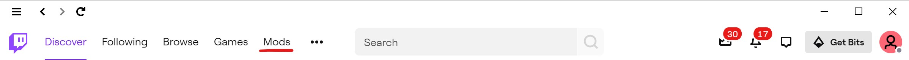
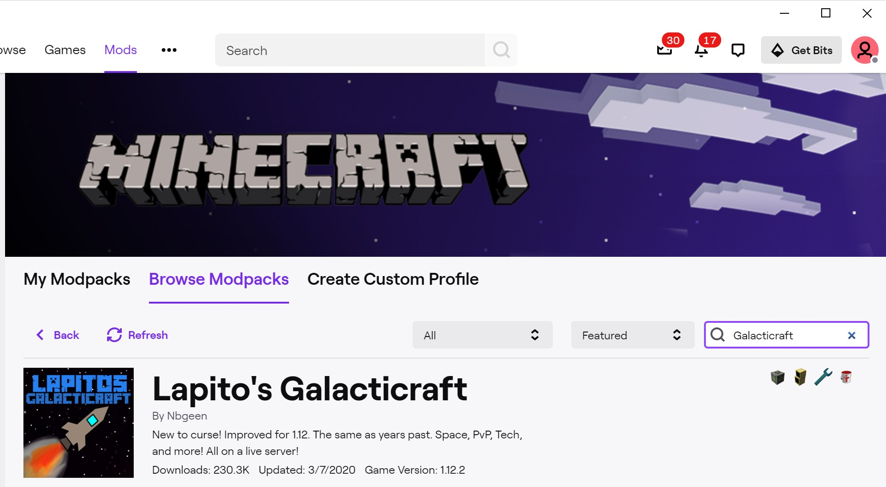
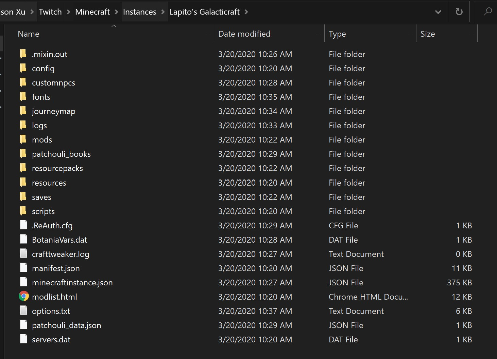

# Joining STARcraft \(Minecraft Server\)

## Setting Up Minecraft

1. [ ] Download Twitch app from the following link. The app will serve as the central launcher for starting Minecraft. You do not need to download Minecraft separately, although you do need a Mojang account. 



* [ ] After setting up Twitch, sign-in \(make an account if need be\). Click on the mods tab in the top header 

* [ ] Select Minecraft from the list of games and click 'Install' \(or choose Advanced Options if you want to customize install directory\)
* [ ] After Minecraft is installed, select it from the Mods page, click 'Browse Modpacks' and search for 'Galacticraft'.

* [ ] Install the pack. If the install errors out, try restarting Twitch and installing again. \(Make sure Twitch is fully closed out in this case, in Windows close Twitch in the task tray\).
* [ ] Click 'Play' to start Minecraft. Log-in using your Mojang account.
* [ ] Make sure the bottom left installation shows 'Lapito's Galacticraft' and then click the green play button. The first load may take a long time.
* [ ] On the Minecraft screen, click 'Options...' -&gt; 'Resource Packs...'-&gt;'Open Resource Pack Folder'. Navigate up one directory until you see the following:

* [ ] Close Minecraft. Rename the config folder in 'Lapito's Galacticraft' in the screenshot to 'config.backup'. Download the following zip file and extract the config folder within it to 'Lapito's Galacticraft'. 




You have now successfully installed Galacticraft


## Joining the Server

* [ ] Message in the STARcraft discord, including your Minecraft username, in order to be whitelisted.
* [ ] Start up Minecraft again, click 'Multiplayer Menu' and then 'Direct Connect'. Message in Discord for the server address.


You are now on the STARcraft server!



If you run into any errors connecting to the server, make sure you have replaced the config as described above


