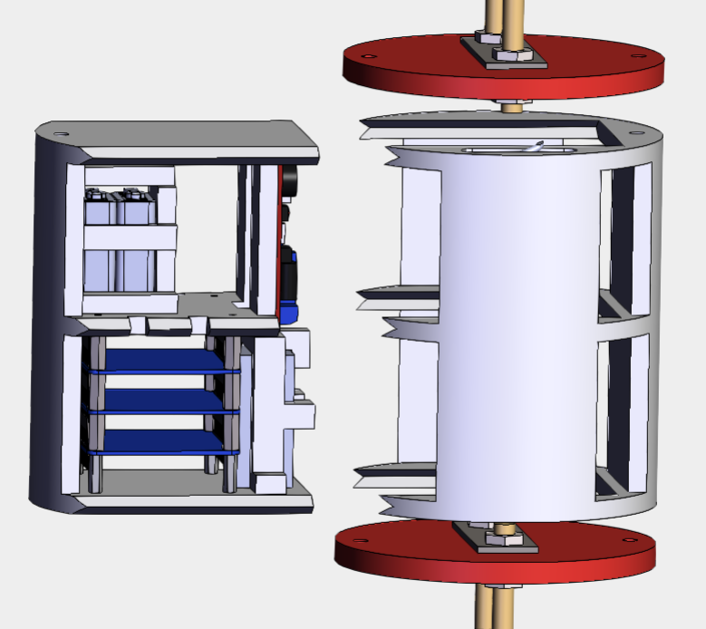

# Avionics Bay Glossary

## **Overview**

Many systems within a rocket are controlled by electronics, such as the parachute deployment systems, the motor ignition systems, and with our latest SSEP project, the stage separation mechanisms. These electronic controls are known as avionics, and they are essential to the function of the rocket, but they can be quite delicate and must be in proximity to the systems they are controlling so they can be wired effectively. The avionics bay houses these avionics in a relatively central location in the rocket and in such a way that the avionics are kept safe throughout the rocket's flight.

#### **Types**

We use two main types of avionics bays: axial designs and radial designs. These names refer to how each design is installed into the rocket. Axial av-bays are inserted through the airframe tube along the tube's long axis, and radial av-bays are inserted radially through the side of the airframe tube, through a door in the tube. All radial av-bays have a sled, which houses the avionics and is the actual component to slide in and out of the airframe tube. Some axial av-bays have a sled design so that the avionics can be accessed radially as well, but this is not the case for all axial av-bays.

Full avionics bay for Bear Force One with the radially installed sled highlighted in blue (Right), and sled from avionics bay for Bear Force One with altimeters to control the parachute deployment (Left):

<figure><figcaption></figcaption></figure>

 

<figure><figcaption></figcaption></figure>

## **Components**

There are two main types of components discussed here: structural components and electronic components. The structural components serve to house the avionics (the sled) and to connect the inner structure to the rocket’s frame (bulkheads, u-bolts, etc.). The electronic components are the avionics themselves, notably the altimeters and CAS, along with their power supplies.

### **Structural Components**

The following outer structural components are found in practically every av-bay, no matter the design:

* Bulkheads: These usually metal plates connect the rest of the avionics bay assembly to the frame of the rocket.
* U-bolts: These u-shaped bolts are fastened to bulkheads and connect the bulkhead, and therefore the avionics bay assembly, to a parachute assembly. Typically there is a fore u-bolt that connects to the drogue chute assembly forward of the av-bay and an aft u-bolt that connects to the main chute assembly aft of the av-bay. However, if there is only one chute assembly connected to the av-bay, as is the case with the lower stage of the SSEP rocket, only one u-bolt is needed.
* Av-bay rods: These rods provide additional structural support for the av-bay and are fastened with wingnuts. They can be seen in the av-bay for Bear Force One as the two vertical rods, shown at the bottom of this section.

Bulkhead + u-bolt assembly from Jay’s CAS-compatible 5.5” av-bay:

<figure><figcaption></figcaption></figure>

Additional outer structural components can be found on some av-bays, depending on their design:

* Additional outer bulkheads: Some av-bays, like the one in Bear Force One, have an additional set of outer bulkheads so that the rods and the u-bolts have four connection points instead of two. These additional outer bulkheads are depicted in the image below of the av-bay in Bear Force One with a slightly blue hue.
* Av-bay door: Any av-bay with a sled needs to have a door to access the sled. By default, any radial av-bay will have an av-bay door. This is one of the drawbacks to a radial av-bay design, as any hole in the airframe, such as an av-bay door, could potentially negatively impact the stability of the airframe.

Av-bay airframe tubes for Bear Force One with cutout for av-bay door:

<figure><figcaption></figcaption></figure>

The following are the main inner structural components of a radial av-bay or an axial av-bay with a sled:

* Sled: This structure houses all the avionics in a radial av-bay and some axial av-bays, and is designed to slide in and out of the av-bay assembly through the av-bay door for easy access to the electronics. It is convenient, but requires an av-bay door.
* Sled housing: This structure houses the sled and essentially gives the sled something to slide into. There are channels cut into the inner edges of the housing that the sled can slide into so that it is held firmly in place.
* Inner bulkheads/sled housing bulkheads: These bulkheads have a large section cut out and the edges of the cutout grooved so that a sled can slide directly into the bulkheads instead of sliding into a housing. These are used in the av-bay for Bear Force One, shown below highlighted in blue.

Sled from Jay’s 5.5” CAS compatible av-bay (Left), and corresponding sled housing from Jay’s av-bay (Right). One can see how the sled could slide into the housing and be held still by the grooves cut into the housing that match the rails on the sled:

<figure><figcaption></figcaption></figure>

Avionics bay for Bear Force One with upper inner bulkheads highlighted blue:

<figure><figcaption></figcaption></figure>

### **Avionics Components**

The following components are the avionics in a typical av-bay along with their associated components:

* Altimeters: These measure the altitude of the rocket during its flight and are used to trigger the parachute deployment.
* 9V batteries: These are used to power the altimeters in flight. They are encased in a housing we have designed.
* 9V battery cases: These cases keep the 9V batteries safe and allow them so be more easily secured to the avionics bay.
* CAS: Our very own modular avionics unit designed by the avionics subteam. It usually has four layers of adaptable circuitry, and is roughly 2”x2”x2” in size. It will hopefully be used in the SSEP rocket to trigger the stage separation mechanism, but for right now we’re just including it in all of our new av-bay designs, as our goal is for it to become a standard part of our avionics system.
* LiPo batteries: These are used to power CAS, and they also have housing units that have been designed for them.
* CAS antenna: This antenna would allow CAS to talk to instruments on the ground, but it still needs to be integrated into the avionics system.

PerfectFlite Stratologger altimeter (first), LiPo battery for CAS (second), and 9V battery inside custom-made casing (with cover removed to view the battery) (third):

<figure><figcaption></figcaption></figure>

<figure><figcaption></figcaption></figure>

<figure><figcaption></figcaption></figure>

CAS stack put together (without antenna):

<figure><figcaption></figcaption></figure>

### **Other Av-bay Designs**

Some av-bays are designed with a specific, unique purpose in mind, so they may have different designs to fit their specifications. For instance, an additional av-bay aft of the main parachute assembly was needed on the SSEP rocket in order to trigger the stage separation system and to ignite the upper stage motors. However, there was not much space to fit this av-bay. So, a small axial av-bay was designed by Hadar to meet these requirements, shown below. Note that it does not have a sled and an access door but instead splits into two accessible parts that are then clamped together when installed into the rocket.

<figure><figcaption></figcaption></figure>
