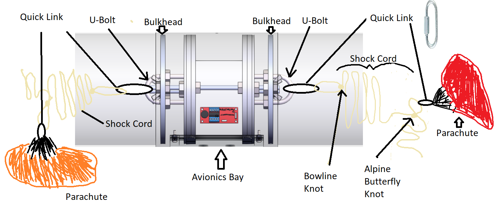

# Parachute Harness

<figure><figcaption>
Parachute Harness Diagram
</figcaption></figure>

**Harness Components**

1. Quick Links- metal rings that connect the shock cord to the u-bolts and also connect the parachutes to the shock cord.
2. Shock Cord- durable kevlar rope that holds all of the rocket together when parachutes are deployed.&#x20;
3. Bulkheads- metal cylinders that are important for structural integrity. The u-bolts thread through the bulkheads.
4. U-Bolts- Are connected to the shock chord by a quick link.
5. Swivel?

Fold the Parachutes (Ideally a two person job)

1. Dedicate a 10 by 10 foot area to fold the main chute.&#x20;
2. Lay out the parachute on its side and gather the shroud lines (the string coming from the edge of the parachute). This means that if the parachute was fully open with the inside facing up and you were standing at the center of the parachute holding all the shroud lines, that you move to the side folding it in half.
3. Make sure the shroud lines are untangled.
4. Examine each section and patch holes
5. Examine each colored section and patch holes.
6. For each section on one half of the parachute, fold the colored section in half do the edges of each section meet.
7. Have the folded half of the parachute on one side and the unfolded half of the parachute other on the other side.
8. Before continuing, only two sections of the parachute should be visible, with half of it folded under one color and the other half unfolded under the other color.
9. Fold the edge of the unfolded half of parachute to the middle and the the other edge to the newly created edge.
10. From the resulting rectangle, bundle the short edge four times until you have a resulting almost square parachute.

If confused watch the video attached.


