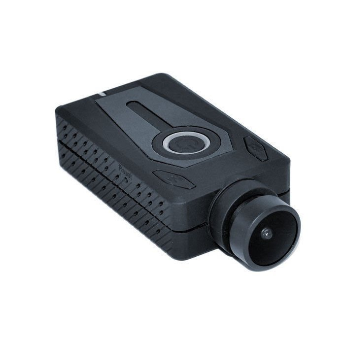

# Cameras

## Description

The Cameras project uses the Mobius Maxi camera mounted on a custom base plate that is epoxyed on the airframe's exterior with a custom shroud.

Two shrouds shall be mounted. The camera shrouds have been optimized to maximize field of view while minimizing impact to the aerodynamics of the airframe, allowing the cameras to record the flight with as much detail as possible without being a detriment to vehicle performance. The recorded results are retrieved from an in-camera SD card post-landing. The captured footage should theoretically document the rocket in flight even after it escapes visual range from the ground.

<figure><figcaption>
Mobius Maxi Camera
</figcaption></figure>

## System Weights, Measures, and Test Reports

Each Mobius Maxi measures 7.1 cm x 3.5 cm x 1.8 cm and weighs 52 g. Each shroud measures approximately 13.2 cm x 4.1 cm x 3.8 cm and will be manufactured from PLA material using 3D printing.

At the time of writing, no in-air flight recordings have yet been captured. Recording testing has been performed, but the full extent of camera capabilities have not yet been documented. A battery life test has been completed along with a shake test to mimic the turbulance he camera would experience while on the rocket. The Camera was able to record for over 2 continuous hours with minimal quality degrigation as a result of shaking. Worst-case test is planned in the future, with active external heating to mimic launchpad conditions.

## &#x20;CADS

CADs are for the camera's custom shroud.

<figure><figcaption></figcaption></figure>

<figure><figcaption></figcaption></figure>

<figure><figcaption></figcaption></figure>

## Hazard Analysis and Risk Assessment

The primary risks and failure modes associated with Cameras are depletion of the battery and structural failure of the shroud during flight. The camera shroud could sheer off from the baseplate, take damage from shaking from not being properly secure in the shroud. Test on different epoxies are being conducted to determine which would best minimize the risk of the camera seperating from the body of the rocket, with the possibility of grooves being put in place to increase surface area contact.

Without power, the Mobius Maxi camera cannot record data. Mitigation strategies include fully charging the camera the night before and setting the video recording settings to their lowest power consumption setting.

Structural failure of the camera shroud would cause parts of the shroud or the entire shroud to shear off of the launch vehicle, potentially even changing the vehicle's trajectory. Mitigation strategies include printing the shroud at higher densities and out of stronger materials, and checking again that the shroud is properly mounted before launch.

## Assembly, Pre-flight, and Launch Checklists

#### Pre-Flight

1. Charge both Mobius Maxi cameras with MicroUSB cable.
2. Place one MicroSD card into each camera.
3. Configure settings on both cameras to be appropriate to flight mission and launch conditions, including recording automatically when power is turned on.
4. Turn cameras off.
5. Place shroud onto the baseplate with lens oriface towards fins and align the two holes on the shroud with the corresponding two holes on the airframe.
6. Secure the lower, fin-most hole with the nut plate on the other side of the airframe wall.
7. Place camera into shroud so the lens faces the fins.
8. Secure the upper hole with the nut plate on the other side of the airframe wall.
9. Secure the shroud cap onto the shroud, ensuring that the locks snap fast onto the side of the shroud. If uncertain, apply adhesive.
10. Remove lens cap from camera.
11. Turn on camera and start recording.
12. Repeat steps 5–11 with second camera on opposite side of launch vehicle.

#### Post-Launch

1. Retrieve all payload components from the downed rocket.
2. Turn cameras off and stop recording.
3. Disassemble camera assemblies.
4. Read and analyze data from the SD card.
