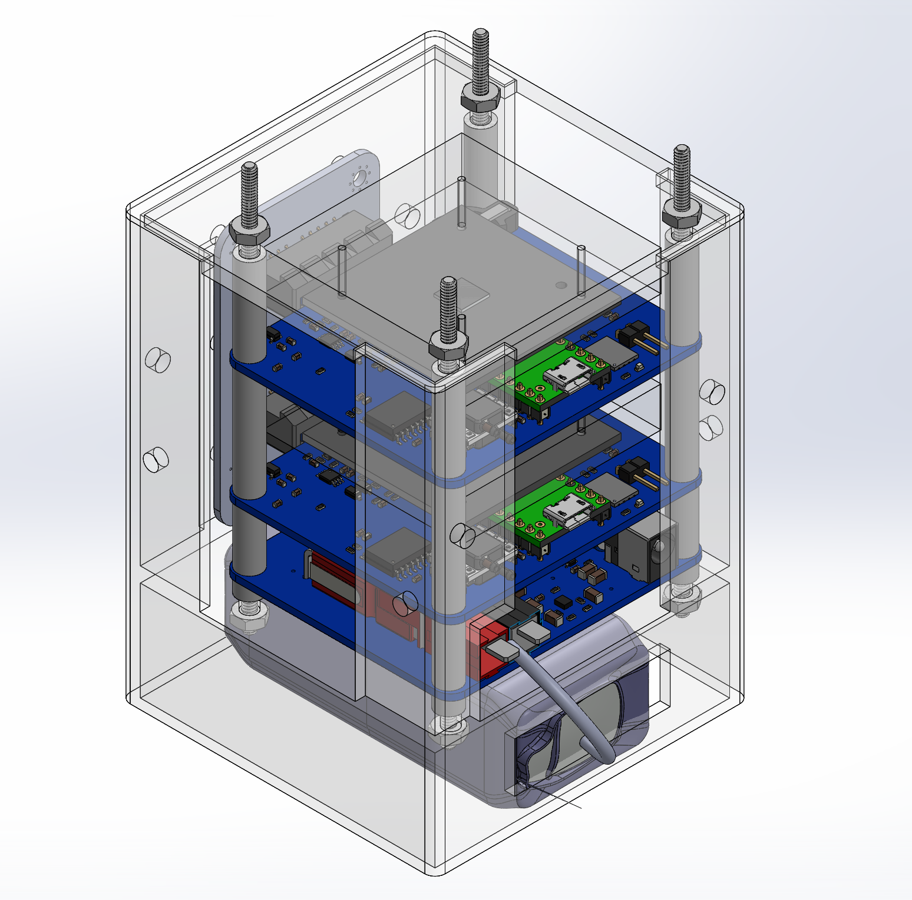
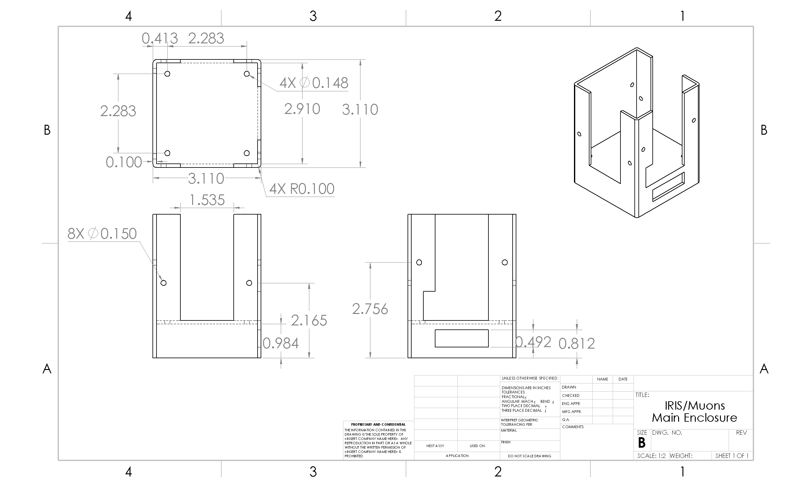
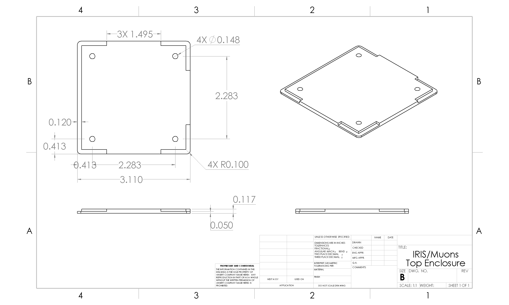

# IRIS

## Introduction

### Main Contributors and General Progress

The IRIS project combines two originally separate projects (IRIS Legacy and Muons) into a 1U CubeSat unit to conserve space in the payload structure.

Rajiv Govindjee, Jason Xu, Bryant La and Ocean Zhou are the main contributors to this project. Rajiv and Jason worked on the first iteration of IRIS while Jason and Ocean worked on the first iteration of Muons. It was decided for the sake of efficiency and adventure that the two detectors should be combined into one complete detector. Jason was heavily responsible for the electrical design of IRIS, in particular the printed circuit boards (PCBs). Bryant and Ocean worked on the mechanical integration of IRIS to the rocket. IRIS is currently in its assembly phase, although with the impacts of the COVID-19 pandemic, the assembly phase has faced delays.&#x20;

## IRIS Overview

IRIS Records Information via Sensors (IRIS) is a sensor suite printed circuit board (PCB), outfitted with an accelerometer, a gyroscope, a magnetometer, a barometric pressure sensor, and a High-G accelerometer. Its function is to record various flight data (acceleration, angular velocity, absolute orientation, barometric pressure/altitude) to assist in developing flight-critical avionics and validating current and future simulation work with respect to flight dynamics.

The IRIS assembly consists of three main PCBs. In order, from bottom to top, the three main PCBs are:

1. a power distribution board (IRIS-Power) connected to a two-cell (2S) 8.4V lithium polymer (LiPo) battery
2. a primary IRIS board (IRIS-Core)
3. an auxillary IRIS board (IRIS-Core)

<figure><figcaption>
Figure 1. IRIS Assembly
</figcaption></figure>

#### Inspiration

The first iteration of Muons was based heavily off of Spencer Axani's project. He is a current particle physics PhD student at MIT! This is the [website](http://cosmicwatch.lns.mit.edu/) that contains all the info about his project. The GitHub page that includes all the software, details, PCB soldering guidelines for this project can be found [here](https://github.com/spenceraxani/CosmicWatch-Desktop-Muon-Detector-v2). Our first detector was basically following his step by step instructions and recreating his detector. So to Spencer, a massive massive thank you!

### Optional Sensors (Reserved for Future Use)

In addition to the motion sensors, there are two optional components on IRIS that are currently unpopulated but can be implemented in the future.

#### GPS

IRIS supports the addition of a GPS module ([uBlox cam-m8](https://www.u-blox.com/en/product/cam-m8-series)) in the future.

#### Pitot Tube Sensor

IRIS supports the addition of a differential pressure sensor, for implementing an external pitot tube in the future.&#x20;

## Electrical Hardware Design Overview

The electrical hardware (PCBs) are avaliable on our cadlab:

* [IRIS-Core PCB](https://cadlab.io/project/23494/master/files)
* [IRIS-Power PCB](https://cadlab.io/project/23273/master/files)

#### IRIS-Power

IRIS-Power occupies the bottom most board of the 3 board stack. The primary purpose of IRIS power is to output regulated power from the 2S LiPo, gauge the LiPo's charge with a battery fuel gauge IC, and provide a backup source of power in case the battery fails or is suddenly disconnected. The backup is provided through 2 supercapacitors that can provide several minutes of backup power.&#x20;

Additonally, the power board has the ability to automatically switch to a connected USB-C power delivery adapter in order to save battery charge during bench-top testing and programming.&#x20;

IRIS-Power provides 5V for the Teensy 4.1 MCU on IRIS-Core, 3.3V for other extra ICs, and 29.5V for the photo-multipler Muon sensor.

#### IRIS-Core

IRIS-Core is the primary module of the 3 layer stack. The middle board of the 3-layer stack is a full-fledged IRIS-Core board, while the top board of the 3-layer stack is a partially populated IRIS-Core board.

The main MCU of IRIS-Core is a [Teensy 4.1](https://www.pjrc.com/store/teensy41.html), an Arduino compatible board.&#x20;

The full-fledged middle module contains a Teensy 4.1, IMU breakout board, High-G accelerometer breakout board, and a muon sensor.

The partially-populated top module contains a Teensy 4.1 and a muon sensor.

## Very Useful Diagrams

For some very useful diagrams detailing the pinouts, peripherals, and power flow connections, see the following pages:


[peripherals-diagram.md](peripherals-diagram.md)



[pinout-diagram.md](pinout-diagram.md)



[power-flow-diagram.md](power-flow-diagram.md)


## Design Log and Updates

### Mechanical Design&#x20;

**(12/06/20)**: There is no way to fasten a nut on a screw from inside the enclosure. The enclosure will be secured to the T-slotted rails with eight screws going through eight brackets, held in place by having the screws serving as pegs into slots. The screws are at different heights, so interference is not an issue.

<figure><figcaption>
Top Section View of Enclosure in Payload Stack
</figcaption></figure>

### Electrical Design

**(12/06/20)**: The backboard support PCB has been replaced with the stack connectors (pin headers) pictured below. This was done for simplicity of design, to reduce the space taken up by the PCBs, and to prevent interference between the vertical threaded rods and the fasteners attaching the enclosure to the T-slotted rails. The enclosure and spacers have been updated to accommodate this change.

<figure><figcaption>
Incomplete Revised Enclosure Assembly (bottom power module missing)
</figcaption></figure>

## Manufacturing

### Engineering Drawings

<figure><figcaption>
Enclosure Main
</figcaption></figure>

<figure><figcaption>
Enclosure Top
</figcaption></figure>

### Prototyping Processes

The enclosure measures 7.9 cm x 7.9 cm x 10.635 cm, and can be manufactured via 3D printing with PLA material.

### Progress

**(12/06/20)**: The PCBs were ordered and arrived. Bryant La will solder the components on campus with a reflow oven over winter break, with Jason Xu's remote assistance. Boards will be shipped to Jason Xu for him to attempt soldering without a reflow oven, though he does not need to succeed for the project to progress.

The BOM is being finalized and the parts will be ordered soon. Once fully manufactured, the code will be rewritten to interface with the combined IRIS/Muons.

**(01/25/21)**: Both Jason Xu and Bryant La are near campus and will work together to finish manufacturing for this project.

**(02/14/21)**: The power board and one of the sensor boards have been soldered. Jason Xu and Bryant La will need to procure the existing completed Muons boards from the Supernode locker to move their scintillators onto the new IRIS/Muons boards. After soldering of the final board is complete, efforts will be focused on writing the board firmware.

## Launch Results

At the time of writing (May 2020), due to power and launch issues, IRIS has been unable to record data during flight for any launch. Data obtained so far has been limited to what IRIS senses during assembly on the ground, which showed little variability as expected; however, the values IRIS reports are accurate (e.g., the barometer shows atmospheric pressure near sea level), which is evidence that the sensor suite functions as it should.

Muons has been launched like IRIS and was able to record data during flight. However, due to the minor detector malfunction, relating to multiple data files being saved for unknown reasons, the data obtained was unable to offer much use; besides total muon count, it was impossible to pinpoint which files corresponded to different points during the flight. Nonetheless, the fact that the detector was able to record muon count and that the muon counts increased over time indicate that the detector is able to function properly during flight.

The previously assembled detectors have been tested twice. The first test was to ensure that the measured voltage signals matched the expected values, in which the detector succeeded. The second test measured how the angle of the scintillator (with _θ_ = 0° being the horizontal orientation) affected muon count measured within an interval of 1 minute. This was done to decide the orientation the detector was to be at inside the rocket. Having the scintillator at a horizontal orientation yields the most counts.

## References

1. [https://www.space.com/32644-cosmic-rays.html](https://www.space.com/32644-cosmic-rays.html)
2. [https://www.pnnl.gov/main/publications/external/technical\_reports/PNNL-20693.pdf](https://www.pnnl.gov/main/publications/external/technical\_reports/PNNL-20693.pdf)&#x20;
3. [https://www.radioactivity.eu.com/site/pages/Cosmic\_Muons.ht](https://www.radioactivity.eu.com/site/pages/Cosmic\_Muons.htm)&#x20;
