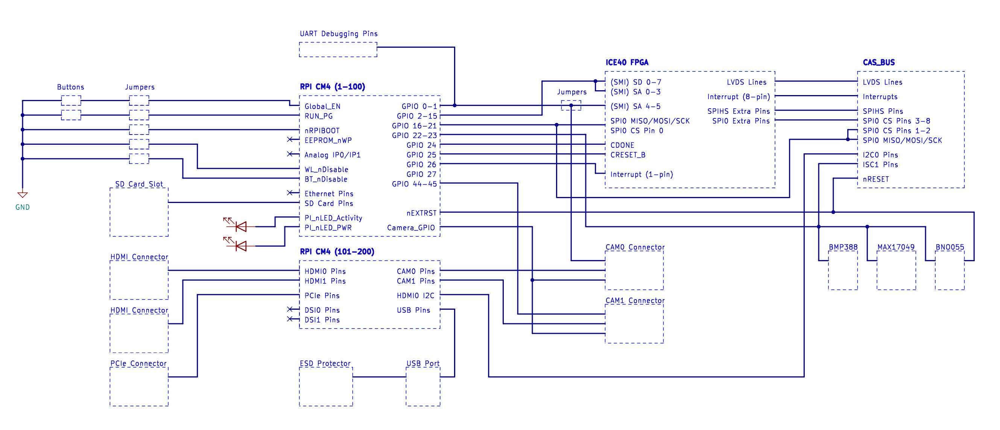

# CAS Core Revised

The core-revised board is still in development. The plan for this board is to use a raspberry pi compute module 4 ("rpi CM4") as the microcontroller for the board. The board will also have an ICE40 FPGA that serves as an I/O expander, since the rpi CM4 has a limited GPIO pin count.&#x20;

The specification for this board includes the following components:

* rpi CM4 microcontroller
* ICE40 FPGA
* 2 camera connectors
* 2 HDIMI connectors
* An SD card slot
* A microUSB port (with an ESD protector)
* 3 sensors (the same as on the original core board)
* a PCIe connector (we still haven't fully decided if this should be added or not)

The rpi CM4 has 45 GPIO pins that can be mapped to various functions. See pages 8 and 9 of the rpi CM4 datasheet ([https://datasheets.raspberrypi.com/cm4/cm4-datasheet.pdf](https://datasheets.raspberrypi.com/cm4/cm4-datasheet.pdf)) for the full list of possible pin assignments. See the "GPIO to CAS Module" google doc ([https://docs.google.com/spreadsheets/d/1WoIMGLvNKh1mcGZh1nwG\_u1I8tszVKkk\_6aB\_qJbBj4/edit?usp=sharing](https://docs.google.com/spreadsheets/d/1WoIMGLvNKh1mcGZh1nwG\_u1I8tszVKkk\_6aB\_qJbBj4/edit?usp=sharing)) for the list of pin assignments that we decided to implement.&#x20;

Note that GPIO0 and GPIO1 have three functions--they can be used as either SMA pins to connect to the FPGA, or as GPIO pins to connect to one of the camera connectors, and on top of that, both pins are also used as UART debugging pins.

The rpi CM4 will use the "secondary memory interface (SMI)" to communicate with the FPGA through the pins that have been assigned SMI functionality.

This schematic describes the overall plan for the entire module, which shows how each of the components should communicate:

<figure><figcaption></figcaption></figure>

This core module is largely inspired by the design from the rpi CM4 I/O board, which features many of the same components (HDMI, PCIe, camera connectors, etc) also connected to an rpi CM4. The I/O board design is located here: [https://datasheets.raspberrypi.com/cm4io/CM4IO-KiCAD.zip](https://datasheets.raspberrypi.com/cm4io/CM4IO-KiCAD.zip)

The symbol and footprint for the rpi cm4 are located here: [https://github.com/Kedarius/RPi-CM4-Kicad](https://github.com/Kedarius/RPi-CM4-Kicad)
