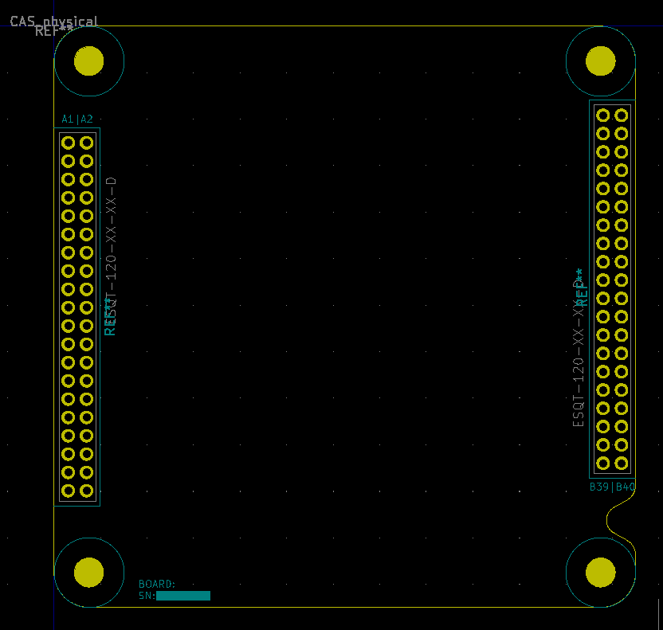
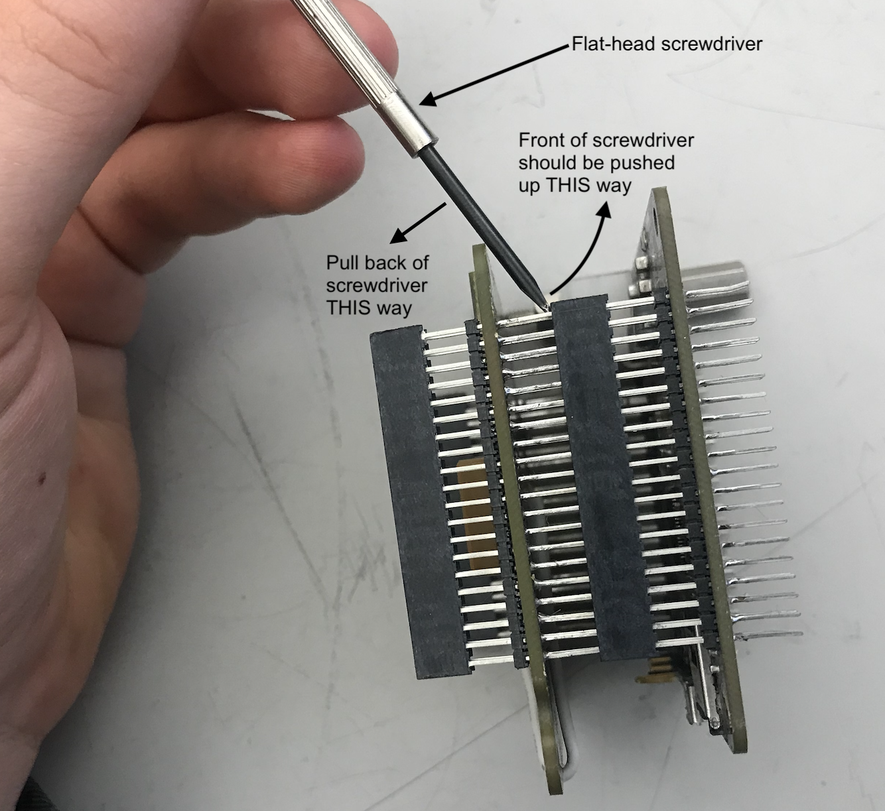

# CAS Overview

The Common Avionics System (CAS) is a system for Avionics hardware development with the primary motives being to reduce hardware development time by better leveraging existing verified designs. CAS achieves this by splitting functionality into separate modules. This allows each module to do one thing and do it well, without having to redo aspects of the system that have already been done. CAS will allow Avionics to more easily support new projects and will reduce risk (in the long-term) by reusing well-tested designs.

CAS Board standards document (describes how to develop modules for CAS): [https://docs.google.com/document/d/1TXryu3QcSKlMYy4J2YmgYoLP\_nRUAluCNtpA56hADVI/edit?usp=sharing](https://docs.google.com/document/d/1TXryu3QcSKlMYy4J2YmgYoLP\_nRUAluCNtpA56hADVI/edit?usp=sharing)

### Terms

**Stack:** A set of modules placed vertically with standoffs separating them.

**Module**: A single printed circuit board (.062" thickness) that has the hardware to satisfy a certain function.

### Dimensions

#### A module in the stack

See image below for cross-section of a stack (specifically of a module). The modules are square PCBs with 4 mounting holes in the corners (large filled yellow circles with blue-green halo). The arrays of smaller empty yellow holes are header pins for connection to other modules in the stack.

The side to side distances are 2.5 inches and mounting hole to mounting hole distances are 2.2 inches. The space from the top of a module to the bottom of another module is 0.6 inches.

<figure><figcaption>
CAS Module Footprint
</figcaption></figure>

### CAS Bus

All of the modules in CAS share a common 80-pin bus. Not all of the pins have functions assigned yet, but they may be assigned in future modules. The CAS modules must never conflict with the common bus pin-to-function assignments. The pin-to-function mapping is recorded in this google sheet: [https://docs.google.com/spreadsheets/d/15-LTwM\_Mr0fLUytdwUPcel4TPknD09fHWANTEQGGa\_4/edit?usp=sharing](https://docs.google.com/spreadsheets/d/15-LTwM\_Mr0fLUytdwUPcel4TPknD09fHWANTEQGGa\_4/edit?usp=sharing)

The types of pins that appear on the bus are:

* Power
  * \+3.3V
  * \+5V
  * \+BATTERY
  * GND
* I2C0
  * SCL
  * SDA
* I2C1
  * SCL
  * SDA
* SPI High-Speed
  * SCK
  * MISO
  * MOSI
  * SS1, SS2
* SPI0
  * SCK
  * MISO
  * MOSI
  * SS1, SS2, SS3, SS4, SS5, SS6, SS7, SS8
* Interrupt pins
  * INT1, INT2, INT3, INT4, INT5, INT6, INT7, INT8

### Power

The entire CAS stack's voltage rails (3.3V and 5V) are powered by a power management unit located on the core board. This power unit on the core board recieves +7.3V DC from an external battery. The entire CAS stack generally draws below 50 mA of current when not doing power-intensive tasks.&#x20;

### Disassembling modules from the stack

To separate modules from each other, use a flat-head screwdriver as a lever, as shown in this picture:

<figure><figcaption></figcaption></figure>
