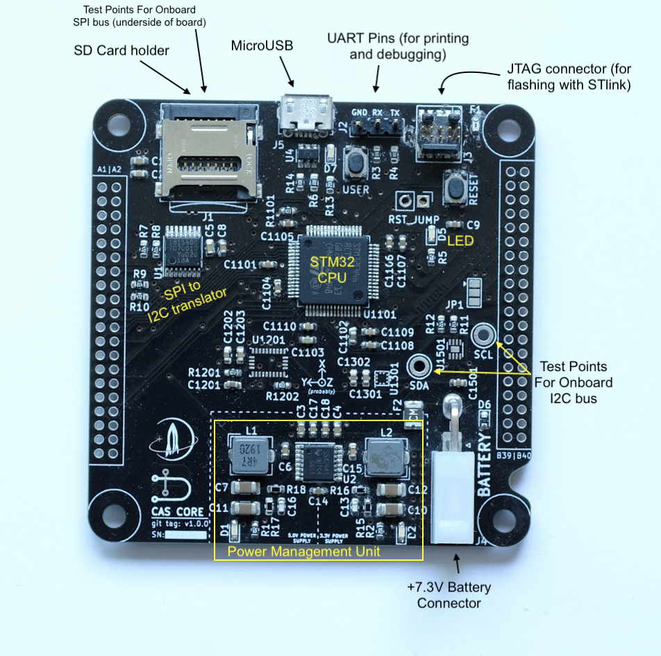

# Core Module

### Overview

The Core Module contains the main MCU (an STM32F401RE chip), three sensors (BMP388 altimeter, BNO055 IMU, MAX17049 fuel gauge), an SD card holder for data logging, a UART debugging port, and USB and JTAG connectors. It also provides power for the other modules through the CAS Bus 5V and 3.3V power rails.&#x20;

The STM32 microcontroller connects to an I2C bus (numbered I2C3) that does not connect to the CAS Bus, bus instead conencts only to the three sensors on the core board itself. The microcontroller also connects to an SPI bus (numbered SPI3) that does not connect to the CAS bus, but instead connects to the SD card holder and the SPI-to-I2C translator. Lastly, note that the I2C2 bus on the CAS bus does not connect directly to the microcontroller, but instead goes to the SPI-to-I2C translator.

The core board also features a "user button" and "user LED" for testing purposes. There is also a RESET button, but this button does not do anything unless there are jumper pins attached to the RESET jumper.

At the time of this writing, none of the three sensors have been soldered onto the board yet because we have been unable to buy them so far (except for the BMP388, which we bought recently but haven't soldered on yet).

### Interface

<figure><figcaption></figcaption></figure>

<figure><figcaption></figcaption></figure>

### Test Procedure

For testing, assemble the module and plugin a battery supplying 7.3V.

1. Test bus power sources. Make sure the voltage of all power pins match the specification.
2. Check USB. Connect USB to the computer and see if the flasher can recognize it.
3. Run echo and LED test. See if we can flash the chip through the debugger, then check if the user LED is blinking and if the UART outputting the correct message.
4. Run sensor connectivity tests for all onboard sensors. This includes checking if we can read the ID registers of IMU, Altimeter and fuel gauge.&#x20;
5. Verify the functionality of onboard sensors. Read actual data from the sensors and see if they match expected values.
6. Test bus interrupt pin connections. Connect a jumper from the 3V3 power pin to an interrupt pin and see if we read the correct value. Repeat this for GND and every pin.&#x20;
7. Check SD card IO. Check if we are able to write data and read back from it.
