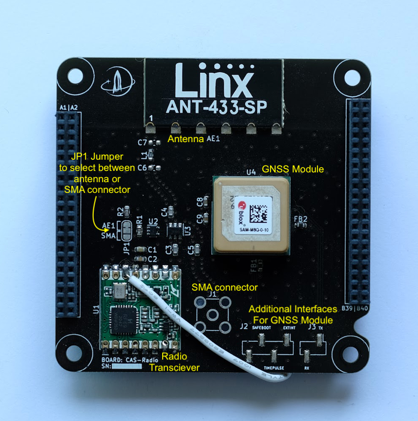

# Radio Module

### Overview

The Radio module contains an RFM69 radio transciever module (with an attached antenna) whose purpose is to transmit data from the rocket to the ground station in real time. The radio module also contains a SAM\_M8Q u-blox GNSS chip which can determine time, latitude, longitude, and altitude. The micocontroller can communicate with the radio through the SPI0 bus, and communicate with the GNSS chip over the I2C1 bus. There are also a couple of optional extra I/O interface pins on the GNSS module that can be connected to external jumper wires.

The radio's output can be sent either to the antenna or to an SMA cable (for testing what data is sent). There are two jumper pins on the board, JP1 and JP2, which control which of the two destinations is connected to the radio's output. JP1 can be used to manually set the radio's output between to the antenna or to the SMA. JP2 can be used to override the selection on JP1 and have the selection be made by the Microcontroller instead. Note that JP1 is on the top of the board and JP2 is on the underside.

The current version of the radio board also has one extra connection made with a white soldered-on wire, which connects the DIO0 pin on the radio transciever to the A20 pin of the CAS Bus (INT 8). This could be used in the future to program the radio transciever to send an interrupt over the DIO0 pin which would reach the Microcontroller at interrupt pin 8.

Normally, the radio should be operated at either 915 MHz or 433 MHz.

<figure><figcaption></figcaption></figure>
