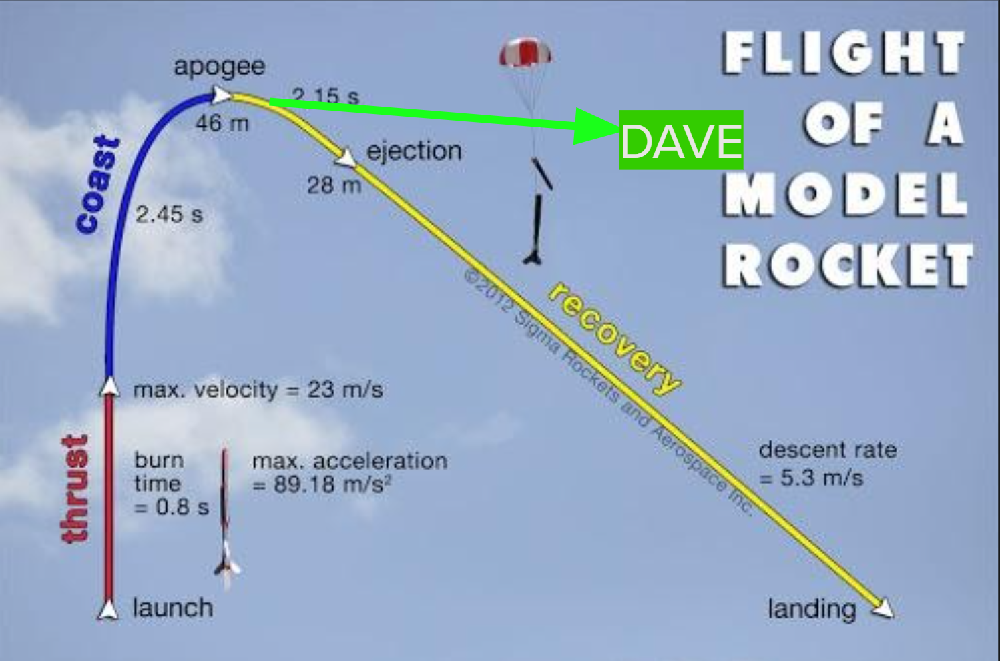
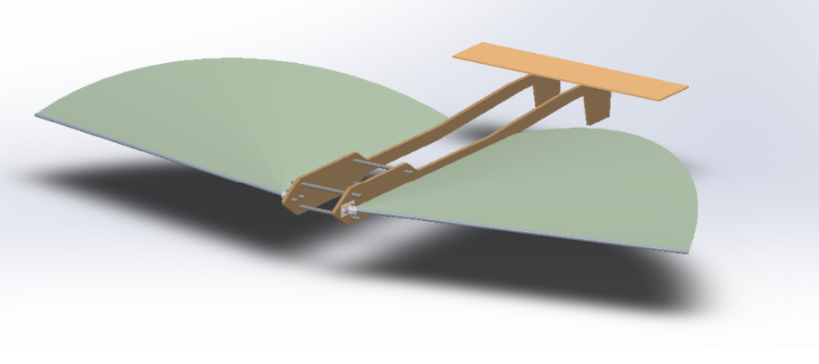
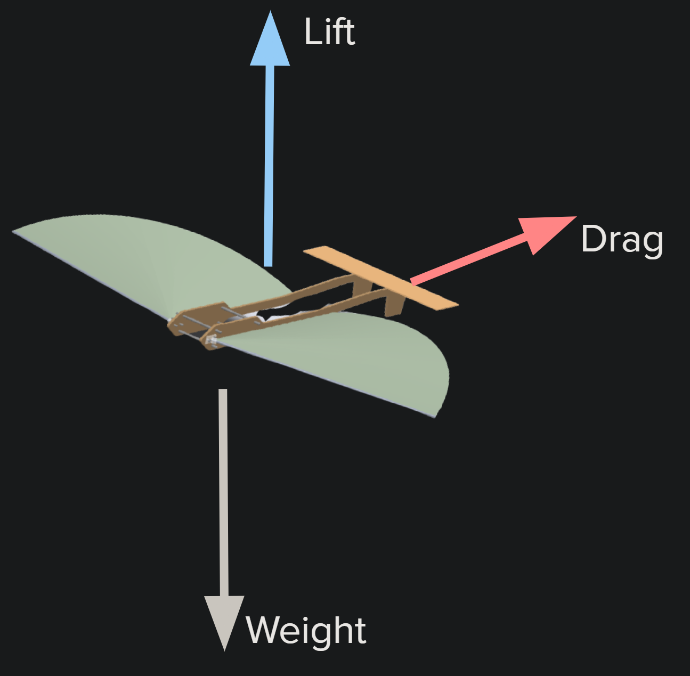

# Summary of DAVE

### Deployment

<figure><figcaption>
Qualitative example of glider deployment the launch vehicle.
</figcaption></figure>

DAVE deploys just after apogee, or the apex of the rocket's flight. In doing so, it uses its ejection mechanism to leave the payload bay in the launch vehicle's interior and pursue its own free-fall path to the ground. Doing so allows DAVE and its cargo to undertake a longer, more controlled flight separate from the parachute and the rocket fuselage.

<figure><figcaption>
Diagram of DAVE's flight path in comparison to the rocket proper. Numerical values in image should be ignored.
</figcaption></figure>

### Aerostructures

<figure><figcaption>
Qualitative example of aerostructure unpacking.
</figcaption></figure>

Due to DAVE's full flight structure needing to be contained within a 6" diameter tube, the glider must be collapsable. In particular, both its primary wings (of Rogollo type) and its elevators must be collapsable in some fashion.

<figure><figcaption>
Preliminary design for DAVE. Note that the wing structures are not actively retractable.
</figcaption></figure>

Additionally, the manipulation of our weight, lift, and drag force vectors are essential to DAVE having a controllable flight. DAVE currently has no mode for producing thrust, but a thrust-producing cargo may be pursued in the future. Calculations to determine the correct geometries (including wing sizing and placement) are located on the DAVE Trello board under Aerostructures.

<figure><figcaption>
The three forces which govern DAVE's flight and the direction in which they act.
</figcaption></figure>

<figure><figcaption>
A qualitative example of a poor balance of the above three forces.
</figcaption></figure>

### Vehicular Control

<figure><figcaption>
Qualitative example of DAVE's controlled flight.
</figcaption></figure>

As we would like to be able to control DAVE's flight from the ground, we will need on-board avionics. These avionics will control two types of control surfaces on DAVE: elevators and rudders. The elevators give DAVE control in the roll and pitch directions, while the rudders give the glider yaw control. Both of these will be located at the rear end of the vehicle - the Rogollo wings will be fixed and uncontrolled.

<figure><figcaption>
Preliminary avionics design for DAVE.
</figcaption></figure>

### Experimental Cargo

<figure><figcaption>
Qualitative example of a potential cargo aboard DAVE.
</figcaption></figure>

The grand purpose of DAVE is to carry onboard experiments that benefit from its unique deployment and flight pattern. Although the current designs for cargo carrying are not set, a goal is to have a modular interface, so any cargo concept that matches can go aboard.
