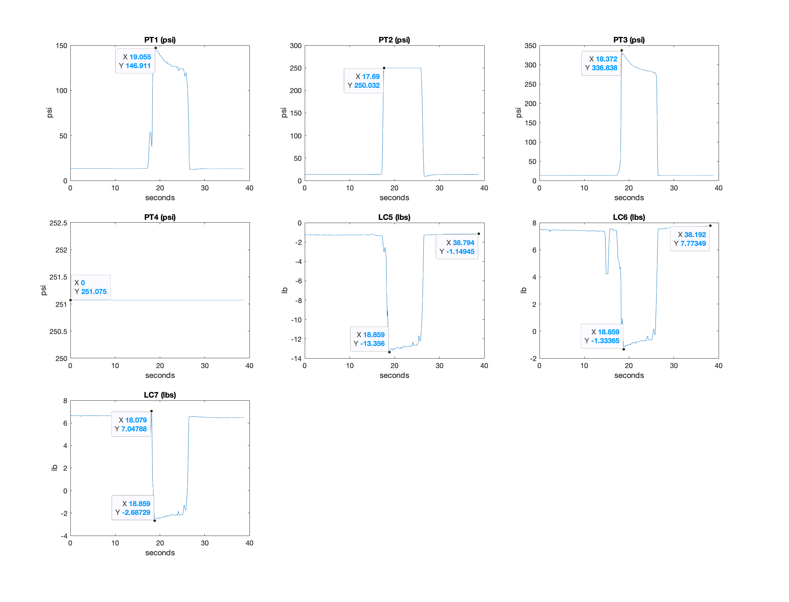

# Ongoing Research

A valuable lesson we learned from the previous hot-fire experience is that we cannot rely solely on commercial piping components, such as off-the-shelf valve regulators, to control the engine system accurately. Therefore, the ELLIE team is continuing as a long-term research group, focusing on advanced valve control.&#x20;

A significant concern has been the droop in the system. It has severely impacted our engine performance, since only a fraction of the GOX flow truly occurred, which resulted in a fuel-rich burn. Here is the visualization of the issues caused by droop, plotted in MATLAB:

<figure><figcaption>
Pressure and Thrust Data from Onboard Sensors
</figcaption></figure>

PT1 measures the pressure of the combustion chamber downstream, while PT2 measures the pressure of the GOX flow. It appears that the GOX regulator's droop was much higher than what we expected, since we have addressed droop by intentionally setting the regulated pressure higher than the nominal pressure. The result was a low-pressure, low-mass flow burn in the combustion chamber. This conclusion is supported by PT1 data with a high point of about 150 psi, which is 100 psi below the GOX pressure.&#x20;

The ELLIE team is addressing this issue by designing a self-regulated valve. The valve will be able to adjust the flow rate according to real-time pressure changes to guarantee a desired mass flow rate.&#x20;

#### Summary

* Data Analysis (Refer to P\&ID on Physical System for instrument locations):
  * Data:
    * Max Thrust: \~32 lbf
    * Combustion Chamber Pressure: \~145psi
    * Upstream GOX Pressure: 250psi
    * Upstream ETH Pressure: 335psi
  * Analysis:
    * Thrust was \~1/3 predicted:
      * GOX feed pressure was very low > sustained a low-pressure reaction in chamber
      * Low Combustion Chamber Pressure + low flowrates > low combustion chamber pressure.
* Long-Term ELLIE system goals:
  * Use existing printed circuit board and fluid system for component testing of LE2
  * Build upon fluid system to test active flow control valves for LE3
