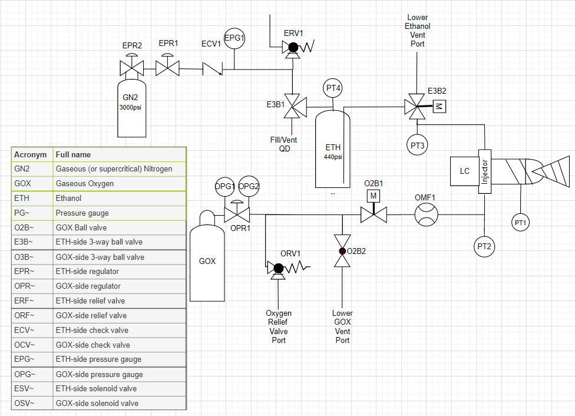
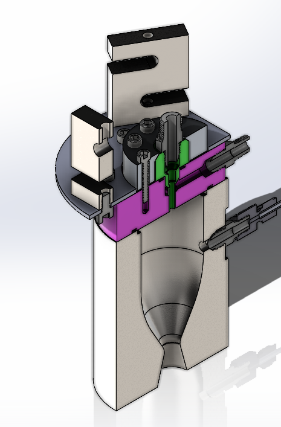

# Physical System

<figure><figcaption>
Piping &#x26; Instrumentation Diagram (P&#x26;ID) for ELLIE
</figcaption></figure>

<figure><figcaption>
Cross-sectional view of the ELLIE thrust chamber, injector, and load cells
</figcaption></figure>

* Thruster:&#x20;
  * Radiatively Cooled (Heat Sink) Combustion Chamber / Nozzle
  * Injector: Coaxial Shear element mixes compressible GOX with ethanol. Dampens pressure instability through 30% Combustion Pressure element flow resistance
  * Thrust Measurement: (Target 30lb thrust)
    * Three S-type load cells, together, measure total thrust force
  * Pressure Measurement:&#x20;
    * Wheatsone Bridge Diaphram Pressure Transducers measure intense distributed forces
* Feed System:&#x20;
  * Energy Regulation:
    * Spring-Loaded Regulators and Stainless Steel Ball 2/3-way Valves.&#x20;
    * High-Pressure copper tubing, braided stainless steel flex hoses.
