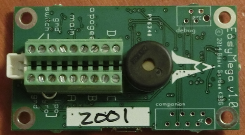

# Electronics

## Perfectflite StratoLoggerCF

<figure><figcaption></figcaption></figure>

This altimeter will be used in both the upper stage main and drogue parachute deployment.

Purpose (Upper Stage Main): Dual Side, Dual Deploy\
Entails: Pyro leads to main and drogue (redundant), deployment based on elevation and velocity.

\
Purpose (Lower Stage Main): Single Side, Single Deploy\
Entails: Pyro leads to main (redundant), deployment based on elevation and velocity.

Specs:

* Works to 100,000 feet MSL, audibly reports peak altitude and maximum velocity after flight.
* Stores 16 flights of 18 minutes each (altitude, temp­erature, and battery voltage at 20 samples per second) for download to a computer with the optional DT4U USB interface. Hi-speed sampling and storage of battery voltage serves as a useful aid in diagnosing intermittent problems with your battery, switch, and wiring. All data are preserved with power off.
* Deploys drogue and main chutes with audible ematch continuity check.
* Outputs capable of 5A current for 1 full second to allow use with nearly any ematch or ematch substitute. Reverse polarity protection prevents spontaneous firing if battery is connected backwards.
* Main chute deployment altitude is adjustable from 100 feet to 9,999 feet in 1 foot increments. 9 presets allow for quick change in the field.
* No mach delay necessary for mach+ flights: Automatic MachLock assures proper operation with any flight.
* Brownout protection will tolerate 2 second power loss in flight – no need for multiple batteries.
* Precision sensor & 24 bit ADC yield superb 0.1% accuracy.
* Built-in voltmeter reports battery voltage on powerup – no more guessing about battery condition.
* Post flight locator siren aids in locating your rocket.
* Confusion-free individual terminal blocks – unreliable multiple wires per terminal are not necessary. Dedicated switch terminal block eliminates the need for splicing switch into battery wire.
* Highly resistant to false trigger from wind gusts; tested in 100+ MPH winds!
* Selectable apogee delay for dual altimeter setups prevents overpressure from simultaneous charge firing.
* Low power design runs for weeks on a standard 9V alkaline battery. Post-flight locator siren will run for months, giving you multiple “second chances” to find a lost rocket.
* Telemetry output for real-time data in flight with your RF link.
* Rugged SMD construction, stringent QC testing, and internal self-diagnostics assure uncompromising reliability.
* Wide operating temperature range of -40F to +185F.
* Measures just 2.0"L x 0.84"W x 0.5"H, fits 24mm tube, weighs just 0.38 oz.

**Manual:**[ **http://www.perfectflite.com/Downloads/StratoLoggerCF%20manual.pdf**](http://www.perfectflite.com/Downloads/StratoLoggerCF%20manual.pdf)

## **Altus Metrum EasyMega**

<figure><figcaption></figcaption></figure>

The Altus unit comes at a hefty cost, but has the advantage of being able to provide angle caculations. using two different altimeters for the same deployment is not advised since it would require two different switches.

Purpose: Lower Stage Parachutes (Drogue and Main, DSDD), Separation Mechanism\
Entails: 3 additional programmable pyro events for separation mechanism (redundant).

Specs:&#x20;

* 2.25 x 1.25 inch board designed to fit inside 38mm airframe coupler tube
* Supports dual deployment and 4 additional pyro events.
* Pyro events are configurable and can be based on time and various flight events and status, including angle from vertical (for safety in staging and air start flights).
* Barometric pressure sensor good to 100k feet MSL
* 1-axis 105-g accelerometer for motor characterization
* 3-axis 16-g accelerometer for gyro calibration
* 3-axis 2000 deg/sec gyros
* 3-axis magnetic sensor
* On-board non-volatile memory for flight data storage
* USB for power, configuration, and data recovery
* Integrated support for LiPo rechargeable batteries
* User choice of pyro battery configuration, can use primary LiPo or any customer-chosen separate pyro battery up to 12 volts nominal.
* **IMPORTANT!** Easy Megas must be wired **BACKWARDS** (i.e. a custom JST connector must be assembled to plug the negative battery terminal into the "positive" end and vice versa) due to manufacturer decision.

**Manual:** [**https://altusmetrum.org/AltOS/doc/altusmetrum.pdf**](https://altusmetrum.org/AltOS/doc/altusmetrum.pdf)

### **Eggtimer Quantum**

<figure><figcaption></figcaption></figure>

Purpose: Airstart (Motor Ignition)

Entails: Single lead to motor ignitor

Specs:

* 66mm x 25mm, weight \~12 grams
* Dual-ended output - pyro igniter is dead until near deployment for safety
* Records altitude up to 60,000 AGL
* Drogue programmable 0-3 seconds after noseover, main programmable from 100-2000 feet
* Wifi compatible - arm via phone
* Polarity-independent
* Comes in a kit - must be soldered and assembled
