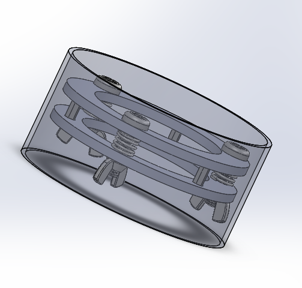
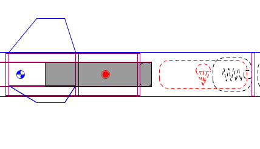

# Pyro Bolts

## An Overview

<figure><figcaption>
The Pyro Bolts (separate tubes not shown)
</figcaption></figure>

Pyro Bolts are an effective way of performing stage separation for in flight vehicles and they can be carried out in a number of ways. Our design prides itself on simplicity, cost effectiveness, and reusability (except for the bolts themselves).

We start with two manufactured O-rings that are each epoxied (or fastened otherwise) to our two airframe tubes, these rings will stay attached throughout the entire launch-recovery process. We then take screws and drill them out, fill them with black powder, insert igniters (e-matches, insert 2 for redundancy), then seal the fasteners. This process is detailed in separate sources and in our stage separation testing documents. The screws can be inserted through holes in the both the O-rings and will be fastened with a wing nut located on the other side of the opposite O-ring. When all screws are ignited, they ideally break and there is no longer anything keeping the two stages together. To ensure separation we opt to place springs between the O-rings, around the screws in order to add force for separation. We can then epoxy multiple standoffs between the rings, to ensure all heights and alignments are correct.

## Calculations

It is extremely important to perform calculations before all else, both to make sure your design is feasible and so that you can select and reference what parts/materials you are planning to use. The specific calculations will vary for each design, but the quickest way to think about what calculations are needed are to think about the forces placed on each part and on all surfaces that connect parts together. We should also check the calculations for the events that take place (black powder and spring actions). For our design above, our main concerns are:

* Can the black powder we have break the screws?
  * This is dependent on several factors, mainly:
    * mass of BP (depends on volume of drilled hole)
    * shear strength of screw material (accounting for the drilled out hole as well)
* Will the screws be able to handle the stress of launch?
  * Dependent on:
    * stress strength of screws
      * this depends on the material and surface area of your screw so account for the fact that the screws have been drilled out a bit
    * stress strength of nuts
* Do the springs fall within the right window of strength (given a reasonable compressed height)?
  * Depends on
    * Spring strength
    * Height between Rings
    * Friction needed to overcome (you can estimate this, we chose 5 lbf)
  * Make sure you fall within the window, the spring should be strong enough to help separate, but not so strong that it causes unnecessary stress on the O-rings and screws.
* Is the epoxy strong enough to hold the O-rings and the airframe tubes together during launch?
  * It probably is but it's best to check, depends on:
    * Surface area between O-rings and Airframe tubes
    * Strength of epoxy
    * Mass in upper and lower stage
    * Acceleration of rocket during launch

These are some of the important calculations needed, however the more you can think of, the better. Make sure each calculation gives us a reasonable factor of safety (use your good judgement).

## Integrating with the Rocket

<figure><figcaption>
Section involving Stage Separation, left side is top stage, right side is bottom stage
</figcaption></figure>

## Sources


Making Your Own Pyro Bolts



How to Minimize Igniter Mis-fires



Shearing Calculations Walkthrough



Nylon Material Properties


{% embed url="http://rocketrycalculator.com/rocketry-calculator/bp-estimator/?__cf_chl_jschl_tk__=09defdb9833611143268f9df77dcd266c7b233d3-1614547437-0-AUAdTZUEFJiEDd1c1YLg9NS_Jp66IRC0jUxTUeivlHxpFTjV-rzBBYxvO_B7vLncaweGpPQIZMDbodQQr-fwbGARsFAzZh5VnxDUbfVa_nKVsO4S0PgefjKT7fDBqon7ZejGISJDYeP6b_0zqoCnfAp0TLQCDovmYrRGiIeiBYk8gDHy6Hl0YSjiitmYa4c7SeK58wj3LZtd3BKszfVFk73zUml6bSFuXNcoJG4v2enezjodaaRFuE7Yz7j4rI-ljUCSbO-TNM10L_GhdoNl7IlKtam_fv6TiXMX1ZiQC5rK9ManiLKnHGPv0QqKbFyPuUpFGLWihMs2AaTReZDCyp5sqlDFQs5jOtOWpAl02RR-" %}
Black Powder Calculator



A Forum for Black Powder Density Estimate (Contact Recovery Lead if you have a better source/estimate)


{% embed url="https://cdn.hackaday.io/files/22132946895488/AeroPac%202012%20100k'%20Program%20Report.compressed.pdf" %}
AeroPac 2012 100k' Program Report

