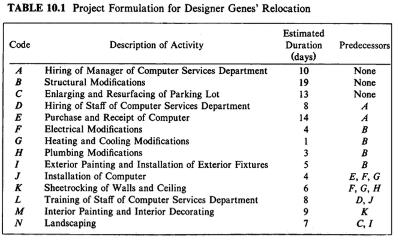
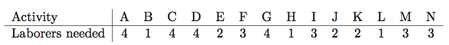
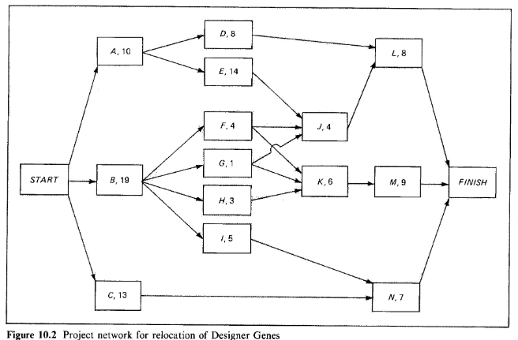
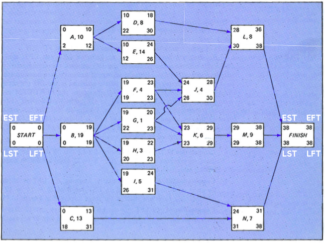
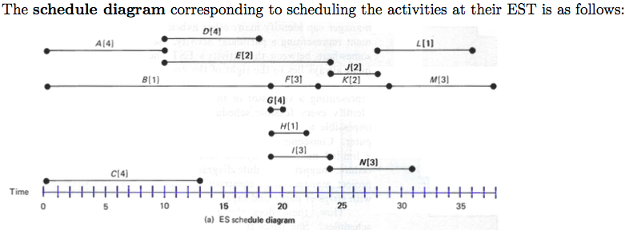
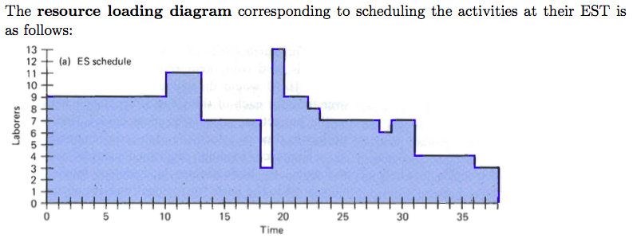
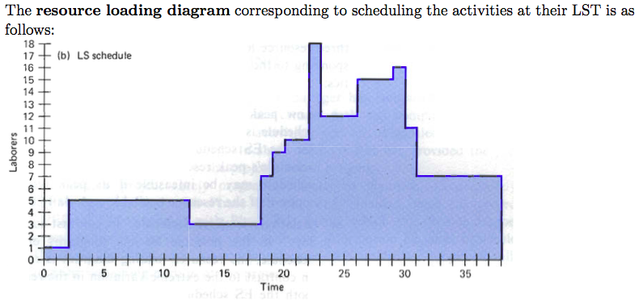

# Project Management

### Task Scheduling and Delegation

* Microsoft Project
  * Offers more rigorous, organized tools like Gantt charts
* Trello
  * Flexible, freeform
  * Doesn't really show dependencies
* Casual
  * Intuitive graphic interface - flowchart orientation makes visualizing steps and dependencies easy

### A Short Guide to Project Planning...

**Systematic project planning can be achieved by adhering to the following steps:**

**Step 1:** List out the activities that need to be done, and then for each activity mark the amount of time each activity needs, the number of people each activity needs, and the activities preceding each activity. If an activity has no preceding activity, mark it’s preceding activity as "None".

**Step 2:** Make a graph representing a chain of events. The starting node should be marked “start”. All activities that have no preceding activity are nodes that have one-way arcs from “start” to that node. From there, every succeeding activity should be connected from its predecessor(s) to itself. Every activity that has no successor should connect to a node labelled “finish”.

**Step 3.1:** Using the estimated times needed for each time, mark the finish time for each activity, and let this be called the “earliest finish time” or EFT. The s node has an EFT of 0. If we denote the EFT of a node n as EFT\[n] and the set of all EFT’s of the nodes preceding n as EFT\[n-1], EFT\[n] = Duration\[n]+max{EFT\[n-1]}. Be sure to find the EFT of the "finish" node, and assume its duration is 0. This EFT is considered the whole project's EFT, and should be noted at a broader scale as the fastest this project can be finished.

**Step 3.2:** Calculate Earliest Start Time (EST), Latest Finish Time (LFT), and Latest Start Time (LST) for each node. Let LST\[n+1] be the set of all LST's of the successors of node n.

1. EST\[n] = EFT\[n] - Duration\[n]
   1. EFT\[start] = 0
   2. EST\[finish] = EFT\[finish]
2. LFT\[n] = min{LST\[n+1]}
3. LST\[n] = LFT\[n] - Duration\[n]

**Important note:** inevitably there will be a chain of activities where the LFT's equal the EFT's (and therefore the LST's equal the EST's). This chain is called the "critical path" (which is important because this method of project planning is called the critical path method), and it should be noted that these activities are the _most_ important to get done in time because they are the whole project's limiting factor for earliest completion time.

**Step 4.1:** Make a schedule loading diagram (a.k.a. Gantt chart), using each activity’s EST, as shown in the image below. Predecessor/successor chains should fall into the same row, though exceptions must obviously be made for activities with multiple predecessors/successors.&#x20;

[**Click Here**](https://en.wikipedia.org/wiki/Gantt\_chart) for more information on Gantt charts.

**Step 4.2:** Using the number of people needed for each task, make a resource loading diagram, as shown in the image below.

**Step 5:** Optimize the resource loading by tinkering with the schedule loading diagram. Adjust the time slots in the schedule loading diagram so as to minimize the maximum number of people needed for the project at any given time. Keep in mind no activity can start after their calculated LST. The optimal schedule will usually be a hybrid schedule, rather than one built purely of EST's or LST's

