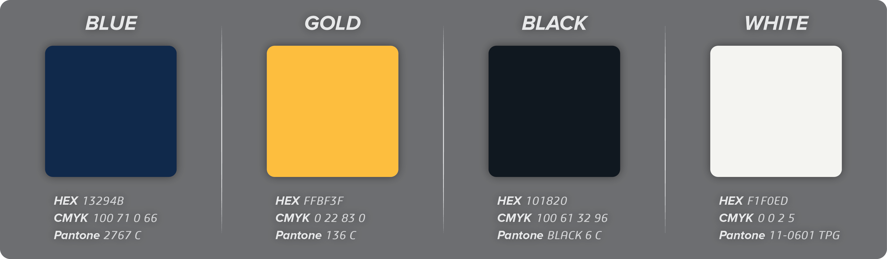
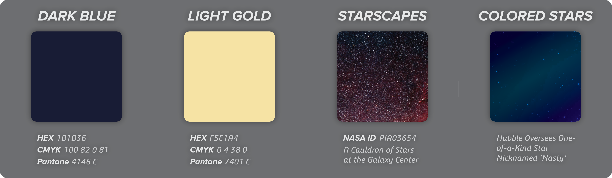
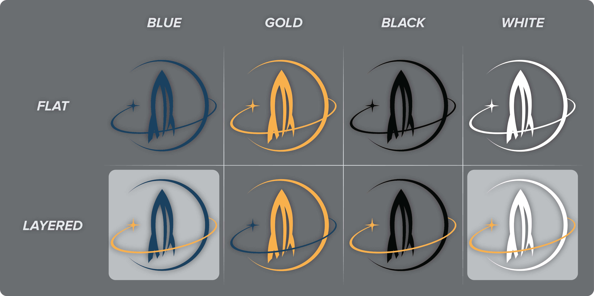
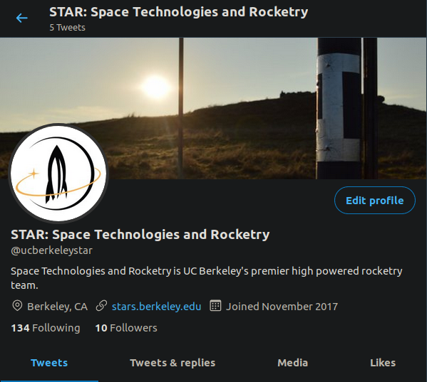

# Brand Guidelines

## Color and Aesthetics

### Primary Palettes

STAR's primary palettes are to be used for primary branding elements such as logos, headers, and important text. Depending on circumstance, the 'black' and 'white' colors may be supplemented or replaced with their web defaults. The colors above can also be used for descriptive text as needed \(particularly black and white\).

### Secondary Palettes

STAR's secondary palette is more flexible than the primary palette. The colors and themes in the figure above are to be used freely as backgrounds, graphic details, or other elements in STAR promotional or other material. They can be tweaked and adjusted as needed and really serve more as recommended guidelines. The "Colored Stars" example above has a gradient overlaid on top of the starscape in the background of the cited NASA image. A large supply of royalty free starscape and other space related images can be attained freely from [NASA](https://images.nasa.gov/). [DSO Browser](https://telescopius.com/weather?fromdsobrowser) is also a good source for amateur astrophotography including several items captured by members of STAR. Note that not all items on DSO Browser are freely available. The use of NASA images is permitted by the following policy:

> NASA content - images, audio, video, and computer files used in the rendition of 3-dimensional models, such as texture maps and polygon data in any format - generally are not copyrighted. You may use this material for educational or informational purposes, including photo collections, textbooks, public exhibits, computer graphical simulations and Internet Web pages. This general permission extends to personal Web pages.
>
> News outlets, schools, and text-book authors may use NASA content without needing explicit permission. NASA content used in a factual manner that does not imply endorsement may be used without needing explicit permission. NASA should be acknowledged as the source of the material. NASA occasionally uses copyrighted material by permission on its website. Those images will be marked copyright with the name of the copyright holder. NASA's use does not convey any rights to others to use the same material. Those wishing to use copyrighted material must contact the copyright holder directly.
>
> NASA has extensive [image](http://images.nasa.gov/) and [video](https://www.youtube.com/NASA)  galleries online, including [historic images](https://www.flickr.com/photos/nasacommons), [current missions](http://images.nasa.gov/), [astronomy pictures](http://photojournal.jpl.nasa.gov/), [Earth images](https://visibleearth.nasa.gov/) and ways to [search for NASA images](http://nasasearch.nasa.gov/search/images?affiliate=nasa&query=). Generally, each mission and program has a video and image collection on the [topic page](https://www.nasa.gov/). For example, Space Station videos can be found at [https://www.nasa.gov/mission\_pages/station/videos/index.html](https://www.nasa.gov/mission_pages/station/videos/index.html). Content can also be found on our extensive [social media channels](https://www.nasa.gov/socialmedia).

The full text of the above policy is available at [https://www.nasa.gov/multimedia/guidelines/index.html](https://www.nasa.gov/multimedia/guidelines/index.html).

## Logo Selection

STAR has both a lettermark and pictorial mark logo for use in all official materials. Both have options available in all the primary colors as described above. All current logos and other brand elements can be found in both PNG and AI format in the [Google Drive](https://drive.google.com/open?id=1SP1aoOocsZ299EDt37n_gfomlcf4F5vK).

### Pictorial Mark Logo

A pictorial mark logo is a graphical logo with some existing and recognizable symbol that's directly associated with the entity the logo is representing. STAR's pictorial logo is an image of a rocket as shown below and comes in eight standard colors.

As pictured above, the pictoral logos come in eight varieties. There's a flat and a layered logo for each of STAR's primary palettes. Note that the black and white logos do not correspond with their exact Pantone color codes as of yet due to temporary color constraints. Although any of the logos shown above are allowed for official STAR use, the highlighted ones are recommended for most purposes. In general, the layered blue logo should be use as the general dark logo and the layered white one for the general light logo.

### Lettermark Logo

STAR's updated lettermark logo is currently a work in progress.

## Typographic Guidelines

The current font used most often in STAR flyers and other promotional materials is Proxima Nova Bold Italic. Note that non-itallic and non-bold varieties are not often used.

As in the example above, capitalized light gold letters are often used for headers and emphasis. White text is often used for bulk descriptive elements. For non-graphic sources such as website material, other fonts are allowed.

## Name Usage

As noted in [our constitution](https://callink.berkeley.edu/organization/star), the official name of this organization is "Space Technologies and Rocketry" and is typically abbreviated as "STAR" with the "A" capitalized. Derivatives of this name such as "California Space Technologies and Rocketry," "CalSTAR," and "UC Berkeley STAR" are not officially recognized and should be used neither either formally nor informally. When appropriate, such as with account names, a full title of "STAR: Space Technologies and Rocketry" may be used as shown below.

## Other Resources

Official UC Berkeley brand guidelines are available at [https://brand.berkeley.edu/](https://brand.berkeley.edu/). Note that STAR is _not_ required to adhere to these guidelines.

