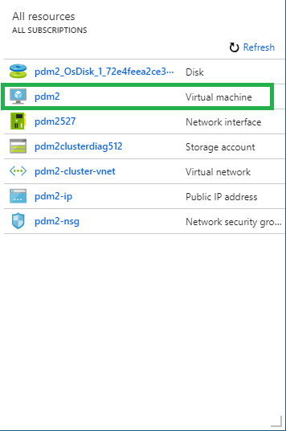
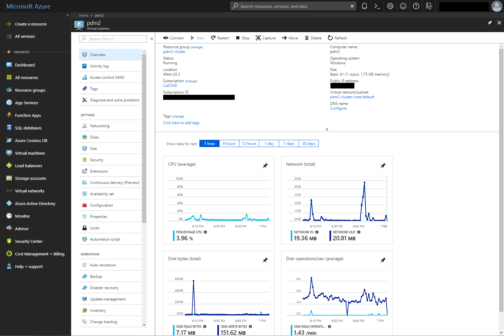

# Azure Server


Be very careful when making server changes. Changing certain items such as processor count, RAM size, disk size, and backup services will incur additional charges. **Do NOT change our subscriptions, services, plan, or anything relating to billing without discussing with all leads. You will be responsible for any changes in payment.**


## Our Server

CalSTAR pays for a cloud server from Microsoft Azure. It is a very weak virtual machine (VM), meant only for low intensive tasks like licensing, product data management (CAD version tracking), and simple scripts (Discord/Slack bots).

### Details

The server is currently on the **Basic A1 (1 vcpus, 1.75 GB memory)** plan with **127GB** of disk space.&#x20;

As of the time of writing, this is CalSTAR's only server (with the exception of a Berkeley OCF web server hosting our website). This means the server is the one you probably have connected to in the past for Solidworks Workgroup PDM and Converge CFD Licensing.

## Getting basic information about the server

If you simply want to look at resource status (CPU Usage, RAM, Network Activity, etc), some of this information is available on the [Azure portal](https://portal.azure.com/).


Login information should have been provided to you upon becoming a lead/admin. If you are not a lead/admin please contact one if you believe something is wrong with the server.


.PNG>)

Selecting the option in the left white box **pdm2 - Virtual machine** will open the dashboard for our server (exact location may differ, ensure you select the **pdm2 - Virtual machine** option).





The dashboard contains most information you will need, including CPU usage, RAM usage, Network usage, Disk usage, Public IP, and links for more actions.

## Advanced maintenance

### Direct Access to Server VM

If you need to do more than view resource status, and need to mess with specific features within the server VM, you will need to connect to the server's Virtual Private Network (VPN) and open a Remote Desktop Protocol (RDP) connection to the server. The following steps will cover how to do both.


Previously, the server was accessible through a Remote Desktop Connection to a public IP address and port number. This has been intentionally disabled for increased network security. You must now first connect to the VPN and RDP with \<server's local IP address>:3389.


### Connecting to the Network

Basically connect to the server's Virtual Private Network (VPN) like you would for the Solidworks Workgroup PDM or other software licensing (Converge CFD). If you have not done so before, or are not sure what that means, [follow this guide.](../software/deprecated-software/connecting-to-calstars-server.md)

### Remote Desktop Protocol connection

[For all systems, download the Remote Desktop Protocol file 'pdm2.rdp' here.](https://drive.google.com/file/d/10KLC-vHKfhdoEB0wp0WwWxkzDUkJIK3P/view?usp=sharing)


The RDP file can only be downloaded when signed into Google Drive with a berkeley.edu account.


#### Windows

Simply run the 'pdm2.rdp' file downloaded previously. It should automatically launch Remote Desktop Connection (RDC, a Windows Program that implements RDP) and prompt you for credentials.

If Remote Desktop Connection does not launch on its own, open it by searching the Start Menu or by pressing  \[⊞ Win + R] and entering

```
mstsc.exe
```

Click **Show Options** and click **Open** in **Connection Settings**. Locate and open the downloaded 'pdm2.rdp' file. You will be prompted to login if done correctly.

#### Linux, Mac, and older/nonstandard Windows

Computers without RDC (Linux, Mac, unusual Windows installations) will need to find a program that implements RDP. A decent alternative is [FreeRDP](http://www.freerdp.com/), however, some knowledge of the terminal/command prompt is necessary to initiate a connection. [Documentation for FreeRDP can be found here](https://github.com/awakecoding/FreeRDP-Manuals/blob/master/User/FreeRDP-User-Manual.markdown).


While functional, a FreeRDP connection is slower than a standard RDC connection. If at all possible, it is highly recommended to connect to the server from a standard Windows installation.



The following information for FreeRDP on Linux and Mac is untested. Please troubleshoot yourselves or contact the current/previous server admin for more information. Please update this wiki if or when you figure out how to properly use FreeRDP.


_For Linux and Mac_, install FreeRDP using your preferred package manager. Use the command below to connect to the server.

```
xfreerdp [path to 'pdm2.rdp']
```

So as an example:

```
xfreerdp ~/Downloads/pdm2.rdp
```

You will be prompted to login if done correctly.


The following instructions for Windows may be difficult without basic knowledge of the Command Prompt, specifically how`cd`and `dir`work. More information can be found here \[[wikipedia](https://en.wikipedia.org/wiki/Cd\_\(command\)#DOS\_and\_Windows)].&#x20;


_For Windows_, download the program, and unzip the files to a new folder. Copy the downloaded 'pdm2.rdp' file into the new folder. Open the Command Prompt by searching the Start Menu or by pressing  \[⊞ Win + R] and entering

```
cmd
```

Using the Command Prompt, navigate to the new folder and run the following command:

```
wfreerdp.exe pdm2.rdp
```

You will be prompted to login if done correctly.&#x20;

## Troubleshooting

### CredSSP encryption oracle remediation

Basically either the computer, the server, or both have outdated security programs. Updating the server and/or your computer will usually fix this issue. If not, follow the steps in **Resolution** [on this website](https://support.microsoft.com/en-us/help/4295591/credssp-encryption-oracle-remediation-error-when-to-rdp-to-azure-vm).


Avoid using the Workaround in the link above.


