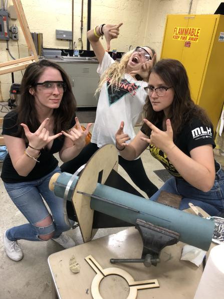

# Attaching Fins

## **Fin Jig** 

Fins can be attached with a fin jig. This method involves epoxying the fins onto the motor mount, at equal spacing, through slits made on the main booster tube. We ensure that the fins stay perpendicular to the airframe by using a fin jig: a lasercut "spacer" that holds the fins in place while the epoxy dries.  

Fin jigs are used for fin sizes where epoxy adhesion is sufficient. For larger or heavier fins \(here we used fiberglass\), it might be best to use fin brackets.

To be added later: schematic of fin jig \(emphasis on the hole for the rail button\), epoxy used, carbon fiber fillets, circle clamp, sanding fillets.

## Fin Brackets

As stated above, fin brackets are convenient for larger and heavier fins where epoxy is not strong enough. A fin bracket is typically an L-bracket that gets bolted into the side of the fin and the airframe. We have not had to use fin brackets yet.

## Fin Can

A fin can is a single-piece setup that includes all the fins attached to a cylinder that slides onto the booster tube. We have also never used this method. 

## Tip-to-tip Layups

See this detailed link for information: [http://jcrocket.com/tttjig.shtml](http://jcrocket.com/tttjig.shtml) 

To quote:

 High performance rockets put a huge amount of stress on the fins. Large heavy rockets put large amounts of torque on the fins and high speed rockets can cause the dreaded fin flutter. All large rockets subject fins to high forces on landing.

 Reinforcing wooden fins with fiberglass or other composite reinforcement helps to make them stronger. \(G-10 fins generally don't need reinforcement for strength.\) However, for very high speed rockets, you also need to stiffen fins and carbon fiber makes an excellent reinforcement for this purpose.

 Fins can be covered with appropriate reinforcement before being mounted to the body. This will make the fins stronger and stiffer. For conventional rockets with motor mount tubes smaller than the body tube, the fins are bonded at three points: outside the MMT, inside the BT and outside the BT. However, for minimum diameter rockets, the fins are bonded only at one point: outside the BT.

 For minimum diameter rockets, it is desirable to reinforce the fin/BT joint for strength. In addition, because minimum diameter rockets are often high performance, it is desirable to stiffen the fins as well. The best way to do this is to laminate the fins tip-to-tip with carbon fiber and fiberglass. By laminating the fins tip-to-tip \(and over the body tube in between\), we reinforce the joint, stiffen the fin and make a solid fin can.

