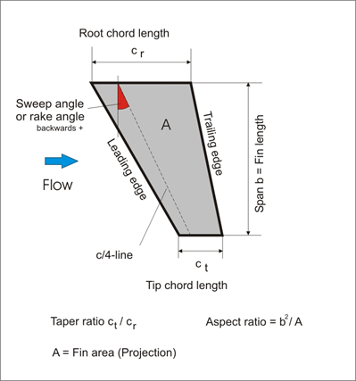

# Sizing Fins

## **Terminology**

* Root chord - edge of fin attached to body tube
* Tip chord - edge of fin parallel and furthest from body tube
* Leading edge - the edge facing the front
* Trailing edge - the edge facing the rear
* Semi-span - distance from the root to tip chord
* Aspect ratio - ratio of a fin’s span squared to its area
* Taper ratio - ratio of tip to root chord lengths

## Fin Geometry

### 

## **Fin Parameters**

### **Fin Flutter**

As the rocket flies at high speeds, the fins will vibrate. For lower speeds, this is not a problem because the amplitude of vibrations will decrease from the air. This is problematic when the rocket speed exceeds the maximum fin flutter speed at which point the air will amplify oscillations to the point of destroying the fin. The maximum fin flutter can be calculated from the following formula:

$$
V_f=\sqrt{\frac{G}{\frac{1.337AR^3P(\lambda +1))}{2(AR+2)(\frac{t}{c_r})^3))}}}
$$

* Flutter speed \(Vf\) - max speed before the fins break
* Shear Modulus \(G\) - amount of deformation associated with a certain amount of force
* Speed of Sound \(a\)
* Wing Thickness \(t\)
* Root Chord \(cr\)
* Tip Chord \(ct\)
* Semi Span \(b\)
* Air Pressure \(P\)
* Aspect Ratio \(AR\) = $$b^2/s$$ 
* Taper Ratio \(λ\) = $$ct/cr$$ 
* Wing Area \(S\) = $$1/2 * (cr + ct) * b$$

It is important to dimension your fins so their maximum fin flutter lies above the maximum rocket speed. 

### Fin Thickness

Thicker fins are more structurally stable, but they also increase the weight of the rocket and the drag experienced during flight. The force of drag can be calculated with:

 $$Fd = 0.5 * p * v^2 * cd * A$$ 

* Drag Force \(Fd\)
* Air Pressure \(p\)
* Velocity \(v\)
* Drag Coefficient \(cd\) - how well air moves around the fins
* Area \(A\) - increases with more thickness

The drag coefficient can be lowered by improving the cross sectional area of the fin. Cross sectional areas include square, rounded, and airfoil in the order of lowest to highest performance. The fin thickness should also account for fin flutter as a low thickness can risk damaging fins during flight.

### Stability

The primary purpose of fins is to correct the rocket during flight such that it continues on a stable trajectory. In order to do this, the center of pressure should lie below the center of gravity. This is so the rocket is stabilized or pointed upward if there is a deviation from the stable configuration. The center of pressure is the sum of the pressure field on the rocket, which creates a lift force. 

$$S = (CP-CG)/d$$ 

* Stability \(S\) - measured in cals
* Center of Pressure \(CP\) from the front of the rocket
* Center of Gravity \(CG\) also from the front of the rocket
* Rocket diameter \(d\)

As a general rule of thumb, the stability should fall between 1-2 cals. Below this range, the rocket may not correct itself enough. Above this range, the rocket may overcorrect. By increasing the surface area of the fins, the center of pressure will move towards the aft end and increase the stability.

