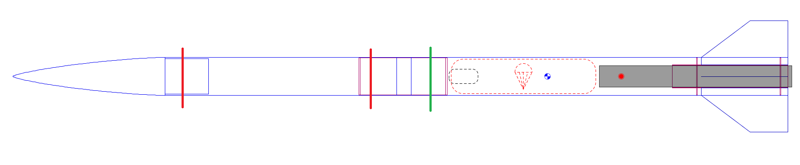

# Tube Attachement

## Separable Interfaces

### Friction

Rocketeers traditionally use friction fits for low-power, mid-power, and most L1 and some L2-level rockets. Take this example of a rocket with a single-deploy, motor ejection recovery system:

There are three interfaces marked with vertical lines; the green one is the only interface required to be separable, as it is where parachutes exit the vehicle. In this case, we rely on the friction between the electronics bay coupler (fore) and the booster tube (aft) to keep the upper and lower section from moving relative to each other on ascent after the motor has burned out.

#### Drag Separation

If a friction-fit interface is not tight enough, drag separation can occur. While separation during powered ascent is less likely, after the motor has stopped producing thrust, it is possible that the drag force experienced by the lower section of the rocket (including fins) is greater than that experienced by the upper section. When this imbalance of forces occurs, it is possible for the lower section to accelerate relative to the upper section. This is known as drag separation, and is not always a bad thing; it can even be desirable if used for stage separation.

#### A Practical Guide to Friction Fits

It can be more of an art than a science to get a good friction fit. Generally, we recommend following this (paraphrased) advice from Dave Raimondi (ex-LUNAR President, L3-certified):

> Your friction fit should allow you to gently lift the rocket in the air by the upper section and hold it such that it is stable and not touching the ground. Then shake the rocket and make sure the bottom section separates with some effort, but does not require violent shaking.

To adjust your friction fit, either: remove/add masking tape to the coupler, or, if no masking tape remains and it is still too tight, sand down the coupler/inside of body tube. We recommend adding tape one layer at a time, either in entire rings or even half rings for fine-tuning. Use wide painters or masking tape for best results (> 1" wide). There is a fair amount of tolerance on the above advice; don't be too worried if your fit seems to be a little too loose or a little too tight.

#### When Not to Use Friction

Any rocket with dual-side dual-deploy recovery will require a stronger interface to keep the main parachute from coming out. Also consider using a stronger interface for larger and heavier rockets, as they may be subject to larger forces.\
\
Refer also to the many forum threads like these for more information:



### Shear Pins

Shear pins are fasteners designed to hold an interface together, but break (shear) when recovery energetics (black powder, usually) are activated. They may also be used to retain deployable payloads. The driving mechanism for shear pin failure is the transverse loads applied by each section of tubing (coupler, body tube) as pressure is built up inside the airframe; the shear pins are not vaporized, melted, or otherwise affected by recovery charges.

#### Shear Pins Selection

STAR members have traditionally used #2-56 or #4-40 nylon screws (e.g., from McMaster-Carr) as "shear pins". While these screws technically have threads, they are often more of a press-fit than screwed into the airframe. No female threads (nut/threaded insert) are required. Shear pins have been effectively used with BlueTube and fiberglass airframes.

#### Shear Pin Sizing

Using too many or too few shear pins can result in extreme quantities of black powder being required, or the premature separation of the airframe in flight, respectively. STAR has experience with both of these scenarios. **Only testing can truly help you avoid these outcomes**. Short of testing, precise calculation of the loads may be helpful; however, it is generally quite difficult to estimate exactly what loads will be applied to each shear pin.&#x20;

Note that dynamic loading when the main parachute opens is usually far higher than any other load during flight; if shear pins are used to retain a payload through/after main parachute deployment, pay special attention to this interface to ensure it does not break prematurely.

## Non-Separable Interfaces

When it comes to larger or more complex rockets, it is expected that you will have one or more interfaces that you need to be separable during assembly, but do not come apart during flight. These are generally held together with some sort of fastener. One common example of this type of interface is a nosecone that detaches from the payload tube to allow for the insertion of a payload, but does not need to detach during flight.

### Standard Nuts

It is certainly possible to epoxy an ordinary hex nut (see: [Fasteners](../manufacturing/general-fasteners.md)) to the inside of a coupler and thread into it with a machine screw. That being said, we recommend using one of the below options for better reliability and/or convenience. Trying to properly position a normal or low-profile hex nut can be difficult and can result in getting epoxy in the threads or a poor bond with the airframe.

### Nut Plates / Weld Nuts

Nut plates and weld nuts essentially refer to the same thing: a normal nut, but attached to a wide base that permanently attaches to a surface. Once the weld nut is attached to a surface, it offers female threads for a removable but secure attachment (similar to a [threaded insert](../manufacturing/general-fasteners.md#threaded-inserts)). Traditionally in aerospace (especially planes!), nut plates are attached to a surface with rivets while weld nuts (more common in cars) are literally welded to a surface. "Adhesive-mount nuts" are also sold with the explicit purpose of being attached with an adhesive, although most weld nuts/ nut plates are fine to use with epoxy.

.png>)

To use a weld nut or nut plate with epoxy for a coupler-body tube interface, follow these rough steps (also see below for references with pictures):

1. Test fit coupler and body tube together and tape/ hold interface so tubes do not rotate relative to each other
2. Drill a hole (free fit tolerance for the screw that will be used) radially through both body tube and coupler
3. Insert a screw radially inward through the hole, going through both the body tube and coupler.
4. Hold the nut on the inside of the coupler and thread it onto the screw
5. Mark out area for epoxy around footprint of nut
6. Remove nut and apply epoxy, taking care to avoid the hole where the screw will go. Remember that when the epoxy is compressed, it will spread out, but should not enter the screw/nut interface.
7. Thread nut back on to screw, stopping right before it touches the epoxy
8. Pull screw radially outward, pressing nut into epoxy
9. Hold nut static (use pliers if needed, clean afterward with isopropyl alcohol) while screwing in screw completely to apply medium pressure
10. As epoxy cures, make sure that the screw is still removable. It is very possible to accidentally permanently epoxy the screw to the nut, rendering the connection useless. We recommend keeping pressure at least until the epoxy has set, periodically removing the screw to check that the threads are still useable

#### Nut Plate References

See this fantastic tutorial on how to use weld nuts/nut plates with fiberglass airframes: [http://hararocketry.org/hara/how-to-use-weld-nut-plates-on-fiberglass-rocket/](http://hararocketry.org/hara/how-to-use-weld-nut-plates-on-fiberglass-rocket/)\
\
A similar write-up can be found in Apogee Newsletter 341: [https://www.apogeerockets.com/education/downloads/Newsletter341.pdf](https://www.apogeerockets.com/education/downloads/Newsletter341.pdf)

### Sheet Metal Screws

Historically, STAR has used #4-40 pan head sheet metal screws (from ACE Hardware or McMaster-Carr) to semi-permanently attach Blue Tube interfaces. Sheet metal screws are similar to wood screws in that they have deep, aggressive threads and a sharp point; however, unlike wood screws, they are threaded all the way until the head. This property makes them useful even at very short lengths (1/2" or 1/4" long).

| Pros of sheet metal screws                            | Cons of sheet metal screws                     |
| ----------------------------------------------------- | ---------------------------------------------- |
| Simple                                                | Limited number of uses                         |
| Slightly cheaper than alternatives                    | Less reliable / reproducible                   |
| Little upfront work                                   | Require significant rework after max uses      |
| Fairly accepting of too-small holes in soft materials | Difficult to size holes for in rigid materials |

#### Limits on Sheet Metal Screws

As a sheet metal screw directly cuts into the airframe, the material that said sheet metal screw is holding onto is gradually removed each time the screw is inserted and removed. Practically, this manifests itself as the screw feeling loose and/or simply falling out after too many uses. The screw may also bind in the interface at an angle, instead of remaining perpendicular to the long axis of the rocket.

While Blue Tube generally accepts \~10 or more assembly/removal cycles without any issues and up to 20-25 without serious concern, you may start to notice sheet metal screws in fiberglass becoming loose after as few as 4 cycles (typ. 6-8). This is in part due to the fact that Blue Tube, as a paper composite, will recover its shape more easily after being deformed. While it is possible to attempt to remedy a too-large hole with some epoxy, it is often easier to simply drill another hole and fill the previous one entirely. Depending on the epoxy used, this may take up to 24 hours to completely cure.\
\
For a project team on tight assembly timelines and an interest in professionalism and reliability, we do not recommend sheet metal screws for composite airframes. Do not underestimate the potential timeline and build quality impact a poor tube connection can cause.

### Self Clinching Nuts (AKA PEM nuts)

Self clinching nuts, sometimes called PEM nuts or press fit nuts, are nuts designed for installing a permeant fixture of female threads in a hole of sheet metal.

.png>)

.png>)

After a hole is drilled with the right diameter, the nut can be press fit into the hole.  This process will deform the metal to envelope the back tapered shank and hold the nut in place, as well as imbed serration to provide torque resistance.

Rockets are usually not made of sheet metal, but these nut have been seen to work on fiberglass tubes.  Do note that for tubes under 2.5" in diameter, the curvature of the tube may be too great for the nut to properly work, as they are design for flat surfaces.  It is also important to buy nuts that are suited for the thickness of the tube wall.  Additionally, ensure you have the right size drill bit, as hole diameter is crucial to ensure the nut press fits well.

.png>)

Specialized tools can be used to press fit the nuts into place, but simpler methods can also be effective.  By using a screw or bolt that is compatible with the nut, one can tighten the screw and effectively "press" the nut into the drilled hole.  A washer can be used to create a better clamping surface, but may not be necessary.

.png>)

Some people choose to also add epoxy to the nut to increase the strength of the nut to the tube.  It likely depends on serval factors for how well the nut actually stay in place, but in flight when the nuts are engaged with the screws, they shouldn't go anywhere.  The screw shearing off is more likely than the nut failing all together.  Multiple nuts should be used to make a good permanent connection between to pieces of the rocket.  It is also recommended that the screw sizes should be slightly longer than they need to be, so in the case of the screws shearing off, they can still be removed from the nuts.  Even then, it is recommended to not use these nut for shear pins/screws, and to go with the more traditional technique outlined above.
