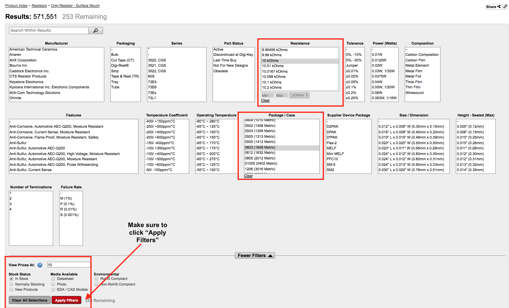
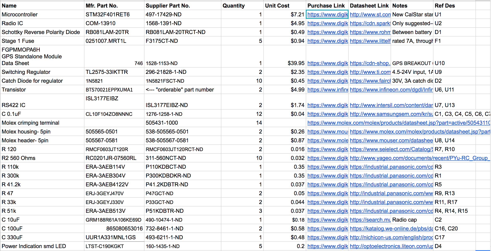
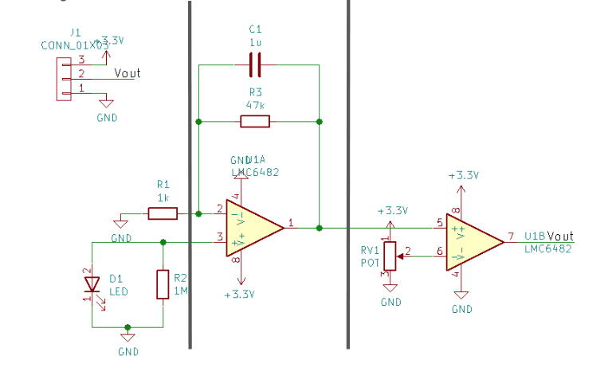
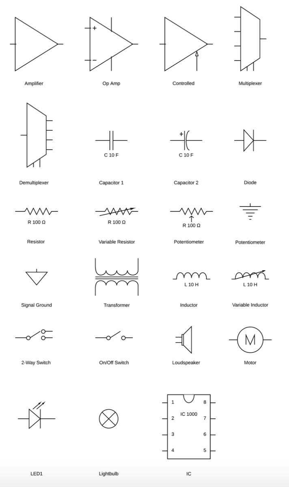
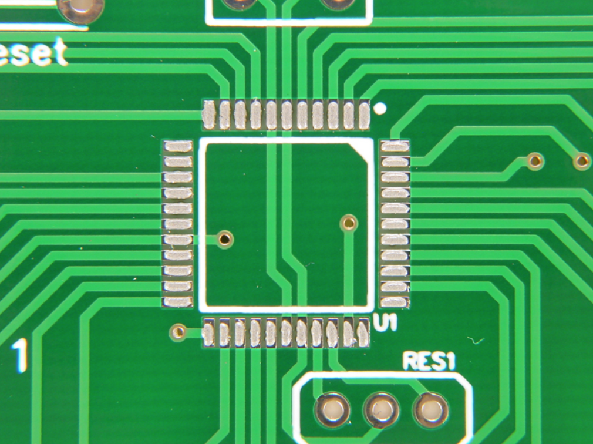
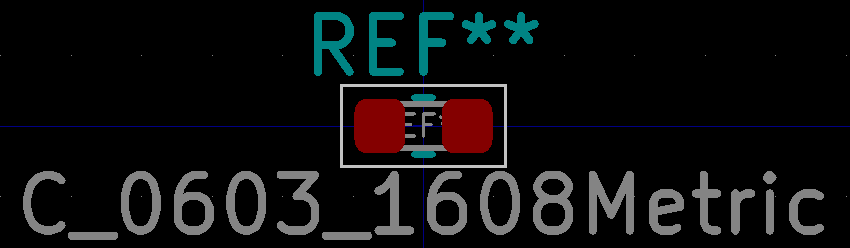
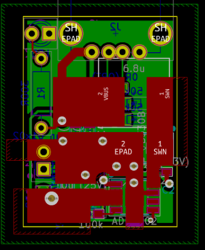
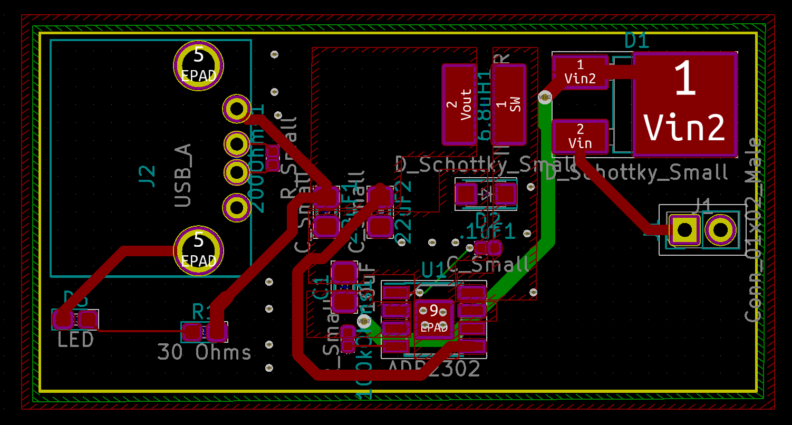
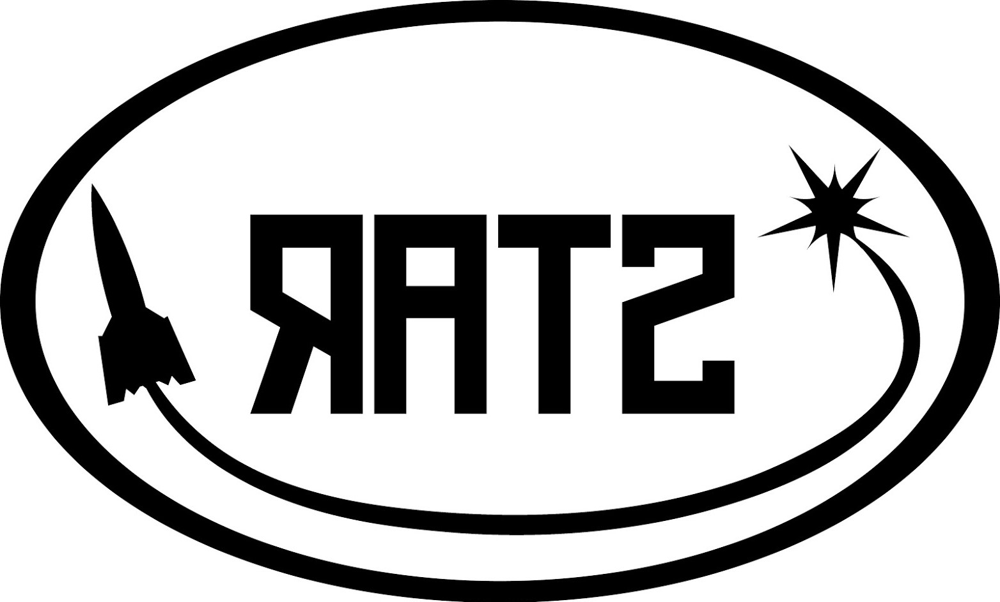

# Board Design Reference


Some parts of this page may be out of date (in particular, the  section "Before You Submit"). The rest of this page is a great reference!



Please note that there is a board design DeCal that can give you a more detailed understanding of how to build PCBs: [https://decal.berkeley.edu/courses/4529](https://decal.berkeley.edu/courses/4529). Though this tutorial will follow the format of the decal's [website](https://ieee.berkeley.edu/hope/pcb.html),  this page is just an introduction. You can access the syllabus and material at this link: [https://ieee.berkeley.edu/hope/pcb.html](https://ieee.berkeley.edu/hope/pcb.html).  Here is another useful resource on PCB design: h[ttp://www.ti.com/lit/an/szza009/szza009.pdf](http://www.ti.com/lit/an/szza009/szza009.pdf)​


## What is a PCB?

A printed circuit board, or PCB, is the backbone of hardware design. These cheap, compact, reliable boards allow us to implement circuits into a greater system. They are better than alternatives in that they provide form (hold everything together) and function (make good electrical connections). They are built from conductive copper layers separated with non-conductive substrates and include things called vias, tracks, and pads which will be discussed later. While the process of making PCBs may seem long and frustrating, this tutorial will guide you through the most basic parts of making a good PCB.&#x20;

## The Design

In order to start making your PCB, you will need a design. It should meet your system specifications under all relevant conditions (such as temperature or vibration) in little time for little cost with few iterations (don't worry if you have to redo your design, but don't just guess and check). Your design should be testable and fail minimally. You can start a design by identifying what particular electrical components provide which functions. These components are then put into something called a schematic, which essentially pieces these components together to make your design work.

### Specifications and Testability

Before starting **anything else**, make a [specification document](https://en.wikipedia.org/wiki/Functional\_specification). This should outline exactly what you want your board to do, but _should not specify implementation details._ For example, a telemetry and power control board might be expected to transmit and receive data at 96 kBits/s, provide up to 500 mA at 5V for 6 hours, etc. Each of these desired functions should be testable before final deployment of the system (i.e. a function like "doesn't run out of power on the pad if there's a delay" would be better written as "provides up to 500 mA at 5V for 6 hours").

Your specification document should be roughly 0.5-2 pages long, depending on the complexity of the project. You may refer to a higher-level system architecture document, or even omit the specification document and simply use a section of a system architecture document as your spec, depending on how far design work has progressed. Make sure to also refer to the rules and regulations of whatever competition the board is for ([see here for IREC](http://www.soundingrocket.org/sa-cup-documents--forms.html)); explicitly citing these in a spec document is always good.

### System Architecture and Interfaces

Once you have your functionality decided upon, it's time to start developing the design a little further. At this stage, continue updating your specification document or create a new system architecture document that will contain all design choices to achieve the desired functionality.

This is where questions like "do we need a microcontroller or can this be done without one?" or "how are we going to power this board?" should be answered. As you do this, feel free to update your specification document as you realize what additional functionality is needed. At this stage, you should also consider exactly how your board may interface with other devices and people (radio, serial communication, LEDs to communicate power/status, switches, etc.)

Depending on your familiarity with the available hardware, you may not be able to fully specify the architecture before taking a look at the next section, Selecting Parts. It is perfectly fine to go back and forth between looking at available components and updating the system architecture.

## Selecting Parts

Selecting parts to use for your design may seem like a tedious task, but it's extremely important to get right for your project to work. After determining your desired functionality and architecture, you know what passive component values and ICs (integrated circuits) you will need, but that is only a small part of selecting the physical part that will end up on your physical board. Here are some things to consider:

### Component Package

Components come in may different sizes and shapes: some are larger, some are smaller, some are impossible to solder, etc. It is extremely important to pick a correct form factor for each component, or your design will be impossible to assemble.

* Solderability
  * How small is the component? For passives, CalSTAR uses 0603 Imperial or larger.
  * Does it have leads or is it marked QFN (no leads) or BGA (ball grid array - under the IC)? If the latter, you will need a reflow oven and cannot solder by hand. If absolutely necessary, QFN/LGA components may be solderable at a hot-air station; ask a subteam or project lead if you think this might be necessary.
* Surface Mount vs. Through-Hole
  * Surface Mount (SMT/SMD) and Through-Hole (THT or DIP) are two forms the component can take. The former lies flush on the board and are usually smaller while the latter is put in a hole through the board.&#x20;
  * Passives and ICs should be SMD, while connectors are usually through-hole. The more compact the board, the better.

### Packaging and Quantity

Different from the component package, this is how the components are actually shipped. Make sure you can order the amount you want; some components are sold in units of 5,000! Generally, Tube, Tray, and Cut Tape and fine, whereas Tape and Reel and Digi-Reel have minimums in the thousands. See the [Digikey ordering guide](../general-tutorials/in-progress-digikey-ordering-guide.md) for more details.

### Application Circuits

* When looking at an IC's application circuit schematic/layout, consider the complexity and the sensibility of the externals required. If it is not appropriate for your design, consider another IC. Many ICs require an extensive network of resistors, capacitors, etc. to function properly.
* In general, while searching for parts, whether from Digikey (preferred) or Mouser or Adafruit, **read the datasheet** and specs carefully to ensure they fulfill the requirements you need. You need to check that is can drive the correct load, provide or handle enough current, is powered by the correct voltage, is the right size, and for passives, is the right value. Here is an example of a search for a specific 10kOhm 0603 SMD resistor from Digikey:

## Commonly Used Components&#x20;

### Microcontrollers

Microcontrollers are essentially the "brain" of the PCB. You can program them to perform specific tasks (for example, light up an LED or interpret sensor data). They are usually quite complex and have dedicated pins for their different functions. GPIO pins (General Purpose Input-Output) are especially useful for customization. CalSTAR has previously used AVR processors by Atmel (ATmegas, the same as commonly found on Arduinos), but we are now using 32-bit ARM chips made by STMicroelectronics (STM32F401RET6, for example).

### Transistors

Transistors are three-terminal semiconductor devices used to amplify or switch electronic signals and electrical power. There are many different types of transistors, but the most common that you'll see are BJTs (bipolar junction transistors) and (MOS)FETs, which are (metal-oxide semiconductor) field effect transistors. Transistor physics is generally not covered well in lower-division EE classes; feel free to ask someone for help picking a transistor if you're unsure.

[This stack exchange post](https://electronics.stackexchange.com/questions/13079/when-is-a-mosfet-more-appropriate-as-a-switch-than-a-bjt) does an excellent job at summarizing when you should use a BJT versus when you should use a MOSFET.

### DC-DC Converters

DC-DC converters converts one DC voltage into another. For example, a 12-V battery voltage may need to be stepped down to 5 or 3.3V. There are two common types: LDO and switching regulator. The LDO (linear drop-off) is generally simpler to implement into a PCB because it has fewer external components, but it uses a lot of power.&#x20;

A switching regulator, on the other hand, is relatively efficient with power and is generally more precise. These converters are important to supply the correct voltage to a component in order for it to work properly. A switching regulator that steps up voltage (at the expense of current) is known as a boost converter, while one that steps down is known as a buck converter. There are also [buck-boost converters](https://en.wikipedia.org/wiki/Buck%E2%80%93boost\_converter).

### Passive Elements

Passive elements include resistors, capacitors, inductors, oscillators, buzzers: anything that either consumes but does not produce energy or that is incapable of power gain (unlike a transistor that is capable of amplifying). Capacitors and inductors can used for oscillation (like a voltage regulator). Capacitors can also be used for coupling/decoupling.

### Indicators

These are usually LEDs or buzzers: anything that indicates a specific function is occurring. LED's are important to indicate whether power is being supplied to a PCB, for cases of safety and debugging. Buzzers can be used when the PCB is obscured (like in the rocket) and the board LED is no longer visible. Small green SMD LEDs are common to indicate power, while other colors can be used to indicate activity or danger.

### Diodes

A diode is an semiconductor device with two terminals that allows for the flow of current in one direction only. An LED (light emitting diode) is one example. Diodes can be used for reverse polarity protection, i.e. if you connect power in the wrong direction, current will not flow and therefore will protect your circuit. Zener diodes can also protect surges by having one terminal connected to a power net and one connected to ground.

### Fuses

A fuse is a safety device that prevents a short circuit from damaging the rest of the board. There are two types: resettable and non-resettable fuses. A non-resettable fuse works by allowing the overcurrent to melt a small piece of metal in between its terminals so that it becomes open. A resettable fuse has a material in between its terminals that, instead of melting, increases resistance and cuts off current flow.

### Connectors

These are the components that are usually soldered to the edge of the board that allow it to connect to the necessary peripherals. For example, a battery will need a connector (usually an Anderson PowerPole), while screw terminals may be used for wire connection to other PCBs.

### Other ICs

There are many different ICs (integrated circuits) that your PCB may need in order to function. This includes sensors (like a GPS, altimeter, accelerometer, or gyroscope) to provide information about what your project is doing (in our case, what is happening during flight). In addition, a radio IC, with attached antenna, is useful for communicating commands to the microcontroller during testing and flight.

## Making a BOM (Bill of Materials)&#x20;

While selecting your parts, you will need to write them down. Each component requires a lot of information in order to purchase the correct one. Here is an example BOM, with the necessary columns:

The manufacturer part number is the number of the manufacturer (for example, Infineon) of the component while the supplier part number is the code of the supplier (for example, Digikey). "Ref Des" stands for Reference Designator, which is the number of the component in your schematic. **Make sure that you select the correct size for all components and that their packages are appropriate for your layout.** For example, make sure resistors/capacitors are 0603 and that you distinguish between through-hole and surface mount.

## Making A Schematic

What is a schematic? They are drawings that represent elements in a system using abstract symbols to give information without unnecessary details. You can implement these schematics in your PCB design software, as discussed in the information notes at the top of this page. In general, signals should go from left to right, top to bottom, with higher voltages at the top and lower at the bottom. Here is an example in KiCad (the long parallel gray lines are to indicate the separation of functions in the circuit):&#x20;

Notice the connector to power is at the top left and the output is at the bottom right. The amplifiers follow the "high voltage up-low voltage down" rule and everything is separated by function.

You will want to use an appropriate grid size to align your wires (about 50 mils - **1 mil is 1 thousandth of an inch, NOT one millimeter**) and use labels to make the values and functions of each part clear.&#x20;

Most ICs are drawn as rectangles. A resistor can be shown as a long rectangle or a zig-zag shape. Capacitors are using two parallel lines of some length, while a battery is a long line in parallel with a short one. Some shapes are made for special functions (a triangle is usually an amplifier). Here are some examples:&#x20;

Sometimes you will need to make a new schematic symbol if your software doesn't provide it. Be sure to group pins on your new symbol by function, not the location on the physical package. Power should be on top, ground on bottom, and inputs on left and outputs on right.&#x20;

Once you have your symbols in your schematic, you might notice they will have associated letters and numbers. For example, U1 or R4. These are called reference designators, as shown above in the example BOM. The letter tells you what kind of component it is. "U" means some IC while "J" is a connector and "R" is a resistor. The number is just clarifies which of that type it is. Naming 15 different resistors "R" isn't helpful, so they are labeled R1 to R15. These are usually automatic, but you will have to hand-label their values, of course.&#x20;

When your schematic is complete, you will want to run ERC, or electrical rules checker, through your software. In Diptrace, this is done by clicking "Verification" at the top menu bar and then selecting "Electrical Rules Check" from the drop-down menu. In KiCad, it is Inspect>Electrical Rules Check. This will ensure that your wires are connected appropriately and that you didn't make any egregious errors.&#x20;

## Making A Layout

What is a layout? It is like a map for how your physical board will be arranged. PCB's are built layer by layer with copper layers for connectivity and insulating layers to provide mechanical rigidity and form. The boards are covered with something called soldermask, so that when you start soldering, the solder will stay only within the exposed pads you designate. These pads are made of copper and connect to the copper layers in the board. Here is an example of both through-hole and surface mount pads with the lines of connectivity in light green (the other smaller holes you see are called vias, which you'll learn about later):

Layout begins by assigning footprints to each of the components in your schematic. Footprints are the physical representation of the schematic symbol of a component. For example, a capacitor footprint will usually be two parallel rectangles, as shown below:

There is a function in your software that allows you to import your schematic so that the footprints connect like they're supposed to. This is called LVS (layout vs schematic) and is often included in DRC (design rule check).These connections are those light green lines you see above. You can even use the autorouter to do this, but it's not a very intelligent function. It's better to do it by hand. Make sure that when you are connecting pads to one another that none of your lines cross! Your layout needs to be planar. You may find that this proves difficult, if not impossible, so to get around this, use vias. Vias, which are holes that go between the back and front of the board, need to be proportional to the width of the trace (the term for the light green lines). See the following figure. Below is a calculator for finding the appropriate width of a trace, which need to be larger to carry large currents.&#x20;

When routing, use net classes (e.g. power, ground, etc), and try to keep traces short, especially for high currents, since traces have resistance. Fill zones, or copper pours (see example below), help to dissipate heat across the board and connect large areas together. Follow datasheet recommendations for help.

Once you've arranged them in a way that makes sense for your project (i.e. connectors should almost always be at the edge, with the SMT IC's near the center), consider the Design Rules. These are the minimal manufacturability requirements of the board. For example, drill sizes have to be a certain diameter, along with trace widths. The smaller everything is, the more difficult and expensive it will be manufacture, if not impossible. At the end of your design, you will run DRC, which is similar to ERC, but instead checks that you have followed all the rules of manufacturability. Here is an example of a layout:

General steps to follow:

1. Begin by drawing edge cuts. This is the yellow rectangle that surrounds the components. It determines the outermost edge of your board. Usually, the size of your board is dictated by mechanical requirements, so this is almost always the first thing you should do.
2. The other two colors of rectangle define the ground and power planes that you will be connecting your components to.&#x20;
3. Check ICs' datasheets for a recommended layout. How much space does the recommended layout require? In the above example, U1 had a recommended layout that suggested the capacitors and diodes around it be arranged as so, with copper pours connecting them where appropriate.&#x20;
4. Next, place the connectors at the edge of your board. In this example, it would be the USB connector (it wouldn't make much sense to put that in the middle). Place power-related components and their external components after that, according to the datasheet's recommendations. Include any fills or thermal vias that it recommends.
5. Place the rest of your components (usually passives and indicators) and then add any additional filled zones you may need.
6. Lastly, route all nets not connected to a fill zone and adjust the size of your fills as necessary after creating them. Add routes and vias to connect your fills.

Other things to consider include the following:

* Traces have resistance (they will heat up, decreasing efficiency and wasting power), have inductance (current through them can't change instantaneously), and have capacitance (causes signals on one wire to show up on others). Increasing trace width reduces resistance and inductance. Decreasing trace length does the same.
* Vias have inductance and add length, so put them in parallel when you must use them.
* Decouple correctly by placing capacitors close to the component you are decoupling and size the capacitor correctly so that inductance doesn't dominate. See datasheets for recommendations.&#x20;

When you have finished your layout, go through this [checklist](https://ieee.berkeley.edu/hope/checklist.html) to ensure that your board is ready for fabrication.&#x20;

## Before You Submit

Make sure you have done all of the following before a review, and before boards are submitted for manufacturing.

### Schematic

* All passives should have values visible.
* Important nets should be labeled
  * E.g.: V\_in, 3.3V, GND, DEBUG\_RX, DEBUG\_TX, ACCEL\_SDA.
* Text should not overlap.
* Components that are not easily replaceable should have Manufacturer and Datasheet filled out in Component Properties.
  * "Not easily replaceable": ICs, connectors, fuses, any unusual components such as a massive electrolytic capacitor.
* Schematic should be broken up into modules (surrounded with a box) to aid readability. Label each module with text.
  * E.g.: radio, voltage regulator, reset line, programmer port.
  * Use netports to prevent lines going everywhere.
* Test points should be added to ALL nets that we MAY want to measure at some point.

### Layout

* Double check all patterns
* Add silkscreen
  * Pins on ports such as UART, programming ports, actuators, etc should be labeled
  * Move reference designators (RefDes) if necessary
    * Tip: F10 allows moving reference designators, 'r' for rotate
  * Place board name and version (eg Ground Station v3)
  *   Calstar Logo (use reflected version if placing logo on the back of a board)

      &#x20; &#x20;
* File > Renew Layout from Schematic
* Verification > Check Net Connectivity
* Verification > Compare to Schematic
* Verification > Check Design Rules (F9)
* Use the HOPE PCB Decal checklist: [https://ieee.berkeley.edu/hope/checklist.html](https://ieee.berkeley.edu/hope/checklist.html)
* Use BAC's InstantDFM to verify they can produce your board within standard capabilities: [http://instantdfm.bayareacircuits.com/](http://instantdfm.bayareacircuits.com/)

## Calculators/References

Impedance calculator: [https://www.eeweb.com/tools/microstrip-impedance](https://www.eeweb.com/tools/microstrip-impedance)

* Use to calculate impedance of traces, primarily for matching against 50 Ohms
* Note: we have our boards manufactured to be 31 mils (this is the substrate height)
* The substrate in our case is FR4

Trace width calculator: [https://www.eeweb.com/tools/external-pcb-trace-width](https://www.eeweb.com/tools/external-pcb-trace-width)

* Use to determine minimum required trace widths based on current range

Bay Area Circuits:

* Stay within BAC's standard capabilities
* Manufacturing capabilities: [https://bayareacircuits.com/capabilities/](https://bayareacircuits.com/capabilities/)
* Stackup capabilities: [https://bayareacircuits.com/multi-layer-stackups/](https://bayareacircuits.com/multi-layer-stackups/)
* Instant DFM: [http://instantdfm.bayareacircuits.com/](http://instantdfm.bayareacircuits.com/)
