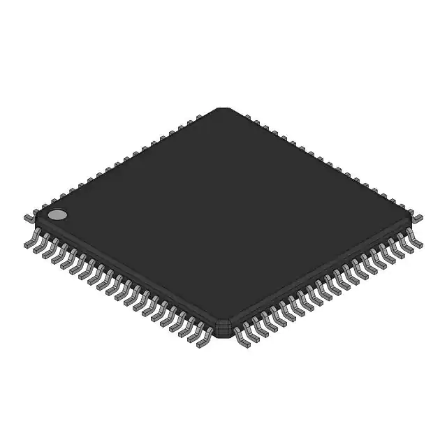
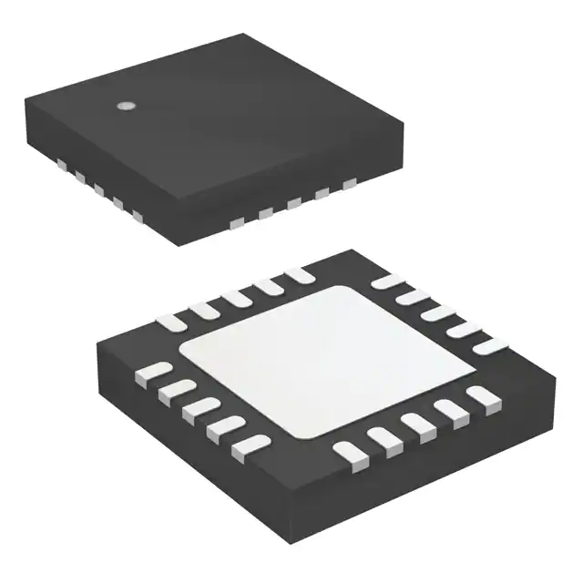
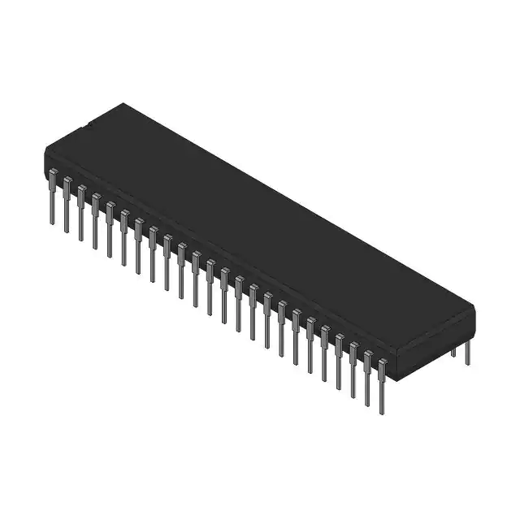

# Component Selection

One of the challenges of circuit design is narrowing down exactly which components you want to use. For example, suppose you need to include a zener diode as part of your circut. A quick internet search on supplier websites reveals more than 70,000 possible options! How are you supposed to narrow it down?

### Old Projects

This option is relatively simple but works very well: browse through some of our old electronics projects and re-use components that we've used before. For example, if you need a zener diode, check our past projects to see if any of them incorporated a zener diode, and re-use that specific diode for your current project (as long as that diode meets your current project requirements). Some of the projects that you can browse are:

* CAS: [core](https://github.com/calstar/cas-core-hw), [radio](https://github.com/calstar/cas-radio-hw), and [pyro](https://github.com/calstar/cas-pyro-hw)
* [Ground Station](https://github.com/calstar/hardware-ground-station)
* Electronics for [ELLIE](https://github.com/calstar/ellie-ground) and [LE2](https://github.com/calstar/le2-avionics)

### Kicad

Open up kicad and browse through their schematic symbol libraries. In these "Kicad default libraries" you can find a whole host of specific part numbers for each general type of component (amplifiers, transistors, etc). There are two main advantages to using components from the Kicad default libraries: first, obviously, you'll have easy access to the symbol and footprint for your part, without having to make them yourself or search online. Second, by virtue of the component being included in Kicad's deafult libraries, you'll know that it's a very popular component.&#x20;

If we go back to our old example of trying to find a zener diode, here's how we can search the Kicad default libraries. First, open up the schematic editor and select the button to add a component:

<figure><figcaption></figcaption></figure>

Then, type "zener diode" in the search bar:

<figure><figcaption></figcaption></figure>

Most of the options it shows us here at the top are 'generic symbols' and aren't specific part numbers.

<figure><figcaption></figcaption></figure>

If we scroll down, now we can see some specific part numbers. For example, here I've selected the BZV55B2V4 zener diode, and if we later decide we want to use it in our project, we can buy that specific diode from digikey.

### SnapEDA

Sometimes, if a component isn't available in the Kicad default libraries, you can find it in an online Kicad library, which you can download and incorporate into your project just like a component from a default library. One of the best resources for finding these online kicad libraries is snapeda.com. This website allows your to search by part type (or by specific part number) to get symbols and footprints that you can integrate into your kicad project.&#x20;

If you go to the main page and type "zener diode" then the search results will look something like this:

<figure><figcaption></figcaption></figure>

You can click on each individual part to see more details about its symbol and footprint. Note that not all components will have both a symbol and footprint provided--some have only a symbol, some have only a footprint, and some have neither. Components with the will have a symbol, and components with the will have a footprint. If you get a component with only a symbol, it is possible to make the footprint yourself and incorporate both into your project (and vice versa). However, note that symbols are generally much easier to make yourself than footprints.

One of the great things about SnapEDA is that it tells you how popular each part is by displaying the number of times that each symbol and footprint has been downloaded. If something has over 100 downloads, that usually means its a very solid choice. For this reason, looking up parts on SnapEDA is still useful even if you already have the symbols and footprints. If you're trying to choose between two zener diodes, and one of them has much more downloads on SnapEDA than the other, then that might help to inform your choice between them.

### Digikey

Digikey.com is the main website that we use to search for and purchase parts. However, we frequently buy parts from other sources as well--mouser.com is a good example, offering almost all of the same features as digikey. We also buy parts from Amazon sometimes, like the ESP32s used in the LE2 ground system.&#x20;

For now, though, you can stick to digikey, as that will make things simpler. Continuing with our zener diode example, you can start by typing 'zener diode' into the search bar at the top of the screen. Doing so will lead you to a page that looks like this, where you can select the category of components to browse:

<figure><figcaption></figcaption></figure>

Click on "Diodes - Zener - Single." Next, you'll see a page that looks like this, where you can browse all the specific components to purchase:

<figure><figcaption></figcaption></figure>

You can start narrowing things down by selecting some filters. Under "product status", select "active"--this is one filter that you can always select right off the bat. After that, scroll through the rest of the filters and select the ones that apply to your project. For example, maybe you know that you'll need a zener voltage of 12V exactly--in that case, you can go to the "Voltage - Zener (Nom)" filter and select 12. Additionally, maybe the project requirements stipulate that the zener diode needs to support 500 mW of power; in that case, you can go to the "Power - Max" filter and select every power level above 500 mW. Oftentimes, you can also go to the "Mounting Type" filter and select "surface mount" because we usually use surface-mount components on PCBs due to their small size. (Though sometimes we do need to use through-hole components, usually when the components have some kind of high-voltage or high-current function).&#x20;

Press the red "apply all" button after selecting your filters. This drops the number of results down to about 617. Next, unless you have a specific part number in mind, go to the "Quantity Available" tab and press the down arrow button to sort in descenging order or quantity available. This is done for two reasons; first, the parts with a very high number available are generally the most popular, and therefore the best to use. Second, we have had some problems in the past with parts that are out of stock on digikey (for example: we designed CAS in 2020 and included a component called the BNO055. That component ended up going out of stock, and as of 2023, it's still out of stock. Depending on how far in the future you're reading this, it may still be out of stock today!).&#x20;

From here, you can scroll down the list of most popular components and note down any that look appealing. Note that, when digikey reports the quantity of a component, they include both the quantity that they have "in stock" (the normal way to buy them) as well as the quantity available on the "marketplace." The marketplace is relatively new so STAR doesn't have much experience buying from there. If you find a component you really like that's only available on the marketplace, by all means go ahead and buy it, but if you want to stay on the safe side, then stick to the components that are listed as "in stock" on digikey. At this point, you'll probably be able to get a shortlist of several components (10 or so) and start deciding between them.

### Other tips for choosing components

* Look at options from a reliable vendor. Some vendors that make lots of good components include Texas Instruments, Onsemi, Diodes Incorporated, Analog Devices, and NXP. Note that digikey allows you to filter by vendor when you are doing the filtering step.
* If you are deciding between a few components, read their datasheets. Some datasheets have detailed pinouts, application circuits, debugging information, and more, whereas some other datasheets only have the absolute bare minimum. Components with more comprehensive datasheets are generally a better choice because they'll be easy to use.
* Solderability is very important! Components with "little legs" (there's an official package name but I can't remember it) are much preferred because the metal part sticking out makes it relatively easy to solder. In contrast, some components have all their pads directly under the package without any legs at all. This makes it much more difficult to solder, although it can still be done by STAR's capabilities if there are no other options.

<figure><figcaption>
A component with the little legs
</figcaption></figure>

<figure><figcaption>
A component with no legs because the pads are directly under the package
</figcaption></figure>

<figure><figcaption>
A DIP ("Dual Inline Package") component, which is actually also a bad choice because it takes up too much area on a PCB, despite being very easy to solder. These components should primarily be used for breadboarding.
</figcaption></figure>

* Go to adafruit.com if you're interested in getting breakout boards specifically. Adafruit has a much narrower scope than most other component distributors, and they tend to specialize in things that you can connect to an arduino or esp32, such as sensors and actuators. Adafruit usually has very extensive documentation and tutorials for using their components, which makes them a really appealing choice.
* Some components are used a lot by STAR simply because our club used them before many times, so they should be prioritized when doing components searches. Some examples of this include the STM32F401RE microcontrollers, which was used in many projects (most notably CAS), as well as the ESP32 devkit-C V4, which was used for ELLIE and LE2 electronics.
* If there's one component that is mostly really good but won't work for some reason (maybe its out of stock, or it doesn't meet the required power rating, or something else), try looking for a closely related component. Most manufacturers use a sort of naming convention in which components have more similar part numbers if they are more closely related. Many datasheets will even have an "ordering information" section near the end where they tell you the exact meaning of the naming convention for that family of components.
* If the component you're looking for is something that a microcontroller communicates with, you should prioritize components that already have drivers written for them (available online), so you don't have to write drivers yourself.
* You can literally just google something like "best zener diode" and see what the top few results are. This isn't the most effective strategy, but sometimes it can work.
