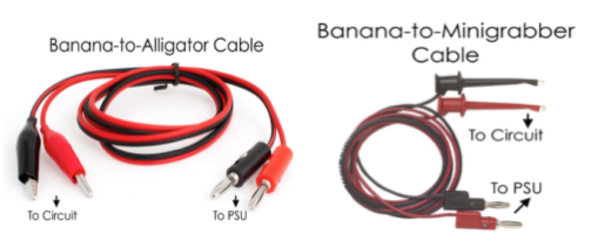
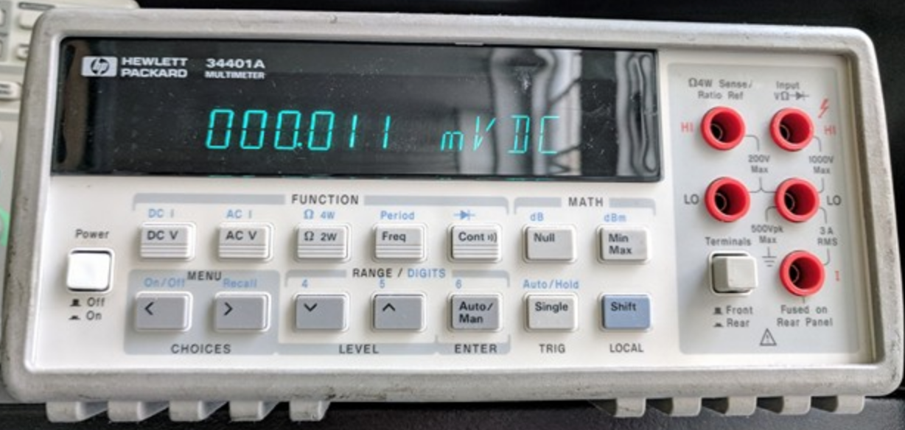
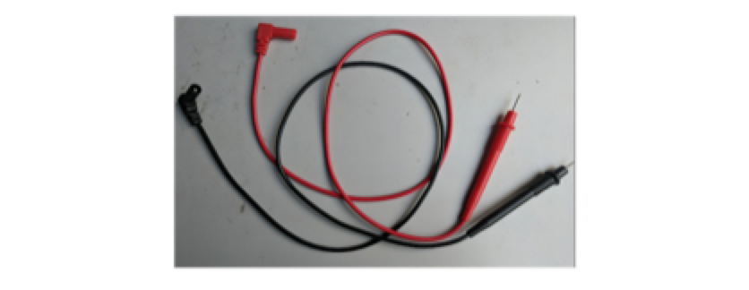
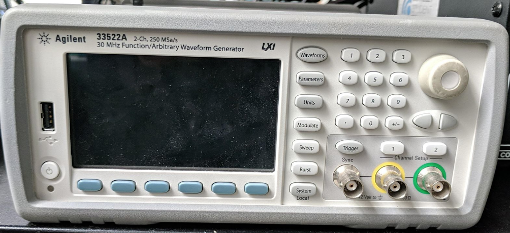
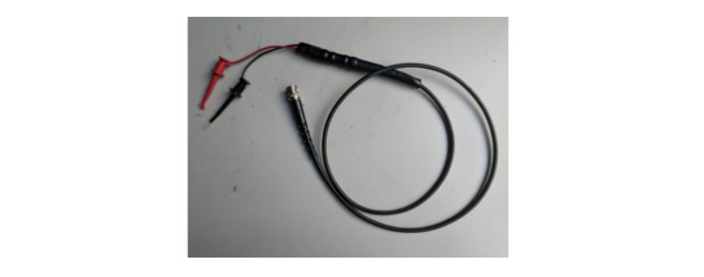

# Using Lab Equipment


Please note that there will be a lab equipment use workshop \*on this day at this time\*.  If you choose not to attend or prefer to learn from this tutorial, it is recommended to sit in front of each machine and follow along to familiarize yourself with its functions.


## Power Source

The power source is used in place of a battery when running hardware tests. You can connect this to your circuit by using banana plugs, pictured below. By convention, red should be connected to the \(+\) terminals, and black to the \(-\), or ground, terminals.

As described by the gif above, follow these steps to set up the power supply:

1. **Turn on the power supply** by pressing the Power on/off button. 
2. **Set a current limit.** To set a current limit, first push the "Display Limit" button. Next, push the "Voltage/Current" button on the right of the machine so that the current is selected \(blinking\). Then, use the arrow buttons on the right to select the digit you want to adjust, and then use the knob to adjust the value of that digit. **Generally, we will use 0.100A** unless otherwise noted. **While 0.100A may seem small, it is still enough current to cause serious damage to the PCB you're testing.**
3. **Select an output:** This device is capable of outputting 3 different voltages with maximum values of 6V, 25V, and −25V respectively. Make sure to push the button for the output you would like to use. 
4. **Set the voltage:** After selecting the correct output \(step 3\), set the voltage to the desired value. To do this, push the "Voltage/Current" button so that the voltage \(displayed on the left\) is selected \(blinking\). Then adjust the value using the arrow buttons and knob, like when you set the current limit. **Make sure you are adjusting voltage and NOT current.** 
5. **Turn the output on:** By default, the output of the device is turned off. For the device to actually output current, press the "Output On/Off" button. **Always turn the output OFF whenever you are idle / don't need the Power Supply!**

## Multimeter

Note that these probes have the same connector as the oscilloscope probes. **But beware!** The function generator and oscilloscope probes have different impedances, which means if you use the wrong probe for the instrument you're using, your output will give you absurd voltage values. 

Multimeters can come handheld or in the lab as shown above. They are used to measure the resistance, current, or voltage difference across two terminals. They can also be used to test for continuity. This means that you can determine what points are shorted together or not. You can use banana plugs with this machine, but the probes shown below are generally better to touch at specific points. 

Follow these steps to set up:

1. **Turn the multimeter on**.
2. **Connect the probe to the multimeter.** You can determine what terminals to plug the probes into by looking at their labels. 
   1. To measure voltage or resistance or to test for continuity, plug the red probe into the terminal with the V, Ω, and diode symbol. 
   2. To measure current, plug the red probe into the terminal with the capital "i" next to it. 
   3. The black probe should be in the terminal labeled "LO" between them. 
3. **Touch the ends of each probe to the nodes on the board** that you want to measure across/test continuity for. You can toggle the information you want to see on the multimeter by pressing the DC V \(for DC voltage\), AC V \(for AC voltage\), Ω \(for resistance\), or cont \)\)\) \(for continuity\) buttons. When you press cont, it will say open until it is shorted. If there is continuity, it will beep.

## Oscilloscope 

Oscilloscope can be used to measure signals that change over time. Unlike a voltmeter, which only shows the instantaneous voltage value, the oscilloscope shows a graph of a voltage versus time, which is useful to see how devices respond to inputs. This piece of equipment may look pretty complicated, but most of the knobs are to adjust axes. Oscilloscopes can also be used to simply measure DC voltages, as one would with a voltmeter. 

The oscilloscope probe that connects to the color coded metal terminals at the bottom looks like this:

Follow these steps to set up:

1. **Turn the oscilloscope on** \(button at the bottom left corner\). 
2. **Connect the probe to one of the 4 input channels** \(yellow, green, blue, or red\). Make sure that the channel is on \(indicated by a green light on the channel number\). To turn a channel on \(when it was originally off\), simply press the corresponding numbered button. To turn it off, push the button again, and the light will be off.
3. **Connect your probe to your circuit.** 
4. **Auto Scale:** Potentially skip steps 5-7 by using the "Auto Scale" button \(see the image above\) to automatically scale the axes. **Don't get too dependent on the "Auto Scale" button; sometimes it doesn't do a "good enough" job.**
5. **Adjust the horizontal axis of the plot.** The large knob at the top \(immediately to the right of the screen\) controls the horizontal time axis and allows you to zoom in or out. The time increments represented by the tick marks on the plot are indicated at the top of the screen. 
6. **Adjust the vertical scale.** The larger of the two knobs for each channel \(the one above the button with the channel number\) allows the vertical scale of the voltage graph to be adjusted. As with the horizontal scale, the number of volts per tick mark on the graph is marked at the top of the screen. 
7. **Adjust the offset.** In some cases, signals will appear off screen; adjusting the smaller of the two knobs \(below the channel number button\) corresponding to each input will shift signals up or down on the plot. 
8. **Add measurements such as average voltage, amplitude, etc.** Measurements can be added by pushing the "Meas" button and using the buttons below the screen to select and add measurements. 

## Function Generator 

The function generator can be used to provide test inputs to your circuits. It acts like a power source, but there is a difference. While the power supply is capable of giving you a fixed voltage, the function generator can output sine waves, square waves, and a variety of other waveforms that change over time. Sometimes the function generator is useful if more independent DC supply voltages are needed than the power supply can provide.

Steps to set up the function generator:

1. **Connect the function generator probe** \(pictured above\) to either channel 1 or 2. 
2. **Press the "1" button for channel one and the "2" button for channel two to see their menus.** Here, you can set the output load \(for example, high Z\), voltage limits, as well as turning the output on and off \(as you would with a power source\).
3. Press the button labeled "waveforms" to get a list of waveforms. **Press the blue buttons on the bottom to select your desired waveform.** 
4. **Press the "parameters" buttons to set the parameters of your waveform.** Here you can use the keypad, knob, and arrows to adjust the frequency, amplitude, offset, duty cycle, and phase of your waveform. Again, use the blue buttons at the bottoms to toggle between parameters. You can also press "units" to change the units.

