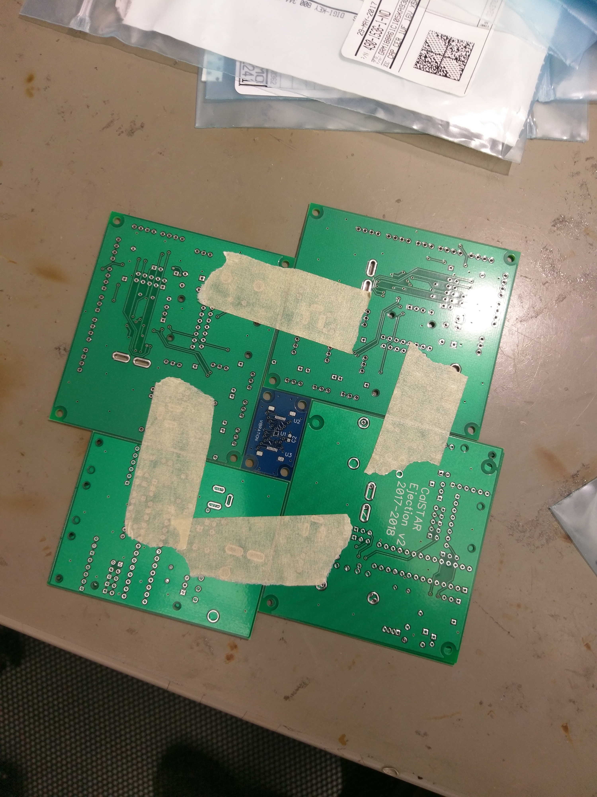
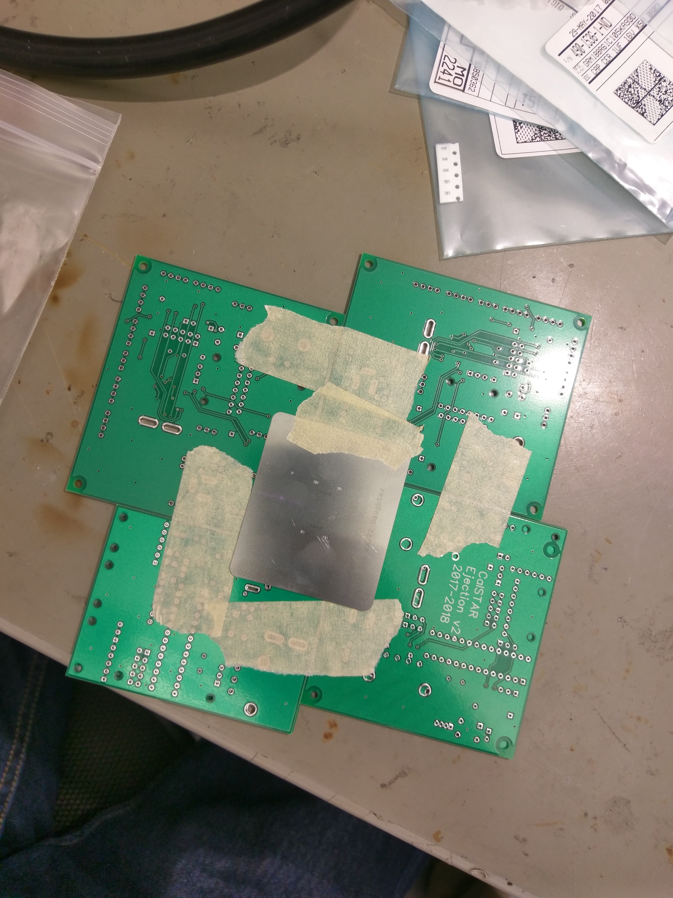
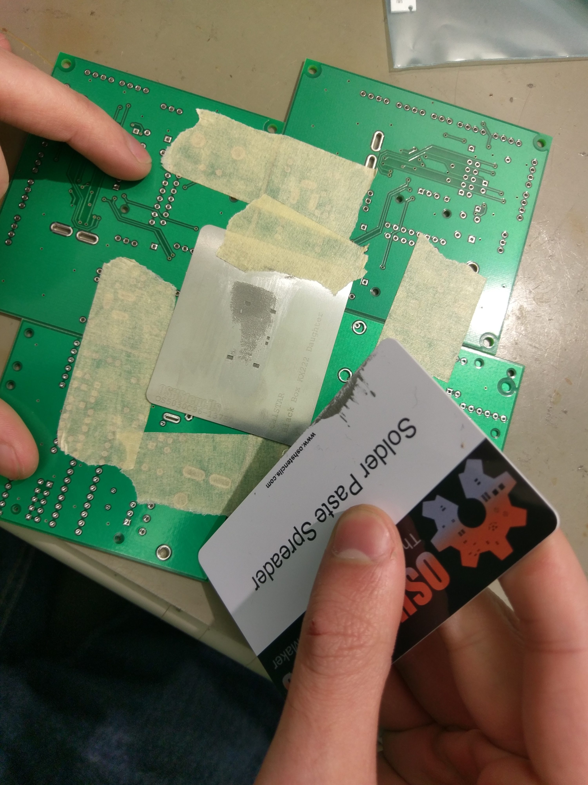
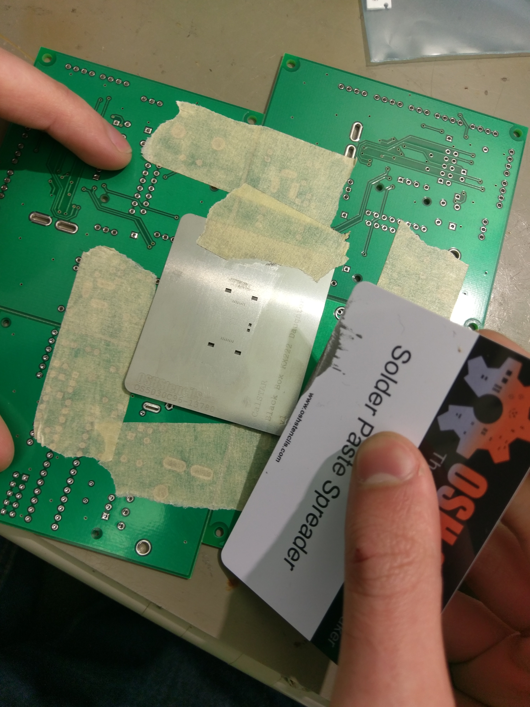
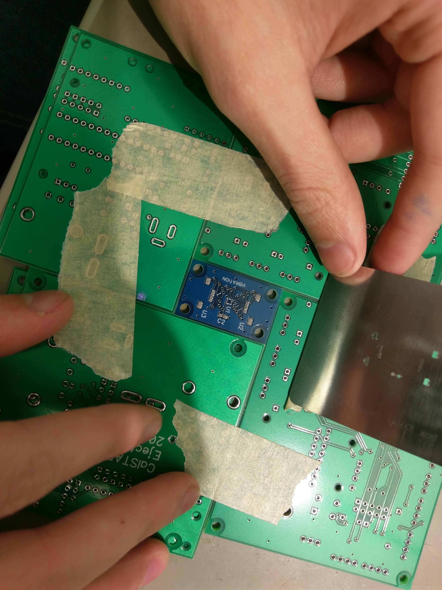
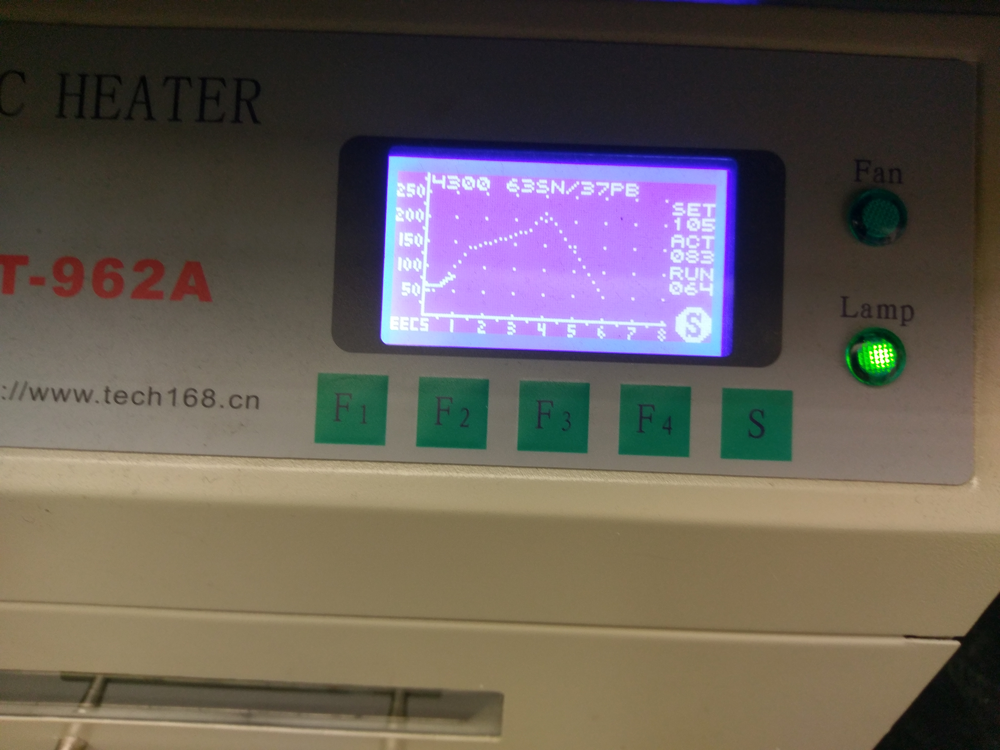

# Reflow Oven

## Glossary

* **Reflow Oven:** essentially a toaster over that can follow a pre-programmed temperature profile
* **Solder paste:** similar to solder, but comes in a syringe and is paste-like. When heated past a certain temperature, solder paste flows, and upon cooling forms an ordinary solder joint.

## How to use the Supernode reflow oven

The Chenming Hu Innovation Lab \(Supernode\) contains a reflow oven. STAR as a team has used it successfully to solder components. Here is how to do so:

### Materials

* PCB to be soldered, henceforth referred to as the "target PCB"
* PCB blanks, preferably large and of the same height as the target PCB
* Stencil \(usually ordered from OSH Park\)
* Solder paste \(63/37 Sn-Pb\)
  * We currently have a syringe labeled CalSTAR in the Supernode referigerator
  * This is expensive, so try not waste it
* Masking or other tape
* Scraper / credit-card-sized card

### Applying solder paste

1. Clean the target PCB with isopropyl alcohol \(isopropanol\)
2. Arrange spare PCB blanks in a configuration around the target PCB as follows: 
3.    

4. Make sure the PCB to solder is snug and there are no gaps around it. If the blanks are thinner \(e.g. 31 mil\) than the PCB to solder \(e.g. 61 mil\) or vice versa, you can double-stack. **It is important to have the blanks be at the same height as the target PCB**
5. Next, position the stencil such that the holes in the stencil line up **perfectly** with their respective pads
6. Once alignment has been achieved--and be sure that it's as close to perfect as possible--**tape one edge only of the stencil** to the blanks and orient it so the taped side is away from you:
7.  
8. Squeeze solder paste from the syringe "above" \(tape side\) each section of pads 
9. Use a scraper or card to press firmly down on the stencil and spread solder paste, drawing the scraper toward you. **At no point should you scrape away from yourself, lifting the stencil!**\*\*\*\*
10. You will likely have to add more solder paste after the first pass. It is OK to recover solder paste, move it around, etc., but be very careful not to scrape too much side-to-side or away from you. **The stencil must remain flat and in position**
11. Continue spreading the solder paste around until each pad clearly has solder paste on it. We have found a steep angle allows for the collection of paste from the top of the stencil, while a low angle and higher amounts of downward force can help to get paste through the holes in the stencil
12.  
13. Gently lift the stencil from the board and flip it "up", exposing the board
14.  

### Placing components

1. Using tweezers, carefully place all components according the reference designators / layout.
2. After placement, verify each component is securely on the board by gently pressing down on the top of the package with tweezers
3. Remove the board gently from the blanks, without tilting it overly

After placement, components should be somewhat attached to the board--the solder paste is sticky. All components should be aligned with their footprints.

### Reflowing the board

It's finally time!


Before starting this section, open all windows in the vicinity of the oven. This process may produce unpleasant and carcinogenic odors.


1. Open the reflow oven and carefully set the board on the ceramic / kapton tape spacers. Do not place the board directly on the metal tray of the oven
2. Close the oven door
3. Turn the oven on with the switch on the back. You will have to walk around to the other side of the oven to access it
4. Select the pre-set reflow profile for 63/37 solder.
5. Start the heating sequence.
6. 


Even though the reflow oven will not quite be able to follow the profile specified, we have had no known problems with just letting it run--the temperatures reached are sufficient.   
  
Abort only if it is _abundantly_ clear that the oven will not reach anywhere near the desired curve, and restart--if the oven starts from 50C, there should be no significant issues.



Allow the oven to cool, and carefully remove your newly-reflowed board after waiting a few minutes for it to cool down!


### Post-Procedure

1. Inspect the board for any "tombstoning", shifted parts, failed connections, etc. Some amount of these are normal and can be reworked with the hot air rework station or a normal soldering iron.
2. Inspect smaller connections under the microscope, and retouch if necessary with a soldering iron
3. Do not be alarmed if the board is slightly browned--it's been toasted, after all

