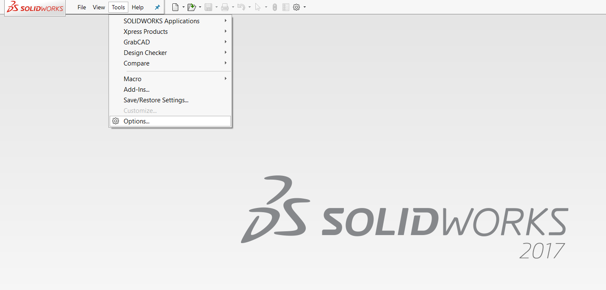
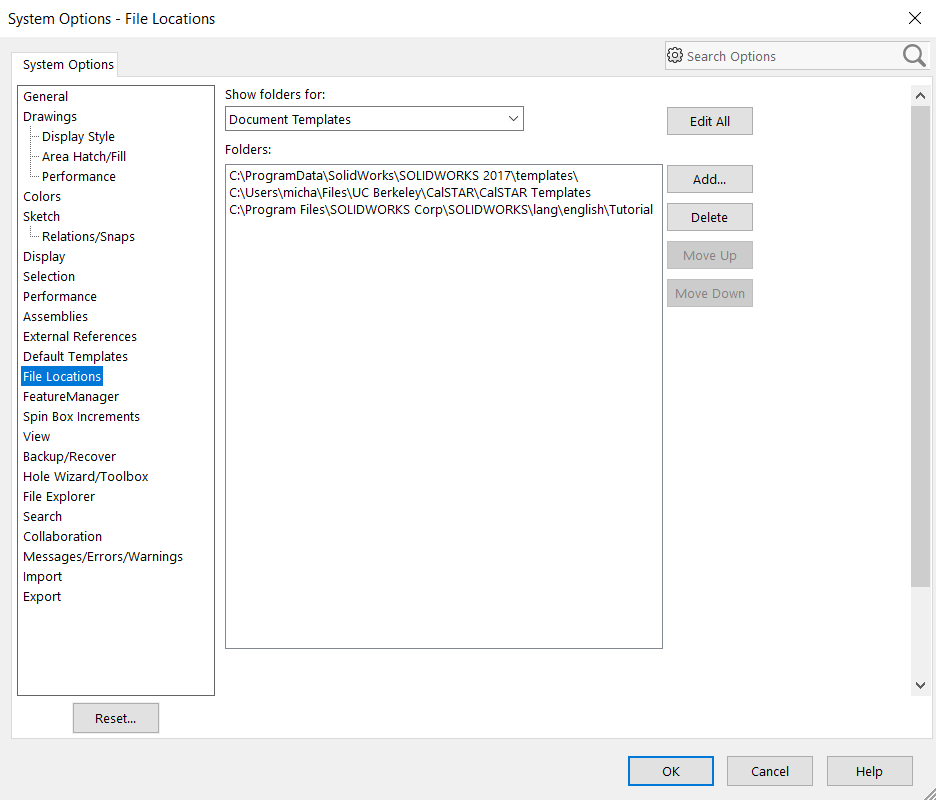
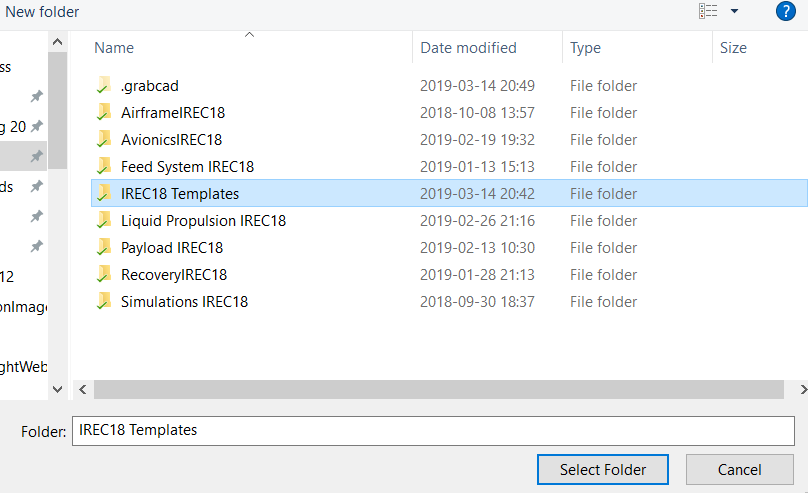
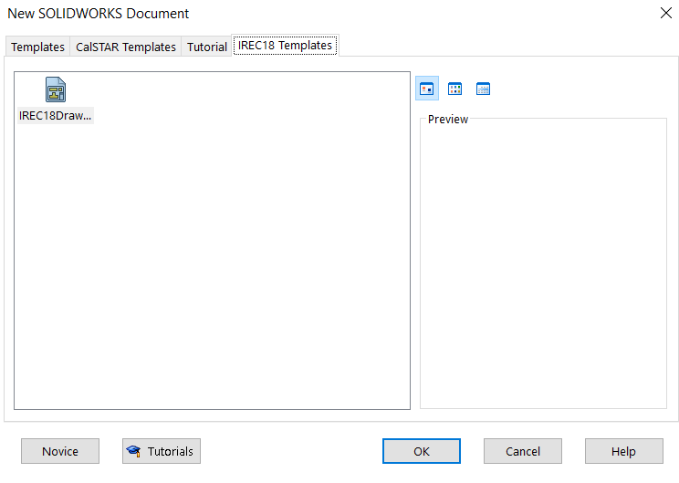
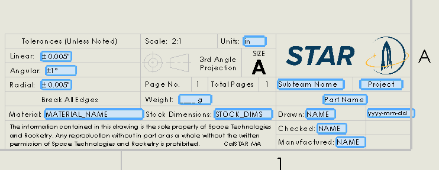

# How to Use SolidWorks Templates

## Setup


You only have to do this once! Follow these instructions carefully and everything will be easier later on.


### 1. Link SolidWorks to GrabCAD templates folder


Before moving forward, make sure you have GrabCAD set up in SolidWorks:&#x20;

[Getting Started With GrabCAD Workbench](../software/getting-started-with-grabcad.md)


1. Open up SolidWorks
2. Make sure that your local GrabCAD folders are up to date
   1. If you don't know how to do this, check out: [Using GrabCAD Workbench in SolidWorks](../software/using-grabcad-workbench-in-solidworks.md)
3. Navigate to _Tools>Options_

4\. In the popup window, navigate to _"File Locations"_

5\. Click _"Add"_

6\. Navigate to the top-level GrabCAD folder "IREC18 Templates"

7\. Press OK

Now, when you make a new part, this will show up! You can navigate to the IREC18 Templates Tab and select that drawing template when you make a new drawing.


If you don't see this dialogue, click on "Advanced" in the bottom left corner



You're all set! Now when you make a new part or drawing you should be able to navigate to the IREC18 Templates tab and make a new part just like you would normally.



When you create a part, you can still use the default part template (i.e. just make a part however you would normally). This is only relevant for creating drawings.


## Editing the Title Block

Some properties in the title block will be automatically filled. We have already determined which ones will update automagically, so all you need to do is the following:

1. Double click the title block
2. Some fields should be highlighted in blue
3. Edit the blue text boxes
4. Click outside of the title block

And you're done! It's that easy!
