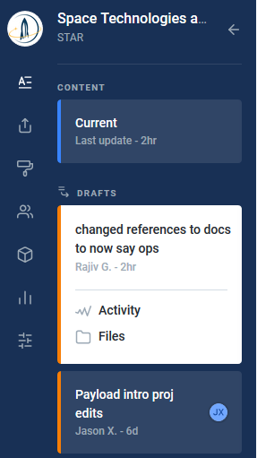
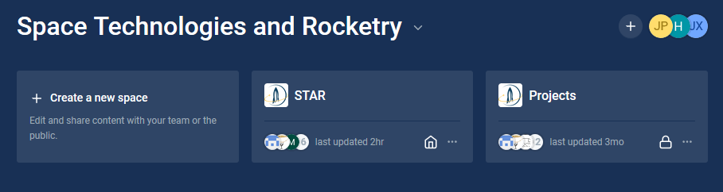
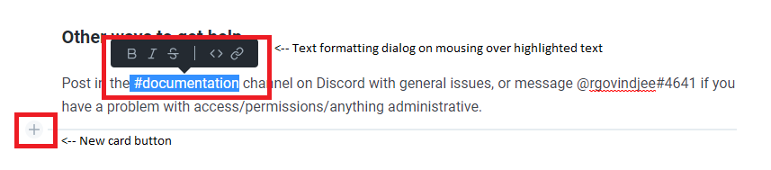

# How to use GitBook

Access

All members are encouraged to contribute to our project documentation! After setting up a GitBook account on [https://www.gitbook.com/](https://www.gitbook.com/) \(though email or Google, GitHub, etc.\), **please first carefully and completely read the entire Draft Descriptions sections below**, and follow the instructions found there to get edit access to our GitBook.

## Draft Descriptions


After making a ****change \(new draft\), **you must describe changes** with a short message **by clicking on "Describe this draft"** in the Drafts section in the sidebar **and writing a brief description.**


Now that you've read this section, you can first follow the join link here: [https://www.gitbook.com/invite/calstar?invite=-LJpEDqIbGMPYJc2aWZ3](https://www.gitbook.com/invite/calstar?invite=-LJpEDqIbGMPYJc2aWZ3)  
  
Then message @rgovindjee\#4641 on Discord requesting editing permissions and make sure to include the passphrase "version\_history" to indicate you read through \(or at least read this sentence...\).

## Creating a draft

To start editing a GitBook page, first go to [https://www.gitbook.com/](https://www.gitbook.com/) and click on "Go to Dashboard"in the upper right-hand corner.

Once at your dashboard, select which space you'd like to edit \(this one is called STAR\) 

You'll now have a sidebar with draft options, and a blue button on the lower right-hand corner of the page to start a new draft editing that page. One draft can contain edits to multiple pages. Remember, always enter a draft description!

## Publishing a draft

Let's say you've written and saved a draft, and given it a draft description. There are two cases:

1. You've written a fairly lengthy draft, aren't sure the style is quite consistent with the rest of our docs, had some formatting issue, or just generally wrote a quick draft that isn't highly polished.
2. You've made a minor edit, or spent a significant amount of time making a polished and consistent page that you believe does not have errors.

If you fall into Case 1, or do not identify with either case, please message in the \#documentation channel saying something along the lines of "Hey, I've written a draft on xxx and was wondering if someone could check it over". In this case, the Documentation team will take care of any remaining copy editing issues, formatting, etc. and publish the draft. You're done!

If you fall into Case 2, you are welcome to simply publish your draft by clicking on the blue "Merge" button in the sidebar. If you're not confident that the draft is error-free, please default to Case 1; the more eyes looking at the work the better.

## For any and mostly all questions

Please reference the GitBook documentation here; it should contain complete instructions on everything there is to know about GitBook: [**https://docs.gitbook.com/**](https://docs.gitbook.com/)  
****  
Specifically, for basic instructions for editing see: [https://docs.gitbook.com/content-editing/markdown](https://docs.gitbook.com/content-editing/markdown)

## Summary of the essentials

* To add a new page, click "+ Add New Page" on the left sidebar or mouse over an existing section or page and click the " $$\cdots$$ " button to add a new page under an existing section
* All content is contained in cards; to create a new card: mouse over the empty space below existing content and click the '+' button
* To rearrange cards: drag the square icon with 9 dots up or down
* To create **bold**, ****_italic_, ~~strikethrough~~, or `code` text: in paragraph/heading mode, highlight a section of text and mouse over it to see options. **Ctrl+B** and _Ctrl+I_ also work as shortcuts.  

* To insert a math formula $$\left( \Delta v = v_\text{e} \ln \frac {m_0} {m_f} \right)$$ mouse over the cursor and click the '+' button, then click the equation button
* To create lists, just type "- " or "\* " or "1. " and it should auto-format to a bulleted list. You can also create a dedicated card with a list.
* For multimedia, paste a link and it should auto-format. You can also create a new pane with images.

## Known issues

If you're using Firefox and having issues inserting an image, try a different browser.

Placing "~" before and after text will make it strikethrough, ~~like this~~. As a workaround to avoid this, write the text that's supposed to follow the second ~ somewhere else \(such as the beginning of the paragraph\), then copy and paste it to the appropriate position.

For example, to write "~5% or ~10%", you might do this:

~5% or

~10% ~5% or

~5% or ~10%

### Other ways to get help

Post in the \#operations channel on Discord with general issues, or message @rgovindjee\#4641 if you have a problem with access/permissions/anything administrative.

