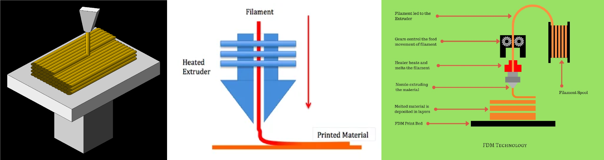
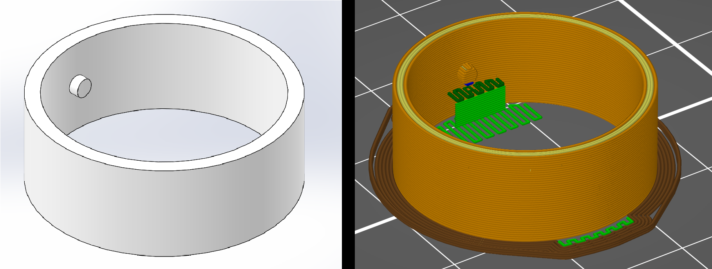

# 3D Printing (FDM)

## Introduction

The term "3D printing" is most often used to refer to fused deposition modeling, or FDM. There are other less common / more expensive methods of 3D printing (stereolithography and selective laser sintering), but those will not be covered in this guide. Generally, all of these processes fall under the umbrella of "additive manufacturing". Here is a description of the FDM process from Wikipedia:

> Filament is fed from a large coil through a moving, heated printer extruder head, and is deposited on the growing work. The print head is moved under computer control to define the printed shape. Usually the head moves in two dimensions to deposit one horizontal plane, or layer, at a time; the work or the print head is then moved vertically by a small amount to begin a new layer.

To illustrate the basics, here are some graphics:

## Design for Printing

While 3D printers can attempt most kinds of geometry, you will achieve far more success by considering the printability of your part during the design process. In addition, some parts are simply infeasible to print.

### Overhangs and Supports

### Tolerancing

We recommend adding 0.010" - 0.020" or 0.3 - 0.5 mm of clearance between parts that you would like to fit together. Some printers extrude more than others, making this often an iterative process.&#x20;

### Anisotropy

Printed parts are anisotropic, meaning they have different properties along different directions. This is a direct consequence of the fact that they are built up layer-by-layer.

#### Tolerances

Printers generally have different resolutions in different axes. Usually, the x-y resolution is far greater than the z-resolution; after all, the z-resolution is limited by the height of each layer.

#### Strength

Do not attempt to use a standard FEA simulation for anything more than a broad evaluation of a printed part. Printed parts almost always fail along layer lines (i.e. one layer separates from the next one up) and not within a layer. As a result, printed parts are often much weaker than expected in in the z (normal to layers) axis and with respect to bending moments in all directions.

## Export

## Slicing

### Supports

### Infill

## Printing

This step is highly machine-dependent.

### Prusa

### Ultimaker

## Post-Processing

Most parts require some sort of post-processing.

### Supports

Removal of supports is an exceedingly common task, but also a frequent source of injury. Here are some tips.

We recommend using your hands or needle-nosed pliers for the removal of supports. Do not use any sort of blade if at all possible. However, if you need to remove a brim or clean up a burr, we highly recommend the use of a [deburring tool](https://www.amazon.com/Acrux7-Deburring-Remover-Plastic-Aluminum/dp/B077Z4T437?ref\_=fsclp\_pl\_dp\_2). These are fairly safe and extremely effective; use by gently pulling the tool toward yourself.

If you cannot find a deburring tool (STAR generally has one, as does Jacobs), you may use a knife as a last resort. We recommend using a 2-3 in-long folding or fixed-blade (where legal) knife with a locking blade. In the absence of a locking blade, a swiss army-style knife is acceptable. We strongly advise against using an X-Acto knife for this purpose, even though they are commonly found in maker spaces.


When using a knife to clean up a part, always **CUT AWAY FROM YOURSELF AND OTHERS.**


Use long, smooth strokes and do not attempt to force the blade. If the blade becomes stuck, just back out and try again with a more gentle angle/less pressure. Try to limit the use of a knife as a prybar; use pliers when possible. Again, **CUT AWAY FROM YOURSELF AND OTHERS**.

### Tolerancing

The advantage of printed parts is that it is usually possible to rapidly iterate on them to fix fit issues. That being said, it is often useful to remove a small amount of material to allow two parts to fit together. We recomend the use of **files, not sandpaper** whenever possible. Files will remove material far more quickly, at the cost of some flexibility.

### Finish

#### Sanding

While it may seem possible to sand down printed parts to achieve a smooth finish, this is almost always a colossal waste of everyone's time. Only do so if absolutely critical. Be warned that the plastic will likely appear to whiten a bit as the sanding abrades the surface.

#### Epoxy

You may use a thin, clear epoxy to coat parts for protection and aesthetics. We recommend using a disposable foam brush and an epoxy with a long enough working time that it does not get sticky while being applied. This method may also work together with sanding (see above).

#### Chemicals

If you have an ABS part, it is possible to smooth the surface using acetone vapors. [Here is a link to a reasonable tutorial](https://rigid.ink/blogs/news/acetone-vapor-smoothing). Do NOT follow a tutorial making use of a hot plate, stove, etc; this is unnecessary and dangerous, risking a safety incident to save an hour or two. Without heat, this is generally a safe process. Be warned that the acetone vapors may compromise the structural integrity of your part over time; watch for cracks and increased brittleness.\
\
There are no reasonably safe solvents that can smooth PLA parts; the only such chemicals are designed to attack organic matter and are thus highly toxic to humans. Do not attempt to acquire them.
