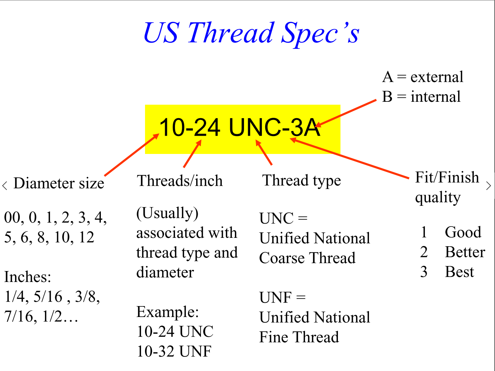
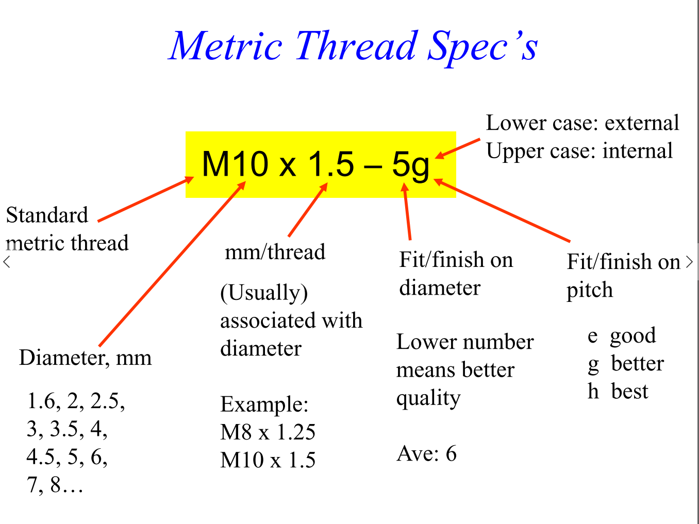
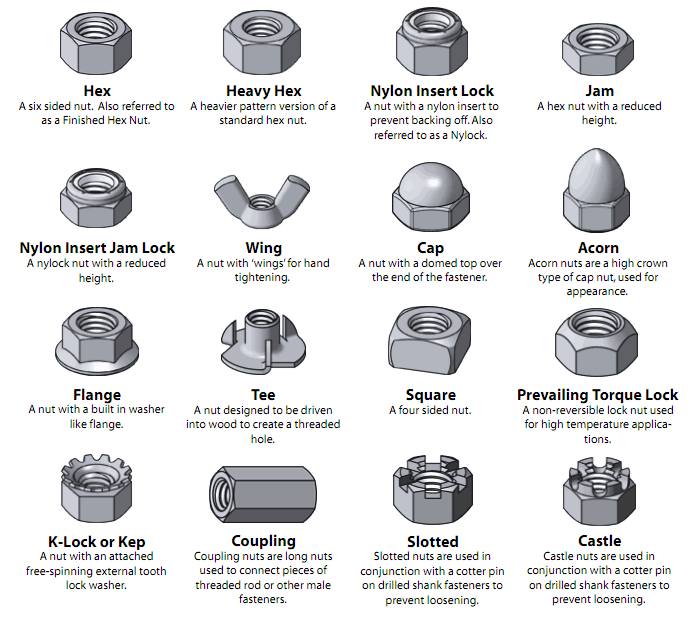
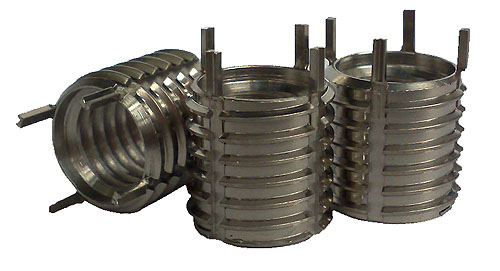

# Fasteners

## Screws

### Overview of US Thread Specifications


Coarse threads are the most commonly available and should be suitable for almost all use cases


### Overview of Metric Thread Specifications


Before choosing to use metric threads, please coordinate with you project team to ensure the type of thread used is consistent.


### Additional Resources

For a more in-depth treatment, refer to this fastener handout: [http://homepages.cae.wisc.edu/\~me231/online\_notes/dimensoning/fastener\_handout.pdf](http://homepages.cae.wisc.edu/\~me231/online\_notes/dimensoning/fastener\_handout.pdf)

If working in **US customary units**, refer also to the Wikipedia page on the Unified Thread Standard: [https://en.wikipedia.org/wiki/Unified\_Thread\_Standard](https://en.wikipedia.org/wiki/Unified\_Thread\_Standard)\
\
If working in **SI units**, refer to the ISO thread sizing Wikipedia page: [https://en.wikipedia.org/wiki/ISO\_metric\_screw\_thread](https://en.wikipedia.org/wiki/ISO\_metric\_screw\_thread)

### Additional Screw Use & Design Tips

* When working on a project or part, try to minimize the number of different sizes of screws used. Avoid having a variety of screw sizes.
* Try to keep screw drive type consistent.
* Use the clearance hole chart  in the "Tolerancing" page for appropriate clearence hole sizes.


[tolerancing.md](tolerancing.md)


* Be mindful of the size of the screw head when designing a part, especially of how the head affects clearance to other parts. It can be useful to obtain the SolidWorks model of a specific screw (commonly avaliable on McMaster) to check for clearance issues.
* Screws used as a hinge, such as part of a screw-nut hinge combination, and other structural-critical screws should have an appropriate thread locker (such as Loctite 242) applied.
* Screws and standoffs used in close proximity to exposed electronics should ideally be non-conductive.

## Nuts


Always make sure the nut you get corresponds with the thread of the screw that you are planning on using it with.


### Additional Nut Notes

* The most common type of nut that we use is a hex nut.
* Nylock nuts are the common alternative if a more secure connection needs to be made.
* In nearly every case, nuts require much more clearance than screws and thus are usually oriented away from moving parts and where they can't come into contact with other surfaces.

## Threaded Inserts

Threaded inserts can be extremely useful way of having a threaded connection in your designs.

A very common situation that can arise is a need to thread into 3D printed parts. 3D-printed parts are difficult to tap (use a tool to create threads on the inside of a hole) because plastics (especially for PLA) deform at low temperatures. 3D-printing internal threads are also difficult because of the need for high precision. Directly threading a screw into a part is often not ideal, because repeatedly removing and screwing the fastener will appreciably lower the integrity and strength of the connection.

As such, threaded inserts are an ideal solution to this issue, since the insert is designed to be permanently secured to the part yet also allow for the repeated insertion of a screw into the thread. An analogous way of achieving this is to design the part to hold a captive hex or square nut inside. In this case, the nut acts as the insert. More information about plastic-specific inserts can be found here:



Another common situation is a need for a thread into a soft metal, such as aluminum. Aluminum is often desirable, especially for aerospace applications, because of its low weight. However, it is not ideal to directly thread into aluminum for the following reasons:

* Most fasteners are steel, which is considerably stronger than aluminum. A threaded interface between steel and aluminum can cause significant wear to the internal threads of the aluminum leading to issues such including binding.
* [Galvanic corrosion](https://en.wikipedia.org/wiki/Galvanic\_corrosion) can always be of concern when joining two dissimilar metals.&#x20;

Again, threaded fasteners or captive nuts are ideal in this scenario. When choosing inserts for aluminum, make sure they are passivated or mil-spec, as to prevent galvanic corrosion from occurring. [Passivated key-locking inserts](https://www.mcmaster.com/threaded-inserts) can be ideal for this application.

For a reference on dimensions on mil-spec threaded inserts, see the below documents:


Spec sheet 1



Spec sheet 2


## Rivets

Rivets are permanently-deforming fasteners. Please do not use rivets unless you have a very good reason to do so, as they prevent the disassembly of the part (without an angle grinder). There is little information on rivets included here on purpose. Rivnuts or Nutserts are slightly better, but also have issues related to their deformation.
