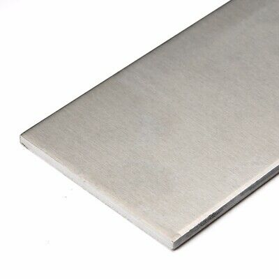

# Material Properties and Uses

## Acetal Homopolyer Resin \(Delrin\)

Delrin is a low-friction plastic that is extremely machineable; Delrin parts can be made on a laser cutter or mill. For small, precise parts, the Othermill is a great way to machine Delrin. Delrin is fairly strong, although it will deform substantially under higher loads.

## Acrylic

Acrylic \(in the form that Jacobs Hall sells\) is a fairly brittle material that we recommend avoiding for use in flight parts. Acrylic is occaisionally useful for enclosures or signs. Polycarbonate is recommended as a substitute for acrylic unless the material _must_ be laser cut.

##  Acrylonitrile Butadiene Styrene \(ABS\)

ABS is a common 3D-printing plastic. It is slightly more ductile than PLA, the other common printing plastic, but otherwise [similar](https://downloads.makerbot.com/legal/MakerBot_R__PLA_and_ABS_Strength_Data.pdf). While there is a common perception that ABS is "stronger" than PLA, this is somewhat inaccurate; for most uses, they are indistinguishable.

| ABS | PLA |
| :--- | :--- |
| ABS printers at Jacobs have soluble supports | Usually not available with soluble supports at Jacobs |
| Much higher tendency to warp, especially without enclosed, heated build envelope | Doesn't warp nearly as much |
| ABS printers at Jacobs are much higher resolution than the Type A / Ultimaker | Type A prints are typically the worst quality achievable, Ultimakers are slightly better |
| Parts may bend instead of breaking, higher elongation at break | May crack if dropped, rather than bending, but higher tensile strength |
| Dimensions and Fortus are limited and often in use, may require joining a lengthy queue | Type A and Ultimakers are more plentiful and more frequently free, with low turnaround time |
| Costs at least $$\$3.33 \text{/ in}^3$$ at Jacobs; $$<1 \text{ in}^3$$  parts are free | Free at Jacobs |
| Fumes may give you cancer, kills the planet | Food-safe, biodegradable \(with 6 months in a specialized composting facility, don't worry\) |
| Glass transition at a slightly higher temperature \(~ $$20\degree\text{C}$$ higher\) | Gets softer at slightly lower temperatures |
| Requires Jacobs hands-on training | On-line training only needed |
| Little ABS personally owned by team members | In-stock at homes of team members for printing |

## Alum**i**num \(6061\)

6061 aluminum is a fairly machinable material that can be processed with a waterjet cutter, bandsaw, fiber laser cutter, mill, lathe, and/or welding machine. Compared to most plastics and wood, aluminum is very strong; consider using aluminum for parts where strength is more important than weight. Aluminum is fairly soft, so do not design parts that require threads to be cut into aluminum; instead, use [threaded inserts](general-fasteners.md). We generally use the 6061 alloy, but others are acceptable; check with an expert before making the decision to use another alloy.

## Brass \(485 Leaded Naval Brass\)

This is the material we are currently using for our thrust chamber. Otherwise, generally avoid brass as there are better and cheaper substitutes available \(usually aluminum\).

## Plywood

Jacobs Hall sells plywood in several sizes and thicknesses for laser cutting. Common thicknesses are 0.25 in and 0.125 in. It is important to note that wood is anisotropic; its material properties vary significantly according to the direction of the forces applied. Wood can be used for structural parts, but it may be better to consider Lexan and aluminum first. Jacobs plywood is often used to make non-structural jigs, holders, etc.

## Polycarbonate \(PC, Lexan\)

Lexan is extremely strong, although it will flex slightly under load. Most of our Lexan parts are produced with a waterjet cutter, although they can be milled, bored, etc. afterward if needed. We are unable to cut Lexan with lasers; if laser cutting is desired and strength is not a priority, consider using Delrin instead.

## Polylactic Acid \(PLA\)

PLA is a bio-based plastic commonly used for 3D printing. It is slightly more brittle than ABS, but it can absorb more energy before failure.  See the "Acrylonitrile Butadiene Styrene \(ABS\)" entry for a comparison of PLA with ABS.  It is also more readily available than any other 3D printing materials in the Jacobs Hall Makerspace. PLA is a good candidate for parts with complex geometry that are non-structural in nature. It is important to note that printed parts, like wood, are anisotropic; they fail much more easily in some directions \(along layer lines\) than others.

## Stainless Steel

ESRA guidelines say we pretty much can't use stainless steel for anything important. That being said, other projects or non-critical parts might be allowed to use stainless steel; check the regulations! Many low-strength fasteners are made out of 18-8 stainless.

