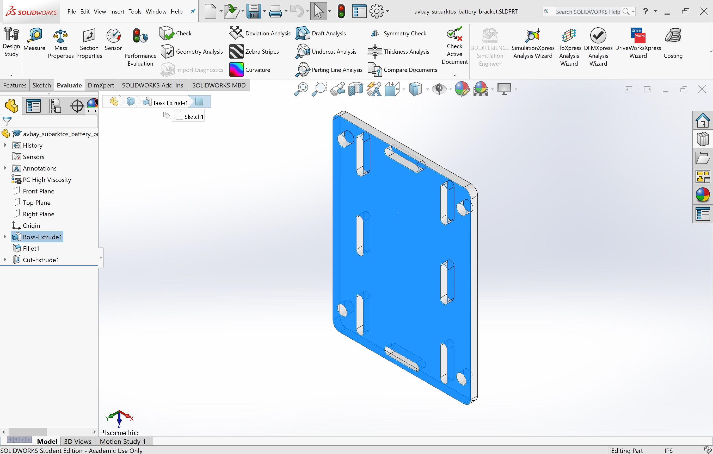

# Laser cutting

## SolidWorks to Laser Cutter


Laser cutting is a fast manufacturing and prototyping method suitable for highly planar parts. 


* Start by opening the SolidWorks part you want to laser cut.
* Select the surface that you want the laser cutter to follow by clicking on the surface, as shown in the image below.

* In the top menu, go to "File"&gt;"Save As"
* From the file type drop down box, you must select a DXF \(.dxf\) file
* Click "Yes", and a properties box will appear on the left sidebar. The selected face should be automatically filled in the "Entities to Export" box. Click the check mark and then "Save" to proceed.
* We are now done with SolidWorks, but before exiting the program please take note of the dimension units of the part. In the part above, it is in inches \(IPS\)
* Now open Adobe Illustrator, click on "File"&gt;"Open" and select your .dxf file.
* A very important window will pop up. Under "Artwork Scale" **you must select "Scale By: 100%"** the **"Scale" box must be 1**.
* Now, remembering what your part dimension units were, you must select the correct units you used in SolidWorks in the "Unit\(s\)" box. For IPS, select "Inches" from the drop down and for MMGS select "Millimeters".
* After selecting the unit, the value of the "Unit\(s\)" box may change. **This value must be set to 1.**


Have you ensured that your DXF scale options are correct? It is difficult to guess whether your part has been correctly scaled or not after these options have been set.


* You are now ready to proceed with processing the illustrator file.
* Delete any text that SolidWorks may have generated \(ie. "SolidWorks Educational Product. For instructional use only\)
* Select all of the lines and set the stroke width to 0.001in and color to pure red. \(These steps are detailed further on in this guide\)


You have now successfully prepared a SolidWorks part to be laser cut. Follow the rest of this guide for further instructions.


## Laser Cutter Introduction

### Important things to remember

* Flip the lever on the wall next to the laser cutter before operation \(You should hear air start blowing\)
* Make sure there is not something hidden in the background that doesn't immediately show up on illustrator
* Ensure that everything in illustrator is a vector
* Lift the hood and check where the laser is pointing to confirm where exactly you are cutting
* Check the extremes of the shape being cut on the material you are cutting
* Try to avoid using warped materials

#### Universal Laser Systems Safety and Operation Reference \(From Jacobs Hall Bcourses Module\)

**Jacobs Hall**;

Three Universal VLS 6.60 \(left\) Located in 110c. and one Universal ILS 12.75 \(right\) Located in 120.

**Invention Lab**;

One VLS2.30 Located at the Citris Invention Lab.

**Cory Student Workshop;**

One PLS4.75 Located at the CSW.

### Course Synopsis

In this course you will learn how to use the Universal Laser cutters to cut, score, and/or engrave a variety of materials. Laser cutting works by directing a high-power laser through optics onto a material which either cuts through or etches, depending on settings used. It is useful for precisely cutting 2D geometries and engraving images onto materials. Completion of this class will allow you to sign up for the Hands-On check out at Jacobs Hall. Once that step is completed, you will have access to the Universal lasers in Jacobs Hall, the Invention Lab, and the Cory Student Workshop.

### Laser Safety and Procedures

* **Laser cutters are only operable while Design Specialists, or Student Supervisors with training are present.**  
* Remember the buddy system**- there must be a second person within earshot of you while working on the laser. Buddy system requirement will be a superuser requirement for CSW.**
* **Any operation of the laser system is a potential fire hazard.**
  * **Most, if not all, materials are combustible in certain circumstances.** Acrylic is especially flammable when vector cutting. Wood, paper, and plastics can all combust. **NEVER OPERATE THE LASER SYSTEM WITHOUT CONSTANT SUPERVISION OF THE CUTTING AND ENGRAVING PROCESS.** Exposure to the laser beam may cause ignition of combustible materials which can lead to a fire. 

#### Fire Protocol

**Any fire lasting more than half a second must be controlled. This list of steps begins with the simplest and escalates. Follow as many steps as necessary to extinguish any fire:** 

1. 1. 1. Lift the top door. This often stops small flames.
      2. Turn off the exhaust system.
      3. Blow on the material.
      4. Remove the material if it is safe to grab a corner.
      5. Spray water with spray bottle. Blue spray bottles are kept near each laser system.
      6. If the fire is unmanageable, use the nearest fire alarm to contact the local fire department and evacuate the building. 

Notify a technician immediately, even if a fire is small and easily extinguished. It’s important to know why it occurred, assess any damage, and prevent it from repeating.  
Discontinue using the laser until a technician has assessed that it is okay to resume.

**Circumstances that can cause fire:**

* * Files with lots of dense geometry very close together. This can cause the laser to repeatedly cut the same area, build up heat in one area and ignite it
  * Similarly, power settings too high for the material being cut and/or speed settings too slow
  * **The laser is not focused properly** \(focus carriage is too close or too far from material\). The laser is usually set up to focus automatically based on the thickness entered by the user but it can be disabled manually. Ask a Design Specialist to assist with this.
  * Attempting to cut materials on top of each other
  * **Always remove all material including scrap material from the machine after use.** Cordless vacuums are kept near the laser system. It is required to remove the cutting table and vacuum out the interior. Scrap material left in the laser system including materials that collect in the removable cutting table can be a fire hazard.
  * **Exposure to the laser beam may cause physical burns and can cause severe eye damage.** Proper use and care of this system are essential to safe operation.
  * **Properly using the installed fume exhaust system is mandatory when operating the laser system.** Fumes and smoke from the engraving process must be extracted from the laser system and filtered or exhausted outside.
  * **Some materials, when engraved or cut with a laser, can produce toxic and corrosive fumes.** If you are not sure of a material is laser-safe, you can consult with shop staff. We recommend that you obtain the material’s Safety Data Sheet \(SDS\) from the manufacturer of every material you intend to process in the laser system. The SDS discloses all of the hazards when handling or processing a particular material. Do not process any material that causes chemical deterioration of the laser system such as rust, metal etching or pitting, peeling paint, etc.
* 
#### Appointment Reservation System

* * The Invention Lab lasers are on a first-come basis. Please be kind to your fellow users and be accommodating if you have a very long job.
  * For the Jacobs Hall lasers, the reservation system can be found at [http://reserve.jacobshall.org/ \(Links to an external site.\)Links to an external site.](http://reserve.jacobshall.org/). **Please prepare your cut file in advance and estimate the cutting time using the Universal Laser software**. See the **Laser Cutter Interface** section below regarding estimating cutting time. 
  * Reservations can be made up to 7 days in advance.
  * **Late & no-shows**: **After** **10 minutes** **a reservation is forfeited and the remainder of the time is given to the first drop-in user**. If you cannot make it to an appointment, please cancel it before it begins.
  * Unreserved times are designated drop-in use by anyone until the next reservation.
  * For the CSW, access requires the presence of superuser on first come first serve basis by checking shop calendar for superuser availability. Limiting access for maker-pass users for fairness to non-maker-pass users.

#### Laser Work Space Etiquette

* If a laser system breaks or is damaged while you are using it, inform the shop staff. Equipment damage is a normal part of the shop environment; for safety reasons it is important to inform a shop staff member immediately.
* **Always clean up fully after yourself.** No material scraps should remain in the shop or in the machines.
* If a laser system is not cutting material, the lens may need to be cleaned. Do not increase the intensity as this can cause the lens to burst. Notify a shop staff member and the lens can be cleaned if needed. 

### BANNED Materials

For your health safety and others in the shop, processing any material that is not laser-safe is against shop policy. **Always check with a technician before assuming any material NOT purchased at the Jacobs Online store is okay.** 

* **PVC** \(aka **Polyvinyl chloride, vinyl, pleather**\) is not laser safe. Chlorinated materials \( are corrosive to the machine and toxic
* **Chlorinated rubbers** also release chlorine. Some paints contain chlorinated rubber. 
* **Nitrile rubber** releases hydrogen cyanide when combusted
* **Polystyrene foam** \(aka **Styrofoam**\) - Melts and catches fire. Very dangerous.
* **Almost any foam -** Including Foam core, polypropylene foam, etc. Very dangerous.
* **Construction grade plywood** - Most plywood sold in hardware stores is not bonded with modified adhesives making it prone to smoking, flaming, charring at the edges and producing toxic fumes \([Best Plywood for Laser Cutting \(Links to an external site.\)Links to an external site.](http://n-e-r-v-o-u-s.com/blog/?p=6042): No Knots, Thicker/Less Ply, Interior Grade, urea-formaldehyde\(UF\) or melamine-formaldehyde\(off-gasses less formaldehyde\) [glue \(Links to an external site.\)Links to an external site.](http://discourse.fablabelpaso.org/t/choosing-the-right-type-of-plywood/45)\)
* **ABS** off-gases hydrogen cyanide in fumes, a chemical known to be very toxic and has been used as a chemical warfare agent. 
* **Polycarbonate** \(aka **Lexan**\) - absorbs infrared radiation, causing it to melt and warp. Looks very similar to acrylic sheets.

### Laser safe materials

Remember that all materials create fumes when laser cut. "Safe" materials are judged as such by not being overly combustible or releasing corrosive, mutagenic, or poisonous gases when laser cut.**Always check with a technician before assuming any material NOT purchased at the Jacobs Online store is okay.** 

* **Paper / Cardstock** - can be both etched and cut
* **Wood** - can be both etched and cut
* **Cast Acrylic** can be cut or rastered \(has a frosted, translucent appearance\)
* **Extruded Acrylic** - can be cut \(does not frost when etched\)
* **Delrin** - hard plastic, good for mechanical parts like gears \(available in different hardnesses\)
* **Cotton / Felt / Hemp** - cuts well, engraves well
* **Polyester fabric** - cuts okay, edges melt a bit, doesn’t engrave well
* **Leather** - natural leather only, not synthetic “pleather”
* **Anodized Aluminum** - can be etched \(Black anodized aluminum provides best contrast out of all anodized aluminum\)
* **Ceramic / Stone** - Engraving is possible on porcelain, ceramic, terracotta  slate, marble and stone
* **Brass** - Uncoated brass can not be etched with a laser, it needs to have some kind of coating \(such as paint\).
* **Glass** - Can be etched only. Must be flat. Etching colored glass has best visual results.
* **Rubber** - Buna-N Rubber, Polyurethane rubber, natural rubber \(no nitrile rubber or any chlorine-containing rubber\)

**Step 0 - File Setup**

Files can be set up ahead of time to use time efficiently. Universal laser systems operate in one of two modes. A **raster** mode, in which images are marked or engraved into a material by etching a pattern of dots into the material at high resolutions up to 1000 dpi, and a **vector** mode in which the laser follows a two dimensional path to cut or mark a shape into a material. The printer driver determines whether an element in the graphic data being printed is a vector or raster object by its width.

The 3 laser cutters in 110C can cut 32" wide by 18" high, and the laser cutter in 120 can cut 48" wide by 24" high. The CSW laser cutter bed size is 18"x24".  If you want to cut using the full cut area, set up the file you want to cut using 24", 32" or 48" for the width, and 18" or 24" for the height. Also select color mode RGB. This is crucial because the laser cutter software will not understand other modes. 

#### **File Requirements**

**Line thickness**

**Only lines and curves with a thickness of .001 in \(.072 pt\) or less will be interpreted as vector objects**. **All other elements of the graphic, including JPEG images, being printed will be interpreted as raster objects.** In order to print vector elements, the software you are printing from must support creation of lines with a thickness of .001 in \(.072 pt\) or less. This includes Adobe Illustrator, Rhino, SolidWorks, AutoCAD, and other drafting software.

**Line Color**

**Red** lines indicate a line to be cut, **Blue** lines indicate a line to be scored, **Black** lines indicate a line to be engraved. When changing colors in Illustrator, use the following instructions to make sure you are using true RGB values;

1. To change line color, make sure your image is selected, then click on the color pallet icon in the tool bar;

. 

2. Click on the "more" dropdown icon in the upper right of the colors box to choose "Show Options". Make sure RGB is also selected;

3. To make a cut or score line Make sure that the color choice is for "stroke" by clicking on the stroke square \(which looks like a hollow red rectangle in the below icon\). Now enter the correct values for the type of operation you want. For instance, To make a cut line enter 255 in the R setting, 0 in the G setting, and 0 in the B setting. To make a score line enter 0 in the R setting, 0 in the green setting, and 255 in the blue setting. 

#### Laser System

**Step 1 - Clean off honeycomb cutting bed. Debris can be a fire hazard.**

**Step 2 - Load and Position Material**

**\*When in the Invention Lab, open the ventilation gate located on the wall behind and to the right of the machine**

Open the top door to the laser system and place material to be laser processed onto the engraving table. You may need to manually move the support table down to allow clearance to fit thicker materials into the machine. The material must be flat and consistent in thickness. The machine cannot remain focused on warped materials or materials that change in thickness/height.

\*When at the CSW, turn the machine on in the correct order;

\*

1.Press the power button on BOFA fume extractor 

2. Turn the air compressor 90 degrees counterclockwise 

3. Turn on the Laser Cutter 

**Step 3 - Sending to Universal Control Panel**


Have you ensured that your illustrator file is the correct scale? If you do not know the scale, press Ctrl-R to bring up the rulers. See if your part is reasonably sized. 


1. While still in Illustrator, click Print to open the printing options.
2. Click "set up" in the bottom, right corner
3. Open the preferences dialog. This will load the laser cutter's material settings database.

**Laser Cutter Interface** 

Vector cutting depth and raster engraving depth \(or marking intensity if you are surface marking only\) are controlled by specifying the **speed** of processing and the **laser power level** **for raster engraving** and by specifying the **speed of processing, laser power level and number of pulses per inch \(PPI\) for vector cutting and marking**. 

These parameters are specified in the laser cutter preferences interface by one of two methods. The two methods are laid out in tabs in the laser cutter interface. The first method is a materials database method which simplifies setup for beginners and casual users, the second method is a manual method with allows much more control for advanced users. Each method treats assignment of laser job settings to colors in the graphic being printed and interpretation of raster and vector elements in the graphic being printed in slightly different ways.  

1. Materials are listed under various categories. Under the appropriate category or sub-category, select the material you are processing.
2. Enter the **material thickness**. Use calipers to measure the thickness accurately. 
3. Click **Defaults** to reset the **Intensity Adjustment** sliders to 0%. Only adjust vector cutting intensity if needed.
4. Click **OK**, then click **Print**.
5. At the bottom right of the screen, click the Universal Control Panel icon.

It will load the geometry into this screen.  

<table>
  <thead>
    <tr>
      <th style="text-align:left">
        
      </th>
      <th style="text-align:left">
        
<b>Basic View</b> (default mode)

        
&#x2022; The <b>Basic View</b> shows a preview window of the job currently
          selected.

        
&#x2022; The cursor becomes a magnifying glass (Zoom Tool) if you pass
          it over the preview window. Left-clicking the mouse zooms in and right-clicking
          zooms out. (Mouse scroll wheel can be used in any mode to zoom in and out.)

        
&#x2022; Selecting the Settings button takes you back to the printer driver
          interface to allow you to change most of the settings for the job selected.
          Keep in mind that some settings cannot be changed after printing from your
          graphics program, such as print density and vector quality. If a setting
          is not adjustable after printing from your graphics program, it will be
          grayed out or not appear at all when you press the settings button in the
          UCP.

      </th>
    </tr>
  </thead>
  <tbody>
    <tr>
      <td style="text-align:left">
        
      </td>
      <td style="text-align:left">The<b> Focus View</b> feature allows you to quickly manually move the focus
        carriage to a desired position in the material processing field. This is
        useful for focusing, as well as testing whether the geometry falls within
        the material.</td>
    </tr>
    <tr>
      <td style="text-align:left">
        
      </td>
      <td style="text-align:left">The<b> Relocate</b> feature gives you the ability to move the image in
        the selected job to another area of the engraving field. This feature does
        not permanently modify the original image location.</td>
    </tr>
    <tr>
      <td style="text-align:left">
        
      </td>
      <td style="text-align:left">The <b>Duplicate</b> feature gives you the ability duplicate an image in
        a grid pattern. You can select how many rows and columns of the image as
        well as the spacing between the rows and columns.</td>
    </tr>
    <tr>
      <td style="text-align:left">
        
      </td>
      <td style="text-align:left">The estimate feature approximately calculates the amount of time it will
        take the laser system to process the selected job. For more complex jobs,
        the estimate feature can take a while to estimate the job completion time.
        A job can be estimated while a machine is disconnected or turned off.</td>
    </tr>
  </tbody>
</table>#### **Before Starting The Laser Cutter**

1. Make sure the material is positioned correctly within the engraving area, and the geometry is positioned correctly in the Control Panel.
2. Close the top door.
3. Check that the **fume exhaust** is running and **compressed air** is flowing. Controls for each of these should be labeled near the laser.
4. Always ask a Design Specialist if you have any issues setting up your cut file or preparing the laser cutter.
5. Press the green **START** button on the UCP to begin laser processing.

* The Universal software should be set to automatically focus based on the material thickness specified.
* Order of execution when using the materials database tab proceeds with raster objects first, then vector marking objects and finally vector cutting objects.

#### **Test Cuts First**

It is not guaranteed that the laser will successfully cut through a material. It’s recommended to do a quick test cut:

1. 1. Create a very small shape \(such as a ½" - ¾” diameter circle\) and position it in a marginal part of your material or another piece of the same material.
   2. Cut the test geometry. As always, watch for anything 
   3. On the UCP, click “Settings” to re-open cut settings.
   4. Adjust the intensity sliders on the top right but increase by small increments.
   5. Then move the test cut shape in order to repeat.

      **Universal Laser Systems Safety and Operation Reference**

      

      **Jacobs Hall**;

      Three Universal VLS 6.60 \(left\) Located in 110c. and one Universal ILS 12.75 \(right\) Located in 120.

      **Invention Lab**;

      

      One VLS2.30 Located at the Citris Invention Lab.

      **Cory Student Workshop;**

      

      One PLS4.75 Located at the CSW.

      **Course Synopsis**

      In this course you will learn how to use the Universal Laser cutters to cut, score, and/or engrave a variety of materials. Laser cutting works by directing a high-power laser through optics onto a material which either cuts through or etches, depending on settings used. It is useful for precisely cutting 2D geometries and engraving images onto materials. Completion of this class will allow you to sign up for the Hands-On check out at Jacobs Hall. Once that step is completed, you will have access to the Universal lasers in Jacobs Hall, the Invention Lab, and the Cory Student Workshop.

      **Laser Safety and Procedures**

      * **Laser cutters are only operable while Design Specialists, or Student Supervisors with training are present.**  
      * Remember the buddy system**- there must be a second person within earshot of you while working on the laser. Buddy system requirement will be a superuser requirement for CSW.**
      * **Any operation of the laser system is a potential fire hazard.**
        * **Most, if not all, materials are combustible in certain circumstances.** Acrylic is especially flammable when vector cutting. Wood, paper, and plastics can all combust. **NEVER OPERATE THE LASER SYSTEM WITHOUT CONSTANT SUPERVISION OF THE CUTTING AND ENGRAVING PROCESS.** Exposure to the laser beam may cause ignition of combustible materials which can lead to a fire. 

      **Fire Protocol**

      **Any fire lasting more than half a second must be controlled. This list of steps begins with the simplest and escalates. Follow as many steps as necessary to extinguish any fire:** 

      1. 1. 1. Lift the top door. This often stops small flames.
            2. Turn off the exhaust system.
            3. Blow on the material.
            4. Remove the material if it is safe to grab a corner.
            5. Spray water with spray bottle. Blue spray bottles are kept near each laser system.
            6. If the fire is unmanageable, use the nearest fire alarm to contact the local fire department and evacuate the building. 

      Notify a technician immediately, even if a fire is small and easily extinguished. It’s important to know why it occurred, assess any damage, and prevent it from repeating.  
      Discontinue using the laser until a technician has assessed that it is okay to resume.

      **Circumstances that can cause fire:**

      * * Files with lots of dense geometry very close together. This can cause the laser to repeatedly cut the same area, build up heat in one area and ignite it
        * Similarly, power settings too high for the material being cut and/or speed settings too slow
        * **The laser is not focused properly** \(focus carriage is too close or too far from material\). The laser is usually set up to focus automatically based on the thickness entered by the user but it can be disabled manually. Ask a Design Specialist to assist with this.
        * Attempting to cut materials on top of each other
        * **Always remove all material including scrap material from the machine after use.** Cordless vacuums are kept near the laser system. It is required to remove the cutting table and vacuum out the interior. Scrap material left in the laser system including materials that collect in the removable cutting table can be a fire hazard.
        * **Exposure to the laser beam may cause physical burns and can cause severe eye damage.** Proper use and care of this system are essential to safe operation.
        * **Properly using the installed fume exhaust system is mandatory when operating the laser system.** Fumes and smoke from the engraving process must be extracted from the laser system and filtered or exhausted outside.
        * **Some materials, when engraved or cut with a laser, can produce toxic and corrosive fumes.** If you are not sure of a material is laser-safe, you can consult with shop staff. We recommend that you obtain the material’s Safety Data Sheet \(SDS\) from the manufacturer of every material you intend to process in the laser system. The SDS discloses all of the hazards when handling or processing a particular material. Do not process any material that causes chemical deterioration of the laser system such as rust, metal etching or pitting, peeling paint, etc.
      * 
      **Appointment Reservation System**

      * * The Invention Lab lasers are on a first-come basis. Please be kind to your fellow users and be accommodating if you have a very long job.
        * For the Jacobs Hall lasers, the reservation system can be found at [http://reserve.jacobshall.org/ \(Links to an external site.\)Links to an external site.](http://reserve.jacobshall.org/). **Please prepare your cut file in advance and estimate the cutting time using the Universal Laser software**. See the **Laser Cutter Interface** section below regarding estimating cutting time. 
        * Reservations can be made up to 7 days in advance.
        * **Late & no-shows**: **After** **10 minutes** **a reservation is forfeited and the remainder of the time is given to the first drop-in user**. If you cannot make it to an appointment, please cancel it before it begins.
        * Unreserved times are designated drop-in use by anyone until the next reservation.
        * For the CSW, access requires the presence of superuser on first come first serve basis by checking shop calendar for superuser availability. Limiting access for maker-pass users for fairness to non-maker-pass users.

      **Laser Work Space Etiquette**

      * If a laser system breaks or is damaged while you are using it, inform the shop staff. Equipment damage is a normal part of the shop environment; for safety reasons it is important to inform a shop staff member immediately.
      * **Always clean up fully after yourself.** No material scraps should remain in the shop or in the machines.
      * If a laser system is not cutting material, the lens may need to be cleaned. Do not increase the intensity as this can cause the lens to burst. Notify a shop staff member and the lens can be cleaned if needed. 

      **BANNED Materials**

      For your health safety and others in the shop, processing any material that is not laser-safe is against shop policy. **Always check with a technician before assuming any material NOT purchased at the Jacobs Online store is okay.** 

      * **PVC** \(aka **Polyvinyl chloride, vinyl, pleather**\) is not laser safe. Chlorinated materials \( are corrosive to the machine and toxic
      * **Chlorinated rubbers** also release chlorine. Some paints contain chlorinated rubber. 
      * **Nitrile rubber** releases hydrogen cyanide when combusted
      * **Polystyrene foam** \(aka **Styrofoam**\) - Melts and catches fire. Very dangerous.
      * **Almost any foam -** Including Foam core, polypropylene foam, etc. Very dangerous.
      * **Construction grade plywood** - Most plywood sold in hardware stores is not bonded with modified adhesives making it prone to smoking, flaming, charring at the edges and producing toxic fumes \([Best Plywood for Laser Cutting \(Links to an external site.\)Links to an external site.](http://n-e-r-v-o-u-s.com/blog/?p=6042): No Knots, Thicker/Less Ply, Interior Grade, urea-formaldehyde\(UF\) or melamine-formaldehyde\(off-gasses less formaldehyde\) [glue \(Links to an external site.\)Links to an external site.](http://discourse.fablabelpaso.org/t/choosing-the-right-type-of-plywood/45)\)
      * **ABS** off-gases hydrogen cyanide in fumes, a chemical known to be very toxic and has been used as a chemical warfare agent. 
      * **Polycarbonate** \(aka **Lexan**\) - absorbs infrared radiation, causing it to melt and warp. Looks very similar to acrylic sheets.

      **Laser safe materials**

      Remember that all materials create fumes when laser cut. "Safe" materials are judged as such by not being overly combustible or releasing corrosive, mutagenic, or poisonous gases when laser cut.**Always check with a technician before assuming any material NOT purchased at the Jacobs Online store is okay.** 

      * **Paper / Cardstock** - can be both etched and cut
      * **Wood** - can be both etched and cut
      * **Cast Acrylic** can be cut or rastered \(has a frosted, translucent appearance\)
      * **Extruded Acrylic** - can be cut \(does not frost when etched\)
      * **Delrin** - hard plastic, good for mechanical parts like gears \(available in different hardnesses\)
      * **Cotton / Felt / Hemp** - cuts well, engraves well
      * **Polyester fabric** - cuts okay, edges melt a bit, doesn’t engrave well
      * **Leather** - natural leather only, not synthetic “pleather”
      * **Anodized Aluminum** - can be etched \(Black anodized aluminum provides best contrast out of all anodized aluminum\)
      * **Ceramic / Stone** - Engraving is possible on porcelain, ceramic, terracotta  slate, marble and stone
      * **Brass** - Uncoated brass can not be etched with a laser, it needs to have some kind of coating \(such as paint\).
      * **Glass** - Can be etched only. Must be flat. Etching colored glass has best visual results.
      * **Rubber** - Buna-N Rubber, Polyurethane rubber, natural rubber \(no nitrile rubber or any chlorine-containing rubber\)

      **Step 0 - File Setup**

      Files can be set up ahead of time to use time efficiently. Universal laser systems operate in one of two modes. A **raster** mode, in which images are marked or engraved into a material by etching a pattern of dots into the material at high resolutions up to 1000 dpi, and a **vector** mode in which the laser follows a two dimensional path to cut or mark a shape into a material. The printer driver determines whether an element in the graphic data being printed is a vector or raster object by its width.

      The 3 laser cutters in 110C can cut 32" wide by 18" high, and the laser cutter in 120 can cut 48" wide by 24" high. The CSW laser cutter bed size is 18"x24".  If you want to cut using the full cut area, set up the file you want to cut using 24", 32" or 48" for the width, and 18" or 24" for the height. Also select color mode RGB. This is crucial because the laser cutter software will not understand other modes. 

      

      **File Requirements**

      **Line thickness**

      **Only lines and curves with a thickness of .001 in \(.072 pt\) or less will be interpreted as vector objects**. **All other elements of the graphic, including JPEG images, being printed will be interpreted as raster objects.** In order to print vector elements, the software you are printing from must support creation of lines with a thickness of .001 in \(.072 pt\) or less. This includes Adobe Illustrator, Rhino, SolidWorks, AutoCAD, and other drafting software.

      

      **Line Color**

      **Red** lines indicate a line to be cut, **Blue** lines indicate a line to be scored, **Black** lines indicate a line to be engraved. When changing colors in Illustrator, use the following instructions to make sure you are using true RGB values;

      1. To change line color, make sure your image is selected, then click on the color pallet icon in the tool bar;

      . 

      2. Click on the "more" dropdown icon in the upper right of the colors box to choose "Show Options". Make sure RGB is also selected;

      

      3. To make a cut or score line Make sure that the color choice is for "stroke" by clicking on the stroke square \(which looks like a hollow red rectangle in the below icon\). Now enter the correct values for the type of operation you want. For instance, To make a cut line enter 255 in the R setting, 0 in the G setting, and 0 in the B setting. To make a score line enter 0 in the R setting, 0 in the green setting, and 255 in the blue setting. 

      

      

      **Laser System**

      **Step 1 - Clean off honeycomb cutting bed. Debris can be a fire hazard.**

      **Step 2 - Load and Position Material**

      **\*When in the Invention Lab, open the ventilation gate located on the wall behind and to the right of the machine**

      

      Open the top door to the laser system and place material to be laser processed onto the engraving table. You may need to manually move the support table down to allow clearance to fit thicker materials into the machine. The material must be flat and consistent in thickness. The machine cannot remain focused on warped materials or materials that change in thickness/height.

      \*When at the CSW, turn the machine on inthe correct order;

      \*

      1.Press the power button on BOFA fume extractor 

      2. Turn the air compressor 90 degrees counterclockwise 

      3. Turn on the Laser Cutter 

      **Step 3 - Sending to Universal Control Panel**

      1. While still in Illustrator, click Print to open the printing options.
      2. Click "set up" in the bottom, right corner
      3. Open the preferences dialog. This will load the laser cutter's material settings database.

      **Laser Cutter Interface** 

      Vector cutting depth and raster engraving depth \(or marking intensity if you are surface marking only\) are controlled by specifying the **speed** of processing and the **laser power level** **for raster engraving** and by specifying the **speed of processing, laser power level and number of pulses per inch \(PPI\) for vector cutting and marking**. 

      These parameters are specified in the laser cutter preferences interface by one of two methods. The two methods are laid out in tabs in the laser cutter interface. The first method is a materials database method which simplifies setup for beginners and casual users, the second method is a manual method with allows much more control for advanced users. Each method treats assignment of laser job settings to colors in the graphic being printed and interpretation of raster and vector elements in the graphic being printed in slightly different ways.  
      

      1. Materials are listed under various categories. Under the appropriate category or sub-category, select the material you are processing.
      2. Enter the **material thickness**. Use calipers to measure the thickness accurately. 
      3. Click **Defaults** to reset the **Intensity Adjustment** sliders to 0%. Only adjust vector cutting intensity if needed.
      4. Click **OK**, then click **Print**.
      5. At the bottom right of the screen, click the Universal Control Panel icon.

      

      It will load the geometry into this screen.  
      

      <table>
        <thead>
          <tr>
            <th style="text-align:left">
              
            </th>
            <th style="text-align:left">
              
<b>Basic View</b> (default mode)

              
&#x2022; The <b>Basic View</b> shows a preview window of the job currently
                selected.

              
&#x2022; The cursor becomes a magnifying glass (Zoom Tool) if you pass
                it over the preview window. Left-clicking the mouse zooms in and right-clicking
                zooms out. (Mouse scroll wheel can be used in any mode to zoom in and out.)

              
&#x2022; Selecting the Settings button takes you back to the printer driver
                interface to allow you to change most of the settings for the job selected.
                Keep in mind that some settings cannot be changed after printing from your
                graphics program, such as print density and vector quality. If a setting
                is not adjustable after printing from your graphics program, it will be
                grayed out or not appear at all when you press the settings button in the
                UCP.

            </th>
          </tr>
        </thead>
        <tbody>
          <tr>
            <td style="text-align:left">
              
            </td>
            <td style="text-align:left">The<b> Focus View</b> feature allows you to quickly manually move the focus
              carriage to a desired position in the material processing field. This is
              useful for focusing, as well as testing whether the geometry falls within
              the material.</td>
          </tr>
          <tr>
            <td style="text-align:left">
              
            </td>
            <td style="text-align:left">The<b> Relocate</b> feature gives you the ability to move the image in
              the selected job to another area of the engraving field. This feature does
              not permanently modify the original image location.</td>
          </tr>
          <tr>
            <td style="text-align:left">
              
            </td>
            <td style="text-align:left">The <b>Duplicate</b> feature gives you the ability duplicate an image in
              a grid pattern. You can select how many rows and columns of the image as
              well as the spacing between the rows and columns.</td>
          </tr>
          <tr>
            <td style="text-align:left">
              
            </td>
            <td style="text-align:left">The estimate feature approximately calculates the amount of time it will
              take the laser system to process the selected job. For more complex jobs,
              the estimate feature can take a while to estimate the job completion time.
              A job can be estimated while a machine is disconnected or turned off.</td>
          </tr>
        </tbody>
      </table>**Before Starting The Laser Cutter**

      1. Make sure the material is positioned correctly within the engraving area, and the geometry is positioned correctly in the Control Panel.
      2. Close the top door.
      3. Check that the **fume exhaust** is running and **compressed air** is flowing. Controls for each of these should be labeled near the laser.
      4. Always ask a Design Specialist if you have any issues setting up your cut file or preparing the laser cutter.
      5. Press the green **START** button on the UCP to begin laser processing.

      * The Universal software should be set to automatically focus based on the material thickness specified.
      * Order of execution when using the materials database tab proceeds with raster objects first, then vector marking objects and finally vector cutting objects.

      **Test Cuts First**

      It is not guaranteed that the laser will successfully cut through a material. It’s recommended to do a quick test cut:

      1. 1. Create a very small shape \(such as a ½" - ¾” diameter circle\) and position it in a marginal part of your material or another piece of the same material.
         2. Cut the test geometry. As always, watch for anything 
         3. On the UCP, click “Settings” to re-open cut settings.
         4. Adjust the intensity sliders on the top right but increase by small increments.
         5. Then move the test cut shape in order to repeat.

### See Also







