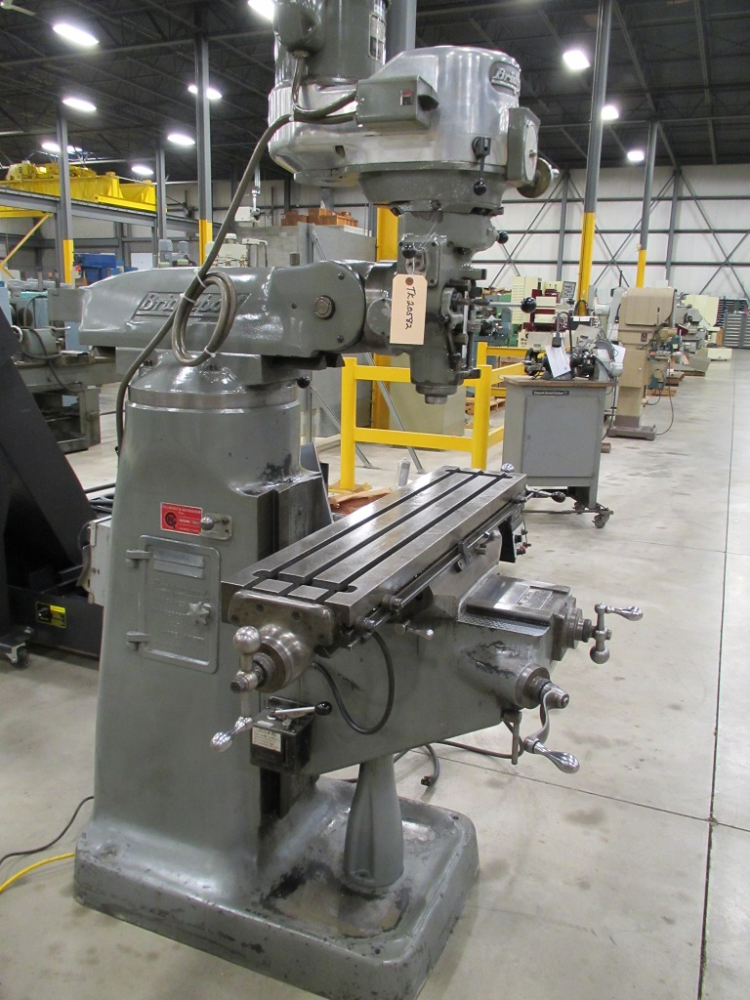
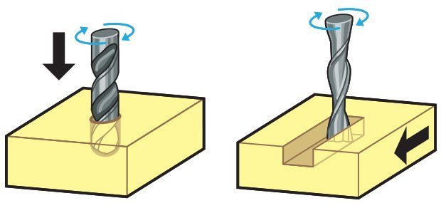
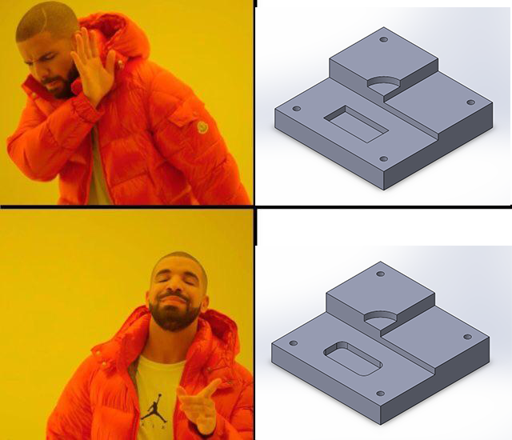
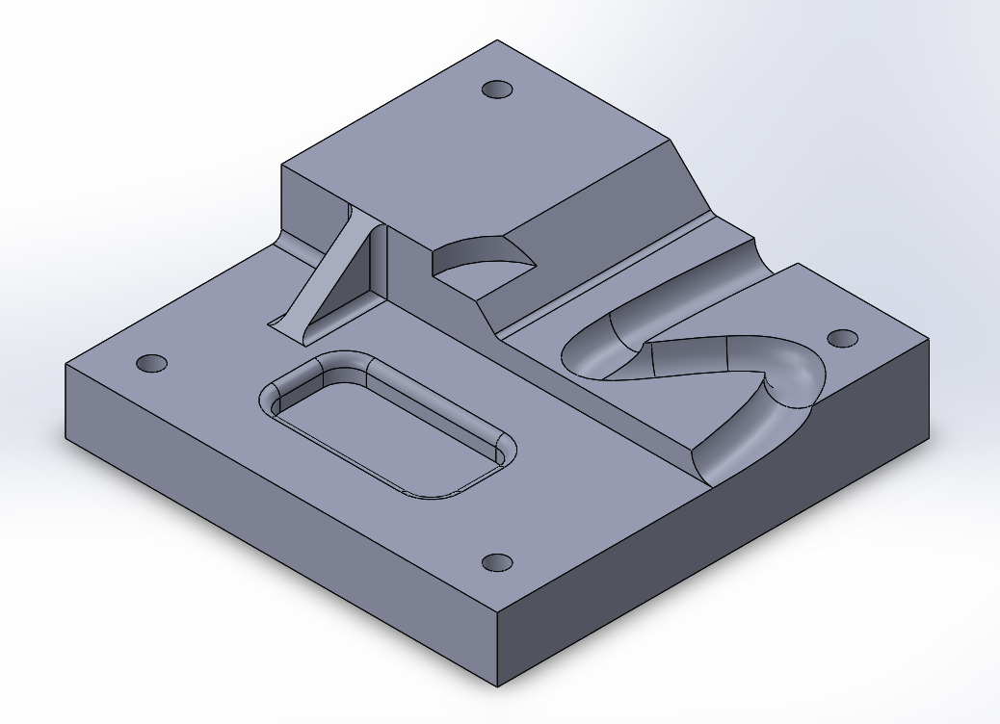

# Milling

## What are mills?

Contrary to popular belief, a mill is not a drill press. This is a manual mill: &#x20;

\
A mill has a spindle which holds an end mill. End mills are similar in appearance to drill bits, but are not the same!

The spindle spins the end mill rapidly while the material (or the spindle) is moved in the x, y, or z directions. More advanced, usually computer numerical control (CNC) machines can also sometimes rotate, giving up to 4 or 5 "axes" to move in. With CNC milling, a computer, rather than a human machinist, handles the motion of the stock and spindle. Here is an example of a CNC mill in action:


While the machine in this video is impressive, you will most likely be designing for a manual mill.


Both manual mills and CNC mills generally share some basics in terms of how they operate. Here is a video that covers the basics of mills:


Feel free to ignore specific details about the machine setup and parts, like the types of lead screws.


## What can they do?

### Holes

Just like drill presses, mills can make holes in materials. You can either use an end mill, or simply put a standard drill bit in the mill using a removable chuck. Mills are particularly useful if you would like a set of very precisely spaced holes, as they possess an x-y coordinate system (drill presses generally do not).

\
In the image above, notice that the center hole is not bored all the way through. This is generally possible to do fairly accurately even on a manual mill, with the use of a stop. However, dimensional accuracy may vary. Always check with your machinist first.

When it comes to sizing holes, make sure that there is actually a drill bit or end mill with the correct diameter for your hole. Perform a google search for a drill bit sizing chart or see the table here: [https://en.wikipedia.org/wiki/Drill\_bit\_sizes#Drill\_bit\_conversion\_table](https://en.wikipedia.org/wiki/Drill\_bit\_sizes#Drill\_bit\_conversion\_table) for a conversion between letter and number drill bits to decimal inches.&#x20;

In the US, drills come in number sizes (smallest useful size being #50-#60 and going all the way up to #1, which is roughly 0.228 in) as well as letter sizes, which start at A (0.234 in) up to Z (0.413). Beyond and interspersed with the letter and number drills are standard fractional inch size, ranging commonly from as small as 3/64 in up to 1 1/2 in. Check with your machinist to see what sizes are available first.

### Flats, Facing, and Profiling

A mill can remove material from a face or create a flat surface at any depth. Furthermore, sharp corners are possible if the tool is allowed to travel off the end of the part (see Pockets section for examples of when this is not the case). It is best if these cuts are at right angles to each other; more complex geometry will require the use of CNC.

\
For an example video of a CNC machine cutting a more complex profile, see below:


Profiling a curved profile that could not be done on a manual mill


### Pockets

When a flat surface with some type of wall on the sides is desired, we have a pocket. Mills are able to do pockets, but keep a few things in mind:

1. End mills (the tool) have finite radii. For example, if an 1/8" diameter end mill is used to make a pocket, the interior corners will have a minimum 1/16" radius. Use a fillet in CAD to reflect this.
2. Conventional (manual) mills may not easily be able to make, for example, a rectangular pocket with precise corner coordinates, especially if the pocket is deep and requires multiple passes. This type of geometry is better suited for a function mill or a CNC mill. When in doubt, check what can and cannot be done with the person who will be making the part!

### Complex 3D Geometry

This type of geometry will generally only be possible with a CNC mill. Please be aware that CNC parts can have long lead times if coming from the machine shop. Furthermore, there are still limitations on what a CNC machine can do; as with manual mills, there are limits based on available tooling (curved surfaces generally require ball end mills) and the material.

That being said, there are some parts that are great candidates for CNC and it can certainly be a useful technology. Small parts especially will be easier to make (see: [Othermill](othermill.md)) and can make design significantly easier.

### General Advice

* Try to limit the number of different tools needed to make your part. Tool changes can cost significant time and effort. For example, try making all holes a standard diameter, or choose just a few. If a pocket is large, use large-radius fillets on the corners to allow the machinist to use a single large tool to make the feature in one pass, rather than switching to a smaller tool just for the corners.
* As a general rule, simple geometry is better. Things like right angles and low requirements for accuracy and precision (see: [Tolerancing](../tolerancing.md)) make everyone's lives easier.
* When in doubt, ask. Other club members or the machine shop staff are happy to help!
