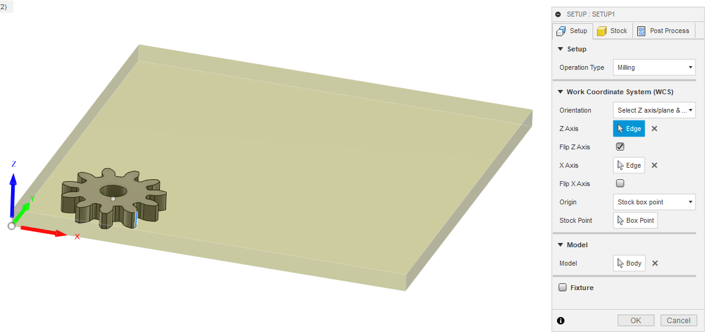
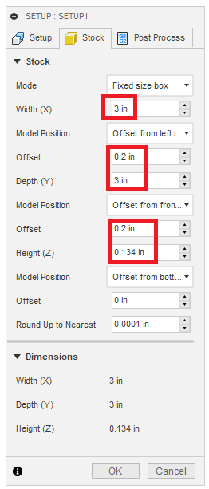
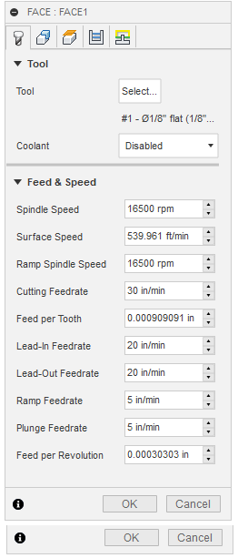
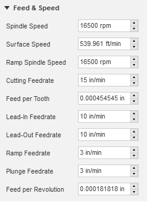

# Othermill

## When to use the Othermill

The Othermill creates very dimensionally accurate parts, but may be slower and more complex than other prototyping processes. If your part significantly depends on being diemnsionally accurate \(for example, low backlash gears\), then the othermill may be a good choice. Laser cutters produce a noticeable and uneven kerf, and 3D printing \(FDM\) cannot produce very fine details well.

## Best practices

The smallest commonly available Othermill bit that can be used to mill out parts is the 1/32" bit. This bit can cut up to materials that are 0.125" thick. Be aware that machining speed can be significantly slowed down the smaller the bit size is. Refer to online resources on Computer-Aided Machining \(CAM\) best practices on what bit to choose.

## Material Selection

In order of machinability, here are the materials the authors have used successfully on the Othermill:

1. Delrin \(acetyl homopolymer resin\)
2. Lexan \(polycarbonate\)
3. Aluminum

The Othermill should not be used to cut steel.

## Tool Selection

Download the Jacobs Hall tool library from the Jacobs Hall bcourses training for the Othermill. Do not download the tool library directly from Bantam Tools, as it contains some inaccuracies.

## Model Setup

Measure the stock and CAD the part to be no greater than the thickness of the stock. If the part is mostly flat, have its thickness match the thickness of the stock unless facing is needed.

## Computer-Aided Machining \(CAM\)

### Setup

Set up the Work Coordinate System as follows. Other tutorials may recommend you set the origin at the _top_ of the stock, but this can cause poor results and collisions with the spoilboard. While these toolpaths will be offset in the Z direction when we import them into the Bantam Tools software, we will correct this at a later time.

Input the accurate dimensions of your stock in the Stock tab. Then, adjust the position of your part relative to the edges of the stock. Items in red boxes should generally be changed for each part or stock piece, while the rest should match the image.

### Feeds and Speeds

The term "feeds and speeds" refers to how quickly the tool rotates and how quickly it moves along the x, y, and z axis. Smaller tools should generally be used with slower feeds and speeds.

#### 1/8" tool, Delrin

#### 1/8" endmill, Aluminum

Aluminum is significantly tougher than plastics. most important is the stepdown on operations with multiple depths; **use a stepdown of at most 0.004"**. For drilling, use a very conservative chip clearing toolpath, pecking in 0.001" increments at a speed of 0.5 in/min. Milling aluminum with the Othermill is somewhat of an acquired skill, so don't worry if you break a bit or two at first. **Do not attempt to mill aluminum with anything smaller than a 1/16" endmill.**

### Toolpath Planning

#### Climb vs. Conventional

Climb milling will result in a better finish and longer tool life.

#### Linking

Check the "keep tool down" checkbox or cuts with multiple depths will lift the tool each time.

Always keep the Ramp checkbox checked and generally use a ramp angle of 3-5 degrees depending on the material \(larger angle ok on softer materials\).

#### Common operations and ordering

* Facing
* Bore
* 2D Contour

### Simulation


Always simulate your toolpaths in Fusion before exporting them for use on the machine. This is the primary way to prevent damage to the machine, the tooling, and the part


Open the simulation settings and check the "Stock" box. You can change from the default green color by changing the material options, but this is not important. Watch the entire simulation; if it is long, speed it up as little as necessary to ensure you catch any unintended behavior.

### Post-Processing

Right click on each operation on the left dropdown and select "Post Process". Select the settings for the Othermill and give your toolpath a descriptive name and number: e.g. 1\_facing, 2\_bore, etc. Numbering will help you keep track of the order in which to run each operation.

This step will produce .gcode files; these are text files containing a list of instructions that will be fed to the Othermill during operation. Make sure you save the gcode files in an accessible location on your filesystem.

## Mill Setup

1. Turn on the Othermill using the power switch at the back left corner.
2. Ensure that the emergency stop \(big red button\) is not engaged.
3. Connect the machine to a computer that has Bantam Tools installed.
4. Open Bantam Tools, and home the machine.
   1. If using the fixturing bracket, locate the bracket by pressing "locate".
   2. Insert a 1/8" endmill upside down \(with the cutting flute inside the collet\).
5. Load the material \(tbd\)
6. Load the toolpaths. Click the "Open Files" button and select your .gcode files.
7. Offset the toolpaths. **If you do not perform this step, nothing will be milled**. For each toolpath, open the "Placement" dropdown and enter -\[stock thickness\] under the z-offset. For exampele, if I have a sheet of nominally 1/8" Delrin that I have measured to be 0.135" thick, I would put "-0.130 in". You may also add x and y offsets, but be sure to repeat the process for each individual operation / toolpath.
8. Load a tool by clicking "Change...". Mount the desired bit and select it from the drop down menu. Click "Locate" and ensure that the mill has moved the bit above a clear section of the spoilboard \(metal bed\). If not, manually adjust. Confirm the position, and the machine will begin to move the bit down to touch the bed. While this is happening, make sure you are ready to stop the machine \(press "ESC" or the emergency stop to stop\). Once the bit has made contact with the bed, the machine should immediately stop trying to move the bit down. If you head any sound of resistance STOP THE MILL and try again.

## Machining

